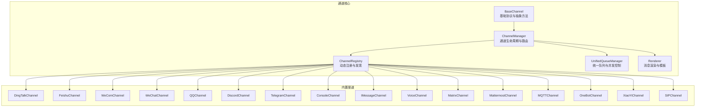
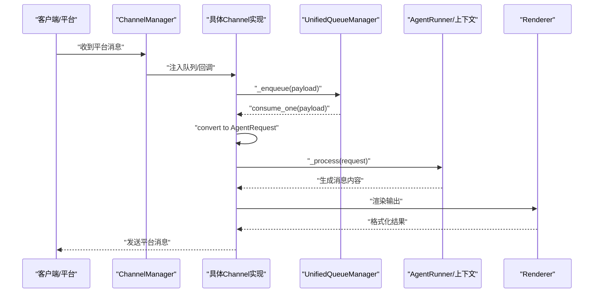
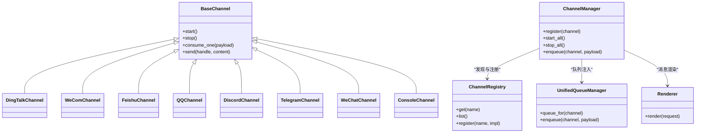

# 支持的渠道

<cite>
**本文引用的文件**
- [schema.py](file://src/qwenpaw/app/channels/schema.py)
- [manager.py](file://src/qwenpaw/app/channels/manager.py)
- [base.py](file://src/qwenpaw/app/channels/base.py)
- [registry.py](file://src/qwenpaw/app/channels/registry.py)
- [unified_queue_manager.py](file://src/qwenpaw/app/channels/unified_queue_manager.py)
- [renderer.py](file://src/qwenpaw/app/channels/renderer.py)
- [channels.en.md](file://website/public/docs/channels.en.md)
- [test_dingtalk.py](file://tests/unit/channels/test_dingtalk.py)
- [test_feishu.py](file://tests/unit/channels/test_feishu.py)
- [test_discord.py](file://tests/unit/channels/test_discord.py)
- [test_telegram.py](file://tests/unit/channels/test_telegram.py)
- [test_qq.py](file://tests/unit/channels/test_qq.py)
- [test_wecom.py](file://tests/unit/channels/test_wecom.py)
- [test_weixin.py](file://tests/unit/channels/test_weixin.py)
- [test_console.py](file://tests/unit/channels/test_console.py)
- [test_imessage.py](file://tests/unit/channels/test_imessage.py)
- [test_voice.py](file://tests/unit/channels/test_voice.py)
- [test_matrix.py](file://tests/unit/channels/test_matrix.py)
- [test_mattermost.py](file://tests/unit/channels/test_mattermost.py)
- [test_mqtt.py](file://tests/unit/channels/test_mqtt.py)
- [test_onebot_channel.py](file://tests/unit/channels/test_onebot_channel.py)
- [test_xiaoyi.py](file://tests/unit/channels/test_xiaoyi.py)
- [test_sip.py](file://tests/unit/channels/test_sip.py)
- [test_base_core.py](file://tests/unit/channels/test_base_core.py)
- [check_channels.sh](file://scripts/check-channels.sh)
- [check_channel_contracts.py](file://scripts/check_channel_contracts.py)
</cite>

## 目录
1. [简介](#简介)
2. [项目结构](#项目结构)
3. [核心组件](#核心组件)
4. [架构总览](#架构总览)
5. [详细组件分析](#详细组件分析)
6. [依赖关系分析](#依赖关系分析)
7. [性能考量](#性能考量)
8. [故障排查指南](#故障排查指南)
9. [结论](#结论)
10. [附录](#附录)

## 简介
本文件面向需要在QwenPaw中接入即时通讯渠道的开发者与运维人员，系统梳理已支持的渠道平台（钉钉、企业微信、飞书、QQ、Discord、Telegram、微信、Console控制台等），并结合仓库中的契约测试、单元测试与官方文档资料，给出各渠道的特性、适用场景、限制条件、消息格式差异、认证方式、多模态能力、兼容性与最佳实践建议。

## 项目结构
QwenPaw的渠道体系由统一的通道基类、管理器、注册表、队列与渲染器构成，并以契约测试与单元测试保障扩展一致性与稳定性。内置渠道类型集合定义于通道模式文件中；网站文档提供了渠道能力矩阵与HTTP配置接口说明；脚本用于自动化校验渠道契约与覆盖率。

图表来源
- [schema.py:30-43](file://src/qwenpaw/app/channels/schema.py#L30-L43)
- [manager.py](file://src/qwenpaw/app/channels/manager.py)
- [registry.py](file://src/qwenpaw/app/channels/registry.py)
- [unified_queue_manager.py](file://src/qwenpaw/app/channels/unified_queue_manager.py)
- [renderer.py](file://src/qwenpaw/app/channels/renderer.py)

章节来源
- [schema.py:12-49](file://src/qwenpaw/app/channels/schema.py#L12-L49)
- [channels.en.md:1314-1375](file://website/public/docs/channels.en.md#L1314-L1375)
- [check_channels.sh](file://scripts/check-channels.sh)
- [check_channel_contracts.py](file://scripts/check_channel_contracts.py)

## 核心组件
- 通道地址与类型标识
  - ChannelAddress：统一路由结构，包含kind（会话类型）、id（目标标识）与extra（扩展参数），并提供to_handle转换逻辑。
  - 内置通道类型集合：包含imessage、discord、dingtalk、feishu、qq、telegram、mqtt、console、voice、sip、xiaoyi等。
  - 默认通道类型：console。
- 通道消息转换协议
  - ChannelMessageConverter协议：定义通道与AgentRequest之间的双向转换，确保不同平台的消息能被统一对待。
- 渠道管理与注册
  - ChannelManager：负责通道启动/停止、队列注入、消费循环与错误处理。
  - ChannelRegistry：动态注册与发现通道实现，支持插件式扩展。
  - UnifiedQueueManager：为每个通道维护独立队列，保证并发与顺序。
  - Renderer：消息渲染与模板处理，便于跨渠道输出一致。

章节来源
- [schema.py:12-57](file://src/qwenpaw/app/channels/schema.py#L12-L57)
- [base.py](file://src/qwenpaw/app/channels/base.py)
- [manager.py](file://src/qwenpaw/app/channels/manager.py)
- [registry.py](file://src/qwenpaw/app/channels/registry.py)
- [unified_queue_manager.py](file://src/qwenpaw/app/channels/unified_queue_manager.py)
- [renderer.py](file://src/qwenpaw/app/channels/renderer.py)

## 架构总览
下图展示从请求进入、通道解析、队列分发到响应发送的整体流程，以及与Agent运行时的交互关系。

图表来源
- [manager.py](file://src/qwenpaw/app/channels/manager.py)
- [unified_queue_manager.py](file://src/qwenpaw/app/channels/unified_queue_manager.py)
- [renderer.py](file://src/qwenpaw/app/channels/renderer.py)
- [channels.en.md:1372-1375](file://website/public/docs/channels.en.md#L1372-L1375)

## 详细组件分析

### 钉钉（DingTalk）
- 特点与适用场景
  - 多模态接收与发送能力全面，适合企业内部工作流与机器人集成。
  - 支持文本、图片、视频、音频、文件等多种媒体类型。
- 认证方式
  - 通过应用凭证与回调URL进行对接，需在平台侧配置机器人与安全设置。
- 消息格式与特殊功能
  - 使用统一的ChannelAddress与Converter协议，消息在进入后转换为AgentRequest再回发。
  - 支持富文本卡片、按钮等交互元素（视平台版本与权限而定）。
- 限制条件
  - 需要企业管理员授权与应用开通。
  - 对媒体大小与类型存在平台限制。
- 测试与契约
  - 单元测试覆盖完整，契约测试通过，确保扩展一致性。

章节来源
- [test_dingtalk.py](file://tests/unit/channels/test_dingtalk.py)
- [channels.en.md:1321-1333](file://website/public/docs/channels.en.md#L1321-L1333)

### 企业微信（WeCom）
- 特点与适用场景
  - 企业级IM，适合组织内合规通信与知识库问答。
  - 多媒体能力与文件传输完善。
- 认证方式
  - 使用企业应用凭证与回调配置，支持多种授权模式。
- 消息格式与特殊功能
  - 统一转换协议，支持富文本与文件下载。
- 限制条件
  - 需满足企业微信平台的合规要求与权限范围。
- 测试与契约
  - 单元测试与契约测试均通过。

章节来源
- [test_wecom.py](file://tests/unit/channels/test_wecom.py)
- [channels.en.md:1321-1333](file://website/public/docs/channels.en.md#L1321-L1333)

### 飞书（Feishu）
- 特点与适用场景
  - 协作效率高，适合团队沟通与任务编排。
  - 多媒体能力与表格/多维表等协作工具联动。
- 认证方式
  - 应用凭证与事件订阅配置。
- 消息格式与特殊功能
  - 支持富文本与交互控件。
- 限制条件
  - 与钉钉类似，存在媒体与频率限制。
- 测试与契约
  - 单元测试与契约测试均通过。

章节来源
- [test_feishu.py](file://tests/unit/channels/test_feishu.py)
- [channels.en.md:1321-1333](file://website/public/docs/channels.en.md#L1321-L1333)

### QQ
- 特点与适用场景
  - 覆盖广泛的个人与群聊用户群体，适合公域或社区场景。
- 认证方式
  - 平台应用凭证与回调配置。
- 消息格式与特殊功能
  - 多媒体与文件传输能力完善。
- 限制条件
  - 需遵循平台的频率与内容审核规则。
- 测试与契约
  - 单元测试与契约测试均通过。

章节来源
- [test_qq.py](file://tests/unit/channels/test_qq.py)
- [channels.en.md:1321-1333](file://website/public/docs/channels.en.md#L1321-L1333)

### Discord
- 特点与适用场景
  - 社区与游戏类场景广泛，适合公域生态。
- 认证方式
  - 机器人的OAuth2与Webhook配置。
- 消息格式与特殊功能
  - 发送多媒体能力处于“建设中”，当前以文本为主。
- 限制条件
  - 平台对媒体与速率有限制。
- 测试与契约
  - 单元测试与契约测试均通过。

章节来源
- [test_discord.py](file://tests/unit/channels/test_discord.py)
- [channels.en.md:1321-1333](file://website/public/docs/channels.en.md#L1321-L1333)

### Telegram
- 特点与适用场景
  - 跨境与隐私导向场景，适合国际用户群体。
- 认证方式
  - Bot Token与Webhook配置。
- 消息格式与特殊功能
  - 多媒体与文件传输完善。
- 限制条件
  - 需遵守平台速率与内容策略。
- 测试与契约
  - 单元测试与契约测试均通过。

章节来源
- [test_telegram.py](file://tests/unit/channels/test_telegram.py)
- [channels.en.md:1321-1333](file://website/public/docs/channels.en.md#L1321-L1333)

### 微信（WeChat）
- 特点与适用场景
  - 中国主流社交平台，适合私域运营与客户服务。
- 认证方式
  - 公众号/小程序/企业微信等不同场景的凭证配置。
- 消息格式与特殊功能
  - 多媒体与文件传输完善。
- 限制条件
  - 内容合规与频率限制严格。
- 测试与契约
  - 单元测试与契约测试均通过。

章节来源
- [test_weixin.py](file://tests/unit/channels/test_weixin.py)
- [channels.en.md:1321-1333](file://website/public/docs/channels.en.md#L1321-L1333)

### Console控制台
- 特点与适用场景
  - 开发调试与本地演示的理想选择，无外部依赖。
- 认证方式
  - 无需外部认证，直接通过本地通道交互。
- 消息格式与特殊功能
  - 文本交互为主，便于快速验证Agent行为。
- 限制条件
  - 不支持多媒体与外部平台特性。
- 测试与契约
  - 单元测试与契约测试均通过。

章节来源
- [test_console.py](file://tests/unit/channels/test_console.py)
- [channels.en.md:1321-1333](file://website/public/docs/channels.en.md#L1321-L1333)

### 其他内置渠道概览
- iMessage：仅文本接收，发送受限。
- Voice：仅音频输入/输出，适合语音助手场景。
- Matrix：多模态能力完善，支持文件与部分多媒体。
- Mattermost：多模态能力较全，部分多媒体仍在建设中。
- MQTT：轻量消息总线，适合IoT或边缘场景。
- OneBot：适配QQ/钉钉等平台的通用协议实现。
- XiaoYi：部分多媒体能力在建设中。
- SIP：语音通信协议，适合VoIP场景。

章节来源
- [channels.en.md:1321-1333](file://website/public/docs/channels.en.md#L1321-L1333)
- [test_imessage.py](file://tests/unit/channels/test_imessage.py)
- [test_voice.py](file://tests/unit/channels/test_voice.py)
- [test_matrix.py](file://tests/unit/channels/test_matrix.py)
- [test_mattermost.py](file://tests/unit/channels/test_mattermost.py)
- [test_mqtt.py](file://tests/unit/channels/test_mqtt.py)
- [test_onebot_channel.py](file://tests/unit/channels/test_onebot_channel.py)
- [test_xiaoyi.py](file://tests/unit/channels/test_xiaoyi.py)
- [test_sip.py](file://tests/unit/channels/test_sip.py)

## 依赖关系分析
- 组件耦合与内聚
  - BaseChannel定义了统一的抽象接口，具体渠道只需实现“入站→请求”和“响应→出站”的转换逻辑，内聚度高、耦合度低。
  - ChannelManager通过注册表与队列管理器解耦具体渠道实现，便于扩展与替换。
- 外部依赖与集成点
  - 各渠道通过平台提供的API或Webhook进行消息收发；认证方式因平台而异。
  - 渲染器负责将Agent输出标准化为平台可接受的消息格式。
- 可能的循环依赖
  - 通过模块化设计避免循环导入；通道实现不直接依赖运行时细节，仅依赖协议与管理器注入。

图表来源
- [base.py](file://src/qwenpaw/app/channels/base.py)
- [manager.py](file://src/qwenpaw/app/channels/manager.py)
- [registry.py](file://src/qwenpaw/app/channels/registry.py)
- [unified_queue_manager.py](file://src/qwenpaw/app/channels/unified_queue_manager.py)
- [renderer.py](file://src/qwenpaw/app/channels/renderer.py)

章节来源
- [schema.py:30-49](file://src/qwenpaw/app/channels/schema.py#L30-L49)
- [channels.en.md:1372-1375](file://website/public/docs/channels.en.md#L1372-L1375)

## 性能考量
- 队列与并发
  - 每个通道拥有独立队列，避免相互阻塞；可通过队列长度与批量策略优化吞吐。
- 错误处理与重试
  - 消费失败时调用错误回调，建议结合指数退避与熔断策略。
- 渲染与序列化
  - 将Agent输出统一渲染后再发送，减少平台端格式差异带来的重复工作。
- 媒体与大消息
  - 对超大文件与多媒体消息建议采用分片或外链策略，降低单次传输压力。

## 故障排查指南
- 契约测试与单元测试
  - 所有内置渠道均具备契约测试与单元测试，若新增或修改渠道，请同步补齐测试，确保四层防护机制生效。
- 常见问题定位
  - 通道未启用：检查enabled标志位与配置项。
  - 空文本或无效payload：确认入站转换逻辑与空值过滤。
  - 多媒体发送失败：核对平台限额与格式支持。
- 运行时监控
  - 通过HTTP接口读取/更新通道配置，实时调整行为；变更将自动写入配置文件并生效。

章节来源
- [test_base_core.py](file://tests/unit/channels/test_base_core.py)
- [channels.en.md:1356-1365](file://website/public/docs/channels.en.md#L1356-L1365)
- [check_channels.sh](file://scripts/check-channels.sh)
- [check_channel_contracts.py](file://scripts/check_channel_contracts.py)

## 结论
QwenPaw的渠道体系以统一协议与管理器为核心，辅以完善的契约测试与单元测试，确保扩展的一致性与稳定性。针对不同场景，可按多模态支持度、认证复杂度与合规要求选择合适渠道。建议优先评估业务合规与用户体验，再结合平台能力矩阵做出最终决策。

## 附录
- 渠道能力矩阵（接收/发送文本、图片、视频、音频、文件）
  - 参考网站文档中的能力表，涵盖钉钉、飞书、Discord、iMessage、QQ、WeCom、WeChat、Telegram、Mattermost、Matrix、XiaoYi、Voice等。
- HTTP配置接口
  - 支持列出、替换、获取与更新单个通道配置，变更写入agent.json并自动应用。

章节来源
- [channels.en.md:1314-1365](file://website/public/docs/channels.en.md#L1314-L1365)