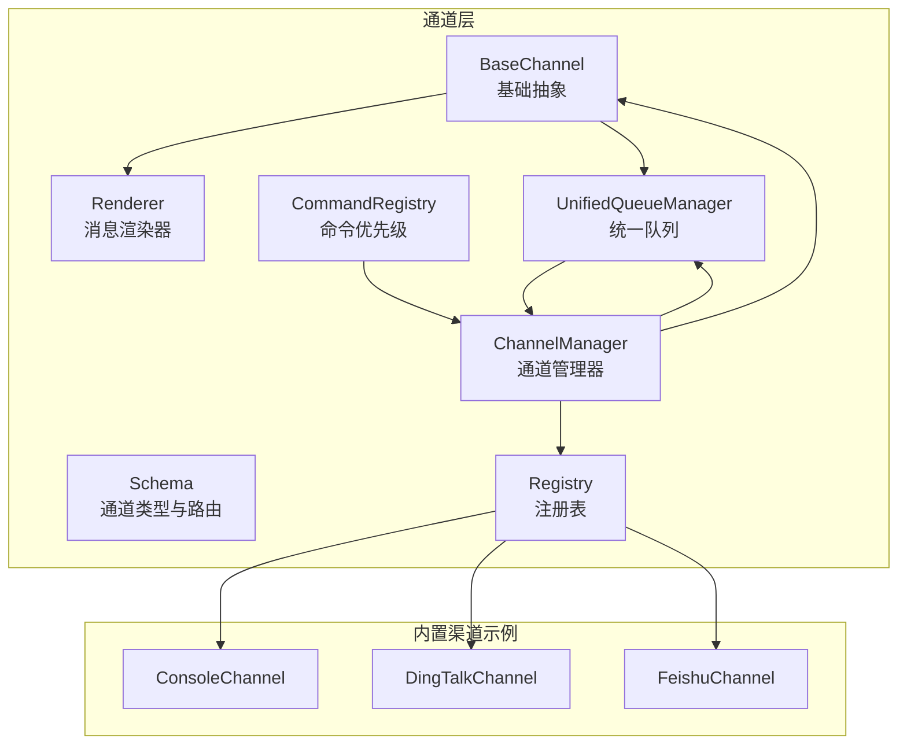
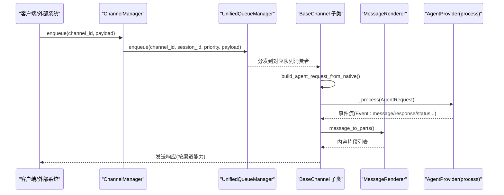
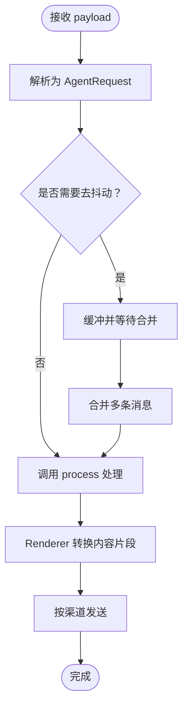
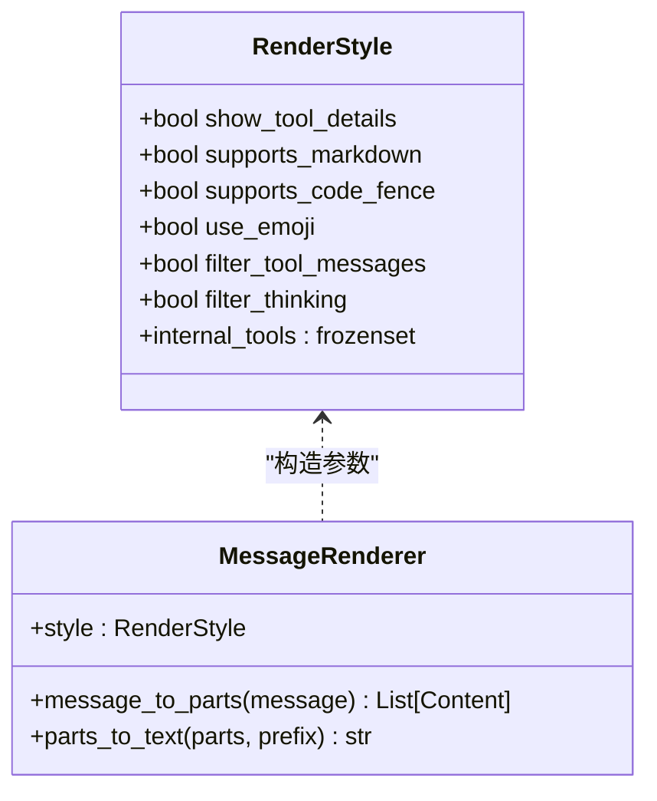
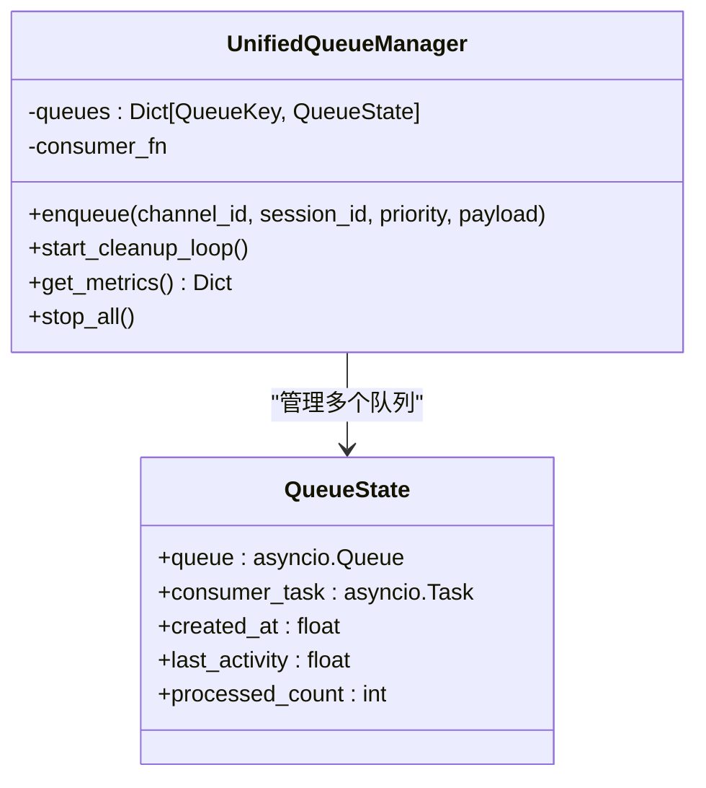
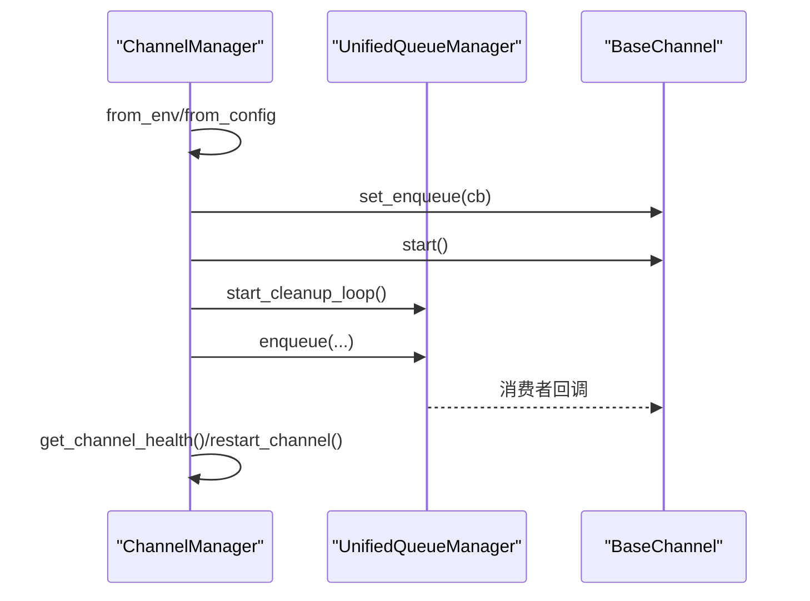
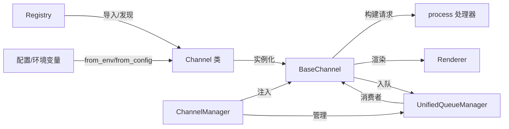

# 渠道开发指南

<cite>
**本文档引用的文件**
- [src/qwenpaw/app/channels/base.py](file://src/qwenpaw/app/channels/base.py)
- [src/qwenpaw/app/channels/manager.py](file://src/qwenpaw/app/channels/manager.py)
- [src/qwenpaw/app/channels/schema.py](file://src/qwenpaw/app/channels/schema.py)
- [src/qwenpaw/app/channels/unified_queue_manager.py](file://src/qwenpaw/app/channels/unified_queue_manager.py)
- [src/qwenpaw/app/channels/renderer.py](file://src/qwenpaw/app/channels/renderer.py)
- [src/qwenpaw/app/channels/registry.py](file://src/qwenpaw/app/channels/registry.py)
- [src/qwenpaw/app/channels/command_registry.py](file://src/qwenpaw/app/channels/command_registry.py)
- [src/qwenpaw/app/channels/utils.py](file://src/qwenpaw/app/channels/utils.py)
- [src/qwenpaw/app/channels/console/channel.py](file://src/qwenpaw/app/channels/console/channel.py)
- [src/qwenpaw/app/channels/feishu/channel.py](file://src/qwenpaw/app/channels/feishu/channel.py)
- [src/qwenpaw/app/channels/dingtalk/channel.py](file://src/qwenpaw/app/channels/dingtalk/channel.py)
- [tests/unit/channels/README_zh.md](file://tests/unit/channels/README_zh.md)
- [tests/contract/channels/test_console_contract.py](file://tests/contract/channels/test_console_contract.py)
- [website/public/docs/channels.en.md](file://website/public/docs/channels.en.md)
</cite>

## 目录
1. [简介](#简介)
2. [项目结构](#项目结构)
3. [核心组件](#核心组件)
4. [架构总览](#架构总览)
5. [详细组件分析](#详细组件分析)
6. [依赖关系分析](#依赖关系分析)
7. [性能考虑](#性能考虑)
8. [故障排查指南](#故障排查指南)
9. [结论](#结论)
10. [附录](#附录)

## 简介
本指南面向希望为 QwenPaw 开发自定义渠道适配器的工程师，提供从项目初始化到部署上线的全流程技术指导。文档聚焦以下关键能力：
- 消息格式转换与统一内容模型
- Markdown 渲染、富文本与多媒体内容支持
- 消息队列管理、并发与异步处理
- 错误处理、重试与异常恢复
- 性能优化、内存与资源控制
- 安全认证、权限管理与最佳实践
- 测试与调试工具使用

## 项目结构
QwenPaw 的渠道体系由“通道抽象层 + 统一队列 + 渲染器 + 管理器 + 注册表”构成，支持内置与自定义渠道扩展。

**图表来源**
- [src/qwenpaw/app/channels/base.py:78-160](file://src/qwenpaw/app/channels/base.py#L78-L160)
- [src/qwenpaw/app/channels/renderer.py:78-120](file://src/qwenpaw/app/channels/renderer.py#L78-L120)
- [src/qwenpaw/app/channels/schema.py:12-50](file://src/qwenpaw/app/channels/schema.py#L12-L50)
- [src/qwenpaw/app/channels/command_registry.py:23-63](file://src/qwenpaw/app/channels/command_registry.py#L23-L63)
- [src/qwenpaw/app/channels/unified_queue_manager.py:60-118](file://src/qwenpaw/app/channels/unified_queue_manager.py#L60-L118)
- [src/qwenpaw/app/channels/manager.py:68-110](file://src/qwenpaw/app/channels/manager.py#L68-L110)
- [src/qwenpaw/app/channels/registry.py:191-196](file://src/qwenpaw/app/channels/registry.py#L191-L196)

**章节来源**
- [src/qwenpaw/app/channels/base.py:78-160](file://src/qwenpaw/app/channels/base.py#L78-L160)
- [src/qwenpaw/app/channels/manager.py:68-110](file://src/qwenpaw/app/channels/manager.py#L68-L110)
- [src/qwenpaw/app/channels/schema.py:12-50](file://src/qwenpaw/app/channels/schema.py#L12-L50)
- [src/qwenpaw/app/channels/unified_queue_manager.py:60-118](file://src/qwenpaw/app/channels/unified_queue_manager.py#L60-L118)
- [src/qwenpaw/app/channels/renderer.py:78-120](file://src/qwenpaw/app/channels/renderer.py#L78-L120)
- [src/qwenpaw/app/channels/registry.py:191-196](file://src/qwenpaw/app/channels/registry.py#L191-L196)

## 核心组件
- BaseChannel：定义通道通用接口、会话解析、去抖动、事件流式发送、权限与提及策略等。
- Renderer：将 Agent 消息转换为各渠道可发送的内容片段（文本/图片/音频/视频/文件/拒绝），支持样式控制与过滤。
- UnifiedQueueManager：基于三元键（渠道、会话、优先级）的动态队列与消费者管理，支持自动清理空闲队列。
- ChannelManager：统一注入 process 处理器、创建队列、调度入队与消费、健康检查与重启。
- Registry/CommandRegistry：内置与自定义渠道注册、命令优先级映射。
- Utils：文本拆分、文件 URL 解析、进程工厂等辅助工具。

**章节来源**
- [src/qwenpaw/app/channels/base.py:78-160](file://src/qwenpaw/app/channels/base.py#L78-L160)
- [src/qwenpaw/app/channels/renderer.py:78-120](file://src/qwenpaw/app/channels/renderer.py#L78-L120)
- [src/qwenpaw/app/channels/unified_queue_manager.py:60-118](file://src/qwenpaw/app/channels/unified_queue_manager.py#L60-L118)
- [src/qwenpaw/app/channels/manager.py:68-110](file://src/qwenpaw/app/channels/manager.py#L68-L110)
- [src/qwenpaw/app/channels/registry.py:191-196](file://src/qwenpaw/app/channels/registry.py#L191-L196)
- [src/qwenpaw/app/channels/command_registry.py:23-63](file://src/qwenpaw/app/channels/command_registry.py#L23-L63)
- [src/qwenpaw/app/channels/utils.py:18-76](file://src/qwenpaw/app/channels/utils.py#L18-L76)

## 架构总览
下图展示从消息进入队列到渲染发送的端到端流程，以及内置渠道的典型实现差异。

**图表来源**
- [src/qwenpaw/app/channels/manager.py:352-364](file://src/qwenpaw/app/channels/manager.py#L352-L364)
- [src/qwenpaw/app/channels/unified_queue_manager.py:119-164](file://src/qwenpaw/app/channels/unified_queue_manager.py#L119-L164)
- [src/qwenpaw/app/channels/base.py:658-690](file://src/qwenpaw/app/channels/base.py#L658-L690)
- [src/qwenpaw/app/channels/renderer.py:87-120](file://src/qwenpaw/app/channels/renderer.py#L87-L120)

## 详细组件分析

### BaseChannel：消息桥接与会话管理
- 统一请求构建：从原生 payload 解析为 AgentRequest，支持 content_parts 与 meta 透传。
- 会话解析：resolve_session_id 将 sender_id 与 meta 映射为 session_id，支持去重与合并。
- 去抖动与缓冲：对无文本内容进行缓冲合并，避免空消息风暴；支持时间窗口合并。
- 权限与提及：支持开放/白名单策略、@机器人/群聊提及策略。
- 事件流式处理：_stream_with_tracker 将事件序列化为 SSE，支持 content/message/response 不同阶段回调。
- 渲染与发送：结合 MessageRenderer 生成渠道可发送内容片段，调用 send_* 接口。

**图表来源**
- [src/qwenpaw/app/channels/base.py:697-734](file://src/qwenpaw/app/channels/base.py#L697-L734)
- [src/qwenpaw/app/channels/base.py:797-800](file://src/qwenpaw/app/channels/base.py#L797-L800)
- [src/qwenpaw/app/channels/base.py:463-574](file://src/qwenpaw/app/channels/base.py#L463-L574)

**章节来源**
- [src/qwenpaw/app/channels/base.py:78-160](file://src/qwenpaw/app/channels/base.py#L78-L160)
- [src/qwenpaw/app/channels/base.py:297-350](file://src/qwenpaw/app/channels/base.py#L297-L350)
- [src/qwenpaw/app/channels/base.py:463-574](file://src/qwenpaw/app/channels/base.py#L463-L574)

### MessageRenderer：Markdown/富文本/多媒体渲染
- 支持文本、图片、音频、视频、文件、拒绝等内容类型。
- 可配置样式：是否显示工具详情、是否过滤思考内容、是否启用表情与代码围栏。
- 工具调用与输出：将函数/插件/MCP 调用转换为可读文本或媒体片段。
- 文本回退：当存在媒体时，将媒体以文本形式附加说明。

**图表来源**
- [src/qwenpaw/app/channels/renderer.py:38-86](file://src/qwenpaw/app/channels/renderer.py#L38-L86)
- [src/qwenpaw/app/channels/renderer.py:87-120](file://src/qwenpaw/app/channels/renderer.py#L87-L120)

**章节来源**
- [src/qwenpaw/app/channels/renderer.py:78-120](file://src/qwenpaw/app/channels/renderer.py#L78-L120)
- [src/qwenpaw/app/channels/renderer.py:298-350](file://src/qwenpaw/app/channels/renderer.py#L298-L350)

### UnifiedQueueManager：动态队列与消费者
- 三元键隔离：(channel_id, session_id, priority_level) 粒度的队列与消费者。
- 动态创建：首次入队时创建队列与消费者任务。
- 自动清理：空闲超时后取消消费者并移除队列。
- 指标监控：提供队列数量、大小、处理计数等指标。

**图表来源**
- [src/qwenpaw/app/channels/unified_queue_manager.py:60-118](file://src/qwenpaw/app/channels/unified_queue_manager.py#L60-L118)
- [src/qwenpaw/app/channels/unified_queue_manager.py:165-213](file://src/qwenpaw/app/channels/unified_queue_manager.py#L165-L213)

**章节来源**
- [src/qwenpaw/app/channels/unified_queue_manager.py:60-118](file://src/qwenpaw/app/channels/unified_queue_manager.py#L60-L118)
- [src/qwenpaw/app/channels/unified_queue_manager.py:274-290](file://src/qwenpaw/app/channels/unified_queue_manager.py#L274-L290)
- [src/qwenpaw/app/channels/unified_queue_manager.py:430-471](file://src/qwenpaw/app/channels/unified_queue_manager.py#L430-L471)

### ChannelManager：统一生命周期与健康检查
- 从环境/配置创建通道实例，注入统一 process 处理器。
- 设置队列回调、启动/停止通道、替换通道、清理队列。
- 提供健康检查与重启单通道能力，支持工作区注入。

**图表来源**
- [src/qwenpaw/app/channels/manager.py:111-217](file://src/qwenpaw/app/channels/manager.py#L111-L217)
- [src/qwenpaw/app/channels/manager.py:462-541](file://src/qwenpaw/app/channels/manager.py#L462-L541)
- [src/qwenpaw/app/channels/manager.py:580-666](file://src/qwenpaw/app/channels/manager.py#L580-L666)

**章节来源**
- [src/qwenpaw/app/channels/manager.py:68-110](file://src/qwenpaw/app/channels/manager.py#L68-L110)
- [src/qwenpaw/app/channels/manager.py:462-541](file://src/qwenpaw/app/channels/manager.py#L462-L541)
- [src/qwenpaw/app/channels/manager.py:580-666](file://src/qwenpaw/app/channels/manager.py#L580-L666)

### 渠道实现示例对比

#### ConsoleChannel：终端输出与上传媒体解析
- 从 native payload 构建 AgentRequest，解析上传媒体路径。
- 流式输出事件，打印文本/媒体信息，支持令牌用量统计。
- 支持主动发送文本与内容片段。

**章节来源**
- [src/qwenpaw/app/channels/console/channel.py:63-140](file://src/qwenpaw/app/channels/console/channel.py#L63-L140)
- [src/qwenpaw/app/channels/console/channel.py:255-277](file://src/qwenpaw/app/channels/console/channel.py#L255-L277)
- [src/qwenpaw/app/channels/console/channel.py:445-449](file://src/qwenpaw/app/channels/console/channel.py#L445-L449)

#### DingTalkChannel：卡片/会话 Webhook 与去重
- 保存 sessionWebhook 用于主动推送；支持卡片自动布局与 @ 提醒。
- 去重：基于消息 ID 的并发处理集合；早期 ACK 防止重试风暴。
- 合并批量回复：合并流式内容为一次回复，或通过 Webhook 多次发送。

**章节来源**
- [src/qwenpaw/app/channels/dingtalk/channel.py:112-172](file://src/qwenpaw/app/channels/dingtalk/channel.py#L112-L172)
- [src/qwenpaw/app/channels/dingtalk/channel.py:319-364](file://src/qwenpaw/app/channels/dingtalk/channel.py#L319-L364)
- [src/qwenpaw/app/channels/dingtalk/channel.py:603-637](file://src/qwenpaw/app/channels/dingtalk/channel.py#L603-L637)

#### FeishuChannel：WebSocket 接收与 Open API 发送
- 使用 lark-oapi WebSocket 接收消息，Open API 发送；支持去重、昵称缓存、时钟偏移校正。
- 支持富文本/图片/文件/音视频等媒体下载与转发。
- 会话 ID 基于 chat_id/open_id 的短标识，便于定时任务查找。

**章节来源**
- [src/qwenpaw/app/channels/feishu/channel.py:173-258](file://src/qwenpaw/app/channels/feishu/channel.py#L173-L258)
- [src/qwenpaw/app/channels/feishu/channel.py:324-344](file://src/qwenpaw/app/channels/feishu/channel.py#L324-L344)
- [src/qwenpaw/app/channels/feishu/channel.py:607-625](file://src/qwenpaw/app/channels/feishu/channel.py#L607-L625)

## 依赖关系分析
- 注册表负责发现与加载内置/自定义渠道类，支持模块级路由注册钩子。
- 管理器通过注册表与配置创建通道实例，并注入统一 process。
- 队列管理器按三元键隔离，消费者按需创建，避免固定池开销。
- 渲染器独立于通道，仅依赖统一内容类型，便于扩展。

**图表来源**
- [src/qwenpaw/app/channels/registry.py:191-196](file://src/qwenpaw/app/channels/registry.py#L191-L196)
- [src/qwenpaw/app/channels/manager.py:111-217](file://src/qwenpaw/app/channels/manager.py#L111-L217)
- [src/qwenpaw/app/channels/unified_queue_manager.py:165-213](file://src/qwenpaw/app/channels/unified_queue_manager.py#L165-L213)

**章节来源**
- [src/qwenpaw/app/channels/registry.py:191-196](file://src/qwenpaw/app/channels/registry.py#L191-L196)
- [src/qwenpaw/app/channels/manager.py:111-217](file://src/qwenpaw/app/channels/manager.py#L111-L217)

## 性能考虑
- 队列隔离与动态消费者：按会话+优先级隔离，避免全局锁竞争；空闲队列自动清理降低内存占用。
- 去抖动与合并：对无文本消息进行缓冲合并，减少下游压力；时间窗口合并提升吞吐。
- 文本拆分与媒体处理：长文本按换行拆分，保持代码围栏闭合；媒体采用占位符避免超长消息。
- 并发与去重：通道内对消息 ID 去重，避免重复处理；通道间通过队列键隔离。
- 资源控制：队列最大长度限制、入队超时保护、消费者清理循环。

**章节来源**
- [src/qwenpaw/app/channels/unified_queue_manager.py:119-164](file://src/qwenpaw/app/channels/unified_queue_manager.py#L119-L164)
- [src/qwenpaw/app/channels/unified_queue_manager.py:376-428](file://src/qwenpaw/app/channels/unified_queue_manager.py#L376-L428)
- [src/qwenpaw/app/channels/base.py:297-350](file://src/qwenpaw/app/channels/base.py#L297-L350)
- [src/qwenpaw/app/channels/utils.py:18-76](file://src/qwenpaw/app/channels/utils.py#L18-L76)

## 故障排查指南
- 契约测试：确保自定义通道实现必须方法，避免破坏其他通道。
- 单元测试：覆盖初始化、生命周期、消息处理等关键路径。
- 日志与指标：关注队列积压、消费者异常、渲染失败、去重命中率。
- 常见问题定位：
  - 队列满/超时：检查队列最大长度与处理速度，必要时增加优先级或降级。
  - 重复消息：确认去重逻辑与会话键一致性。
  - 渲染异常：检查 RenderStyle 配置与内容类型完整性。
  - 渠道认证失败：核对 app_id/app_secret/token 刷新逻辑。

**章节来源**
- [tests/unit/channels/README_zh.md:88-197](file://tests/unit/channels/README_zh.md#L88-L197)
- [tests/contract/channels/test_console_contract.py:83-110](file://tests/contract/channels/test_console_contract.py#L83-L110)
- [src/qwenpaw/app/channels/unified_queue_manager.py:145-157](file://src/qwenpaw/app/channels/unified_queue_manager.py#L145-L157)

## 结论
通过统一的 BaseChannel 抽象、可插拔的渲染器、动态队列与管理器，QwenPaw 为自定义渠道开发提供了清晰的扩展点。遵循本文档的开发流程与最佳实践，可在保证性能与稳定性的同时快速实现高质量的渠道适配器。

## 附录

### 开发流程清单
- 创建自定义渠道目录与模块，继承 BaseChannel，实现 from_config/from_env/build_agent_request_from_native/send 等方法。
- 在自定义渠道目录注册模块级路由（如需），遵循 /api/ 前缀规范。
- 编写契约测试与单元测试，确保方法签名与行为符合要求。
- 在配置中启用渠道，设置认证参数与策略（白名单、提及策略等）。
- 部署并观察队列指标、渲染日志与错误统计，持续优化。

**章节来源**
- [website/public/docs/channels.en.md:1512-1533](file://website/public/docs/channels.en.md#L1512-L1533)
- [tests/unit/channels/README_zh.md:88-197](file://tests/unit/channels/README_zh.md#L88-L197)