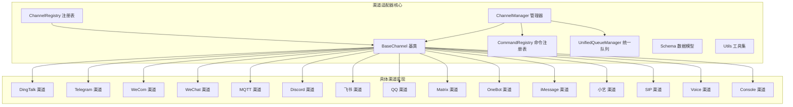
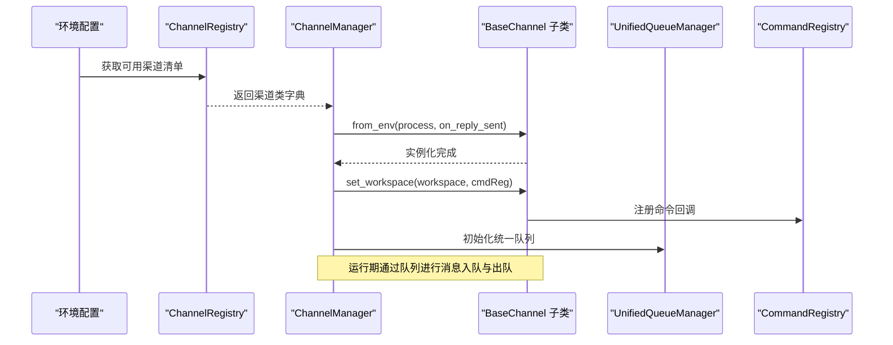
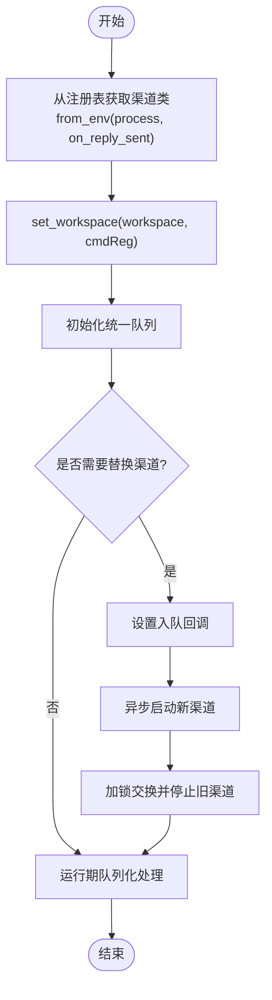
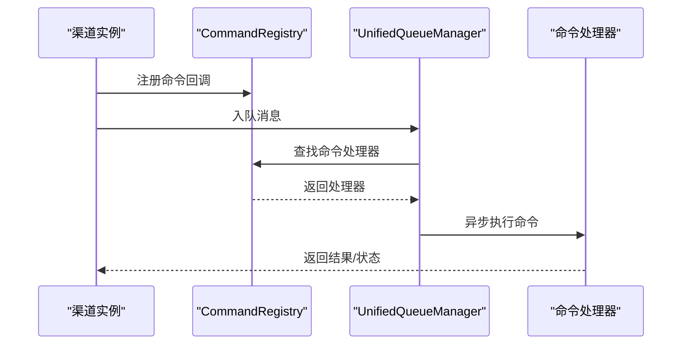
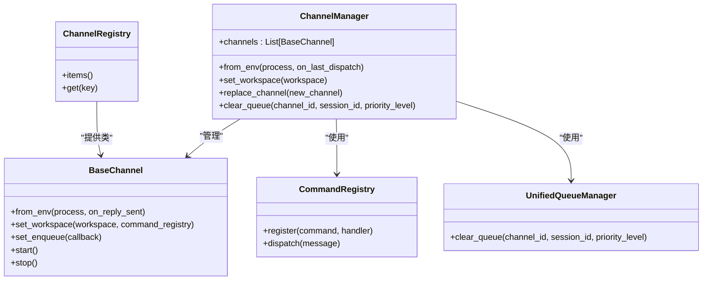

# 渠道适配器框架

<cite>
**本文引用的文件**
- [src/qwenpaw/app/channels/base.py](file://src/qwenpaw/app/channels/base.py)
- [src/qwenpaw/app/channels/manager.py](file://src/qwenpaw/app/channels/manager.py)
- [src/qwenpaw/app/channels/registry.py](file://src/qwenpaw/app/channels/registry.py)
- [src/qwenpaw/app/channels/command_registry.py](file://src/qwenpaw/app/channels/command_registry.py)
- [src/qwenpaw/app/channels/unified_queue_manager.py](file://src/qwenpaw/app/channels/unified_queue_manager.py)
- [src/qwenpaw/app/channels/schema.py](file://src/qwenpaw/app/channels/schema.py)
- [src/qwenpaw/app/channels/utils.py](file://src/qwenpaw/app/channels/utils.py)
- [src/qwenpaw/app/channels/__init__.py](file://src/qwenpaw/app/channels/__init__.py)
- [src/qwenpaw/app/channels/console/channel.py](file://src/qwenpaw/app/channels/console/channel.py)
- [src/qwenpaw/app/channels/dingtalk/channel.py](file://src/qwenpaw/app/channels/dingtalk/channel.py)
- [src/qwenpaw/app/channels/telegram/channel.py](file://src/qwenpaw/app/channels/telegram/channel.py)
- [src/qwenpaw/app/channels/wecom/channel.py](file://src/qwenpaw/app/channels/wecom/channel.py)
- [src/qwenpaw/app/channels/weixin/channel.py](file://src/qwenpaw/app/channels/weixin/channel.py)
- [src/qwenpaw/app/channels/mqtt/channel.py](file://src/qwenpaw/app/channels/mqtt/channel.py)
- [src/qwenpaw/app/channels/discord_/channel.py](file://src/qwenpaw/app/channels/discord_/channel.py)
- [src/qwenpaw/app/channels/feishu/channel.py](file://src/qwenpaw/app/channels/feishu/channel.py)
- [src/qwenpaw/app/channels/qq/channel.py](file://src/qwenpaw/app/channels/qq/channel.py)
- [src/qwenpaw/app/channels/matrix/channel.py](file://src/qwenpaw/app/channels/matrix/channel.py)
- [src/qwenpaw/app/channels/onebot/channel.py](file://src/qwenpaw/app/channels/onebot/channel.py)
- [src/qwenpaw/app/channels/imessage/channel.py](file://src/qwenpaw/app/channels/imessage/channel.py)
- [src/qwenpaw/app/channels/xiaoyi/channel.py](file://src/qwenpaw/app/channels/xiaoyi/channel.py)
- [src/qwenpaw/app/channels/sip/backend.py](file://src/qwenpaw/app/channels/sip/backend.py)
- [src/qwenpaw/app/channels/sip/session.py](file://src/qwenpaw/app/channels/sip/session.py)
- [src/qwenpaw/app/channels/sip/sip_client.py](file://src/qwenpaw/app/channels/sip/sip_client.py)
- [src/qwenpaw/app/channels/voice/conversation_relay.py](file://src/qwenpaw/app/channels/voice/conversation_relay.py)
- [src/qwenpaw/app/channels/voice/twilio_manager.py](file://src/qwenpaw/app/channels/voice/twilio_manager.py)
- [src/qwenpaw/app/channels/voice/twiml.py](file://src/qwenpaw/app/channels/voice/twiml.py)
- [tests/unit/channels/test_base_core.py](file://tests/unit/channels/test_base_core.py)
</cite>

## 目录
1. [简介](#简介)
2. [项目结构](#项目结构)
3. [核心组件](#核心组件)
4. [架构总览](#架构总览)
5. [详细组件分析](#详细组件分析)
6. [依赖关系分析](#依赖关系分析)
7. [性能考量](#性能考量)
8. [故障排查指南](#故障排查指南)
9. [结论](#结论)
10. [附录：开发示例与最佳实践](#附录开发示例与最佳实践)

## 简介
本技术文档面向希望为QwenPaw平台开发“渠道适配器”的开发者，系统性阐述渠道适配器的基础架构、继承体系与核心接口设计；详解BaseChannel基类的方法定义、生命周期管理与抽象方法实现；介绍ChannelManager的渠道管理机制、统一队列与负载均衡策略；解释ChannelRegistry的注册机制、动态加载与版本管理；并提供CommandRegistry的命令处理框架、消息路由与执行流程。文档同时给出可直接参考的源码路径与图示，帮助开发者快速上手并高质量完成自定义渠道适配器的开发。

## 项目结构
渠道适配器框架位于后端应用模块中，核心代码集中在src/qwenpaw/app/channels目录下，并在该目录下按渠道类型组织具体实现（如dingtalk、telegram、wecom等）。整体采用“基类+多子类”的继承体系，配合统一的管理器、注册表与命令分发机制，形成可扩展、可维护的渠道生态。

图表来源
- [src/qwenpaw/app/channels/base.py](file://src/qwenpaw/app/channels/base.py)
- [src/qwenpaw/app/channels/manager.py](file://src/qwenpaw/app/channels/manager.py)
- [src/qwenpaw/app/channels/registry.py](file://src/qwenpaw/app/channels/registry.py)
- [src/qwenpaw/app/channels/command_registry.py](file://src/qwenpaw/app/channels/command_registry.py)
- [src/qwenpaw/app/channels/unified_queue_manager.py](file://src/qwenpaw/app/channels/unified_queue_manager.py)
- [src/qwenpaw/app/channels/schema.py](file://src/qwenpaw/app/channels/schema.py)
- [src/qwenpaw/app/channels/utils.py](file://src/qwenpaw/app/channels/utils.py)
- [src/qwenpaw/app/channels/dingtalk/channel.py](file://src/qwenpaw/app/channels/dingtalk/channel.py)
- [src/qwenpaw/app/channels/telegram/channel.py](file://src/qwenpaw/app/channels/telegram/channel.py)
- [src/qwenpaw/app/channels/wecom/channel.py](file://src/qwenpaw/app/channels/wecom/channel.py)
- [src/qwenpaw/app/channels/weixin/channel.py](file://src/qwenpaw/app/channels/weixin/channel.py)
- [src/qwenpaw/app/channels/mqtt/channel.py](file://src/qwenpaw/app/channels/mqtt/channel.py)
- [src/qwenpaw/app/channels/discord_/channel.py](file://src/qwenpaw/app/channels/discord_/channel.py)
- [src/qwenpaw/app/channels/feishu/channel.py](file://src/qwenpaw/app/channels/feishu/channel.py)
- [src/qwenpaw/app/channels/qq/channel.py](file://src/qwenpaw/app/channels/qq/channel.py)
- [src/qwenpaw/app/channels/matrix/channel.py](file://src/qwenpaw/app/channels/matrix/channel.py)
- [src/qwenpaw/app/channels/onebot/channel.py](file://src/qwenpaw/app/channels/onebot/channel.py)
- [src/qwenpaw/app/channels/imessage/channel.py](file://src/qwenpaw/app/channels/imessage/channel.py)
- [src/qwenpaw/app/channels/xiaoyi/channel.py](file://src/qwenpaw/app/channels/xiaoyi/channel.py)
- [src/qwenpaw/app/channels/sip/backend.py](file://src/qwenpaw/app/channels/sip/backend.py)
- [src/qwenpaw/app/channels/voice/conversation_relay.py](file://src/qwenpaw/app/channels/voice/conversation_relay.py)
- [src/qwenpaw/app/channels/console/channel.py](file://src/qwenpaw/app/channels/console/channel.py)

章节来源
- [src/qwenpaw/app/channels/__init__.py](file://src/qwenpaw/app/channels/__init__.py)
- [src/qwenpaw/app/channels/base.py](file://src/qwenpaw/app/channels/base.py)
- [src/qwenpaw/app/channels/manager.py](file://src/qwenpaw/app/channels/manager.py)

## 核心组件
- BaseChannel：所有渠道适配器的抽象基类，定义统一的生命周期钩子、消息处理接口、工作区注入与命令注册回调设置等。
- ChannelManager：负责从注册表批量创建渠道实例、注入统一进程与工作区、管理渠道生命周期、统一队列与负载均衡。
- ChannelRegistry：渠道类的注册与动态加载入口，支持按可用渠道列表筛选与实例化。
- CommandRegistry：命令注册与分发中心，承载消息到命令的路由与执行流程。
- UnifiedQueueManager：统一队列管理器，提供按渠道、会话、优先级的队列清理与调度能力。
- Schema/Utils：数据模型与通用工具，支撑渠道间共享的数据结构与辅助能力。

章节来源
- [src/qwenpaw/app/channels/base.py](file://src/qwenpaw/app/channels/base.py)
- [src/qwenpaw/app/channels/manager.py](file://src/qwenpaw/app/channels/manager.py)
- [src/qwenpaw/app/channels/registry.py](file://src/qwenpaw/app/channels/registry.py)
- [src/qwenpaw/app/channels/command_registry.py](file://src/qwenpaw/app/channels/command_registry.py)
- [src/qwenpaw/app/channels/unified_queue_manager.py](file://src/qwenpaw/app/channels/unified_queue_manager.py)
- [src/qwenpaw/app/channels/schema.py](file://src/qwenpaw/app/channels/schema.py)
- [src/qwenpaw/app/channels/utils.py](file://src/qwenpaw/app/channels/utils.py)

## 架构总览
渠道适配器框架通过“基类约束 + 管理器编排 + 注册表动态加载 + 命令分发 + 统一队列”的组合，形成高内聚、低耦合的扩展架构。ChannelManager在启动时从ChannelRegistry获取可用渠道清单，逐一实例化并注入统一的process回调与工作区；随后通过CommandRegistry进行命令路由，借助UnifiedQueueManager实现队列化处理与负载均衡。

图表来源
- [src/qwenpaw/app/channels/manager.py](file://src/qwenpaw/app/channels/manager.py)
- [src/qwenpaw/app/channels/registry.py](file://src/qwenpaw/app/channels/registry.py)
- [src/qwenpaw/app/channels/command_registry.py](file://src/qwenpaw/app/channels/command_registry.py)
- [src/qwenpaw/app/channels/unified_queue_manager.py](file://src/qwenpaw/app/channels/unified_queue_manager.py)

## 详细组件分析

### BaseChannel 基类：方法定义、生命周期与抽象接口
- 生命周期钩子
  - 初始化与注入：from_env用于从环境创建实例并注入统一process回调；set_workspace用于注入工作区与命令注册表。
  - 队列回调：set_enqueue用于存储入队回调，供管理器或队列系统调用。
  - 会话与上下文：提供会话标识、用户标识、消息解析与回执通知等接口约定。
- 抽象方法与约定
  - 消息接收与处理：定义消息到达后的解析、校验与转发至命令分发层的接口。
  - 回复发送：定义标准化的回复封装与发送流程。
  - 资源清理：定义停止与释放资源的钩子，确保优雅关闭。
- 与ChannelManager的协作
  - 管理器在创建完成后调用set_workspace注入统一的命令注册表，以便渠道内部可直接路由命令。

章节来源
- [src/qwenpaw/app/channels/base.py](file://src/qwenpaw/app/channels/base.py)
- [tests/unit/channels/test_base_core.py](file://tests/unit/channels/test_base_core.py)

### ChannelManager：渠道管理、统一队列与替换流程
- 渠道创建与注入
  - 通过ChannelRegistry获取可用渠道类，结合环境参数批量实例化；随后统一注入process回调与on_reply_sent。
- 工作区注入
  - set_workspace将工作区注入所有渠道，并传入CommandRegistry以建立命令路由通道。
- 统一队列与负载均衡
  - 内置CommandRegistry与UnifiedQueueManager，支持按渠道、会话、优先级的队列清理与调度。
- 动态替换
  - replace_channel提供无锁入队回调设置、新渠道异步启动、锁内交换与旧渠道停止的原子替换流程，避免并发重启问题。

图表来源
- [src/qwenpaw/app/channels/manager.py](file://src/qwenpaw/app/channels/manager.py)
- [src/qwenpaw/app/channels/command_registry.py](file://src/qwenpaw/app/channels/command_registry.py)
- [src/qwenpaw/app/channels/unified_queue_manager.py](file://src/qwenpaw/app/channels/unified_queue_manager.py)

章节来源
- [src/qwenpaw/app/channels/manager.py](file://src/qwenpaw/app/channels/manager.py)

### ChannelRegistry：注册机制、动态加载与版本管理
- 注册与发现
  - 提供渠道类的注册与查询接口，支持按渠道键名检索对应类。
- 动态加载
  - 与ChannelManager配合，依据可用渠道清单动态筛选并实例化。
- 版本管理
  - 可通过注册表版本号或渠道元信息实现兼容性控制与灰度发布策略。

章节来源
- [src/qwenpaw/app/channels/registry.py](file://src/qwenpaw/app/channels/registry.py)

### CommandRegistry：命令处理框架、消息路由与执行流程
- 命令注册
  - 渠道在set_workspace阶段向CommandRegistry注册命令处理器，建立消息到命令的映射。
- 路由与执行
  - ChannelManager在收到消息后，经CommandRegistry路由到具体命令处理器，再交由统一队列进行异步执行。
- 扩展点
  - 支持命令优先级、超时控制、重试策略与错误处理的统一配置。

图表来源
- [src/qwenpaw/app/channels/command_registry.py](file://src/qwenpaw/app/channels/command_registry.py)
- [src/qwenpaw/app/channels/unified_queue_manager.py](file://src/qwenpaw/app/channels/unified_queue_manager.py)

章节来源
- [src/qwenpaw/app/channels/command_registry.py](file://src/qwenpaw/app/channels/command_registry.py)
- [src/qwenpaw/app/channels/unified_queue_manager.py](file://src/qwenpaw/app/channels/unified_queue_manager.py)

### UnifiedQueueManager：队列化处理与清理
- 队列维度
  - 以channel_id、session_id、priority_level为维度进行队列隔离与调度。
- 清理能力
  - clear_queue支持按维度清理队列，便于重试与故障恢复。
- 与ChannelManager协作
  - ChannelManager在初始化时注入队列管理器，并在运行期通过队列进行消息的有序处理。

章节来源
- [src/qwenpaw/app/channels/unified_queue_manager.py](file://src/qwenpaw/app/channels/unified_queue_manager.py)

### Schema 与 Utils：数据模型与通用工具
- Schema
  - 定义渠道间共享的数据结构与序列化规范，保证消息格式一致性。
- Utils
  - 提供渠道通用的工具函数，如消息规范化、会话管理、鉴权辅助等。

章节来源
- [src/qwenpaw/app/channels/schema.py](file://src/qwenpaw/app/channels/schema.py)
- [src/qwenpaw/app/channels/utils.py](file://src/qwenpaw/app/channels/utils.py)

## 依赖关系分析
- 继承关系
  - 各具体渠道（如dingtalk、telegram、wecom等）均继承自BaseChannel，遵循统一接口与生命周期。
- 管理与编排
  - ChannelManager聚合多个BaseChannel实例，协调CommandRegistry与UnifiedQueueManager。
- 注册与发现
  - ChannelRegistry集中管理渠道类，支持动态加载与版本控制。
- 数据与工具
  - Schema与Utils为各渠道提供统一的数据契约与工具能力。

图表来源
- [src/qwenpaw/app/channels/base.py](file://src/qwenpaw/app/channels/base.py)
- [src/qwenpaw/app/channels/manager.py](file://src/qwenpaw/app/channels/manager.py)
- [src/qwenpaw/app/channels/registry.py](file://src/qwenpaw/app/channels/registry.py)
- [src/qwenpaw/app/channels/command_registry.py](file://src/qwenpaw/app/channels/command_registry.py)
- [src/qwenpaw/app/channels/unified_queue_manager.py](file://src/qwenpaw/app/channels/unified_queue_manager.py)

## 性能考量
- 队列化与背压
  - 使用UnifiedQueueManager对消息进行队列化处理，避免瞬时高峰导致的阻塞与丢包。
- 并发与锁粒度
  - ChannelManager对替换流程采用细粒度锁，仅在交换与停止旧渠道时加锁，其余时间保持高并发。
- 资源复用
  - BaseChannel在生命周期内尽量复用连接与会话，减少频繁创建销毁带来的开销。
- 负载均衡
  - 通过队列维度（渠道、会话、优先级）实现天然的负载隔离与均衡。

## 故障排查指南
- 渠道无法启动
  - 检查ChannelRegistry是否正确注册渠道类，确认from_env参数是否完整。
- 消息未被处理
  - 确认ChannelManager已调用set_workspace并将CommandRegistry注入；检查命令是否已在CommandRegistry注册。
- 队列堆积
  - 使用clear_queue清理指定维度队列；检查命令处理器执行耗时与重试策略。
- 替换失败
  - 关注replace_channel流程中的回调设置、新渠道启动与旧渠道停止顺序，避免并发重启。

章节来源
- [src/qwenpaw/app/channels/manager.py](file://src/qwenpaw/app/channels/manager.py)
- [src/qwenpaw/app/channels/command_registry.py](file://src/qwenpaw/app/channels/command_registry.py)
- [src/qwenpaw/app/channels/unified_queue_manager.py](file://src/qwenpaw/app/channels/unified_queue_manager.py)

## 结论
QwenPaw的渠道适配器框架以BaseChannel为核心抽象，结合ChannelManager的统一编排、ChannelRegistry的动态注册、CommandRegistry的命令路由以及UnifiedQueueManager的队列化处理，构建了高扩展、高可用的渠道生态。开发者只需遵循基类接口与生命周期约定，即可快速实现新的渠道适配器，并通过统一的管理与调度获得稳定的运行表现。

## 附录：开发示例与最佳实践
- 开发步骤
  - 新建渠道类并继承BaseChannel，实现from_env、start、stop与消息处理接口。
  - 在渠道模块中注册命令处理器，确保set_workspace阶段完成注册。
  - 在ChannelRegistry中注册新渠道类，使其可通过环境自动加载。
  - 如需队列化处理，使用UnifiedQueueManager提供的入队与清理能力。
- 最佳实践
  - 明确消息格式与Schema，确保跨渠道一致性。
  - 将耗时操作放入队列异步执行，避免阻塞主循环。
  - 对关键资源（如网络连接、会话）进行生命周期管理与异常恢复。
  - 为命令处理器编写单元测试，覆盖正常与异常分支。
  - 使用clear_queue进行可控的队列清理与重试，避免无限堆积。

章节来源
- [src/qwenpaw/app/channels/base.py](file://src/qwenpaw/app/channels/base.py)
- [src/qwenpaw/app/channels/registry.py](file://src/qwenpaw/app/channels/registry.py)
- [src/qwenpaw/app/channels/command_registry.py](file://src/qwenpaw/app/channels/command_registry.py)
- [src/qwenpaw/app/channels/unified_queue_manager.py](file://src/qwenpaw/app/channels/unified_queue_manager.py)