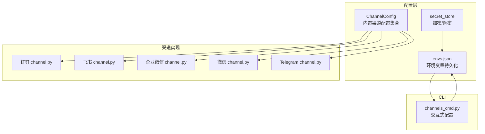
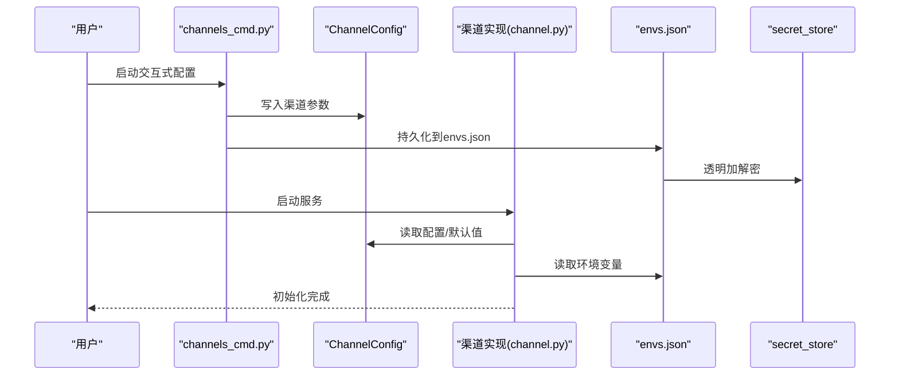
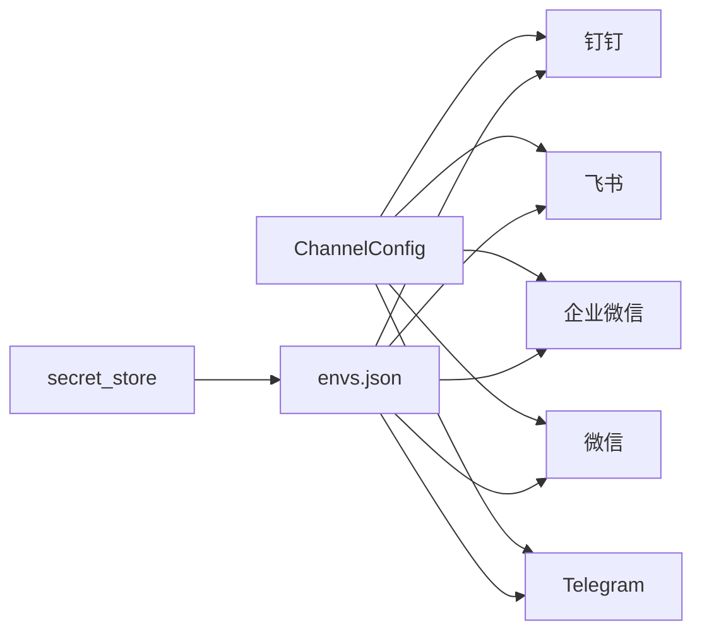

# 渠道配置参数

<cite>
**本文引用的文件**
- [src/qwenpaw/app/channels/dingtalk/channel.py](file://src/qwenpaw/app/channels/dingtalk/channel.py)
- [src/qwenpaw/app/channels/feishu/channel.py](file://src/qwenpaw/app/channels/feishu/channel.py)
- [src/qwenpaw/app/channels/wecom/channel.py](file://src/qwenpaw/app/channels/wecom/channel.py)
- [src/qwenpaw/app/channels/weixin/channel.py](file://src/qwenpaw/app/channels/weixin/channel.py)
- [src/qwenpaw/app/channels/telegram/channel.py](file://src/qwenpaw/app/channels/telegram/channel.py)
- [src/qwenpaw/config/config.py](file://src/qwenpaw/config/config.py)
- [src/qwenpaw/cli/channels_cmd.py](file://src/qwenpaw/cli/channels_cmd.py)
- [src/qwenpaw/envs/store.py](file://src/qwenpaw/envs/store.py)
- [src/qwenpaw/security/secret_store.py](file://src/qwenpaw/security/secret_store.py)
</cite>

## 目录
1. [简介](#简介)
2. [项目结构](#项目结构)
3. [核心组件](#核心组件)
4. [架构总览](#架构总览)
5. [详细组件分析](#详细组件分析)
6. [依赖分析](#依赖分析)
7. [性能考虑](#性能考虑)
8. [故障排查指南](#故障排查指南)
9. [结论](#结论)
10. [附录](#附录)

## 简介
本文件面向QwenPaw各IM渠道（钉钉、企业微信、飞书、微信、Telegram）的配置参数与接入要点，系统性说明各渠道所需的关键参数、认证密钥、连接设置与安全存储策略，并提供配置模板、环境变量设置建议、参数校验规则、默认值与错误处理机制，以及常见问题排查方法。

## 项目结构
QwenPaw通过“通道（Channel）”抽象统一接入多平台IM。各渠道在独立子目录中实现，共享通用的配置模型与环境变量加载机制。关键位置如下：
- 渠道实现：src/qwenpaw/app/channels/<platform>/channel.py
- 渠道配置模型：src/qwenpaw/config/config.py
- CLI交互式配置：src/qwenpaw/cli/channels_cmd.py
- 环境变量持久化与加密：src/qwenpaw/envs/store.py、src/qwenpaw/security/secret_store.py

图表来源
- [src/qwenpaw/config/config.py:415-435](file://src/qwenpaw/config/config.py#L415-L435)
- [src/qwenpaw/cli/channels_cmd.py:303-352](file://src/qwenpaw/cli/channels_cmd.py#L303-L352)
- [src/qwenpaw/envs/store.py:142-220](file://src/qwenpaw/envs/store.py#L142-L220)
- [src/qwenpaw/security/secret_store.py](file://src/qwenpaw/security/secret_store.py)

章节来源
- [src/qwenpaw/config/config.py:415-435](file://src/qwenpaw/config/config.py#L415-L435)
- [src/qwenpaw/cli/channels_cmd.py:303-352](file://src/qwenpaw/cli/channels_cmd.py#L303-L352)
- [src/qwenpaw/envs/store.py:142-220](file://src/qwenpaw/envs/store.py#L142-L220)

## 核心组件
- 渠道配置模型（ChannelConfig）：集中定义所有内置渠道的配置项，默认值与可扩展字段，支持从配置文件读取或插件扩展。
- 渠道实现类：各平台通过from_config/from_env工厂方法从配置或环境变量实例化，注入运行时参数。
- CLI交互配置：提供交互式提示，引导用户输入各渠道的必要参数并写入配置或环境变量。
- 环境变量持久化与加密：envs.json持久化敏感信息，secret_store负责透明加解密，确保安全存储。

章节来源
- [src/qwenpaw/config/config.py:415-435](file://src/qwenpaw/config/config.py#L415-L435)
- [src/qwenpaw/cli/channels_cmd.py:303-352](file://src/qwenpaw/cli/channels_cmd.py#L303-L352)
- [src/qwenpaw/envs/store.py:142-220](file://src/qwenpaw/envs/store.py#L142-L220)

## 架构总览
下图展示渠道配置在系统中的流转：配置模型 → 渠道实现 → 运行时参数；同时CLI与环境变量持久化模块贯穿其中，保障参数输入与安全存储。

图表来源
- [src/qwenpaw/cli/channels_cmd.py:303-352](file://src/qwenpaw/cli/channels_cmd.py#L303-L352)
- [src/qwenpaw/config/config.py:415-435](file://src/qwenpaw/config/config.py#L415-L435)
- [src/qwenpaw/envs/store.py:142-220](file://src/qwenpaw/envs/store.py#L142-L220)
- [src/qwenpaw/security/secret_store.py](file://src/qwenpaw/security/secret_store.py)

## 详细组件分析

### 钉钉渠道（DingTalk）
- 关键参数
  - 启用开关：DINGTALK_CHANNEL_ENABLED
  - 应用标识：DINGTALK_CLIENT_ID
  - 应用密钥：DINGTALK_CLIENT_SECRET
  - 机器人前缀：DINGTALK_BOT_PREFIX
  - 消息类型：DINGTALK_MESSAGE_TYPE（默认markdown）
  - 卡片模板ID：DINGTALK_CARD_TEMPLATE_ID
  - 卡片模板键：DINGTALK_CARD_TEMPLATE_KEY（默认content）
  - 机器人编码：DINGTALK_ROBOT_CODE（若未设置则回退为client_id）
  - 媒体目录：DINGTALK_MEDIA_DIR
  - DM策略：DINGTALK_DM_POLICY（默认open）
  - 群聊策略：DINGTALK_GROUP_POLICY（默认open）
  - 允许来源：DINGTALK_ALLOW_FROM（逗号分隔列表）
  - 拒绝消息：DINGTALK_DENY_MESSAGE
  - 是否需要@：DINGTALK_REQUIRE_MENTION（默认0）
  - 卡片自动布局：DINGTALK_CARD_AUTO_LAYOUT（默认0）
  - 回复时@发送者：DINGTALK_AT_SENDER_ON_REPLY（默认0）
- 默认值与回退
  - 消息类型默认markdown；卡片模板键默认content；机器人编码优先使用DINGTALK_ROBOT_CODE，否则回退为client_id。
- 参数来源
  - 支持from_env从环境变量加载，也支持from_config从配置对象加载。
- 安全建议
  - 将client_id与client_secret存入envs.json并由secret_store加密管理。
- 错误处理
  - 缺少必要参数可能导致初始化失败；建议在启动前检查环境变量是否完整。

章节来源
- [src/qwenpaw/app/channels/dingtalk/channel.py:231-305](file://src/qwenpaw/app/channels/dingtalk/channel.py#L231-L305)

### 企业微信（WeCom）
- 关键参数
  - 启用开关：WECOM_CHANNEL_ENABLED
  - 企业ID：WECOM_CORP_ID
  - 应用密钥：WECOM_APP_SECRET
  - 应用ID：WECOM_APP_ID
  - 机器人前缀：WECOM_BOT_PREFIX
  - 加解密密钥：WECOM_ENCRYPT_KEY
  - 校验Token：WECOM_VERIFICATION_TOKEN
  - 媒体目录：WECOM_MEDIA_DIR
  - DM策略：WECOM_DM_POLICY（默认open）
  - 群聊策略：WECOM_GROUP_POLICY（默认open）
  - 允许来源：WECOM_ALLOW_FROM（逗号分隔列表）
  - 拒绝消息：WECOM_DENY_MESSAGE
  - 是否需要@：WECOM_REQUIRE_MENTION（默认0）
  - 域名：WECOM_DOMAIN（默认wecom）
- 默认值与回退
  - 未设置时采用默认open策略与domain。
- 参数来源
  - 支持from_env与from_config两种方式。
- 安全建议
  - encrypt_key与verification_token等敏感信息建议通过envs.json与secret_store管理。

章节来源
- [src/qwenpaw/app/channels/wecom/channel.py](file://src/qwenpaw/app/channels/wecom/channel.py)

### 飞书（Feishu）
- 关键参数
  - 启用开关：FEISHU_CHANNEL_ENABLED
  - 应用ID：FEISHU_APP_ID
  - 应用密钥：FEISHU_APP_SECRET
  - 机器人前缀：FEISHU_BOT_PREFIX
  - 加解密密钥：FEISHU_ENCRYPT_KEY
  - 校验Token：FEISHU_VERIFICATION_TOKEN
  - 媒体目录：FEISHU_MEDIA_DIR
  - DM策略：FEISHU_DM_POLICY（默认open）
  - 群聊策略：FEISHU_GROUP_POLICY（默认open）
  - 允许来源：FEISHU_ALLOW_FROM（逗号分隔列表）
  - 拒绝消息：FEISHU_DENY_MESSAGE
  - 是否需要@：FEISHU_REQUIRE_MENTION（默认None）
  - 域名：FEISHU_DOMAIN（默认feishu）
- 默认值与回退
  - 未设置require_mention时按None处理；域名默认feishu。
- 参数来源
  - 支持from_env与from_config两种方式。
- 安全建议
  - app_id与app_secret、encrypt_key、verification_token等建议加密存储。

章节来源
- [src/qwenpaw/app/channels/feishu/channel.py:291-322](file://src/qwenpaw/app/channels/feishu/channel.py#L291-L322)

### 微信（WeChat / iLink Bot）
- 关键参数
  - 启用开关：WEIXIN_CHANNEL_ENABLED
  - 令牌：WEIXIN_BOT_TOKEN（扫码登录后获得的Bearer Token）
  - 令牌文件：WEIXIN_BOT_TOKEN_FILE（默认~/.qwenpaw/weixin_bot_token）
  - 基础URL：WEIXIN_BASE_URL（留空使用默认）
  - 媒体目录：WEIXIN_MEDIA_DIR
- 默认值与回退
  - 令牌文件默认路径；基础URL为空时使用默认值。
- 参数来源
  - 支持from_env与from_config两种方式。
- 安全建议
  - bot_token属于高敏感信息，建议通过envs.json与secret_store管理。

章节来源
- [src/qwenpaw/app/channels/weixin/channel.py](file://src/qwenpaw/app/channels/weixin/channel.py)

### Telegram
- 关键参数
  - 启用开关：TELEGRAM_CHANNEL_ENABLED
  - Bot Token：TELEGRAM_BOT_TOKEN
  - 机器人前缀：TELEGRAM_BOT_PREFIX
  - 媒体目录：TELEGRAM_MEDIA_DIR
  - DM策略：TELEGRAM_DM_POLICY（默认open）
  - 群聊策略：TELEGRAM_GROUP_POLICY（默认open）
  - 允许来源：TELEGRAM_ALLOW_FROM（逗号分隔列表）
  - 拒绝消息：TELEGRAM_DENY_MESSAGE
  - 是否需要@：TELEGRAM_REQUIRE_MENTION（默认0）
  - 回复时@发送者：TELEGRAM_AT_SENDER_ON_REPLY（默认0）
- 默认值与回退
  - 未设置时采用默认open策略。
- 参数来源
  - 支持from_env与from_config两种方式。
- 安全建议
  - bot_token属于高敏感信息，建议通过envs.json与secret_store管理。

章节来源
- [src/qwenpaw/app/channels/telegram/channel.py](file://src/qwenpaw/app/channels/telegram/channel.py)

### 渠道配置模型（ChannelConfig）
- 统一入口：ChannelConfig聚合所有内置渠道配置，支持额外键用于插件渠道。
- 默认值：各渠道配置类提供默认值，未设置时按默认策略工作。
- 可扩展：extra="allow"允许插件渠道自定义键。

章节来源
- [src/qwenpaw/config/config.py:415-435](file://src/qwenpaw/config/config.py#L415-L435)

### 交互式配置（CLI）
- 功能：为各渠道提供交互式配置流程，包括启用开关、必要参数输入与隐藏输入（如密钥）。
- 示例：钉钉与飞书的交互式配置流程已在CLI中实现，其他渠道可按相同模式扩展。

章节来源
- [src/qwenpaw/cli/channels_cmd.py:303-352](file://src/qwenpaw/cli/channels_cmd.py#L303-L352)

## 依赖分析
- 渠道实现依赖配置模型与环境变量加载：
  - 渠道类通过from_config/from_env读取ChannelConfig或环境变量。
  - 环境变量通过envs.json持久化，secret_store负责透明加解密。
- 参数依赖关系：
  - 钉钉：client_id/client_secret与robot_code存在回退关系。
  - 飞书/企业微信：encrypt_key与verification_token为安全相关必填项。
  - 微信：bot_token为一次性登录令牌，需持久化至bot_token_file。
  - Telegram：bot_token为唯一凭证，必须严格保密。

图表来源
- [src/qwenpaw/config/config.py:415-435](file://src/qwenpaw/config/config.py#L415-L435)
- [src/qwenpaw/envs/store.py:142-220](file://src/qwenpaw/envs/store.py#L142-L220)
- [src/qwenpaw/security/secret_store.py](file://src/qwenpaw/security/secret_store.py)

## 性能考虑
- 环境变量读取：从envs.json加载并同步到os.environ，避免重复I/O。
- 加密开销：secret_store对敏感值进行透明加解密，建议批量读取与缓存以减少频繁磁盘访问。
- 渠道初始化：参数校验与默认值回退在from_env/from_config阶段完成，避免运行时重复判断。

## 故障排查指南
- 参数缺失
  - 症状：渠道无法启动或报错。
  - 排查：确认对应环境变量是否已设置；检查envs.json是否存在且格式正确。
- 密钥泄露风险
  - 症状：生产环境密钥被明文存储。
  - 排查：确认secret_store已启用，envs.json中的值已被加密；必要时重新保存。
- 默认值导致行为异常
  - 症状：@提醒未生效或卡片布局不符合预期。
  - 排查：核对require_mention、card_auto_layout等布尔型默认值；必要时显式设置。
- 权限与回调
  - 症状：飞书/企业微信回调失败。
  - 排查：确认encrypt_key与verification_token正确无误；核对平台回调地址与域名配置。

章节来源
- [src/qwenpaw/envs/store.py:142-220](file://src/qwenpaw/envs/store.py#L142-L220)
- [src/qwenpaw/security/secret_store.py](file://src/qwenpaw/security/secret_store.py)

## 结论
QwenPaw通过统一的ChannelConfig与渠道实现抽象，结合CLI交互与envs.json+secret_store的安全存储，为多渠道IM接入提供了清晰、可扩展且安全的配置体系。遵循本文档的参数清单、默认值与安全建议，可有效降低配置复杂度并提升部署可靠性。

## 附录

### 配置文件模板（示例）
- envs.json（敏感参数示例）
  - "DINGTALK_CLIENT_ID": "<钉钉应用ID>",
  - "DINGTALK_CLIENT_SECRET": "<钉钉应用密钥>",
  - "FEISHU_APP_ID": "<飞书应用ID>",
  - "FEISHU_APP_SECRET": "<飞书应用密钥>",
  - "WECOM_CORP_ID": "<企业ID>",
  - "WECOM_APP_SECRET": "<应用密钥>",
  - "WECOM_APP_ID": "<应用ID>",
  - "WEIXIN_BOT_TOKEN": "<iLink Bot令牌>",
  - "TELEGRAM_BOT_TOKEN": "<Telegram Bot Token>"

### 环境变量设置建议
- 使用CLI交互式配置或直接编辑envs.json，确保敏感值经secret_store加密。
- 在容器/CI环境中，建议通过密钥管理服务注入envs.json或通过Kubernetes Secret挂载。

### 安全存储建议
- 所有渠道的密钥与令牌均应加密存储于envs.json，避免明文落盘。
- 定期轮换密钥并更新envs.json，确保历史版本不泄露。