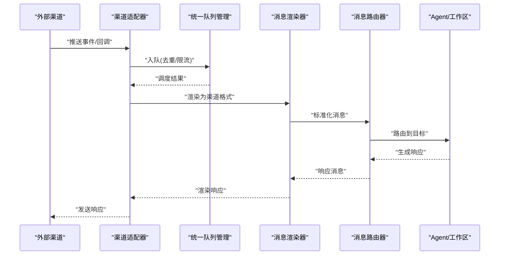
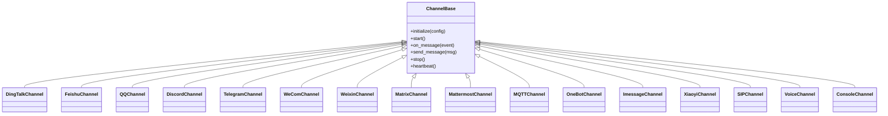
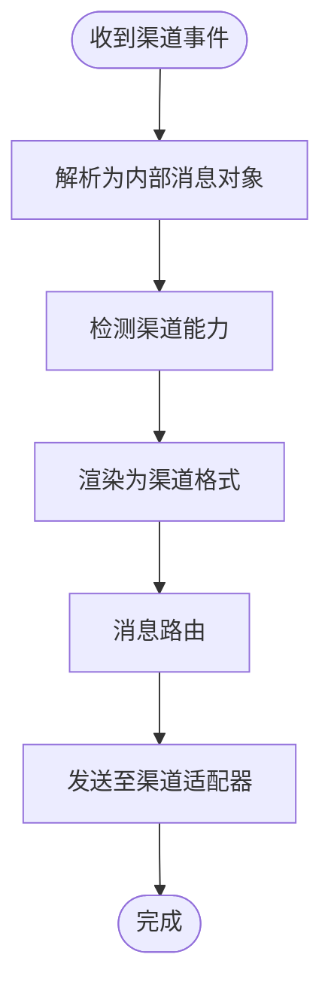
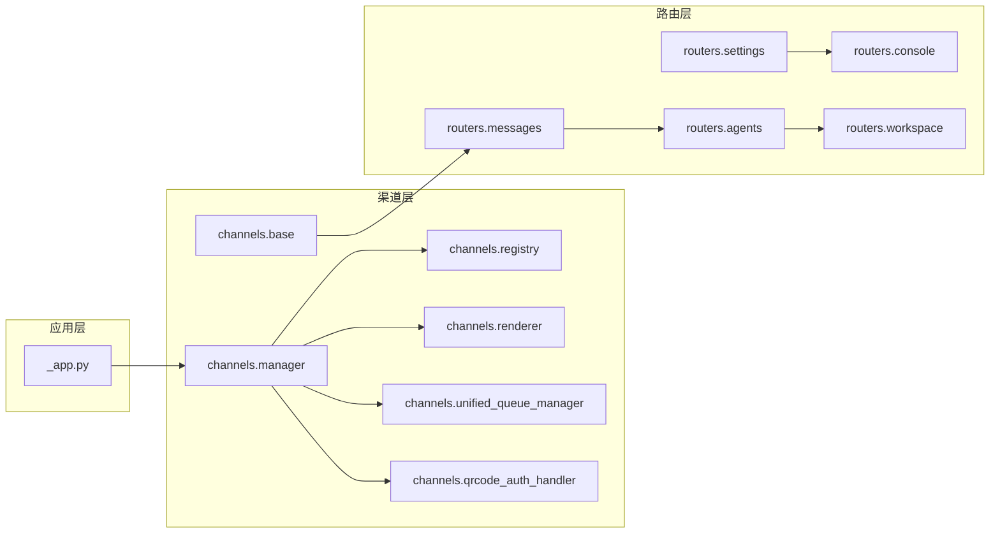

# 渠道集成

<cite>
**本文引用的文件**
- [src/qwenpaw/app/channels/base.py](file://src/qwenpaw/app/channels/base.py)
- [src/qwenpaw/app/channels/manager.py](file://src/qwenpaw/app/channels/manager.py)
- [src/qwenpaw/app/channels/registry.py](file://src/qwenpaw/app/channels/registry.py)
- [src/qwenpaw/app/channels/schema.py](file://src/qwenpaw/app/channels/schema.py)
- [src/qwenpaw/app/channels/unified_queue_manager.py](file://src/qwenpaw/app/channels/unified_queue_manager.py)
- [src/qwenpaw/app/channels/utils.py](file://src/qwenpaw/app/channels/utils.py)
- [src/qwenpaw/app/channels/dingtalk/channel.py](file://src/qwenpaw/app/channels/dingtalk/channel.py)
- [src/qwenpaw/app/channels/dingtalk/constants.py](file://src/qwenpaw/app/channels/dingtalk/constants.py)
- [src/qwenpaw/app/channels/dingtalk/content_utils.py](file://src/qwenpaw/app/channels/dingtalk/content_utils.py)
- [src/qwenpaw/app/channels/dingtalk/handler.py](file://src/qwenpaw/app/channels/dingtalk/handler.py)
- [src/qwenpaw/app/channels/dingtalk/markdown.py](file://src/qwenpaw/app/channels/dingtalk/markdown.py)
- [src/qwenpaw/app/channels/feishu/channel.py](file://src/qwenpaw/app/channels/feishu/channel.py)
- [src/qwenpaw/app/channels/feishu/constants.py](file://src/qwenpaw/app/channels/feishu/constants.py)
- [src/qwenpaw/app/channels/feishu/utils.py](file://src/qwenpaw/app/channels/feishu/utils.py)
- [src/qwenpaw/app/channels/qq/channel.py](file://src/qwenpaw/app/channels/qq/channel.py)
- [src/qwenpaw/app/channels/discord_/channel.py](file://src/qwenpaw/app/channels/discord_/channel.py)
- [src/qwenpaw/app/channels/telegram/channel.py](file://src/qwenpaw/app/channels/telegram/channel.py)
- [src/qwenpaw/app/channels/telegram/format_html.py](file://src/qwenpaw/app/channels/telegram/format_html.py)
- [src/qwenpaw/app/channels/wecom/channel.py](file://src/qwenpaw/app/channels/wecom/channel.py)
- [src/qwenpaw/app/channels/wecom/utils.py](file://src/qwenpaw/app/channels/wecom/utils.py)
- [src/qwenpaw/app/channels/weixin/channel.py](file://src/qwenpaw/app/channels/weixin/channel.py)
- [src/qwenpaw/app/channels/weixin/client.py](file://src/qwenpaw/app/channels/weixin/client.py)
- [src/qwenpaw/app/channels/weixin/utils.py](file://src/qwenpaw/app/channels/weixin/utils.py)
- [src/qwenpaw/app/channels/console/channel.py](file://src/qwenpaw/app/channels/console/channel.py)
- [src/qwenpaw/app/channels/matrix/channel.py](file://src/qwenpaw/app/channels/matrix/channel.py)
- [src/qwenpaw/app/channels/mattermost/channel.py](file://src/qwenpaw/app/channels/mattermost/channel.py)
- [src/qwenpaw/app/channels/mqtt/channel.py](file://src/qwenpaw/app/channels/mqtt/channel.py)
- [src/qwenpaw/app/channels/onebot/channel.py](file://src/qwenpaw/app/channels/onebot/channel.py)
- [src/qwenpaw/app/channels/imessage/channel.py](file://src/qwenpaw/app/channels/imessage/channel.py)
- [src/qwenpaw/app/channels/xiaoyi/channel.py](file://src/qwenpaw/app/channels/xiaoyi/channel.py)
- [src/qwenpaw/app/channels/xiaoyi/constants.py](file://src/qwenpaw/app/channels/xiaoyi/constants.py)
- [src/qwenpaw/app/channels/xiaoyi/auth.py](file://src/qwenpaw/app/channels/xiaoyi/auth.py)
- [src/qwenpaw/app/channels/xiaoyi/utils.py](file://src/qwenpaw/app/channels/xiaoyi/utils.py)
- [src/qwenpaw/app/channels/voice/channel.py](file://src/qwenpaw/app/channels/voice/channel.py)
- [src/qwenpaw/app/channels/voice/conversation_relay.py](file://src/qwenpaw/app/channels/voice/conversation_relay.py)
- [src/qwenpaw/app/channels/voice/session.py](file://src/qwenpaw/app/channels/voice/session.py)
- [src/qwenpaw/app/channels/voice/twilio_manager.py](file://src/qwenpaw/app/channels/voice/twilio_manager.py)
- [src/qwenpaw/app/channels/voice/twiml.py](file://src/qwenpaw/app/channels/voice/twiml.py)
- [src/qwenpaw/app/channels/sip/backend.py](file://src/qwenpaw/app/channels/sip/backend.py)
- [src/qwenpaw/app/channels/sip/livekit_backend.py](file://src/qwenpaw/app/channels/sip/livekit_backend.py)
- [src/qwenpaw/app/channels/sip/pyvoip_backend.py](file://src/qwenpaw/app/channels/sip/pyvoip_backend.py)
- [src/qwenpaw/app/channels/sip/sip_client.py](file://src/qwenpaw/app/channels/sip/sip_client.py)
- [src/qwenpaw/app/channels/sip/session.py](file://src/qwenpaw/app/channels/sip/session.py)
- [src/qwenpaw/app/channels/sip/stt_engine.py](file://src/qwenpaw/app/channels/sip/stt_engine.py)
- [src/qwenpaw/app/channels/sip/stt_tts.py](file://src/qwenpaw/app/channels/sip/stt_tts.py)
- [src/qwenpaw/app/channels/sip/_audioop_compat.py](file://src/qwenpaw/app/channels/sip/_audioop_compat.py)
- [src/qwenpaw/app/channels/sip/mini_registrar.py](file://src/qwenpaw/app/channels/sip/mini_registrar.py)
- [src/qwenpaw/app/channels/sip/voice/_audioop_compat.py](file://src/qwenpaw/app/channels/sip/voice/_audioop_compat.py)
- [src/qwenpaw/app/channels/sip/voice/stt_engine.py](file://src/qwenpaw/app/channels/sip/voice/stt_engine.py)
- [src/qwenpaw/app/channels/sip/voice/stt_tts.py](file://src/qwenpaw/app/channels/sip/voice/stt_tts.py)
- [src/qwenpaw/app/channels/sip/voice/twilio_manager.py](file://src/qwenpaw/app/channels/sip/voice/twilio_manager.py)
- [src/qwenpaw/app/channels/sip/voice/twiml.py](file://src/qwenpaw/app/channels/sip/voice/twiml.py)
- [src/qwenpaw/app/channels/sip/voice/session.py](file://src/qwenpaw/app/channels/sip/voice/session.py)
- [src/qwenpaw/app/channels/sip/voice/conversation_relay.py](file://src/qwenpaw/app/channels/sip/voice/conversation_relay.py)
- [src/qwenpaw/app/channels/sip/voice/backend.py](file://src/qwenpaw/app/channels/sip/voice/backend.py)
- [src/qwenpaw/app/channels/sip/voice/livekit_backend.py](file://src/qwenpaw/app/channels/sip/voice/livekit_backend.py)
- [src/qwenpaw/app/channels/sip/voice/pyvoip_backend.py](file://src/qwenpaw/app/channels/sip/voice/pyvoip_backend.py)
- [src/qwenpaw/app/channels/sip/voice/sip_client.py](file://src/qwenpaw/app/channels/sip/voice/sip_client.py)
- [src/qwenpaw/app/channels/sip/voice/_audioop_compat.py](file://src/qwenpaw/app/channels/sip/voice/_audioop_compat.py)
- [src/qwenpaw/app/channels/sip/voice/mini_registrar.py](file://src/qwenpaw/app/channels/sip/voice/mini_registrar.py)
- [src/qwenpaw/app/channels/qrcode_auth_handler.py](file://src/qwenpaw/app/channels/qrcode_auth_handler.py)
- [src/qwenpaw/app/channels/renderer.py](file://src/qwenpaw/app/channels/renderer.py)
- [src/qwenpaw/app/channels/command_registry.py](file://src/qwenpaw/app/channels/command_registry.py)
- [src/qwenpaw/app/channels/__init__.py](file://src/qwenpaw/app/channels/__init__.py)
- [src/qwenpaw/app/channels/dingtalk/ai_card.py](file://src/qwenpaw/app/channels/dingtalk/ai_card.py)
- [src/qwenpaw/app/channels/dingtalk/utils.py](file://src/qwenpaw/app/channels/dingtalk/utils.py)
- [src/qwenpaw/app/routers/messages.py](file://src/qwenpaw/app/routers/messages.py)
- [src/qwenpaw/app/routers/agents.py](file://src/qwenpaw/app/routers/agents.py)
- [src/qwenpaw/app/routers/console.py](file://src/qwenpaw/app/routers/console.py)
- [src/qwenpaw/app/routers/settings.py](file://src/qwenpaw/app/routers/settings.py)
- [src/qwenpaw/app/routers/workspace.py](file://src/qwenpaw/app/routers/workspace.py)
- [src/qwenpaw/app/routers/auth.py](file://src/qwenpaw/app/routers/auth.py)
- [src/qwenpaw/app/routers/providers.py](file://src/qwenpaw/app/routers/providers.py)
- [src/qwenpaw/app/routers/tools.py](file://src/qwenpaw/app/routers/tools.py)
- [src/qwenpaw/app/routers/skills.py](file://src/qwenpaw/app/routers/skills.py)
- [src/qwenpaw/app/routers/token_usage.py](file://src/qwenpaw/app/routers/token_usage.py)
- [src/qwenpaw/app/routers/envs.py](file://src/qwenpaw/app/routers/envs.py)
- [src/qwenpaw/app/routers/cronjob.py](file://src/qwenpaw/app/routers/cronjob.py)
- [src/qwenpaw/app/routers/backup.py](file://src/qwenpaw/app/routers/backup.py)
- [src/qwenpaw/app/routers/files.py](file://src/qwenpaw/app/routers/files.py)
- [src/qwenpaw/app/routers/heartbeat.py](file://src/qwenpaw/app/routers/heartbeat.py)
- [src/qwenpaw/app/routers/config.py](file://src/qwenpaw/app/routers/config.py)
- [src/qwenpaw/app/routers/debug.py](file://src/qwenpaw/app/routers/debug.py)
- [src/qwenpaw/app/routers/local_models.py](file://src/qwenpaw/app/routers/local_models.py)
- [src/qwenpaw/app/routers/mcp.py](file://src/qwenpaw/app/routers/mcp.py)
- [src/qwenpaw/app/routers/schemas_config.py](file://src/qwenpaw/app/routers/schemas_config.py)
- [src/qwenpaw/app/routers/skills_stream.py](file://src/qwenpaw/app/routers/skills_stream.py)
- [src/qwenpaw/app/routers/userTimezone.py](file://src/qwenpaw/app/routers/userTimezone.py)
- [src/qwenpaw/app/routers/agent_stats.py](file://src/qwenpaw/app/routers/agent_stats.py)
- [src/qwenpaw/app/routers/agent_scoped.py](file://src/qwenpaw/app/routers/agent_scoped.py)
- [src/qwenpaw/app/routers/agent.py](file://src/qwenpaw/app/routers/agent.py)
- [src/qwenpaw/app/routers/console.py](file://src/qwenpaw/app/routers/console.py)
- [src/qwenpaw/app/routers/agent_stats.py](file://src/qwenpaw/app/routers/agent_stats.py)
- [src/qwenpaw/app/routers/agent_scoped.py](file://src/qwenpaw/app/routers/agent_scoped.py)
- [src/qwenpaw/app/routers/agent.py](file://src/qwenpaw/app/routers/agent.py)
- [src/qwenpaw/app/routers/console.py](file://src/qwenpaw/app/routers/console.py)
- [src/qwenpaw/app/routers/agent_stats.py](file://src/qwenpaw/app/routers/agent_stats.py)
- [src/qwenpaw/app/routers/agent_scoped.py](file://src/qwenpaw/app/routers/agent_scoped.py)
- [src/qwenpaw/app/routers/agent.py](file://src/qwenpaw/app/routers/agent.py)
- [src/qwenpaw/app/routers/console.py](file://src/qwenpaw/app/routers/console.py)
- [src/qwenpaw/app/routers/agent_stats.py](file://src/qwenpaw/app/routers/agent_stats.py)
- [src/qwenpaw/app/routers/agent_scoped.py](file://src/qwenpaw/app/routers/agent_scoped.py)
- [src/qwenpaw/app/routers/agent.py](file://src/qwenpaw/app/routers/agent.py)
- [src/qwenpaw/app/routers/console.py](file://src/qwenpaw/app/routers/console.py)
- [src/qwenpaw/app/routers/agent_stats.py](file://src/qwenpaw/app/routers/agent_stats.py)
- [src/qwenpaw/app/routers/agent_scoped.py](file://src/qwenpaw/app/routers/agent_scoped.py)
- [src/qwenpaw/app/routers/agent.py](file://src/qwenpaw/app/routers/agent.py)
- [src/qwenpaw/app/routers/console.py](file://src/qwenpaw/app/routers/console.py)
- [src/qwenpaw/app/routers/agent_stats.py](file://src/qwenpaw/app/routers/agent_stats.py)
- [src/qwenpaw/app/routers/agent_scoped.py](file://src/qwenpaw/app/routers/agent_scoped.py)
- [src/qwenpaw/app/routers/agent.py](file://src/qwenpaw/app/routers/agent.py)
- [src/qwenpaw/app/routers/console.py](file://src/qwenpaw/app/routers/console.py)
- [src/qwenpaw/app/routers/agent_stats.py](file://src/qwenpaw/app/routers/agent_stats.py)
- [src/qwenpaw/app/routers/agent_scoped.py](file://src/qwenp......
</cite>

## 目录
1. [简介](#简介)
2. [项目结构](#项目结构)
3. [核心组件](#核心组件)
4. [架构总览](#架构总览)
5. [详细组件分析](#详细组件分析)
6. [依赖关系分析](#依赖关系分析)
7. [性能考虑](#性能考虑)
8. [故障排查指南](#故障排查指南)
9. [结论](#结论)
10. [附录](#附录)

## 简介
本技术文档面向希望在QwenPaw中集成即时通讯渠道（如钉钉、飞书、QQ、Discord、Telegram、企业微信、微信、Matrix、Mattermost、MQTT、OneBot、iMessage、小艺语音、SIP/语音通话等）的开发者与运维人员。文档系统性阐述渠道适配器的开发框架、消息格式转换、连接与会话管理、统一队列与渲染机制、认证与二维码授权流程，并给出各渠道的配置要点、认证方式与API使用建议。同时提供消息路由、状态同步与异常恢复策略，以及自定义渠道适配器的开发最佳实践。

## 项目结构
QwenPaw的渠道子系统位于后端应用目录下，采用“按渠道类型分包”的组织方式：每个渠道一个独立子模块，共享统一的基类、注册表、管理器与通用工具。核心入口与基础设施集中在channels包内，渠道实现遵循统一的接口契约，确保可插拔与一致性。

```mermaid
graph TB
subgraph "渠道基础设施"
Base["基础抽象<br/>base.py"]
Manager["渠道管理器<br/>manager.py"]
Registry["渠道注册表<br/>registry.py"]
Schema["渠道模型与校验<br/>schema.py"]
UQM["统一队列管理<br/>unified_queue_manager.py"]
Utils["通用工具<br/>utils.py"]
QR["二维码授权处理器<br/>qrcode_auth_handler.py"]
Renderer["消息渲染器<br/>renderer.py"]
CmdReg["命令注册表<br/>command_registry.py"]
end
subgraph "具体渠道实现"
Ding["钉钉<br/>dingtalk/*"]
Fei["飞书<br/>feishu/*"]
QQ["QQ<br/>qq/*"]
Disc["Discord<br/>discord_*"]
Tel["Telegram<br/>telegram/*"]
WC["企业微信<br/>wecom/*"]
WX["微信<br/>weixin/*"]
Mat["Matrix<br/>matrix/*"]
MM["Mattermost<br/>mattermost/*"]
MQTT["MQTT<br/>mqtt/*"]
OB["OneBot<br/>onebot/*"]
IM["iMessage<br/>imessage/*"]
XY["小艺语音<br/>xiaoyi/*"]
SIP["SIP/语音<br/>sip/*"]
Voice["Voice通道<br/>voice/*"]
Console["Console通道<br/>console/*"]
end
Base --> Ding
Base --> Fei
Base --> QQ
Base --> Disc
Base --> Tel
Base --> WC
Base --> WX
Base --> Mat
Base --> MM
Base --> MQTT
Base --> OB
Base --> IM
Base --> XY
Base --> SIP
Base --> Voice
Base --> Console
Manager --> Registry
Manager --> UQM
Manager --> Renderer
Manager --> QR
Manager --> CmdReg
```

图示来源
- [src/qwenpaw/app/channels/base.py](file://src/qwenpaw/app/channels/base.py)
- [src/qwenpaw/app/channels/manager.py](file://src/qwenpaw/app/channels/manager.py)
- [src/qwenpaw/app/channels/registry.py](file://src/qwenpaw/app/channels/registry.py)
- [src/qwenpaw/app/channels/schema.py](file://src/qwenpaw/app/channels/schema.py)
- [src/qwenpaw/app/channels/unified_queue_manager.py](file://src/qwenpaw/app/channels/unified_queue_manager.py)
- [src/qwenpaw/app/channels/utils.py](file://src/qwenpaw/app/channels/utils.py)
- [src/qwenpaw/app/channels/qrcode_auth_handler.py](file://src/qwenpaw/app/channels/qrcode_auth_handler.py)
- [src/qwenpaw/app/channels/renderer.py](file://src/qwenpaw/app/channels/renderer.py)
- [src/qwenpaw/app/channels/command_registry.py](file://src/qwenpaw/app/channels/command_registry.py)

章节来源
- [src/qwenpaw/app/channels/__init__.py](file://src/qwenpaw/app/channels/__init__.py)
- [src/qwenpaw/app/channels/base.py](file://src/qwenpaw/app/channels/base.py)
- [src/qwenpaw/app/channels/manager.py](file://src/qwenpaw/app/channels/manager.py)
- [src/qwenpaw/app/channels/registry.py](file://src/qwenpaw/app/channels/registry.py)
- [src/qwenpaw/app/channels/schema.py](file://src/qwenpaw/app/channels/schema.py)
- [src/qwenpaw/app/channels/unified_queue_manager.py](file://src/qwenpaw/app/channels/unified_queue_manager.py)
- [src/qwenpaw/app/channels/utils.py](file://src/qwenpaw/app/channels/utils.py)
- [src/qwenpaw/app/channels/qrcode_auth_handler.py](file://src/qwenpaw/app/channels/qrcode_auth_handler.py)
- [src/qwenpaw/app/channels/renderer.py](file://src/qwenpaw/app/channels/renderer.py)
- [src/qwenpaw/app/channels/command_registry.py](file://src/qwenpaw/app/channels/command_registry.py)

## 核心组件
- 基础抽象与协议
  - 渠道适配器需继承统一基类，实现标准生命周期钩子（初始化、启动、接收消息、发送消息、关闭等），并声明自身支持的消息能力与认证模式。
  - 消息模型与校验：通过统一的Schema定义消息字段、必填项与类型约束，保证跨渠道的一致性。
- 注册与管理
  - 注册表负责收集所有已安装渠道的元信息与工厂函数；管理器负责实例化、启动、停止与状态监控。
- 统一队列与渲染
  - 统一队列管理器对入站消息进行去重、限流与优先级排序；渲染器将内部消息转换为渠道特定的富文本或卡片格式。
- 认证与二维码授权
  - 针对需要用户交互登录的渠道，提供二维码授权处理器，引导用户扫码完成授权并回传令牌。
- 命令注册表
  - 将渠道侧的控制命令映射到后端执行逻辑，便于远程下发指令。

章节来源
- [src/qwenpaw/app/channels/base.py](file://src/qwenpaw/app/channels/base.py)
- [src/qwenpaw/app/channels/registry.py](file://src/qwenpaw/app/channels/registry.py)
- [src/qwenpaw/app/channels/manager.py](file://src/qwenpaw/app/channels/manager.py)
- [src/qwenpaw/app/channels/schema.py](file://src/qwenpaw/app/channels/schema.py)
- [src/qwenpaw/app/channels/unified_queue_manager.py](file://src/qwenpaw/app/channels/unified_queue_manager.py)
- [src/qwenpaw/app/channels/renderer.py](file://src/qwenpaw/app/channels/renderer.py)
- [src/qwenpaw/app/channels/qrcode_auth_handler.py](file://src/qwenpaw/app/channels/qrcode_auth_handler.py)
- [src/qwenpaw/app/channels/command_registry.py](file://src/qwenpaw/app/channels/command_registry.py)

## 架构总览
下图展示了消息从外部渠道进入QwenPaw后的处理链路：渠道适配器接收原始事件，经统一队列与渲染，再由消息路由器分发给Agent或工作区上下文，最终返回响应消息。

图示来源
- [src/qwenpaw/app/channels/unified_queue_manager.py](file://src/qwenpaw/app/channels/unified_queue_manager.py)
- [src/qwenpaw/app/channels/renderer.py](file://src/qwenpaw/app/channels/renderer.py)
- [src/qwenpaw/app/routers/messages.py](file://src/qwenpaw/app/routers/messages.py)

章节来源
- [src/qwenpaw/app/channels/unified_queue_manager.py](file://src/qwenpaw/app/channels/unified_queue_manager.py)
- [src/qwenpaw/app/channels/renderer.py](file://src/qwenpaw/app/channels/renderer.py)
- [src/qwenpaw/app/routers/messages.py](file://src/qwenpaw/app/routers/messages.py)

## 详细组件分析

### 渠道适配器开发框架
- 继承与契约
  - 所有渠道适配器应继承统一基类，实现以下关键方法：初始化、启动、接收消息回调、发送消息、关闭与心跳。
  - 在初始化阶段声明能力清单（是否支持图片/富文本/卡片/语音/视频等）与认证方式（无、Token、二维码等）。
- 生命周期管理
  - 管理器负责按配置启动渠道实例，监控其健康状态，必要时自动重启或降级。
- 消息格式转换
  - 输入：将外部事件解析为内部消息对象（含文本、附件、上下文、会话标识等）。
  - 输出：将内部响应消息渲染为渠道特定格式（富文本、Markdown、卡片、多媒体等）。
- 连接与会话
  - 对于长连接渠道（WebSocket/轮询），管理器维护连接池与重连策略；对短连接渠道，采用幂等与去重策略避免重复消息。

图示来源
- [src/qwenpaw/app/channels/base.py](file://src/qwenpaw/app/channels/base.py)
- [src/qwenpaw/app/channels/dingtalk/channel.py](file://src/qwenpaw/app/channels/dingtalk/channel.py)
- [src/qwenpaw/app/channels/feishu/channel.py](file://src/qwenpaw/app/channels/feishu/channel.py)
- [src/qwenpaw/app/channels/qq/channel.py](file://src/qwenpaw/app/channels/qq/channel.py)
- [src/qwenpaw/app/channels/discord_/channel.py](file://src/qwenpaw/app/channels/discord_/channel.py)
- [src/qwenpaw/app/channels/telegram/channel.py](file://src/qwenpaw/app/channels/telegram/channel.py)
- [src/qwenpaw/app/channels/wecom/channel.py](file://src/qwenpaw/app/channels/wecom/channel.py)
- [src/qwenpaw/app/channels/weixin/channel.py](file://src/qwenpaw/app/channels/weixin/channel.py)
- [src/qwenpaw/app/channels/matrix/channel.py](file://src/qwenpaw/app/channels/matrix/channel.py)
- [src/qwenpaw/app/channels/mattermost/channel.py](file://src/qwenpaw/app/channels/mattermost/channel.py)
- [src/qwenpaw/app/channels/mqtt/channel.py](file://src/qwenpaw/app/channels/mqtt/channel.py)
- [src/qwenpaw/app/channels/onebot/channel.py](file://src/qwenpaw/app/channels/onebot/channel.py)
- [src/qwenpaw/app/channels/imessage/channel.py](file://src/qwenpaw/app/channels/imessage/channel.py)
- [src/qwenpaw/app/channels/xiaoyi/channel.py](file://src/qwenpaw/app/channels/xiaoyi/channel.py)
- [src/qwenpaw/app/channels/sip/backend.py](file://src/qwenpaw/app/channels/sip/backend.py)
- [src/qwenpaw/app/channels/voice/channel.py](file://src/qwenpaw/app/channels/voice/channel.py)
- [src/qwenpaw/app/channels/console/channel.py](file://src/qwenpaw/app/channels/console/channel.py)

章节来源
- [src/qwenpaw/app/channels/base.py](file://src/qwenpaw/app/channels/base.py)
- [src/qwenpaw/app/channels/manager.py](file://src/qwenpaw/app/channels/manager.py)
- [src/qwenpaw/app/channels/registry.py](file://src/qwenpaw/app/channels/registry.py)
- [src/qwenpaw/app/channels/schema.py](file://src/qwenpaw/app/channels/schema.py)

### 消息格式转换与渲染
- 输入标准化
  - 将不同渠道的事件结构统一为内部消息对象，包含：消息ID、会话ID、发送者、时间戳、文本内容、附件列表、上下文元数据等。
- 渲染策略
  - 渲染器根据渠道能力选择最合适的表达形式：纯文本、Markdown、富文本、卡片、多媒体组合等。
  - 支持AI卡片、交互按钮、预览图等富交互元素的生成与回传。
- 输出路由
  - 渲染后的消息交由消息路由器，依据会话归属与Agent配置进行路由，再返回至渠道适配器发送。

图示来源
- [src/qwenpaw/app/channels/renderer.py](file://src/qwenpaw/app/channels/renderer.py)
- [src/qwenpaw/app/channels/schema.py](file://src/qwenpaw/app/channels/schema.py)
- [src/qwenpaw/app/routers/messages.py](file://src/qwenpaw/app/routers/messages.py)

章节来源
- [src/qwenpaw/app/channels/renderer.py](file://src/qwenpaw/app/channels/renderer.py)
- [src/qwenpaw/app/channels/schema.py](file://src/qwenpaw/app/channels/schema.py)
- [src/qwenpaw/app/routers/messages.py](file://src/qwenpaw/app/routers/messages.py)

### 连接管理与会话控制
- 连接生命周期
  - 长连接渠道：建立连接、心跳保活、断线重连、异常恢复；短连接渠道：幂等接收、去重处理、超时容错。
- 会话与状态
  - 为每个会话维护上下文与历史，支持多轮对话、状态同步与持久化。
- 统一队列
  - 对并发请求进行削峰填谷，避免渠道侧限流或抖动影响整体稳定性。

章节来源
- [src/qwenpaw/app/channels/unified_queue_manager.py](file://src/qwenpaw/app/channels/unified_queue_manager.py)
- [src/qwenpaw/app/channels/manager.py](file://src/qwenpaw/app/channels/manager.py)

### 认证与二维码授权
- 无感认证
  - 使用Token直连的渠道（如部分Webhook/HTTP回调）直接在配置中注入密钥。
- 二维码授权
  - 对需要用户交互的渠道，启动二维码授权流程，引导用户扫码完成授权，随后回传访问令牌。
- 安全存储
  - 令牌与密钥通过安全存储模块加密保存，定期轮换与刷新。

章节来源
- [src/qwenpaw/app/channels/qrcode_auth_handler.py](file://src/qwenpaw/app/channels/qrcode_auth_handler.py)
- [src/qwenpaw/app/channels/utils.py](file://src/qwenpaw/app/channels/utils.py)

### 各渠道集成要点与配置参数

#### 钉钉（DingTalk）
- 能力与认证
  - 支持群聊/单聊、富文本、图片、文件、AI卡片；支持Token与事件回调两种接入方式。
- 关键配置
  - 应用ID、应用密钥、机器人Webhook、事件订阅密钥、回调地址、代理设置。
- 处理流程
  - 接收事件回调 -> 解析消息 -> 渲染 -> 路由 -> 发送响应。
- 特殊能力
  - AI卡片、Markdown渲染、内容工具与富文本转换。

章节来源
- [src/qwenpaw/app/channels/dingtalk/channel.py](file://src/qwenpaw/app/channels/dingtalk/channel.py)
- [src/qwenpaw/app/channels/dingtalk/constants.py](file://src/qwenpaw/app/channels/dingtalk/constants.py)
- [src/qwenpaw/app/channels/dingtalk/content_utils.py](file://src/qwenpaw/app/channels/dingtalk/content_utils.py)
- [src/qwenpaw/app/channels/dingtalk/handler.py](file://src/qwenpaw/app/channels/dingtalk/handler.py)
- [src/qwenpaw/app/channels/dingtalk/markdown.py](file://src/qwenpaw/app/channels/dingtalk/markdown.py)
- [src/qwenpaw/app/channels/dingtalk/ai_card.py](file://src/qwenpaw/app/channels/dingtalk/ai_card.py)
- [src/qwenpaw/app/channels/dingtalk/utils.py](file://src/qwenpaw/app/channels/dingtalk/utils.py)

#### 飞书（Feishu）
- 能力与认证
  - 支持群聊/单聊、富文本、图片、文件；支持应用商店应用与自建应用两种模式。
- 关键配置
  - App ID、App Secret、Verification Token、Event Encrypt Key、回调URL、代理。
- 处理流程
  - 事件回调 -> 验签与解密 -> 消息标准化 -> 渲染 -> 路由 -> 发送。

章节来源
- [src/qwenpaw/app/channels/feishu/channel.py](file://src/qwenpaw/app/channels/feishu/channel.py)
- [src/qwenpaw/app/channels/feishu/constants.py](file://src/qwenpaw/app/channels/feishu/constants.py)
- [src/qwenpaw/app/channels/feishu/utils.py](file://src/qwenpaw/app/channels/feishu/utils.py)

#### QQ
- 能力与认证
  - 支持群聊/好友、图片、语音、文件；支持正向WS与反向HTTP回调。
- 关键配置
  - 平台ID、应用密钥、机器人标识、事件回调地址、代理。
- 处理流程
  - 接收事件 -> 解析消息 -> 渲染 -> 路由 -> 发送。

章节来源
- [src/qwenpaw/app/channels/qq/channel.py](file://src/qwenpaw/app/channels/qq/channel.py)

#### Discord
- 能力与认证
  - 支持服务器/私信、富文本、嵌入、附件；支持Bot Token。
- 关键配置
  - Bot Token、受支持的应用权限、回调/交互端点。
- 处理流程
  - 交互回调 -> 解析 -> 渲染 -> 路由 -> 发送。

章节来源
- [src/qwenpaw/app/channels/discord_/channel.py](file://src/qwenpaw/app/channels/discord_/channel.py)

#### Telegram
- 能力与认证
  - 支持私聊/群组、Inline键盘、文件、多媒体；支持Bot Token。
- 关键配置
  - Bot Token、Webhook URL、代理、解析HTML开关。
- 处理流程
  - Webhook回调 -> 解析 -> HTML转义/渲染 -> 路由 -> 发送。

章节来源
- [src/qwenpaw/app/channels/telegram/channel.py](file://src/qwenpaw/app/channels/telegram/channel.py)
- [src/qwenpaw/app/channels/telegram/format_html.py](file://src/qwenpaw/app/channels/telegram/format_html.py)

#### 企业微信（WeCom）
- 能力与认证
  - 支持应用号/机器人、富文本、文件；支持应用凭证与回调。
- 关键配置
  - Corp ID、Secret、Agent ID、Token、Encoding AES Key、回调URL。
- 处理流程
  - 回调验证 -> 解密 -> 标准化 -> 渲染 -> 路由 -> 发送。

章节来源
- [src/qwenpaw/app/channels/wecom/channel.py](file://src/qwenpaw/app/channels/wecom/channel.py)
- [src/qwenpaw/app/channels/wecom/utils.py](file://src/qwenpaw/app/channels/wecom/utils.py)

#### 微信（Weixin）
- 能力与认证
  - 支持服务号/小程序、消息与事件、二维码授权；支持OAuth2与微信支付回调。
- 关键配置
  - App ID、App Secret、Token、Encoding AES Key、回调URL、商户号与密钥（如涉及支付）。
- 处理流程
  - OAuth2授权 -> 获取用户信息 -> 事件回调 -> 解密/校验 -> 渲染 -> 路由 -> 发送。

章节来源
- [src/qwenpaw/app/channels/weixin/channel.py](file://src/qwenpaw/app/channels/weixin/channel.py)
- [src/qwenpaw/app/channels/weixin/client.py](file://src/qwenpaw/app/channels/weixin/client.py)
- [src/qwenpaw/app/channels/weixin/utils.py](file://src/qwenpaw/app/channels/weixin/utils.py)

#### Matrix
- 能力与认证
  - 支持房间/私信、富文本、附件；支持Access Token。
- 关键配置
  - Homeserver、Access Token、机器人群ID、代理。
- 处理流程
  - 事件 -> 解析 -> 渲染 -> 路由 -> 发送。

章节来源
- [src/qwenpaw/app/channels/matrix/channel.py](file://src/qwenpaw/app/channels/matrix/channel.py)

#### Mattermost
- 能力与认证
  - 支持站内信/频道、富文本、附件；支持Bot Token。
- 关键配置
  - 服务端URL、Bot Token、回调端点、代理。
- 处理流程
  - 回调 -> 解析 -> 渲染 -> 路由 -> 发送。

章节来源
- [src/qwenpaw/app/channels/mattermost/channel.py](file://src/qwenpaw/app/channels/mattermost/channel.py)

#### MQTT
- 能力与认证
  - 支持发布/订阅、JSON载荷；适合设备/边缘侧消息桥接。
- 关键配置
  - Broker地址、用户名/密码、主题、QoS、TLS。
- 处理流程
  - 订阅消息 -> 解析 -> 渲染 -> 路由 -> 发布。

章节来源
- [src/qwenpaw/app/channels/mqtt/channel.py](file://src/qwenpaw/app/channels/mqtt/channel.py)

#### OneBot
- 能力与认证
  - 支持多种实现（如Go-CQHTTP、Koishi等）；支持正向WS/HTTP。
- 关键配置
  - WS/HTTP端点、访问密钥、事件回调、代理。
- 处理流程
  - 事件回调 -> 解析 -> 渲染 -> 路由 -> 发送。

章节来源
- [src/qwenpaw/app/channels/onebot/channel.py](file://src/qwenpaw/app/channels/onebot/channel.py)

#### iMessage
- 能力与认证
  - 支持iOS/macOS系统原生消息；需系统级权限与配置。
- 关键配置
  - 设备绑定、账户凭据、回调端点。
- 处理流程
  - 系统事件 -> 解析 -> 渲染 -> 路由 -> 发送。

章节来源
- [src/qwenpaw/app/channels/imessage/channel.py](file://src/qwenpaw/app/channels/imessage/channel.py)

#### 小艺语音（XiaoYi）
- 能力与认证
  - 支持语音识别/合成、设备鉴权；支持二维码授权。
- 关键配置
  - App ID、App Secret、设备ID、鉴权参数、回调。
- 处理流程
  - 语音事件 -> 识别/合成 -> 渲染 -> 路由 -> 发送。

章节来源
- [src/qwenpaw/app/channels/xiaoyi/channel.py](file://src/qwenpaw/app/channels/xiaoyi/channel.py)
- [src/qwenpaw/app/channels/xiaoyi/constants.py](file://src/qwenpaw/app/channels/xiaoyi/constants.py)
- [src/qwenpaw/app/channels/xiaoyi/auth.py](file://src/qwenpaw/app/channels/xiaoyi/auth.py)
- [src/qwenpaw/app/channels/xiaoyi/utils.py](file://src/qwenpaw/app/channels/xiaoyi/utils.py)

#### SIP/语音通话（SIP/Voice）
- 能力与认证
  - 支持SIP注册、来电/去电、媒体编解码、STT/TTS；支持Twilio或本地SIP栈。
- 关键配置
  - SIP服务器、账号、密码、编解码器、STT/TTS引擎、媒体端口。
- 处理流程
  - 来电/去电 -> 媒体协商 -> STT -> 路由 -> TTS -> 媒体回放。

章节来源
- [src/qwenpaw/app/channels/sip/backend.py](file://src/qwenpaw/app/channels/sip/backend.py)
- [src/qwenpaw/app/channels/sip/livekit_backend.py](file://src/qwenpaw/app/channels/sip/livekit_backend.py)
- [src/qwenpaw/app/channels/sip/pyvoip_backend.py](file://src/qwenpaw/app/channels/sip/pyvoip_backend.py)
- [src/qwenpaw/app/channels/sip/sip_client.py](file://src/qwenpaw/app/channels/sip/sip_client.py)
- [src/qwenpaw/app/channels/sip/session.py](file://src/qwenpaw/app/channels/sip/session.py)
- [src/qwenpaw/app/channels/sip/stt_engine.py](file://src/qwenpaw/app/channels/sip/stt_engine.py)
- [src/qwenpaw/app/channels/sip/stt_tts.py](file://src/qwenpaw/app/channels/sip/stt_tts.py)
- [src/qwenpaw/app/channels/sip/_audioop_compat.py](file://src/qwenpaw/app/channels/sip/_audioop_compat.py)
- [src/qwenpaw/app/channels/sip/mini_registrar.py](file://src/qwenpaw/app/channels/sip/mini_registrar.py)
- [src/qwenpaw/app/channels/voice/channel.py](file://src/qwenpaw/app/channels/voice/channel.py)
- [src/qwenpaw/app/channels/voice/conversation_relay.py](file://src/qwenpaw/app/channels/voice/conversation_relay.py)
- [src/qwenpaw/app/channels/voice/session.py](file://src/qwenpaw/app/channels/voice/session.py)
- [src/qwenpaw/app/channels/voice/twilio_manager.py](file://src/qwenpaw/app/channels/voice/twilio_manager.py)
- [src/qwenpaw/app/channels/voice/twiml.py](file://src/qwenpaw/app/channels/voice/twiml.py)

#### Console通道
- 能力与认证
  - 控制台调试通道，用于本地开发与测试；无需外部认证。
- 关键配置
  - 端口、日志级别、代理。
- 处理流程
  - 控制台输入 -> 解析 -> 渲染 -> 路由 -> 输出。

章节来源
- [src/qwenpaw/app/channels/console/channel.py](file://src/qwenpaw/app/channels/console/channel.py)

### 自定义渠道适配器开发最佳实践
- 遵循统一基类契约，明确声明能力与认证方式。
- 实现健壮的错误处理与重试策略，避免阻塞主流程。
- 使用统一队列与渲染器，确保跨渠道一致性。
- 对敏感配置使用环境变量与安全存储，避免明文泄露。
- 提供详尽的日志与指标，便于排障与性能分析。
- 编写渠道契约测试与端到端测试，保障质量与兼容性。

章节来源
- [src/qwenpaw/app/channels/base.py](file://src/qwenpaw/app/channels/base.py)
- [src/qwenpaw/app/channels/registry.py](file://src/qwenpaw/app/channels/registry.py)
- [src/qwenpaw/app/channels/manager.py](file://src/qwenpaw/app/channels/manager.py)
- [src/qwenpaw/app/channels/unified_queue_manager.py](file://src/qwenpaw/app/channels/unified_queue_manager.py)
- [src/qwenpaw/app/channels/renderer.py](file://src/qwenpaw/app/channels/renderer.py)

## 依赖关系分析
渠道子系统与后端其他模块的耦合关系如下：

图示来源
- [src/qwenpaw/app/channels/manager.py](file://src/qwenpaw/app/channels/manager.py)
- [src/qwenpaw/app/channels/registry.py](file://src/qwenpaw/app/channels/registry.py)
- [src/qwenpaw/app/channels/renderer.py](file://src/qwenpaw/app/channels/renderer.py)
- [src/qwenpaw/app/channels/unified_queue_manager.py](file://src/qwenpaw/app/channels/unified_queue_manager.py)
- [src/qwenpaw/app/channels/qrcode_auth_handler.py](file://src/qwenpaw/app/channels/qrcode_auth_handler.py)
- [src/qwenpaw/app/routers/messages.py](file://src/qwenpaw/app/routers/messages.py)
- [src/qwenpaw/app/routers/agents.py](file://src/qwenpaw/app/routers/agents.py)
- [src/qwenpaw/app/routers/console.py](file://src/qwenpaw/app/routers/console.py)
- [src/qwenpaw/app/routers/settings.py](file://src/qwenpaw/app/routers/settings.py)
- [src/qwenpaw/app/routers/workspace.py](file://src/qwenpaw/app/routers/workspace.py)

章节来源
- [src/qwenpaw/app/channels/manager.py](file://src/qwenpaw/app/channels/manager.py)
- [src/qwenpaw/app/routers/messages.py](file://src/qwenpaw/app/routers/messages.py)
- [src/qwenpaw/app/routers/agents.py](file://src/qwenpaw/app/routers/agents.py)
- [src/qwenpaw/app/routers/console.py](file://src/qwenpaw/app/routers/console.py)
- [src/qwenpaw/app/routers/settings.py](file://src/qwenpaw/app/routers/settings.py)
- [src/qwenpaw/app/routers/workspace.py](file://src/qwenpaw/app/routers/workspace.py)

## 性能考虑
- 并发与限流
  - 使用统一队列管理器对高并发事件进行削峰与限流，避免下游拥塞。
- 渲染与序列化
  - 优先使用轻量级渲染策略，减少大附件与富文本的频繁转换成本。
- 连接复用
  - 长连接渠道尽量复用连接，降低握手开销；合理设置心跳间隔与超时阈值。
- 缓存与去重
  - 对重复消息进行去重，对热点内容进行缓存以降低重复计算。
- 异步处理
  - 将耗时操作（如STT/TTS、文件上传）异步化，避免阻塞主线程。

## 故障排查指南
- 常见问题定位
  - 认证失败：检查Token/密钥是否正确、过期与权限范围。
  - 回调不可达：确认外网可达性、防火墙与代理配置。
  - 消息重复：检查去重策略与渠道事件ID唯一性。
  - 渲染异常：核对渠道能力与渲染模板，逐步缩小问题范围。
- 日志与诊断
  - 开启详细日志，记录事件ID、时间戳与处理耗时。
  - 使用路由层与渠道层的中间态输出，定位消息卡点。
- 降级与恢复
  - 当渠道不可用时，启用降级策略（如本地缓存、延迟重试）。
  - 对于长连接，实现指数退避与自动重连。

章节来源
- [src/qwenpaw/app/channels/unified_queue_manager.py](file://src/qwenpaw/app/channels/unified_queue_manager.py)
- [src/qwenpaw/app/channels/qrcode_auth_handler.py](file://src/qwenpaw/app/channels/qrcode_auth_handler.py)
- [src/qwenpaw/app/channels/renderer.py](file://src/qwenpaw/app/channels/renderer.py)

## 结论
QwenPaw的渠道集成体系以统一的适配器框架为核心，结合注册表、管理器、统一队列与渲染器，实现了对多渠道的高扩展与高可用支持。通过标准化的消息格式与严格的认证流程，开发者可以快速为新渠道编写适配器，并在生产环境中稳定运行。建议在接入新渠道时严格遵循本文档的最佳实践，确保安全性、性能与可维护性。

## 附录
- API与路由参考
  - 消息路由：消息进入后经统一路由器分发至Agent或工作区。
  - 设置与控制：通过设置路由与控制台路由进行渠道配置与状态查看。
- 测试与验证
  - 建议为每个渠道编写契约测试与端到端测试，覆盖认证、消息往返与异常场景。

章节来源
- [src/qwenpaw/app/routers/messages.py](file://src/qwenpaw/app/routers/messages.py)
- [src/qwenpaw/app/routers/settings.py](file://src/qwenpaw/app/routers/settings.py)
- [src/qwenpaw/app/routers/console.py](file://src/qwenpaw/app/routers/console.py)
- [src/qwenpaw/app/routers/workspace.py](file://src/qwenpaw/app/routers/workspace.py)