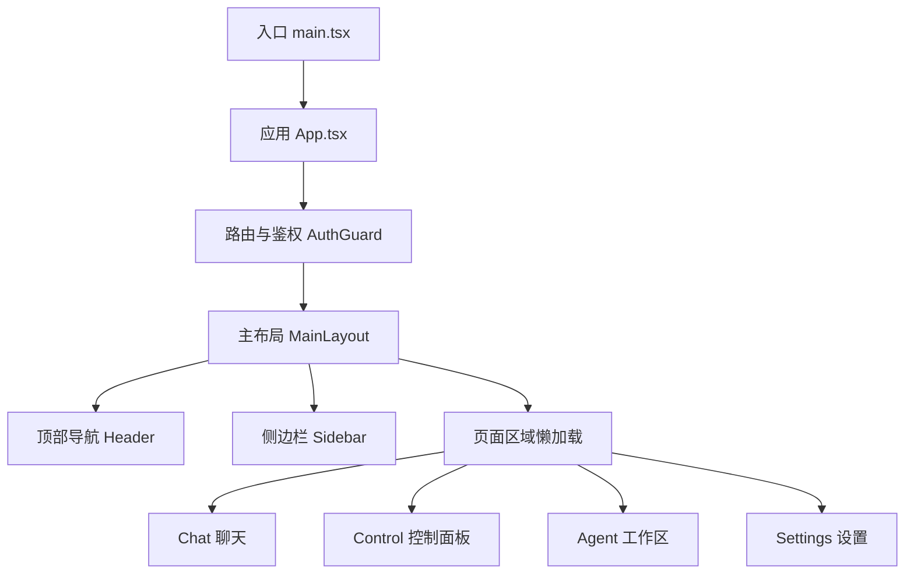
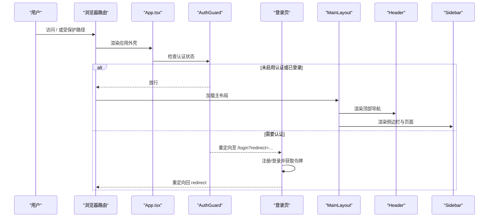
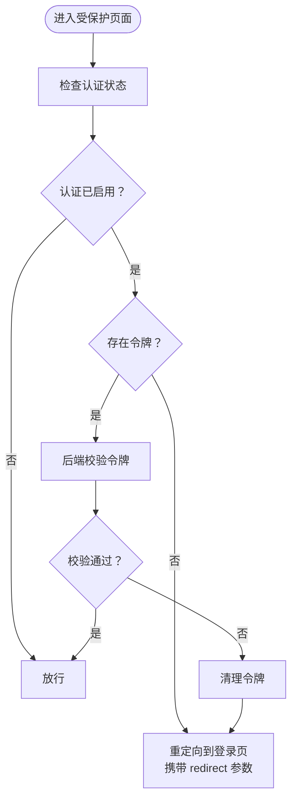
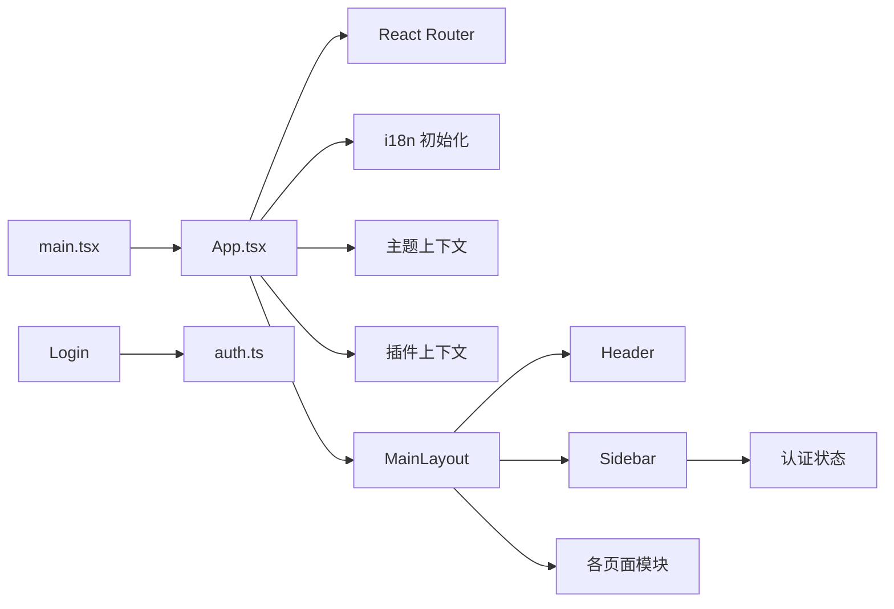

# Web控制台使用

<cite>
**本文引用的文件**
- [console/src/App.tsx](file://console/src/App.tsx)
- [console/src/main.tsx](file://console/src/main.tsx)
- [console/src/layouts/MainLayout/index.tsx](file://console/src/layouts/MainLayout/index.tsx)
- [console/src/layouts/Header.tsx](file://console/src/layouts/Header.tsx)
- [console/src/layouts/Sidebar.tsx](file://console/src/layouts/Sidebar.tsx)
- [console/src/layouts/constants.ts](file://console/src/layouts/constants.ts)
- [console/src/pages/Login/index.tsx](file://console/src/pages/Login/index.tsx)
- [console/src/api/modules/auth.ts](file://console/src/api/modules/auth.ts)
- [console/src/components/ThemeToggleButton/index.tsx](file://console/src/components/ThemeToggleButton/index.tsx)
- [console/src/components/LanguageSwitcher/index.tsx](file://console/src/components/LanguageSwitcher/index.tsx)
- [console/src/pages/Agent/Config/index.tsx](file://console/src/pages/Agent/Config/index.tsx)
- [console/src/pages/Settings/Agents/index.tsx](file://console/src/pages/Settings/Agents/index.tsx)
- [console/src/pages/Control/Channels/index.tsx](file://console/src/pages/Control/Channels/index.tsx)
- [console/src/pages/Settings/SkillPool/index.tsx](file://console/src/pages/Settings/SkillPool/index.tsx)
- [console/src/locales/zh.json](file://console/src/locales/zh.json)
</cite>

## 目录
1. [简介](#简介)
2. [项目结构](#项目结构)
3. [核心组件](#核心组件)
4. [架构总览](#架构总览)
5. [详细组件分析](#详细组件分析)
6. [依赖关系分析](#依赖关系分析)
7. [性能与可用性建议](#性能与可用性建议)
8. [故障排查指南](#故障排查指南)
9. [结论](#结论)
10. [附录：界面元素与操作步骤](#附录界面元素与操作步骤)

## 简介
本指南面向首次使用 Web 控制台的用户，帮助您快速上手控制台的整体布局、导航结构、登录认证流程与权限管理，并详解各核心功能页面的操作方法，包括仪表板概览、代理配置、技能管理、渠道设置等。同时提供界面元素说明与操作步骤，帮助您高效完成日常运维与配置。

## 项目结构
控制台采用前端单页应用（SPA）架构，基于 React + Ant Design 生态，路由通过 React Router 管理，主题与国际化通过上下文注入，页面按功能域分层组织，核心目录如下：
- 布局与导航：layouts（顶部导航栏 Header、侧边栏 Sidebar、主布局 MainLayout）
- 页面模块：pages（Chat、Control、Agent、Settings 等）
- API 封装：api/modules（认证、渠道、代理、技能等）
- 组件库：components（主题切换、语言切换、页面头部等）
- 国际化：locales（多语言资源）
- 上下文：contexts（主题）
- 插件系统：plugins（动态模块注册与宿主外部依赖）

图表来源
- [console/src/main.tsx:1-41](file://console/src/main.tsx#L1-L41)
- [console/src/App.tsx:118-207](file://console/src/App.tsx#L118-L207)
- [console/src/layouts/MainLayout/index.tsx:68-146](file://console/src/layouts/MainLayout/index.tsx#L68-L146)

章节来源
- [console/src/main.tsx:1-41](file://console/src/main.tsx#L1-L41)
- [console/src/App.tsx:118-207](file://console/src/App.tsx#L118-L207)
- [console/src/layouts/MainLayout/index.tsx:68-146](file://console/src/layouts/MainLayout/index.tsx#L68-L146)

## 核心组件
- 应用入口与初始化：负责安装宿主外部依赖、动态注册模块、屏蔽部分控制台噪音日志、挂载根节点。
- 应用外壳与路由：配置浏览器路由、国际化与主题、全局错误边界与骨架屏、登录页与受保护路由。
- 主布局：承载 Header、Sidebar 与页面内容，统一页面容器样式。
- 顶部导航栏：版本信息、文档/FAQ/发布说明链接、语言切换、主题切换、更新弹窗。
- 侧边栏：按“工作区/控制/设置”三大域组织导航项，支持折叠、插件动态注入、账户资料修改与登出。
- 登录页：根据后端认证状态决定注册或登录流程，处理重定向参数。
- 认证 API：封装登录、注册、状态查询、更新资料等接口。
- 主题与语言组件：下拉菜单切换明暗主题与语言，持久化到本地存储。

章节来源
- [console/src/main.tsx:1-41](file://console/src/main.tsx#L1-L41)
- [console/src/App.tsx:118-207](file://console/src/App.tsx#L118-L207)
- [console/src/layouts/Header.tsx:52-301](file://console/src/layouts/Header.tsx#L52-L301)
- [console/src/layouts/Sidebar.tsx:62-611](file://console/src/layouts/Sidebar.tsx#L62-L611)
- [console/src/pages/Login/index.tsx:11-173](file://console/src/pages/Login/index.tsx#L11-L173)
- [console/src/api/modules/auth.ts:14-74](file://console/src/api/modules/auth.ts#L14-L74)
- [console/src/components/ThemeToggleButton/index.tsx:18-52](file://console/src/components/ThemeToggleButton/index.tsx#L18-L52)
- [console/src/components/LanguageSwitcher/index.tsx:13-68](file://console/src/components/LanguageSwitcher/index.tsx#L13-L68)

## 架构总览
控制台采用“路由守卫 + 动态页面 + 插件扩展”的架构模式：
- 路由守卫：在 App 层对访问进行鉴权判断，未登录或令牌失效跳转登录页并携带 redirect 参数。
- 页面懒加载：MainLayout 中除聊天页外均采用动态导入与重试机制，提升首屏性能。
- 插件系统：通过宿主外部依赖与动态模块注册，实现 UI 扩展点，插件路由动态注入侧边栏与页面。
- 主题与国际化：通过上下文注入，Header/Sidebar/LanguageSwitcher/ThemeToggleButton 统一生效。

图表来源
- [console/src/App.tsx:57-112](file://console/src/App.tsx#L57-L112)
- [console/src/pages/Login/index.tsx:21-72](file://console/src/pages/Login/index.tsx#L21-L72)
- [console/src/layouts/MainLayout/index.tsx:102-140](file://console/src/layouts/MainLayout/index.tsx#L102-L140)

章节来源
- [console/src/App.tsx:57-112](file://console/src/App.tsx#L57-L112)
- [console/src/pages/Login/index.tsx:21-72](file://console/src/pages/Login/index.tsx#L21-L72)
- [console/src/layouts/MainLayout/index.tsx:102-140](file://console/src/layouts/MainLayout/index.tsx#L102-L140)

## 详细组件分析

### 登录认证与权限管理
- 认证状态检查：应用启动时调用后端认证状态接口，若启用认证且无有效令牌则强制跳转登录页。
- 登录/注册：登录页根据后端状态判断是否需要注册；注册成功或登录成功后写入令牌并按 redirect 参数跳转。
- 令牌校验：登录后访问受保护页面时，通过 Authorization 头验证令牌有效性，失败则清理令牌并重定向登录。
- 账户资料修改：支持修改用户名与密码，修改后清理令牌并强制跳转登录页以确保安全生效。

图表来源
- [console/src/App.tsx:57-112](file://console/src/App.tsx#L57-L112)
- [console/src/api/modules/auth.ts:44-74](file://console/src/api/modules/auth.ts#L44-L74)
- [console/src/pages/Login/index.tsx:21-72](file://console/src/pages/Login/index.tsx#L21-L72)

章节来源
- [console/src/App.tsx:57-112](file://console/src/App.tsx#L57-L112)
- [console/src/api/modules/auth.ts:14-74](file://console/src/api/modules/auth.ts#L14-L74)
- [console/src/pages/Login/index.tsx:21-72](file://console/src/pages/Login/index.tsx#L21-L72)

### 顶部导航栏与主题/语言切换
- 版本与更新：展示当前版本，检测 PyPI 最新稳定版本并在有更新时以徽标提醒；点击弹出更新说明与复制代码块。
- 导航按钮：文档、FAQ、发布说明、GitHub 链接，支持在桌面端通过 webview 打开外部链接。
- 主题切换：支持明/暗/跟随系统三种模式，图标随当前模式变化。
- 语言切换：支持中/英/日/俄，切换后持久化到本地并同步到后端偏好。

章节来源
- [console/src/layouts/Header.tsx:52-301](file://console/src/layouts/Header.tsx#L52-L301)
- [console/src/components/ThemeToggleButton/index.tsx:18-52](file://console/src/components/ThemeToggleButton/index.tsx#L18-L52)
- [console/src/components/LanguageSwitcher/index.tsx:13-68](file://console/src/components/LanguageSwitcher/index.tsx#L13-L68)

### 侧边栏导航与账户管理
- 导航分组：按“工作区/控制/设置/插件”分组，支持折叠；点击项即跳转对应页面。
- 代理选择器：在“工作区”域内提供代理选择器，用于切换当前工作智能体。
- 账户管理：在启用认证时显示“账户资料”与“退出登录”，支持修改用户名/密码并强制重新登录。
- 插件注入：动态读取插件路由，自动追加到侧边栏与菜单。

章节来源
- [console/src/layouts/Sidebar.tsx:62-611](file://console/src/layouts/Sidebar.tsx#L62-L611)
- [console/src/layouts/constants.ts:13-64](file://console/src/layouts/constants.ts#L13-L64)

### 页面概览与操作要点

#### 仪表板概览（聊天）
- 默认首页，提供与智能体交互的聊天界面，支持模型选择、选项面板等。
- 作为“工作区”域的入口，配合代理选择器切换不同智能体。

章节来源
- [console/src/layouts/MainLayout/index.tsx:13-14](file://console/src/layouts/MainLayout/index.tsx#L13-L14)

#### 代理配置（Agent Config）
- 支持切换“React Agent”、“LLM 重试”、“LLM 限流”等标签页。
- 可根据上下文与记忆后端动态生成对应配置卡片，支持语言与时区设置。
- 提供“保存/重置”操作，保存后生效。

章节来源
- [console/src/pages/Agent/Config/index.tsx:13-198](file://console/src/pages/Agent/Config/index.tsx#L13-L198)

#### 智能体管理（Settings/Agents）
- 支持创建、编辑、删除、启用/禁用智能体，支持拖拽排序。
- 编辑时可选择初始技能并下发到工作区，支持批量操作与技能缓存失效。
- 当前选中的智能体被禁用或删除时，自动切换到默认智能体。

章节来源
- [console/src/pages/Settings/Agents/index.tsx:16-200](file://console/src/pages/Settings/Agents/index.tsx#L16-L200)

#### 技能池（Settings/SkillPool）
- 支持刷新、广播、导入内置技能、ZIP 上传、Hub 导入、批量操作等。
- 提供搜索、标签筛选、列表/网格视图切换。
- 内置技能变更时以徽标提醒，支持一键导入。

章节来源
- [console/src/pages/Settings/SkillPool/index.tsx:32-200](file://console/src/pages/Settings/SkillPool/index.tsx#L32-L200)

#### 渠道设置（Control/Channels）
- 支持内置/自定义/全部过滤，按启用/禁用排序展示。
- 点击卡片打开抽屉式表单进行配置，支持工具消息与思考消息过滤开关。
- 保存后刷新列表并提示成功。

章节来源
- [console/src/pages/Control/Channels/index.tsx:18-163](file://console/src/pages/Control/Channels/index.tsx#L18-L163)

## 依赖关系分析
- 入口依赖：main.tsx 依赖 i18n 初始化、宿主外部依赖安装与动态模块注册。
- 应用依赖：App.tsx 依赖路由、国际化、主题、插件上下文、懒加载页面。
- 布局依赖：MainLayout 依赖 Header、Sidebar、插件路由注入、错误边界与骨架屏。
- 侧边栏依赖：导航映射、KEY_TO_PATH、插件路由、认证状态。
- 登录页依赖：认证 API、路由参数 redirect、消息提示。
- 主题/语言组件依赖：上下文与 i18n。

图表来源
- [console/src/main.tsx:1-41](file://console/src/main.tsx#L1-L41)
- [console/src/App.tsx:118-207](file://console/src/App.tsx#L118-L207)
- [console/src/layouts/MainLayout/index.tsx:68-146](file://console/src/layouts/MainLayout/index.tsx#L68-L146)
- [console/src/layouts/Sidebar.tsx:62-611](file://console/src/layouts/Sidebar.tsx#L62-L611)
- [console/src/pages/Login/index.tsx:11-173](file://console/src/pages/Login/index.tsx#L11-L173)
- [console/src/api/modules/auth.ts:14-74](file://console/src/api/modules/auth.ts#L14-L74)

章节来源
- [console/src/main.tsx:1-41](file://console/src/main.tsx#L1-L41)
- [console/src/App.tsx:118-207](file://console/src/App.tsx#L118-L207)
- [console/src/layouts/MainLayout/index.tsx:68-146](file://console/src/layouts/MainLayout/index.tsx#L68-L146)
- [console/src/layouts/Sidebar.tsx:62-611](file://console/src/layouts/Sidebar.tsx#L62-L611)
- [console/src/pages/Login/index.tsx:11-173](file://console/src/pages/Login/index.tsx#L11-L173)
- [console/src/api/modules/auth.ts:14-74](file://console/src/api/modules/auth.ts#L14-L74)

## 性能与可用性建议
- 首屏优化：利用页面懒加载与骨架屏减少白屏时间，避免阻塞主线程。
- 错误恢复：页面切片加载失败时通过错误边界提示“刷新页面”，提升容错能力。
- 国际化与主题：切换语言与主题为纯前端操作，无需额外请求；建议在设置中固定偏好。
- 插件扩展：插件路由动态注入，注意插件数量过多时侧边栏折叠更实用。

[本节为通用建议，不直接分析具体文件]

## 故障排查指南
- 登录后仍被重定向到登录页
  - 检查后端认证状态与令牌是否正确写入；确认网络可达性与跨域配置。
  - 参考：[console/src/App.tsx:57-112](file://console/src/App.tsx#L57-L112)
- 修改密码后无法登录
  - 修改资料会清理本地令牌并强制跳转登录页，需使用新密码重新登录。
  - 参考：[console/src/layouts/Sidebar.tsx:118-119](file://console/src/layouts/Sidebar.tsx#L118-L119)
- 页面加载失败或空白
  - 使用错误边界提供的“刷新页面”按钮；检查网络与浏览器控制台错误。
  - 参考：[console/src/layouts/MainLayout/index.tsx:93-100](file://console/src/layouts/MainLayout/index.tsx#L93-L100)
- 更新提示不出现
  - 检查网络访问 PyPI 的权限；更新弹窗会延迟显示以避免频繁打扰。
  - 参考：[console/src/layouts/Header.tsx:60-109](file://console/src/layouts/Header.tsx#L60-L109)

章节来源
- [console/src/App.tsx:57-112](file://console/src/App.tsx#L57-L112)
- [console/src/layouts/Sidebar.tsx:118-119](file://console/src/layouts/Sidebar.tsx#L118-L119)
- [console/src/layouts/MainLayout/index.tsx:93-100](file://console/src/layouts/MainLayout/index.tsx#L93-L100)
- [console/src/layouts/Header.tsx:60-109](file://console/src/layouts/Header.tsx#L60-L109)

## 结论
本控制台以清晰的布局与导航、完善的认证与权限管理、以及丰富的功能页面，为用户提供了高效、稳定的运维与配置体验。通过遵循本文档的使用步骤与注意事项，您可以快速掌握登录、主题/语言切换、代理配置、技能管理与渠道设置等核心能力。

[本节为总结，不直接分析具体文件]

## 附录：界面元素与操作步骤

### 顶部导航栏
- 版本徽标：点击可查看更新说明与复制命令。
- 文档/FAQ/发布说明/仓库链接：打开外部页面。
- 语言切换：选择中/英/日/俄。
- 主题切换：明/暗/系统。

章节来源
- [console/src/layouts/Header.tsx:152-301](file://console/src/layouts/Header.tsx#L152-L301)
- [console/src/components/LanguageSwitcher/index.tsx:13-68](file://console/src/components/LanguageSwitcher/index.tsx#L13-L68)
- [console/src/components/ThemeToggleButton/index.tsx:18-52](file://console/src/components/ThemeToggleButton/index.tsx#L18-L52)

### 侧边栏导航
- 工作区域：聊天、控制、工作区、技能、工具、MCP、ACP、代理配置。
- 设置域：智能体、模型、技能池、环境变量、安全、Token 消耗、智能体统计、备份、语音转写、调试。
- 插件域：动态注入的插件页面。
- 折叠模式：紧凑图标按钮，悬停显示标题。
- 账户管理：修改用户名/密码、退出登录。

章节来源
- [console/src/layouts/Sidebar.tsx:140-421](file://console/src/layouts/Sidebar.tsx#L140-L421)
- [console/src/layouts/constants.ts:20-64](file://console/src/layouts/constants.ts#L20-L64)

### 登录页
- 若后端启用认证且无用户：进入注册流程；否则进入登录流程。
- 支持 redirect 参数回跳。
- 成功后写入令牌并跳转。

章节来源
- [console/src/pages/Login/index.tsx:21-72](file://console/src/pages/Login/index.tsx#L21-L72)
- [console/src/api/modules/auth.ts:44-74](file://console/src/api/modules/auth.ts#L44-L74)

### 代理配置（Agent Config）
- 切换标签页：React Agent、LLM 重试、LLM 限流、上下文/记忆后端。
- 语言与时区设置：独立卡片，支持保存。
- 保存/重置：底部操作区。

章节来源
- [console/src/pages/Agent/Config/index.tsx:13-198](file://console/src/pages/Agent/Config/index.tsx#L13-L198)

### 智能体管理（Settings/Agents）
- 创建/编辑：填写基本信息、选择模型、选择初始技能。
- 启用/禁用/删除：支持批量与单个操作。
- 排序：拖拽调整顺序，保存后生效。
- 切换当前智能体：禁用/删除后自动切换到默认智能体。

章节来源
- [console/src/pages/Settings/Agents/index.tsx:16-200](file://console/src/pages/Settings/Agents/index.tsx#L16-L200)

### 技能池（Settings/SkillPool）
- 刷新：获取最新技能列表。
- 广播：将技能分发到工作区。
- 导入内置/ZIP/Hub：多种导入方式。
- 批量操作：选择、清空、删除、退出批量模式。
- 搜索与筛选：关键词与标签组合筛选。

章节来源
- [console/src/pages/Settings/SkillPool/index.tsx:32-200](file://console/src/pages/Settings/SkillPool/index.tsx#L32-L200)

### 渠道设置（Control/Channels）
- 过滤：全部/内置/自定义。
- 排序：启用优先，保持原始顺序。
- 配置：打开抽屉表单，勾选过滤开关，保存后刷新。

章节来源
- [console/src/pages/Control/Channels/index.tsx:18-163](file://console/src/pages/Control/Channels/index.tsx#L18-L163)