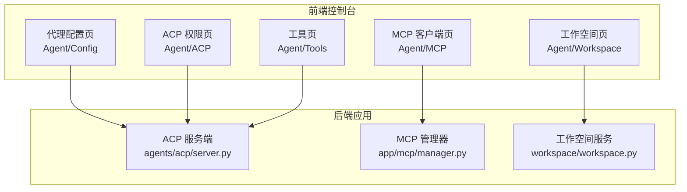
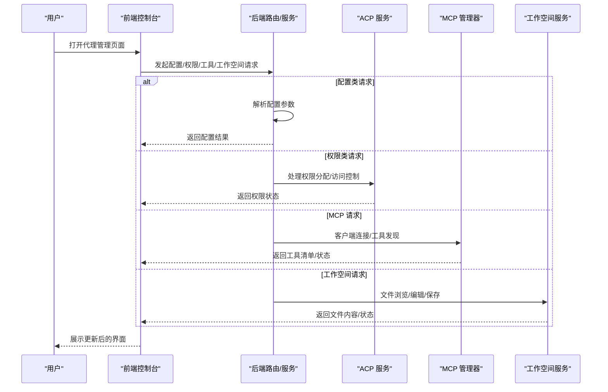
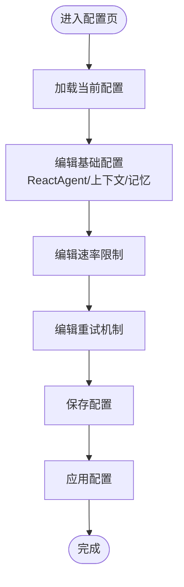
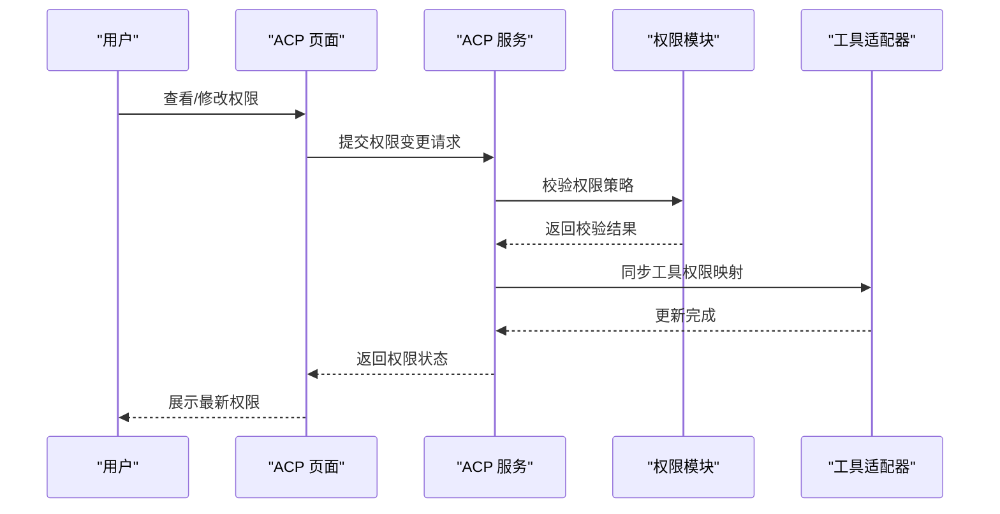
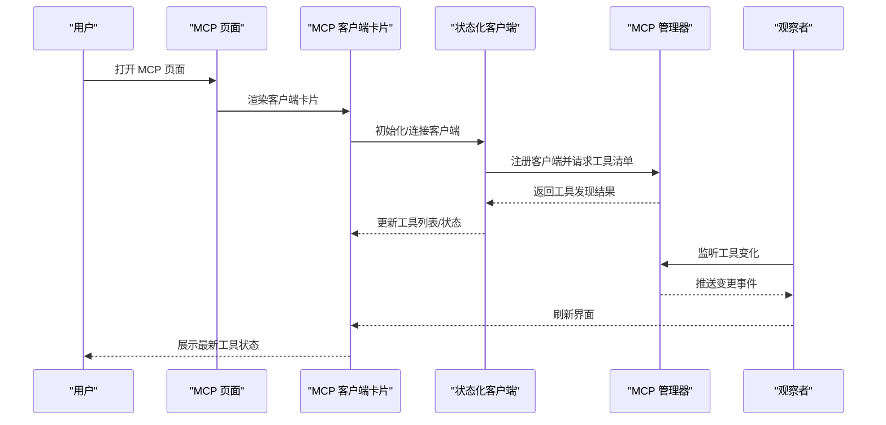
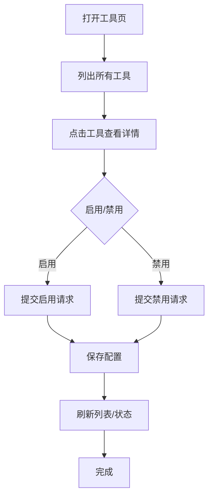
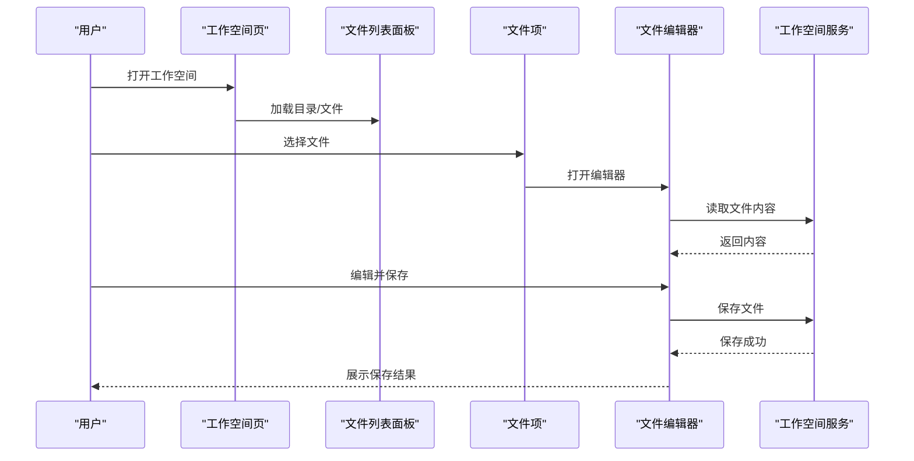
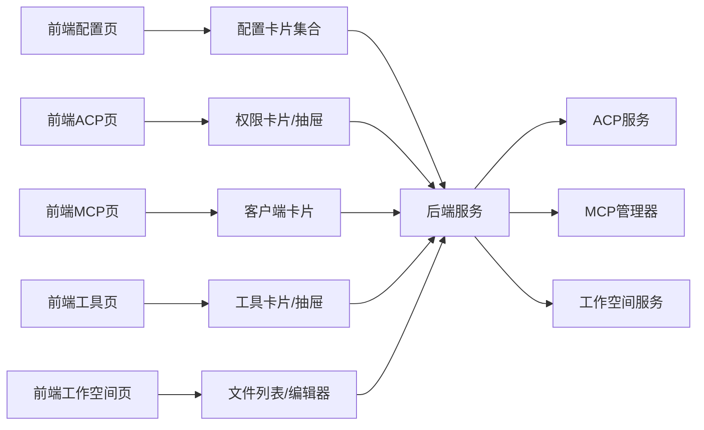

# 代理管理

<cite>
**本文引用的文件**
- [console/src/pages/Agent/Config/index.tsx](file://console/src/pages/Agent/Config/index.tsx)
- [console/src/pages/Agent/Config/components/LlmRateLimiterCard.tsx](file://console/src/pages/Agent/Config/components/LlmRateLimiterCard.tsx)
- [console/src/pages/Agent/Config/components/LlmRetryCard.tsx](file://console/src/pages/Agent/Config/components/LlmRetryCard.tsx)
- [console/src/pages/Agent/Config/components/LightContextCard.tsx](file://console/src/pages/Agent/Config/components/LightContextCard.tsx)
- [console/src/pages/Agent/Config/components/ReMeLightMemoryCard.tsx](file://console/src/pages/Agent/Config/components/ReMeLightMemoryCard.tsx)
- [console/src/pages/Agent/Config/components/ReactAgentCard.tsx](file://console/src/pages/Agent/Config/components/ReactAgentCard.tsx)
- [console/src/pages/Agent/Config/useAgentConfig.tsx](file://console/src/pages/Agent/Config/useAgentConfig.tsx)
- [console/src/pages/Agent/ACP/index.tsx](file://console/src/pages/Agent/ACP/index.tsx)
- [console/src/pages/Agent/ACP/components/ACPCard.tsx](file://console/src/pages/Agent/ACP/components/ACPCard.tsx)
- [console/src/pages/Agent/ACP/components/ACPDrawer.tsx](file://console/src/pages/Agent/ACP/components/ACPDrawer.tsx)
- [src/qwenpaw/agents/acp/core.py](file://src/qwenpaw/agents/acp/core.py)
- [src/qwenpaw/agents/acp/permissions.py](file://src/qwenpaw/agents/acp/permissions.py)
- [src/qwenpaw/agents/acp/service.py](file://src/qwenpaw/agents/acp/service.py)
- [src/qwenpaw/agents/acp/server.py](file://src/qwenpaw/agents/acp/server.py)
- [src/qwenpaw/agents/acp/tool_adapter.py](file://src/qwenpaw/agents/acp/tool_adapter.py)
- [console/src/pages/Agent/MCP/index.tsx](file://console/src/pages/Agent/MCP/index.tsx)
- [console/src/pages/Agent/MCP/components/MCPClientCard.tsx](file://console/src/pages/Agent/MCP/components/MCPClientCard.tsx)
- [src/qwenpaw/app/mcp/manager.py](file://src/qwenpaw/app/mcp/manager.py)
- [src/qwenpaw/app/mcp/stateful_client.py](file://src/qwenpaw/app/mcp/stateful_client.py)
- [src/qwenpaw/app/mcp/watcher.py](file://src/qwenpaw/app/mcp/watcher.py)
- [console/src/pages/Agent/Tools/index.tsx](file://console/src/pages/Agent/Tools/index.tsx)
- [console/src/pages/Agent/Tools/components/ToolCard.tsx](file://console/src/pages/Agent/Tools/components/ToolCard.tsx)
- [console/src/pages/Agent/Tools/components/ToolDrawer.tsx](file://console/src/pages/Agent/Tools/components/ToolDrawer.tsx)
- [console/src/pages/Agent/Workspace/index.tsx](file://console/src/pages/Agent/Workspace/index.tsx)
- [console/src/pages/Agent/Workspace/components/FileEditor.tsx](file://console/src/pages/Agent/Workspace/components/FileEditor.tsx)
- [console/src/pages/Agent/Workspace/components/FileListPanel.tsx](file://console/src/pages/Agent/Workspace/components/FileListPanel.tsx)
- [console/src/pages/Agent/Workspace/components/FileItem.tsx](file://console/src/pages/Agent/Workspace/components/FileItem.tsx)
- [src/qwenpaw/workspace/workspace.py](file://src/qwenpaw/workspace/workspace.py)
- [src/qwenpaw/workspace/service_manager.py](file://src/qwenpaw/workspace/service_manager.py)
- [src/qwenpaw/workspace/service_factories.py](file://src/qwenpaw/workspace/service_factories.py)
</cite>

## 目录
1. [简介](#简介)
2. [项目结构](#项目结构)
3. [核心组件](#核心组件)
4. [架构总览](#架构总览)
5. [详细组件分析](#详细组件分析)
6. [依赖关系分析](#依赖关系分析)
7. [性能考量](#性能考量)
8. [故障排查指南](#故障排查指南)
9. [结论](#结论)
10. [附录](#附录)

## 简介
本指南围绕代理管理功能提供从界面到后端的完整使用说明，涵盖以下主题：
- 代理配置页面：基础配置、上下文管理、速率限制、重试机制等设置项与操作流程
- ACP（Agent Control Panel）权限管理：权限分配与访问控制策略
- MCP（Model Context Protocol）客户端配置与工具发现机制
- 工具管理：工具启用/禁用与配置调整
- 工作空间文件编辑器：文件浏览、编辑与管理

## 项目结构
前端控制台位于 console/src，后端应用位于 src/qwenpaw。代理管理相关页面主要分布在 Agent 路由下：
- 配置页：Agent/Config
- 权限页：Agent/ACP
- MCP 客户端页：Agent/MCP
- 工具页：Agent/Tools
- 工作空间页：Agent/Workspace

**图表来源**
- [console/src/pages/Agent/Config/index.tsx](file://console/src/pages/Agent/Config/index.tsx)
- [console/src/pages/Agent/ACP/index.tsx](file://console/src/pages/Agent/ACP/index.tsx)
- [console/src/pages/Agent/MCP/index.tsx](file://console/src/pages/Agent/MCP/index.tsx)
- [console/src/pages/Agent/Tools/index.tsx](file://console/src/pages/Agent/Tools/index.tsx)
- [console/src/pages/Agent/Workspace/index.tsx](file://console/src/pages/Agent/Workspace/index.tsx)
- [src/qwenpaw/agents/acp/server.py](file://src/qwenpaw/agents/acp/server.py)
- [src/qwenpaw/app/mcp/manager.py](file://src/qwenpaw/app/mcp/manager.py)
- [src/qwenpaw/workspace/workspace.py](file://src/qwenpaw/workspace/workspace.py)

**章节来源**
- [console/src/pages/Agent/Config/index.tsx](file://console/src/pages/Agent/Config/index.tsx)
- [console/src/pages/Agent/ACP/index.tsx](file://console/src/pages/Agent/ACP/index.tsx)
- [console/src/pages/Agent/MCP/index.tsx](file://console/src/pages/Agent/MCP/index.tsx)
- [console/src/pages/Agent/Tools/index.tsx](file://console/src/pages/Agent/Tools/index.tsx)
- [console/src/pages/Agent/Workspace/index.tsx](file://console/src/pages/Agent/Workspace/index.tsx)

## 核心组件
- 代理配置卡片集合：包含速率限制、重试、上下文与记忆、ReactAgent 行为等配置卡片，统一在配置页中进行可视化编辑与保存。
- ACP 权限面板：提供权限卡片与抽屉式详情，支持权限分配与访问控制策略的集中管理。
- MCP 客户端：提供 MCP 客户端卡片与状态化客户端，用于模型上下文协议的连接与工具发现。
- 工具管理：工具卡片与抽屉，支持工具启用/禁用与参数配置。
- 工作空间文件编辑器：文件列表、文件项与编辑器组件，支持文件浏览与编辑。

**章节来源**
- [console/src/pages/Agent/Config/components/LlmRateLimiterCard.tsx](file://console/src/pages/Agent/Config/components/LlmRateLimiterCard.tsx)
- [console/src/pages/Agent/Config/components/LlmRetryCard.tsx](file://console/src/pages/Agent/Config/components/LlmRetryCard.tsx)
- [console/src/pages/Agent/Config/components/LightContextCard.tsx](file://console/src/pages/Agent/Config/components/LightContextCard.tsx)
- [console/src/pages/Agent/Config/components/ReMeLightMemoryCard.tsx](file://console/src/pages/Agent/Config/components/ReMeLightMemoryCard.tsx)
- [console/src/pages/Agent/Config/components/ReactAgentCard.tsx](file://console/src/pages/Agent/Config/components/ReactAgentCard.tsx)
- [console/src/pages/Agent/ACP/components/ACPCard.tsx](file://console/src/pages/Agent/ACP/components/ACPCard.tsx)
- [console/src/pages/Agent/ACP/components/ACPDrawer.tsx](file://console/src/pages/Agent/ACP/components/ACPDrawer.tsx)
- [console/src/pages/Agent/MCP/components/MCPClientCard.tsx](file://console/src/pages/Agent/MCP/components/MCPClientCard.tsx)
- [console/src/pages/Agent/Tools/components/ToolCard.tsx](file://console/src/pages/Agent/Tools/components/ToolCard.tsx)
- [console/src/pages/Agent/Workspace/components/FileEditor.tsx](file://console/src/pages/Agent/Workspace/components/FileEditor.tsx)
- [console/src/pages/Agent/Workspace/components/FileListPanel.tsx](file://console/src/pages/Agent/Workspace/components/FileListPanel.tsx)
- [console/src/pages/Agent/Workspace/components/FileItem.tsx](file://console/src/pages/Agent/Workspace/components/FileItem.tsx)

## 架构总览
代理管理功能从前端控制台发起请求，经由后端路由与服务层处理，最终调用具体子系统（ACP、MCP、工作空间）完成配置与运行时行为控制。

**图表来源**
- [console/src/pages/Agent/Config/index.tsx](file://console/src/pages/Agent/Config/index.tsx)
- [console/src/pages/Agent/ACP/index.tsx](file://console/src/pages/Agent/ACP/index.tsx)
- [console/src/pages/Agent/MCP/index.tsx](file://console/src/pages/Agent/MCP/index.tsx)
- [console/src/pages/Agent/Tools/index.tsx](file://console/src/pages/Agent/Tools/index.tsx)
- [console/src/pages/Agent/Workspace/index.tsx](file://console/src/pages/Agent/Workspace/index.tsx)
- [src/qwenpaw/agents/acp/server.py](file://src/qwenpaw/agents/acp/server.py)
- [src/qwenpaw/app/mcp/manager.py](file://src/qwenpaw/app/mcp/manager.py)
- [src/qwenpaw/workspace/workspace.py](file://src/qwenpaw/workspace/workspace.py)

## 详细组件分析

### 代理配置页面
- 基础配置
  - ReactAgent 卡片：控制代理的核心行为开关与参数，如是否启用特定推理模式或交互策略。
  - 上下文管理卡片：轻量上下文管理器配置，可调节上下文长度、压缩策略与消息统计。
  - 记忆卡片：ReMe 轻量记忆配置，支持记忆窗口大小、触发阈值与清理策略。
- 速率限制
  - LLM 速率限制卡片：对 LLM 调用进行速率限制配置，避免突发流量导致的资源压力或配额耗尽。
- 重试机制
  - LLM 重试卡片：定义失败重试次数、退避策略与超时阈值，提升网络波动下的稳定性。
- 配置持久化
  - 使用配置钩子统一拉取与保存配置，确保前后端一致的配置状态。

**图表来源**
- [console/src/pages/Agent/Config/index.tsx](file://console/src/pages/Agent/Config/index.tsx)
- [console/src/pages/Agent/Config/components/ReactAgentCard.tsx](file://console/src/pages/Agent/Config/components/ReactAgentCard.tsx)
- [console/src/pages/Agent/Config/components/LightContextCard.tsx](file://console/src/pages/Agent/Config/components/LightContextCard.tsx)
- [console/src/pages/Agent/Config/components/ReMeLightMemoryCard.tsx](file://console/src/pages/Agent/Config/components/ReMeLightMemoryCard.tsx)
- [console/src/pages/Agent/Config/components/LlmRateLimiterCard.tsx](file://console/src/pages/Agent/Config/components/LlmRateLimiterCard.tsx)
- [console/src/pages/Agent/Config/components/LlmRetryCard.tsx](file://console/src/pages/Agent/Config/components/LlmRetryCard.tsx)
- [console/src/pages/Agent/Config/useAgentConfig.tsx](file://console/src/pages/Agent/Config/useAgentConfig.tsx)

**章节来源**
- [console/src/pages/Agent/Config/index.tsx](file://console/src/pages/Agent/Config/index.tsx)
- [console/src/pages/Agent/Config/components/ReactAgentCard.tsx](file://console/src/pages/Agent/Config/components/ReactAgentCard.tsx)
- [console/src/pages/Agent/Config/components/LightContextCard.tsx](file://console/src/pages/Agent/Config/components/LightContextCard.tsx)
- [console/src/pages/Agent/Config/components/ReMeLightMemoryCard.tsx](file://console/src/pages/Agent/Config/components/ReMeLightMemoryCard.tsx)
- [console/src/pages/Agent/Config/components/LlmRateLimiterCard.tsx](file://console/src/pages/Agent/Config/components/LlmRateLimiterCard.tsx)
- [console/src/pages/Agent/Config/components/LlmRetryCard.tsx](file://console/src/pages/Agent/Config/components/LlmRetryCard.tsx)
- [console/src/pages/Agent/Config/useAgentConfig.tsx](file://console/src/pages/Agent/Config/useAgentConfig.tsx)

### ACP 权限管理
- 权限卡片与抽屉
  - 权限卡片：展示当前权限概览，支持快速切换与批量操作。
  - 抽屉详情：展开查看具体权限条目、生效范围与历史变更。
- 后端服务
  - 服务端实现权限校验、策略解析与执行，保证访问控制的一致性与安全性。
  - 工具适配器：将工具能力映射为权限项，便于统一管理。

**图表来源**
- [console/src/pages/Agent/ACP/index.tsx](file://console/src/pages/Agent/ACP/index.tsx)
- [console/src/pages/Agent/ACP/components/ACPCard.tsx](file://console/src/pages/Agent/ACP/components/ACPCard.tsx)
- [console/src/pages/Agent/ACP/components/ACPDrawer.tsx](file://console/src/pages/Agent/ACP/components/ACPDrawer.tsx)
- [src/qwenpaw/agents/acp/core.py](file://src/qwenpaw/agents/acp/core.py)
- [src/qwenpaw/agents/acp/permissions.py](file://src/qwenpaw/agents/acp/permissions.py)
- [src/qwenpaw/agents/acp/service.py](file://src/qwenpaw/agents/acp/service.py)
- [src/qwenpaw/agents/acp/server.py](file://src/qwenpaw/agents/acp/server.py)
- [src/qwenpaw/agents/acp/tool_adapter.py](file://src/qwenpaw/agents/acp/tool_adapter.py)

**章节来源**
- [console/src/pages/Agent/ACP/index.tsx](file://console/src/pages/Agent/ACP/index.tsx)
- [console/src/pages/Agent/ACP/components/ACPCard.tsx](file://console/src/pages/Agent/ACP/components/ACPCard.tsx)
- [console/src/pages/Agent/ACP/components/ACPDrawer.tsx](file://console/src/pages/Agent/ACP/components/ACPDrawer.tsx)
- [src/qwenpaw/agents/acp/core.py](file://src/qwenpaw/agents/acp/core.py)
- [src/qwenpaw/agents/acp/permissions.py](file://src/qwenpaw/agents/acp/permissions.py)
- [src/qwenpaw/agents/acp/service.py](file://src/qwenpaw/agents/acp/service.py)
- [src/qwenpaw/agents/acp/server.py](file://src/qwenpaw/agents/acp/server.py)
- [src/qwenpaw/agents/acp/tool_adapter.py](file://src/qwenpaw/agents/acp/tool_adapter.py)

### MCP 客户端配置与工具发现
- 客户端卡片
  - 展示 MCP 客户端连接状态、可用工具清单与配置入口。
- 状态化客户端
  - 维护客户端生命周期、重连策略与工具订阅状态。
- 管理器与观察者
  - 管理器负责客户端注册、工具发现与事件分发。
  - 观察者监听工具变化并触发界面更新。

**图表来源**
- [console/src/pages/Agent/MCP/index.tsx](file://console/src/pages/Agent/MCP/index.tsx)
- [console/src/pages/Agent/MCP/components/MCPClientCard.tsx](file://console/src/pages/Agent/MCP/components/MCPClientCard.tsx)
- [src/qwenpaw/app/mcp/stateful_client.py](file://src/qwenpaw/app/mcp/stateful_client.py)
- [src/qwenpaw/app/mcp/manager.py](file://src/qwenpaw/app/mcp/manager.py)
- [src/qwenpaw/app/mcp/watcher.py](file://src/qwenpaw/app/mcp/watcher.py)

**章节来源**
- [console/src/pages/Agent/MCP/index.tsx](file://console/src/pages/Agent/MCP/index.tsx)
- [console/src/pages/Agent/MCP/components/MCPClientCard.tsx](file://console/src/pages/Agent/MCP/components/MCPClientCard.tsx)
- [src/qwenpaw/app/mcp/stateful_client.py](file://src/qwenpaw/app/mcp/stateful_client.py)
- [src/qwenpaw/app/mcp/manager.py](file://src/qwenpaw/app/mcp/manager.py)
- [src/qwenpaw/app/mcp/watcher.py](file://src/qwenpaw/app/mcp/watcher.py)

### 工具管理
- 工具卡片
  - 展示工具名称、描述、启用状态与最近使用情况。
- 工具抽屉
  - 提供工具详细信息、参数配置与启用/禁用操作入口。
- 与 ACP 的集成
  - 工具权限通过 ACP 进行统一授权与访问控制。

**图表来源**
- [console/src/pages/Agent/Tools/index.tsx](file://console/src/pages/Agent/Tools/index.tsx)
- [console/src/pages/Agent/Tools/components/ToolCard.tsx](file://console/src/pages/Agent/Tools/components/ToolCard.tsx)
- [console/src/pages/Agent/Tools/components/ToolDrawer.tsx](file://console/src/pages/Agent/Tools/components/ToolDrawer.tsx)
- [src/qwenpaw/agents/acp/tool_adapter.py](file://src/qwenpaw/agents/acp/tool_adapter.py)

**章节来源**
- [console/src/pages/Agent/Tools/index.tsx](file://console/src/pages/Agent/Tools/index.tsx)
- [console/src/pages/Agent/Tools/components/ToolCard.tsx](file://console/src/pages/Agent/Tools/components/ToolCard.tsx)
- [console/src/pages/Agent/Tools/components/ToolDrawer.tsx](file://console/src/pages/Agent/Tools/components/ToolDrawer.tsx)
- [src/qwenpaw/agents/acp/tool_adapter.py](file://src/qwenpaw/agents/acp/tool_adapter.py)

### 工作空间文件编辑器
- 文件列表面板
  - 展示目录树与文件列表，支持筛选、排序与导航。
- 文件项
  - 单个文件项组件，支持打开、删除、重命名等操作。
- 文件编辑器
  - 内嵌编辑器组件，支持语法高亮、自动补全与保存。

**图表来源**
- [console/src/pages/Agent/Workspace/index.tsx](file://console/src/pages/Agent/Workspace/index.tsx)
- [console/src/pages/Agent/Workspace/components/FileListPanel.tsx](file://console/src/pages/Agent/Workspace/components/FileListPanel.tsx)
- [console/src/pages/Agent/Workspace/components/FileItem.tsx](file://console/src/pages/Agent/Workspace/components/FileItem.tsx)
- [console/src/pages/Agent/Workspace/components/FileEditor.tsx](file://console/src/pages/Agent/Workspace/components/FileEditor.tsx)
- [src/qwenpaw/workspace/workspace.py](file://src/qwenpaw/workspace/workspace.py)
- [src/qwenpaw/workspace/service_manager.py](file://src/qwenpaw/workspace/service_manager.py)
- [src/qwenpaw/workspace/service_factories.py](file://src/qwenpaw/workspace/service_factories.py)

**章节来源**
- [console/src/pages/Agent/Workspace/index.tsx](file://console/src/pages/Agent/Workspace/index.tsx)
- [console/src/pages/Agent/Workspace/components/FileListPanel.tsx](file://console/src/pages/Agent/Workspace/components/FileListPanel.tsx)
- [console/src/pages/Agent/Workspace/components/FileItem.tsx](file://console/src/pages/Agent/Workspace/components/FileItem.tsx)
- [console/src/pages/Agent/Workspace/components/FileEditor.tsx](file://console/src/pages/Agent/Workspace/components/FileEditor.tsx)
- [src/qwenpaw/workspace/workspace.py](file://src/qwenpaw/workspace/workspace.py)
- [src/qwenpaw/workspace/service_manager.py](file://src/qwenpaw/workspace/service_manager.py)
- [src/qwenpaw/workspace/service_factories.py](file://src/qwenpaw/workspace/service_factories.py)

## 依赖关系分析
- 前端组件依赖
  - 配置页依赖各配置卡片与配置钩子，统一管理代理行为参数。
  - ACP 页依赖权限卡片与抽屉，结合后端服务实现权限控制。
  - MCP 页依赖客户端卡片与状态化客户端，配合管理器与观察者完成工具发现。
  - 工具页依赖工具卡片与抽屉，结合 ACP 工具适配器进行权限映射。
  - 工作空间页依赖文件列表、文件项与编辑器，结合工作空间服务完成文件读写。
- 后端服务依赖
  - ACP 服务依赖权限模块与工具适配器，实现策略校验与工具映射。
  - MCP 管理器依赖状态化客户端与观察者，维护工具发现与事件分发。
  - 工作空间服务依赖服务管理器与工厂，提供文件操作能力。

**图表来源**
- [console/src/pages/Agent/Config/index.tsx](file://console/src/pages/Agent/Config/index.tsx)
- [console/src/pages/Agent/ACP/index.tsx](file://console/src/pages/Agent/ACP/index.tsx)
- [console/src/pages/Agent/MCP/index.tsx](file://console/src/pages/Agent/MCP/index.tsx)
- [console/src/pages/Agent/Tools/index.tsx](file://console/src/pages/Agent/Tools/index.tsx)
- [console/src/pages/Agent/Workspace/index.tsx](file://console/src/pages/Agent/Workspace/index.tsx)
- [src/qwenpaw/agents/acp/server.py](file://src/qwenpaw/agents/acp/server.py)
- [src/qwenpaw/app/mcp/manager.py](file://src/qwenpaw/app/mcp/manager.py)
- [src/qwenpaw/workspace/workspace.py](file://src/qwenpaw/workspace/workspace.py)

**章节来源**
- [console/src/pages/Agent/Config/index.tsx](file://console/src/pages/Agent/Config/index.tsx)
- [console/src/pages/Agent/ACP/index.tsx](file://console/src/pages/Agent/ACP/index.tsx)
- [console/src/pages/Agent/MCP/index.tsx](file://console/src/pages/Agent/MCP/index.tsx)
- [console/src/pages/Agent/Tools/index.tsx](file://console/src/pages/Agent/Tools/index.tsx)
- [console/src/pages/Agent/Workspace/index.tsx](file://console/src/pages/Agent/Workspace/index.tsx)
- [src/qwenpaw/agents/acp/server.py](file://src/qwenpaw/agents/acp/server.py)
- [src/qwenpaw/app/mcp/manager.py](file://src/qwenpaw/app/mcp/manager.py)
- [src/qwenpaw/workspace/workspace.py](file://src/qwenpaw/workspace/workspace.py)

## 性能考量
- 速率限制与重试
  - 在高并发场景下，合理设置速率限制与重试策略可降低后端压力与失败率。
- 工具发现与缓存
  - MCP 工具发现应避免频繁轮询，建议采用增量更新与本地缓存策略。
- 文件编辑
  - 对大文件的读写应采用流式处理与分块保存，减少内存占用与锁竞争。
- 权限校验
  - 权限检查应在服务端集中执行，前端仅做提示，避免绕过风险。

## 故障排查指南
- 配置不生效
  - 检查配置保存接口返回状态，确认参数格式与范围有效。
  - 核对配置钩子是否正确拉取/提交数据。
- 权限异常
  - 确认 ACP 服务端权限策略是否正确解析，工具适配器映射是否一致。
  - 查看权限变更日志与生效范围。
- MCP 工具不可见
  - 检查客户端连接状态与工具发现流程，确认管理器与观察者正常运行。
  - 核对工具清单更新事件是否推送至前端。
- 工作空间文件编辑失败
  - 检查工作空间服务的文件读写权限与路径有效性。
  - 关注大文件保存的分块与并发策略。

**章节来源**
- [console/src/pages/Agent/Config/useAgentConfig.tsx](file://console/src/pages/Agent/Config/useAgentConfig.tsx)
- [src/qwenpaw/agents/acp/server.py](file://src/qwenpaw/agents/acp/server.py)
- [src/qwenpaw/app/mcp/manager.py](file://src/qwenpaw/app/mcp/manager.py)
- [src/qwenpaw/workspace/workspace.py](file://src/qwenpaw/workspace/workspace.py)

## 结论
代理管理功能通过前端可视化界面与后端服务协同，实现了对代理行为、权限、工具与工作空间的全面管控。遵循本文档的操作步骤与最佳实践，可在保障安全性的前提下高效完成代理配置与运维任务。

## 附录
- 快速入口
  - 代理配置：Agent/Config
  - 权限管理：Agent/ACP
  - MCP 客户端：Agent/MCP
  - 工具管理：Agent/Tools
  - 工作空间：Agent/Workspace