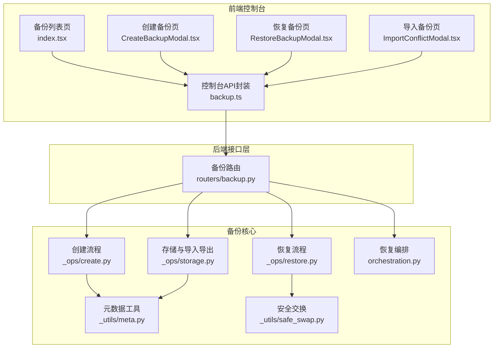
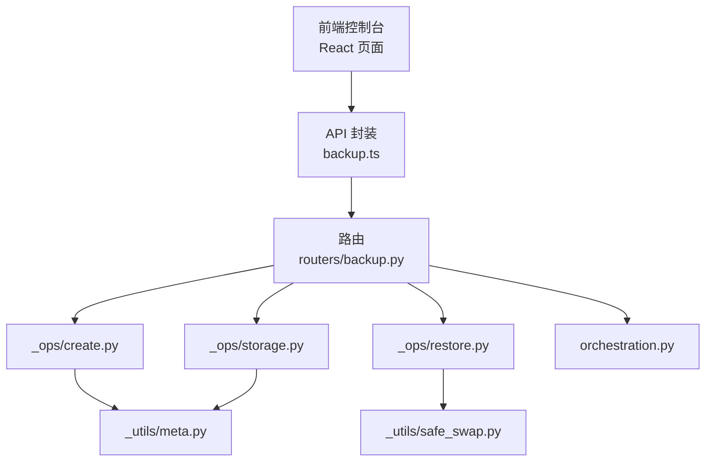
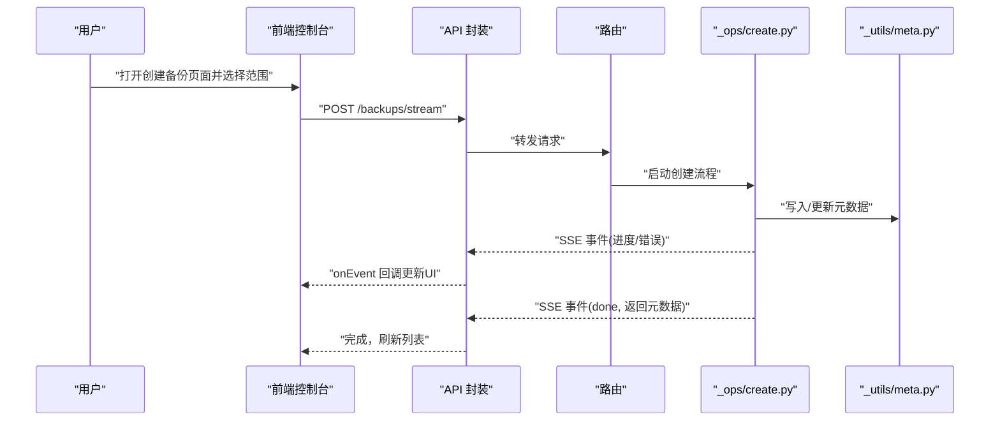
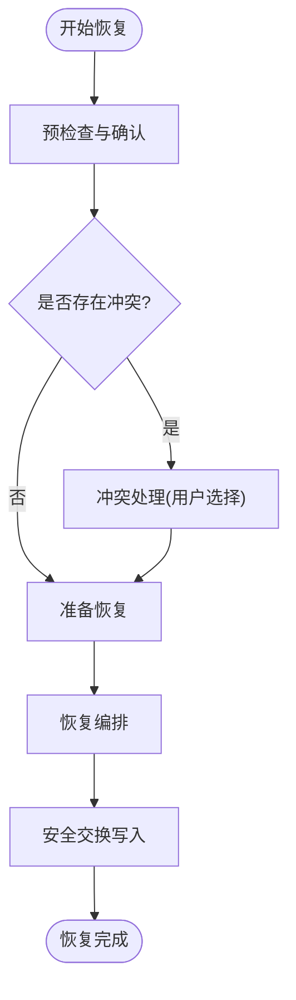
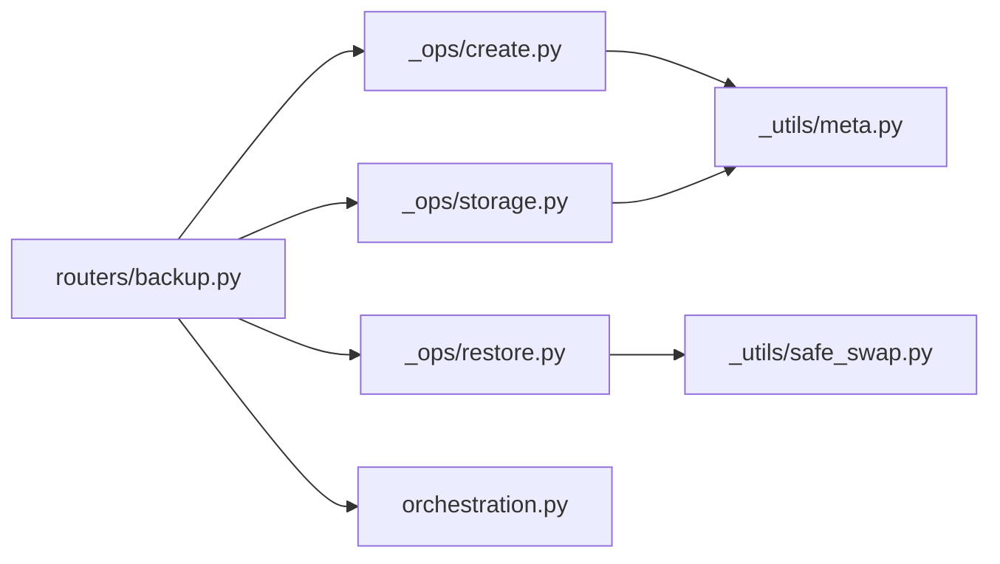

# 备份与恢复

<cite>
**本文引用的文件**
- [src/qwenpaw/backup/__init__.py](file://src/qwenpaw/backup/__init__.py)
- [src/qwenpaw/backup/models.py](file://src/qwenpaw/backup/models.py)
- [src/qwenpaw/backup/orchestration.py](file://src/qwenpaw/backup/orchestration.py)
- [src/qwenpaw/backup/_ops/create.py](file://src/qwenpaw/backup/_ops/create.py)
- [src/qwenpaw/backup/_ops/create_helpers.py](file://src/qwenpaw/backup/_ops/create_helpers.py)
- [src/qwenpaw/backup/_ops/restore.py](file://src/qwenpaw/backup/_ops/restore.py)
- [src/qwenpaw/backup/_ops/restore_helpers.py](file://src/qwenpaw/backup/_ops/restore_helpers.py)
- [src/qwenpaw/backup/_ops/storage.py](file://src/qwenpaw/backup/_ops/storage.py)
- [src/qwenpaw/backup/_utils/meta.py](file://src/qwenpaw/backup/_utils/meta.py)
- [src/qwenpaw/backup/_utils/safe_swap.py](file://src/qwenpaw/backup/_utils/safe_swap.py)
- [src/qwenpaw/app/routers/backup.py](file://src/qwenpaw/app/routers/backup.py)
- [console/src/api/modules/backup.ts](file://console/src/api/modules/backup.ts)
- [console/src/pages/Settings/Backups/index.tsx](file://console/src/pages/Settings/Backups/index.tsx)
- [console/src/pages/Settings/Backups/create/BackupScopeForm.tsx](file://console/src/pages/Settings/Backups/create/BackupScopeForm.tsx)
- [console/src/pages/Settings/Backups/create/CreateBackupModal.tsx](file://console/src/pages/Settings/Backups/create/CreateBackupModal.tsx)
- [console/src/pages/Settings/Backups/create/BackupProgress.tsx](file://console/src/pages/Settings/Backups/create/BackupProgress.tsx)
- [console/src/pages/Settings/Backups/list/BackupTable.tsx](file://console/src/pages/Settings/Backups/list/BackupTable.tsx)
- [console/src/pages/Settings/Backups/restore/PreRestoreConfirmModal.tsx](file://console/src/pages/Settings/Backups/restore/PreRestoreConfirmModal.tsx)
- [console/src/pages/Settings/Backups/restore/RestoreBackupModal.tsx](file://console/src/pages/Settings/Backups/restore/RestoreBackupModal.tsx)
- [console/src/pages/Settings/Backups/import/ImportConflictModal.tsx](file://console/src/pages/Settings/Backups/import/ImportConflictModal.tsx)
- [website/public/docs/backup.en.md](file://website/public/docs/backup.en.md)
</cite>

## 目录
1. [简介](#简介)
2. [项目结构](#项目结构)
3. [核心组件](#核心组件)
4. [架构总览](#架构总览)
5. [详细组件分析](#详细组件分析)
6. [依赖关系分析](#依赖关系分析)
7. [性能考量](#性能考量)
8. [故障排查指南](#故障排查指南)
9. [结论](#结论)
10. [附录](#附录)

## 简介
本指南围绕系统“备份与恢复”能力，提供从策略选择、创建流程、进度监控、文件管理到恢复执行、冲突处理、导入兼容性的完整操作说明，并给出最佳实践与灾难恢复预案建议。内容基于后端 Python 包与前端控制台页面的实际实现进行梳理，确保读者可按步骤完成备份与恢复任务。

## 项目结构
备份与恢复功能由后端 Python 包与前端控制台两部分组成：
- 后端：位于 src/qwenpaw/backup，包含备份创建、存储、恢复编排、工具模块等。
- 前端：位于 console/src/pages/Settings/Backups，提供备份创建、列表、进度、恢复、导入等界面与交互。
- 接口层：位于 src/qwenpaw/app/routers/backup.py，定义 REST API。
- 控制台 API 封装：位于 console/src/api/modules/backup.ts，封装 SSE 流式事件与请求。

图表来源
- [console/src/pages/Settings/Backups/index.tsx:1-200](file://console/src/pages/Settings/Backups/index.tsx#L1-L200)
- [console/src/pages/Settings/Backups/create/CreateBackupModal.tsx:1-200](file://console/src/pages/Settings/Backups/create/CreateBackupModal.tsx#L1-L200)
- [console/src/pages/Settings/Backups/restore/RestoreBackupModal.tsx:1-200](file://console/src/pages/Settings/Backups/restore/RestoreBackupModal.tsx#L1-L200)
- [console/src/pages/Settings/Backups/import/ImportConflictModal.tsx:1-200](file://console/src/pages/Settings/Backups/import/ImportConflictModal.tsx#L1-L200)
- [console/src/api/modules/backup.ts:1-70](file://console/src/api/modules/backup.ts#L1-L70)
- [src/qwenpaw/app/routers/backup.py:1-200](file://src/qwenpaw/app/routers/backup.py#L1-L200)
- [src/qwenpaw/backup/_ops/create.py:1-200](file://src/qwenpaw/backup/_ops/create.py#L1-L200)
- [src/qwenpaw/backup/_ops/restore.py:1-200](file://src/qwenpaw/backup/_ops/restore.py#L1-L200)
- [src/qwenpaw/backup/_ops/storage.py:1-200](file://src/qwenpaw/backup/_ops/storage.py#L1-L200)
- [src/qwenpaw/backup/orchestration.py:1-200](file://src/qwenpaw/backup/orchestration.py#L1-L200)
- [src/qwenpaw/backup/_utils/meta.py:1-200](file://src/qwenpaw/backup/_utils/meta.py#L1-L200)
- [src/qwenpaw/backup/_utils/safe_swap.py:1-200](file://src/qwenpaw/backup/_utils/safe_swap.py#L1-L200)

章节来源
- [src/qwenpaw/backup/__init__.py:1-21](file://src/qwenpaw/backup/__init__.py#L1-L21)
- [console/src/api/modules/backup.ts:1-70](file://console/src/api/modules/backup.ts#L1-L70)

## 核心组件
- 备份创建（流式）：通过后端创建流程生成备份，前端以 SSE 接收进度事件，最终返回备份元数据。
- 备份存储：提供列出、获取、删除、导出、导入等操作。
- 恢复编排：在执行恢复前进行预检查与冲突处理，再进入恢复流程。
- 元数据与安全：使用元数据工具维护备份信息，使用安全交换避免覆盖风险。
- 前端交互：提供备份范围选择、进度展示、恢复确认、导入冲突处理等界面。

章节来源
- [src/qwenpaw/backup/__init__.py:1-21](file://src/qwenpaw/backup/__init__.py#L1-L21)
- [src/qwenpaw/backup/_ops/create.py:1-200](file://src/qwenpaw/backup/_ops/create.py#L1-L200)
- [src/qwenpaw/backup/_ops/storage.py:1-200](file://src/qwenpaw/backup/_ops/storage.py#L1-L200)
- [src/qwenpaw/backup/orchestration.py:1-200](file://src/qwenpaw/backup/orchestration.py#L1-L200)
- [src/qwenpaw/backup/_utils/meta.py:1-200](file://src/qwenpaw/backup/_utils/meta.py#L1-L200)
- [src/qwenpaw/backup/_utils/safe_swap.py:1-200](file://src/qwenpaw/backup/_utils/safe_swap.py#L1-L200)
- [console/src/pages/Settings/Backups/create/BackupScopeForm.tsx:1-200](file://console/src/pages/Settings/Backups/create/BackupScopeForm.tsx#L1-L200)
- [console/src/pages/Settings/Backups/create/BackupProgress.tsx:1-200](file://console/src/pages/Settings/Backups/create/BackupProgress.tsx#L1-L200)
- [console/src/pages/Settings/Backups/list/BackupTable.tsx:1-200](file://console/src/pages/Settings/Backups/list/BackupTable.tsx#L1-L200)
- [console/src/pages/Settings/Backups/restore/PreRestoreConfirmModal.tsx:1-200](file://console/src/pages/Settings/Backups/restore/PreRestoreConfirmModal.tsx#L1-L200)
- [console/src/pages/Settings/Backups/restore/RestoreBackupModal.tsx:1-200](file://console/src/pages/Settings/Backups/restore/RestoreBackupModal.tsx#L1-L200)
- [console/src/pages/Settings/Backups/import/ImportConflictModal.tsx:1-200](file://console/src/pages/Settings/Backups/import/ImportConflictModal.tsx#L1-L200)

## 架构总览
备份与恢复采用“前端控制台 + 后端接口层 + 备份核心模块”的分层设计。前端通过 API 封装发起请求，后端路由对接具体操作模块，核心模块负责业务逻辑与数据持久化。

图表来源
- [console/src/api/modules/backup.ts:1-70](file://console/src/api/modules/backup.ts#L1-L70)
- [src/qwenpaw/app/routers/backup.py:1-200](file://src/qwenpaw/app/routers/backup.py#L1-L200)
- [src/qwenpaw/backup/_ops/create.py:1-200](file://src/qwenpaw/backup/_ops/create.py#L1-L200)
- [src/qwenpaw/backup/_ops/restore.py:1-200](file://src/qwenpaw/backup/_ops/restore.py#L1-L200)
- [src/qwenpaw/backup/_ops/storage.py:1-200](file://src/qwenpaw/backup/_ops/storage.py#L1-L200)
- [src/qwenpaw/backup/orchestration.py:1-200](file://src/qwenpaw/backup/orchestration.py#L1-L200)
- [src/qwenpaw/backup/_utils/meta.py:1-200](file://src/qwenpaw/backup/_utils/meta.py#L1-L200)
- [src/qwenpaw/backup/_utils/safe_swap.py:1-200](file://src/qwenpaw/backup/_utils/safe_swap.py#L1-L200)

## 详细组件分析

### 备份策略与范围选择
- 支持的策略
  - 全量备份：包含选定范围内的全部实体与数据。
  - 增量备份：仅包含自上次备份以来发生变更的数据（如存在增量机制）。
  - 按代理备份：针对特定代理或代理集合进行独立备份。
- 范围选择
  - 在前端“创建备份”页面中，通过表单组件选择备份范围（如代理、会话、技能等），提交后进入创建流程。
- 配置要点
  - 范围选择应结合业务需求与恢复粒度权衡；大范围备份恢复时间较长但一致性更好。
  - 增量备份需确保元数据记录上一次备份时间戳，避免遗漏。

章节来源
- [console/src/pages/Settings/Backups/create/BackupScopeForm.tsx:1-200](file://console/src/pages/Settings/Backups/create/BackupScopeForm.tsx#L1-L200)
- [console/src/pages/Settings/Backups/create/CreateBackupModal.tsx:1-200](file://console/src/pages/Settings/Backups/create/CreateBackupModal.tsx#L1-L200)

### 备份创建流程（含进度监控）
- 步骤
  1) 选择范围并提交创建请求。
  2) 后端启动创建流程，生成备份元数据并开始打包。
  3) 前端通过 SSE 流接收进度事件，实时更新 UI。
  4) 完成后返回备份元数据，前端刷新列表。
- 关键实现
  - 后端创建流程与辅助函数负责扫描、序列化与写入。
  - 前端 API 封装使用 fetch + ReadableStream 解析事件，解析“done”事件获取元数据。
  - 进度 UI 组件根据事件类型与消息更新状态。

图表来源
- [console/src/api/modules/backup.ts:19-58](file://console/src/api/modules/backup.ts#L19-L58)
- [src/qwenpaw/app/routers/backup.py:1-200](file://src/qwenpaw/app/routers/backup.py#L1-L200)
- [src/qwenpaw/backup/_ops/create.py:1-200](file://src/qwenpaw/backup/_ops/create.py#L1-L200)
- [src/qwenpaw/backup/_utils/meta.py:1-200](file://src/qwenpaw/backup/_utils/meta.py#L1-L200)

章节来源
- [console/src/pages/Settings/Backups/create/BackupProgress.tsx:1-200](file://console/src/pages/Settings/Backups/create/BackupProgress.tsx#L1-L200)
- [console/src/api/modules/backup.ts:19-58](file://console/src/api/modules/backup.ts#L19-L58)

### 备份文件管理（查看、删除、下载、分享）
- 查看：在备份列表中展示备份元数据与状态。
- 删除：支持批量删除备份。
- 下载：通过导出接口获取备份文件。
- 分享：通过导出接口生成可分发的备份包。
- 实现要点
  - 列表页提供操作按钮与状态标识。
  - 删除接口接收 ID 数组，返回删除结果。
  - 导出接口返回可下载的备份文件。

章节来源
- [console/src/pages/Settings/Backups/list/BackupTable.tsx:1-200](file://console/src/pages/Settings/Backups/list/BackupTable.tsx#L1-L200)
- [console/src/api/modules/backup.ts:14-70](file://console/src/api/modules/backup.ts#L14-L70)
- [src/qwenpaw/backup/_ops/storage.py:1-200](file://src/qwenpaw/backup/_ops/storage.py#L1-L200)

### 恢复流程（预检查、冲突处理、执行）
- 预检查
  - 在恢复前弹出确认对话框，提示覆盖风险与影响范围。
- 冲突处理
  - 若目标对象已存在，系统提示冲突项并允许用户选择保留策略（保留新/旧或跳过）。
- 执行恢复
  - 后端进行原子化写入与回滚保护，必要时使用安全交换避免覆盖。
- 关键实现
  - 恢复编排模块协调各子流程。
  - 恢复助手模块处理具体实体的恢复细节。
  - 安全交换模块保障写入过程的原子性与可回滚性。

图表来源
- [console/src/pages/Settings/Backups/restore/PreRestoreConfirmModal.tsx:1-200](file://console/src/pages/Settings/Backups/restore/PreRestoreConfirmModal.tsx#L1-L200)
- [console/src/pages/Settings/Backups/restore/RestoreBackupModal.tsx:1-200](file://console/src/pages/Settings/Backups/restore/RestoreBackupModal.tsx#L1-L200)
- [src/qwenpaw/backup/orchestration.py:1-200](file://src/qwenpaw/backup/orchestration.py#L1-L200)
- [src/qwenpaw/backup/_ops/restore.py:1-200](file://src/qwenpaw/backup/_ops/restore.py#L1-L200)
- [src/qwenpaw/backup/_utils/safe_swap.py:1-200](file://src/qwenpaw/backup/_utils/safe_swap.py#L1-L200)

章节来源
- [src/qwenpaw/backup/orchestration.py:1-200](file://src/qwenpaw/backup/orchestration.py#L1-L200)
- [src/qwenpaw/backup/_ops/restore.py:1-200](file://src/qwenpaw/backup/_ops/restore.py#L1-L200)
- [src/qwenpaw/backup/_utils/safe_swap.py:1-200](file://src/qwenpaw/backup/_utils/safe_swap.py#L1-L200)

### 备份导入（从其他系统导入、版本兼容性）
- 导入入口：在导入页面选择备份文件，系统解析并检测兼容性。
- 兼容性检查：校验备份格式、版本与当前系统是否匹配。
- 冲突处理：若目标对象已存在，弹出冲突对话框供用户决策。
- 实现要点
  - 导入接口负责读取外部备份并转换为内部格式。
  - 导入冲突对话框提供用户交互与选择。

章节来源
- [console/src/pages/Settings/Backups/import/ImportConflictModal.tsx:1-200](file://console/src/pages/Settings/Backups/import/ImportConflictModal.tsx#L1-L200)
- [src/qwenpaw/backup/_ops/storage.py:1-200](file://src/qwenpaw/backup/_ops/storage.py#L1-L200)

### 数据模型与元数据
- 备份元数据：包含备份 ID、范围、时间戳、大小、状态等字段。
- 元数据工具：负责读取、写入与更新备份元数据，确保一致性。
- 类型定义：前端与后端共享类型，保证接口契约一致。

章节来源
- [src/qwenpaw/backup/models.py:1-200](file://src/qwenpaw/backup/models.py#L1-L200)
- [src/qwenpaw/backup/_utils/meta.py:1-200](file://src/qwenpaw/backup/_utils/meta.py#L1-L200)
- [console/src/api/types/backup.ts:1-200](file://console/src/api/types/backup.ts#L1-L200)

## 依赖关系分析
- 模块耦合
  - 路由层仅作为入口，不直接处理业务细节，降低耦合度。
  - 创建与恢复流程分别依赖各自的工具模块，职责清晰。
- 外部依赖
  - 前端依赖 fetch 与 ReadableStream 处理 SSE。
  - 后端依赖文件系统与数据库（由具体实现决定）。
- 循环依赖
  - 当前结构未见循环依赖迹象，模块间通过接口层解耦。

图表来源
- [src/qwenpaw/app/routers/backup.py:1-200](file://src/qwenpaw/app/routers/backup.py#L1-L200)
- [src/qwenpaw/backup/_ops/create.py:1-200](file://src/qwenpaw/backup/_ops/create.py#L1-L200)
- [src/qwenpaw/backup/_ops/restore.py:1-200](file://src/qwenpaw/backup/_ops/restore.py#L1-L200)
- [src/qwenpaw/backup/_ops/storage.py:1-200](file://src/qwenpaw/backup/_ops/storage.py#L1-L200)
- [src/qwenpaw/backup/orchestration.py:1-200](file://src/qwenpaw/backup/orchestration.py#L1-L200)
- [src/qwenpaw/backup/_utils/meta.py:1-200](file://src/qwenpaw/backup/_utils/meta.py#L1-L200)
- [src/qwenpaw/backup/_utils/safe_swap.py:1-200](file://src/qwenpaw/backup/_utils/safe_swap.py#L1-L200)

## 性能考量
- 备份性能
  - 大范围全量备份耗时较长，建议在低峰期执行。
  - 增量备份可显著减少数据传输与写入时间，但需确保元数据准确。
- 恢复性能
  - 恢复前的预检查与冲突处理会增加等待时间，建议提前规划范围。
  - 使用安全交换与原子写入可避免重复写入与回滚成本。
- 前端体验
  - SSE 流式事件可提升进度反馈的实时性。
  - 列表分页与懒加载可改善大数据集下的渲染性能。

## 故障排查指南
- 创建失败
  - 检查范围选择是否正确，确认权限与资源可用性。
  - 查看前端控制台网络面板与后端日志，定位错误事件。
- 恢复异常
  - 若出现冲突，优先解决冲突项后再重试。
  - 如遇写入失败，检查磁盘空间与权限。
- 导入问题
  - 确认备份文件格式与版本兼容性。
  - 若导入中断，重新上传并重试。

章节来源
- [console/src/api/modules/backup.ts:31-57](file://console/src/api/modules/backup.ts#L31-L57)
- [src/qwenpaw/backup/_ops/restore.py:1-200](file://src/qwenpaw/backup/_ops/restore.py#L1-L200)

## 结论
备份与恢复功能通过清晰的分层架构与完善的前端交互，实现了从策略选择、创建、管理到恢复与导入的全链路能力。建议在生产环境中结合增量备份与定期演练恢复流程，确保数据安全与业务连续性。

## 附录
- 最佳实践
  - 制定备份策略：全量+增量组合，按代理维度拆分备份。
  - 定期演练：每季度至少进行一次恢复演练，验证备份完整性与恢复速度。
  - 版本管理：导入外部备份前先做兼容性检查，避免跨版本破坏。
- 灾难恢复预案
  - 明确 RTO/RPO 指标，设定自动备份与告警阈值。
  - 准备异地备份与多副本策略，确保极端场景下的可恢复性。
  - 文档化恢复步骤与联系人清单，缩短故障响应时间。

章节来源
- [website/public/docs/backup.en.md:1-500](file://website/public/docs/backup.en.md#L1-L500)