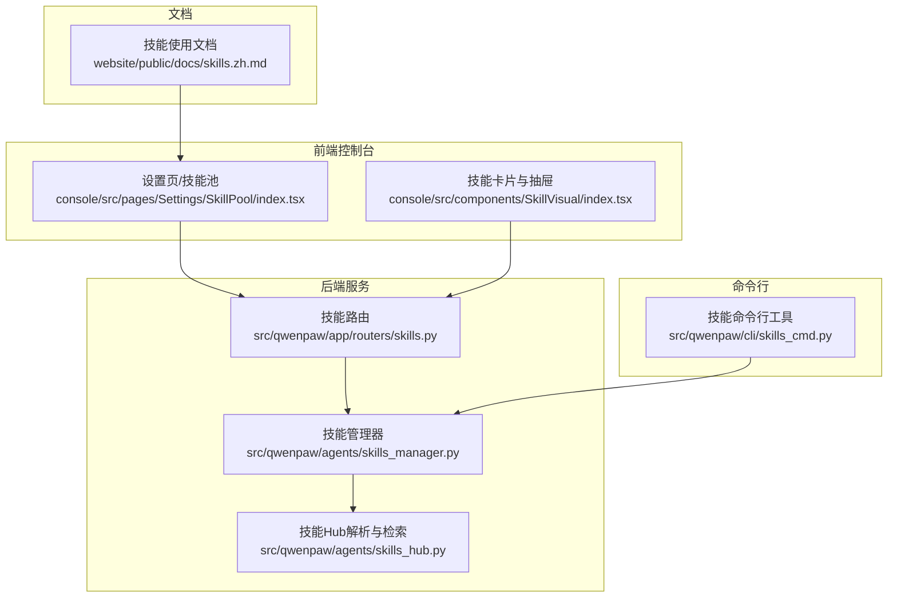
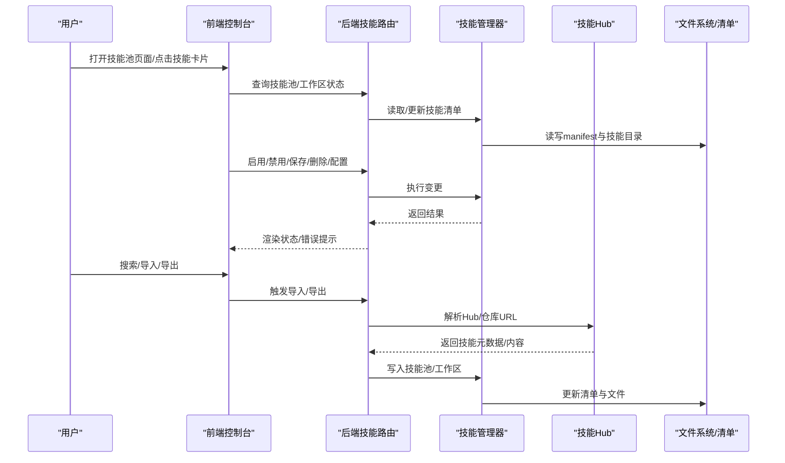
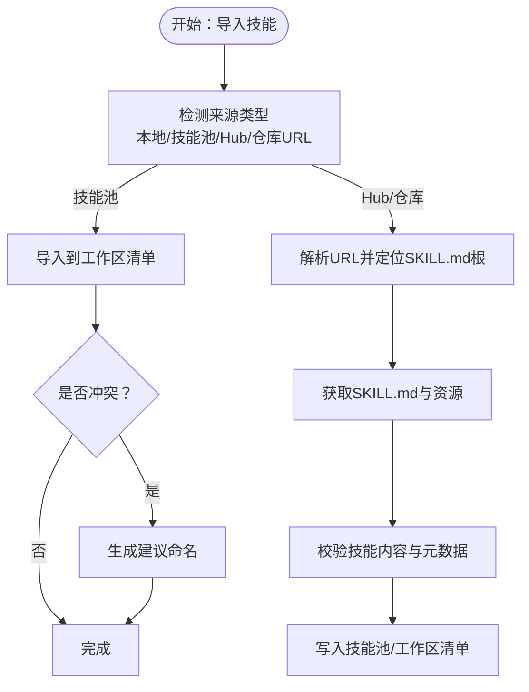
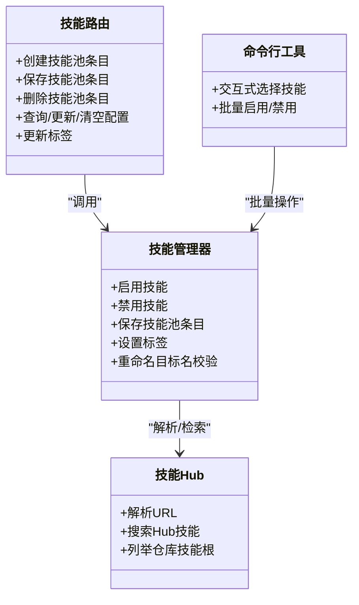

# 技能使用

<cite>
**本文引用的文件**
- [src/qwenpaw/app/routers/skills.py](file://src/qwenpaw/app/routers/skills.py)
- [src/qwenpaw/agents/skills_manager.py](file://src/qwenpaw/agents/skills_manager.py)
- [src/qwenpaw/agents/skills_hub.py](file://src/qwenpaw/agents/skills_hub.py)
- [src/qwenpaw/cli/skills_cmd.py](file://src/qwenpaw/cli/skills_cmd.py)
- [console/src/pages/Settings/SkillPool/index.tsx](file://console/src/pages/Settings/SkillPool/index.tsx)
- [console/src/components/SkillVisual/index.tsx](file://console/src/components/SkillVisual/index.tsx)
- [website/public/docs/skills.zh.md](file://website/public/docs/skills.zh.md)
</cite>

## 目录
1. [简介](#简介)
2. [项目结构](#项目结构)
3. [核心组件](#核心组件)
4. [架构总览](#架构总览)
5. [详细组件分析](#详细组件分析)
6. [依赖关系分析](#依赖关系分析)
7. [性能考虑](#性能考虑)
8. [故障排查指南](#故障排查指南)
9. [结论](#结论)
10. [附录](#附录)

## 简介
本指南面向使用者与开发者，系统性讲解技能系统的使用方法与最佳实践，涵盖以下主题：
- 技能池与技能分类：内置技能与自定义技能的区别与来源
- 技能卡片与抽屉：启用/禁用、配置调整、批量操作
- 技能抽屉详情：描述、参数说明、使用示例
- 技能导入与导出：从技能池导入、批量转移、版本管理
- 冲突解决与版本管理策略
- 调试与测试流程

## 项目结构
技能系统由后端服务、前端控制台、命令行工具与文档网站共同组成，围绕“技能池”“工作区技能清单”“技能Hub”三大核心概念运行。

图表来源
- [src/qwenpaw/app/routers/skills.py:811-1208](file://src/qwenpaw/app/routers/skills.py#L811-L1208)
- [src/qwenpaw/agents/skills_manager.py:2002-3021](file://src/qwenpaw/agents/skills_manager.py#L2002-L3021)
- [src/qwenpaw/agents/skills_hub.py:779-1566](file://src/qwenpaw/agents/skills_hub.py#L779-L1566)
- [src/qwenpaw/cli/skills_cmd.py:106-185](file://src/qwenpaw/cli/skills_cmd.py#L106-L185)
- [console/src/pages/Settings/SkillPool/index.tsx](file://console/src/pages/Settings/SkillPool/index.tsx)
- [console/src/components/SkillVisual/index.tsx](file://console/src/components/SkillVisual/index.tsx)
- [website/public/docs/skills.zh.md](file://website/public/docs/skills.zh.md)

章节来源
- [src/qwenpaw/app/routers/skills.py:811-1208](file://src/qwenpaw/app/routers/skills.py#L811-L1208)
- [src/qwenpaw/agents/skills_manager.py:2002-3021](file://src/qwenpaw/agents/skills_manager.py#L2002-L3021)
- [src/qwenpaw/agents/skills_hub.py:779-1566](file://src/qwenpaw/agents/skills_hub.py#L779-L1566)
- [src/qwenpaw/cli/skills_cmd.py:106-185](file://src/qwenpaw/cli/skills_cmd.py#L106-L185)
- [console/src/pages/Settings/SkillPool/index.tsx](file://console/src/pages/Settings/SkillPool/index.tsx)
- [console/src/components/SkillVisual/index.tsx](file://console/src/components/SkillVisual/index.tsx)
- [website/public/docs/skills.zh.md](file://website/public/docs/skills.zh.md)

## 核心组件
- 技能池（Skill Pool）
  - 存放可复用的技能模板与资源，支持创建、保存、删除、配置、标签管理与冲突建议命名。
- 工作区技能清单（Workspace Skills Manifest）
  - 记录当前工作区已安装技能的状态（启用/禁用）、渠道绑定、用户配置等。
- 技能Hub
  - 支持从外部Hub或仓库解析技能入口、提取元数据、搜索与匹配技能。
- 前端控制台
  - 提供技能池浏览、技能卡片交互、技能抽屉详情展示、批量操作入口。
- 命令行工具
  - 提供交互式技能选择、批量启用/禁用、工作区与技能池对齐等能力。

章节来源
- [src/qwenpaw/app/routers/skills.py:811-1208](file://src/qwenpaw/app/routers/skills.py#L811-L1208)
- [src/qwenpaw/agents/skills_manager.py:2002-3021](file://src/qwenpaw/agents/skills_manager.py#L2002-L3021)
- [src/qwenpaw/agents/skills_hub.py:779-1566](file://src/qwenpaw/agents/skills_hub.py#L779-L1566)
- [src/qwenpaw/cli/skills_cmd.py:106-185](file://src/qwenpaw/cli/skills_cmd.py#L106-L185)
- [console/src/pages/Settings/SkillPool/index.tsx](file://console/src/pages/Settings/SkillPool/index.tsx)
- [console/src/components/SkillVisual/index.tsx](file://console/src/components/SkillVisual/index.tsx)

## 架构总览
技能系统以“后端API + 前端控制台 + 命令行工具”协同工作，核心流程如下：

图表来源
- [src/qwenpaw/app/routers/skills.py:811-1208](file://src/qwenpaw/app/routers/skills.py#L811-L1208)
- [src/qwenpaw/agents/skills_manager.py:2002-3021](file://src/qwenpaw/agents/skills_manager.py#L2002-L3021)
- [src/qwenpaw/agents/skills_hub.py:779-1566](file://src/qwenpaw/agents/skills_hub.py#L779-L1566)

## 详细组件分析

### 技能池与技能分类
- 技能池（Pool）
  - 用于存放可导入/导出的技能模板与资源，支持为技能设置用户标签、配置参数、以及冲突重命名建议。
  - 关键能力：创建、保存、删除、查询配置、更新配置、清空配置、更新标签、重命名目标名校验。
- 工作区技能（Workspace）
  - 与具体工作区关联，记录每个技能的启用状态、默认渠道、用户配置等。
  - 关键能力：启用/禁用技能、批量应用、与技能池对齐。

章节来源
- [src/qwenpaw/app/routers/skills.py:811-1208](file://src/qwenpaw/app/routers/skills.py#L811-L1208)
- [src/qwenpaw/agents/skills_manager.py:2571-2612](file://src/qwenpaw/agents/skills_manager.py#L2571-L2612)
- [src/qwenpaw/agents/skills_manager.py:2936-3021](file://src/qwenpaw/agents/skills_manager.py#L2936-L3021)

### 技能卡片与抽屉详情
- 技能卡片
  - 展示技能名称、来源、状态（启用/禁用）、简要描述、图标等；支持在卡片上直接切换启用状态。
- 技能抽屉
  - 展示技能完整描述、版本信息、脚本列表、引用资源、参数说明、使用示例等；支持在抽屉内进行配置编辑与保存。

章节来源
- [console/src/pages/Settings/SkillPool/index.tsx](file://console/src/pages/Settings/SkillPool/index.tsx)
- [console/src/components/SkillVisual/index.tsx](file://console/src/components/SkillVisual/index.tsx)

### 技能导入与导出
- 导入
  - 从技能池导入到工作区：支持单个/批量导入，自动检测冲突并给出建议命名。
  - 从Hub/仓库导入：支持URL解析（Skills.sh、SkillsMP、GitHub等），自动定位SKILL.md根路径，拉取内容并写入技能池。
- 导出/转移
  - 将工作区技能导出为技能池条目，便于跨工作区迁移与共享。
- 版本管理
  - 技能描述中包含版本文本，导入时可对比版本差异，避免覆盖旧版配置。

图表来源
- [src/qwenpaw/agents/skills_hub.py:779-1566](file://src/qwenpaw/agents/skills_hub.py#L779-L1566)
- [src/qwenpaw/agents/skills_manager.py:2002-2047](file://src/qwenpaw/agents/skills_manager.py#L2002-L2047)
- [src/qwenpaw/app/routers/skills.py:811-1208](file://src/qwenpaw/app/routers/skills.py#L811-L1208)

章节来源
- [src/qwenpaw/agents/skills_hub.py:779-1566](file://src/qwenpaw/agents/skills_hub.py#L779-L1566)
- [src/qwenpaw/agents/skills_manager.py:2002-2047](file://src/qwenpaw/agents/skills_manager.py#L2002-L2047)
- [src/qwenpaw/app/routers/skills.py:811-1208](file://src/qwenpaw/app/routers/skills.py#L811-L1208)

### 批量操作与工作区同步
- 批量启用/禁用
  - 前端支持多选批量切换；命令行提供交互式选择与批量执行。
- 工作区与技能池对齐
  - 自动补齐工作区清单，确保技能存在且状态一致；对缺失或冲突项给出反馈。

章节来源
- [src/qwenpaw/cli/skills_cmd.py:106-185](file://src/qwenpaw/cli/skills_cmd.py#L106-L185)
- [src/qwenpaw/agents/skills_manager.py:2571-2612](file://src/qwenpaw/agents/skills_manager.py#L2571-L2612)

### 技能配置与参数管理
- 配置项
  - 支持为技能设置独立配置，按技能粒度保存/更新/清空。
- 参数说明
  - 抽屉中展示技能参数字段与默认值，便于用户理解与修改。
- 标签管理
  - 为技能添加用户标签，便于筛选与归类。

章节来源
- [src/qwenpaw/app/routers/skills.py:1136-1208](file://src/qwenpaw/app/routers/skills.py#L1136-L1208)
- [src/qwenpaw/agents/skills_manager.py:2936-3021](file://src/qwenpaw/agents/skills_manager.py#L2936-L3021)

## 依赖关系分析

图表来源
- [src/qwenpaw/app/routers/skills.py:811-1208](file://src/qwenpaw/app/routers/skills.py#L811-L1208)
- [src/qwenpaw/agents/skills_manager.py:2002-3021](file://src/qwenpaw/agents/skills_manager.py#L2002-L3021)
- [src/qwenpaw/agents/skills_hub.py:779-1566](file://src/qwenpaw/agents/skills_hub.py#L779-L1566)
- [src/qwenpaw/cli/skills_cmd.py:106-185](file://src/qwenpaw/cli/skills_cmd.py#L106-L185)

章节来源
- [src/qwenpaw/app/routers/skills.py:811-1208](file://src/qwenpaw/app/routers/skills.py#L811-L1208)
- [src/qwenpaw/agents/skills_manager.py:2002-3021](file://src/qwenpaw/agents/skills_manager.py#L2002-L3021)
- [src/qwenpaw/agents/skills_hub.py:779-1566](file://src/qwenpaw/agents/skills_hub.py#L779-L1566)
- [src/qwenpaw/cli/skills_cmd.py:106-185](file://src/qwenpaw/cli/skills_cmd.py#L106-L185)

## 性能考虑
- 批量操作
  - 前端与命令行均支持批量启用/禁用，减少重复请求与渲染开销。
- 缓存与去重
  - Hub解析过程对仓库树与匹配结果进行缓存，降低重复网络请求成本。
- 清单读写
  - 使用原子化清单更新函数，避免并发写入导致的数据不一致。

## 故障排查指南
- 技能未显示或状态异常
  - 检查工作区清单是否存在对应技能条目；确认是否被禁用或渠道未绑定。
- 导入失败
  - 确认URL正确且可访问；检查仓库中是否存在SKILL.md；查看返回的冲突建议命名并重试。
- 配置更新无效
  - 确认已保存配置；检查配置键是否正确；必要时清空后重新设置。
- 冲突与重命名
  - 当目标名称已存在时，系统会返回冲突与建议命名；请根据提示调整目标名称。

章节来源
- [src/qwenpaw/app/routers/skills.py:811-1208](file://src/qwenpaw/app/routers/skills.py#L811-L1208)
- [src/qwenpaw/agents/skills_manager.py:2936-3021](file://src/qwenpaw/agents/skills_manager.py#L2936-L3021)

## 结论
技能系统通过“技能池 + 工作区清单 + Hub解析”的组合，提供了灵活、可扩展的技能管理能力。配合前端卡片与抽屉、命令行工具与文档网站，用户可以高效地完成技能的导入、配置、启用/禁用、批量操作与版本管理，并在出现问题时快速定位与修复。

## 附录
- 更多使用说明与示例，请参考文档网站中的技能使用文档。

章节来源
- [website/public/docs/skills.zh.md](file://website/public/docs/skills.zh.md)