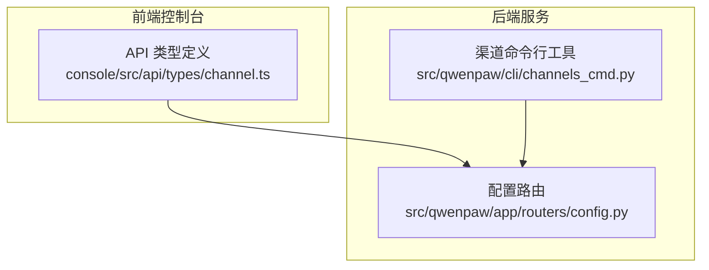
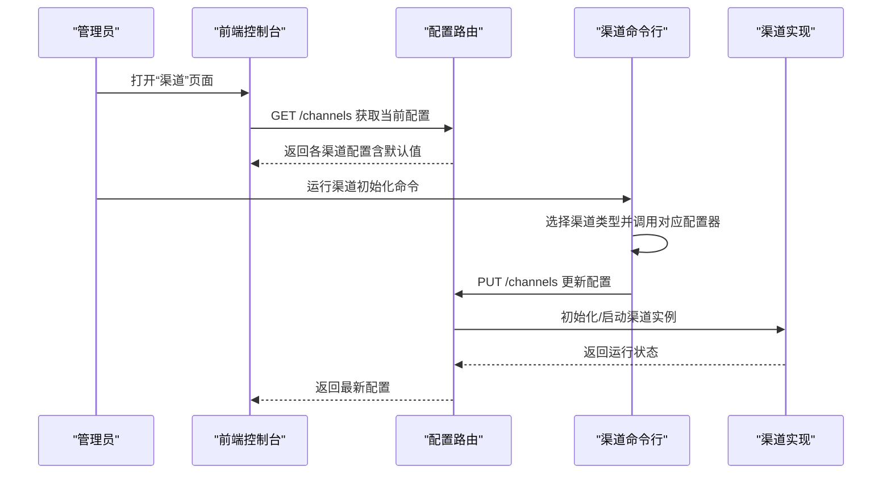
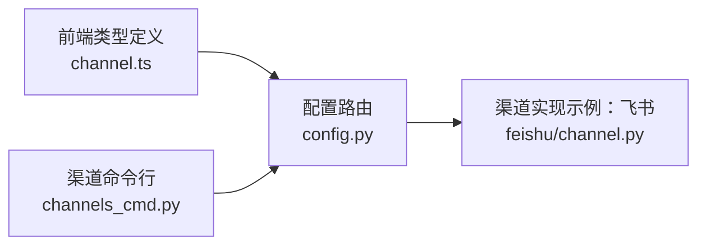

# 渠道集成

<cite>
**本文引用的文件**
- [channels_cmd.py](file://src/qwenpaw/cli/channels_cmd.py)
- [config.py](file://src/qwenpaw/app/routers/config.py)
- [channel.ts](file://console/src/api/types/channel.ts)
- [test_feishu_contract.py](file://tests/contract/channels/test_feishu_contract.py)
- [channel.py](file://src/qwenpaw/app/channels/feishu/channel.py)
</cite>

## 目录
1. [简介](#简介)
2. [项目结构](#项目结构)
3. [核心组件](#核心组件)
4. [架构总览](#架构总览)
5. [详细组件分析](#详细组件分析)
6. [依赖关系分析](#依赖关系分析)
7. [性能考量](#性能考量)
8. [故障排除指南](#故障排除指南)
9. [结论](#结论)
10. [附录](#附录)

## 简介
本指南面向需要在系统中集成多即时通讯渠道（如钉钉、飞书、QQ、Discord、Telegram、微信等）的用户与运维人员。文档覆盖以下内容：
- 支持的渠道类型与特性概览
- 各渠道的配置步骤（含密钥获取、机器人创建、回调地址设置等）
- 渠道卡片的使用方法（启用/禁用、状态查看、二维码生成等）
- 渠道连通性测试与常见问题排查
- 消息转发规则与格式转换机制

## 项目结构
系统采用前后端分离与模块化设计：
- 前端控制台通过 API 类型定义描述各渠道配置项
- 后端路由负责读取与保存渠道配置
- CLI 提供渠道初始化与配置流程
- 单元测试与契约测试保障渠道实现一致性

图表来源
- [channel.ts:1-106](file://console/src/api/types/channel.ts#L1-L106)
- [config.py:99-143](file://src/qwenpaw/app/routers/config.py#L99-L143)
- [channels_cmd.py:638-680](file://src/qwenpaw/cli/channels_cmd.py#L638-L680)

章节来源
- [channel.ts:1-106](file://console/src/api/types/channel.ts#L1-L106)
- [config.py:99-143](file://src/qwenpaw/app/routers/config.py#L99-L143)
- [channels_cmd.py:638-680](file://src/qwenpaw/cli/channels_cmd.py#L638-L680)

## 核心组件
- 渠道配置类型定义：前端统一的配置接口，包含通用字段与各渠道专属字段
- 配置路由：提供查询与更新所有渠道配置的能力
- 渠道命令行：封装渠道初始化流程，按可用渠道动态注册配置器
- 渠道契约测试：验证渠道实现满足基础契约

章节来源
- [channel.ts:1-106](file://console/src/api/types/channel.ts#L1-L106)
- [config.py:99-143](file://src/qwenpaw/app/routers/config.py#L99-L143)
- [channels_cmd.py:638-680](file://src/qwenpaw/cli/channels_cmd.py#L638-L680)
- [test_feishu_contract.py:25-49](file://tests/contract/channels/test_feishu_contract.py#L25-L49)

## 架构总览
下图展示从前端到后端的配置流转与渠道初始化流程。

图表来源
- [config.py:99-143](file://src/qwenpaw/app/routers/config.py#L99-L143)
- [channels_cmd.py:638-680](file://src/qwenpaw/cli/channels_cmd.py#L638-L680)

## 详细组件分析

### 渠道配置类型定义（前端）
- 通用字段：启用开关、机器人前缀、工具消息过滤、思考内容过滤、私聊/群组策略、允许来源、是否必须提及等
- 各渠道专属字段：例如 Discord 的 Bot Token、HTTP 代理；钉钉的企业应用 ID/Secret、消息类型、卡片模板等；飞书的应用 ID/Secret、加密密钥、校验 Token、媒体目录、域名等；QQ 的应用 ID/Secret、确认消息等；Telegram 的 Bot Token、HTTP 代理、打字提示等

章节来源
- [channel.ts:1-106](file://console/src/api/types/channel.ts#L1-L106)

### 渠道配置路由（后端）
- 列出可用渠道类型标识符
- 获取所有渠道配置（若未保存则返回默认值）
- 更新全部渠道配置

章节来源
- [config.py:118-143](file://src/qwenpaw/app/routers/config.py#L118-L143)

### 渠道初始化流程（CLI）
- 内置渠道配置器集合（iMessage、Discord、Telegram、DingTalk、Feishu、QQ、Console、Voice）
- 运行时根据可用渠道过滤配置器
- 调用具体配置器完成交互式配置并返回结果

章节来源
- [channels_cmd.py:638-680](file://src/qwenpaw/cli/channels_cmd.py#L638-L680)

### 渠道契约测试（示例：飞书）
- 通过契约测试确保渠道实现满足基类接口
- 测试中构造渠道实例并传入必要参数进行验证

章节来源
- [test_feishu_contract.py:25-49](file://tests/contract/channels/test_feishu_contract.py#L25-L49)

### 飞书渠道实现（示例）
- 从配置对象构建渠道实例，支持多种策略与过滤选项
- 支持域名选择（飞书/Lark）

章节来源
- [channel.py:291-322](file://src/qwenpaw/app/channels/feishu/channel.py#L291-L322)

## 依赖关系分析
- 前端类型定义驱动后端配置结构
- 后端路由为前端提供统一的配置读写入口
- CLI 作为配置入口，最终写入后端配置
- 各渠道实现遵循统一的基类契约，保证扩展一致性

图表来源
- [channel.ts:1-106](file://console/src/api/types/channel.ts#L1-L106)
- [config.py:99-143](file://src/qwenpaw/app/routers/config.py#L99-L143)
- [channels_cmd.py:638-680](file://src/qwenpaw/cli/channels_cmd.py#L638-L680)
- [channel.py:291-322](file://src/qwenpaw/app/channels/feishu/channel.py#L291-L322)

章节来源
- [channel.ts:1-106](file://console/src/api/types/channel.ts#L1-L106)
- [config.py:99-143](file://src/qwenpaw/app/routers/config.py#L99-L143)
- [channels_cmd.py:638-680](file://src/qwenpaw/cli/channels_cmd.py#L638-L680)
- [channel.py:291-322](file://src/qwenpaw/app/channels/feishu/channel.py#L291-L322)

## 性能考量
- 配置读取：后端在返回渠道配置时会合并默认值，避免空配置导致的重复初始化
- 并发处理：渠道实现通常以独立进程或异步任务运行，减少阻塞
- 过滤策略：通过工具消息过滤与思考内容过滤降低无效消息处理开销
- 代理与网络：对部分渠道提供 HTTP 代理与认证配置，便于内网部署与限速

## 故障排除指南
- 配置未生效
  - 确认已通过后端路由更新全部渠道配置
  - 检查渠道是否处于启用状态
- 渠道无法接收消息
  - 核对渠道专属密钥与令牌是否正确
  - 检查回调地址或接入方式是否符合平台要求
- 消息格式异常
  - 开启/关闭工具消息过滤与思考内容过滤，观察差异
  - 检查机器人前缀与提及策略是否影响识别
- 连接不稳定
  - 对支持代理的渠道配置代理与认证
  - 查看渠道实现的日志与重连策略

## 结论
本系统通过统一的配置类型、路由与命令行工具，实现了多渠道的标准化接入与管理。前端类型定义与后端路由确保配置一致性，CLI 提供便捷的初始化流程，契约测试保障渠道实现质量。结合过滤策略与网络配置，可满足不同场景下的消息转发与格式转换需求。

## 附录

### 支持的渠道与配置要点（基于现有实现与类型定义）
- 钉钉（DingTalk）
  - 关键配置：企业应用 ID、应用密钥、消息类型、卡片模板 ID/Key、机器人编码、回复时是否 AT 发送者
  - 配置入口：通过渠道命令行初始化流程完成
- 飞书（Feishu）
  - 关键配置：应用 ID、应用密钥、加密密钥、校验 Token、媒体目录、域名（飞书/Lark）、私聊/群组策略、允许来源、是否必须提及
  - 配置入口：通过渠道命令行初始化流程完成
- QQ
  - 关键配置：应用 ID、应用密钥、确认消息
  - 配置入口：通过渠道命令行初始化流程完成
- Discord
  - 关键配置：Bot Token、HTTP 代理、代理认证、是否接受机器人消息
  - 配置入口：通过渠道命令行初始化流程完成
- Telegram
  - 关键配置：Bot Token、HTTP 代理、代理认证、是否显示打字提示
  - 配置入口：通过渠道命令行初始化流程完成
- 微信（WeChat）
  - 关键配置：基于通用字段与微信特定参数（需参考实际实现）
  - 配置入口：通过渠道命令行初始化流程完成

章节来源
- [channel.ts:17-54](file://console/src/api/types/channel.ts#L17-L54)
- [channels_cmd.py:638-648](file://src/qwenpaw/cli/channels_cmd.py#L638-L648)

### 渠道卡片使用方法
- 启用/禁用：在渠道卡片中切换“启用”开关
- 查看状态：通过后端路由查询渠道配置，确认运行状态
- 二维码生成：部分渠道（如微信）可能支持二维码授权登录，可在对应卡片中操作
- 配置更新：通过后端路由一次性更新全部渠道配置

章节来源
- [config.py:118-143](file://src/qwenpaw/app/routers/config.py#L118-L143)

### 消息转发规则与格式转换
- 规则
  - 私聊/群组策略：开放或白名单模式
  - 允许来源：限定特定来源的消息
  - 是否必须提及：仅响应被提及的消息
  - 工具消息过滤：可选择过滤工具执行消息
  - 思考内容过滤：可选择过滤模型内部思考内容
- 格式转换
  - 不同渠道的消息格式存在差异，系统通过渠道实现进行适配与转换
  - 可通过配置项调整行为（如显示打字提示、媒体目录等）

章节来源
- [channel.ts:1-10](file://console/src/api/types/channel.ts#L1-L10)
- [channel.py:291-322](file://src/qwenpaw/app/channels/feishu/channel.py#L291-L322)