# 用户指南

<cite>
**本文引用的文件**
- [console/src/pages/Chat/index.tsx](file://console/src/pages/Chat/index.tsx)
- [console/src/pages/Agent/Config/index.tsx](file://console/src/pages/Agent/Config/index.tsx)
- [console/src/pages/Agent/Skills/index.tsx](file://console/src/pages/Agent/Skills/index.tsx)
- [console/src/pages/Agent/Workspace/index.tsx](file://console/src/pages/Agent/Workspace/index.tsx)
- [console/src/pages/Control/Channels/index.tsx](file://console/src/pages/Control/Channels/index.tsx)
- [console/src/pages/Settings/Agents/index.tsx](file://console/src/pages/Settings/Agents/index.tsx)
- [console/src/pages/Settings/Backups/index.tsx](file://console/src/pages/Settings/Backups/index.tsx)
- [console/src/pages/Settings/Models/index.tsx](file://console/src/pages/Settings/Models/index.tsx)
- [console/src/pages/Settings/Security/index.tsx](file://console/src/pages/Settings/Security/index.tsx)
- [console/src/pages/Settings/Environments/index.tsx](file://console/src/pages/Settings/Environments/index.tsx)
- [console/src/constants/channel.ts](file://console/src/constants/channel.ts)
- [console/src/constants/skill.ts](file://console/src/constants/skill.ts)
- [console/src/api/modules/channel.ts](file://console/src/api/modules/channel.ts)
- [console/src/api/modules/skill.ts](file://console/src/api/modules/skill.ts)
- [console/src/api/modules/agents.ts](file://console/src/api/modules/agents.ts)
- [console/src/api/modules/backup.ts](file://console/src/api/modules/backup.ts)
- [console/src/api/modules/provider.ts](file://console/src/api/modules/provider.ts)
- [console/src/api/modules/chat.ts](file://console/src/api/modules/chat.ts)
- [console/src/api/modules/workspace.ts](file://console/src/api/modules/workspace.ts)
- [console/src/api/modules/env.ts](file://console/src/api/modules/env.ts)
- [console/src/api/modules/security.ts](file://console/src/api/modules/security.ts)
- [console/src/api/modules/root.ts](file://console/src/api/modules/root.ts)
- [console/src/api/modules/console.ts](file://console/src/api/modules/console.ts)
- [console/src/api/modules/cronjob.ts](file://console/src/api/modules/cronjob.ts)
- [console/src/api/modules/heartbeat.ts](file://console/src/api/modules/heartbeat.ts)
- [console/src/api/modules/language.ts](file://console/src/api/modules/language.ts)
- [console/src/api/modules/localModel.ts](file://console/src/api/modules/localModel.ts)
- [console/src/api/modules/mcp.ts](file://console/src/api/modules/mcp.ts)
- [console/src/api/modules/plugin.ts](file://console/src/api/modules/plugin.ts)
- [console/src/api/modules/provider.ts](file://console/src/api/modules/provider.ts)
- [console/src/api/modules/root.ts](file://console/src/api/modules/root.ts)
- [console/src/api/modules/security.ts](file://console/src/api/modules/security.ts)
- [console/src/api/modules/skill.ts](file://console/src/api/modules/skill.ts)
- [console/src/api/modules/tokenUsage.ts](file://console/src/api/modules/tokenUsage.ts)
- [console/src/api/modules/tools.ts](file://console/src/api/modules/tools.ts)
- [console/src/api/modules/userTimezone.ts](file://console/src/api/modules/userTimezone.ts)
- [console/src/api/modules/workspace.ts](file://console/src/api/modules/workspace.ts)
- [src/qwenpaw/app/channels/dingtalk/](file://src/qwenpaw/app/channels/dingtalk/)
- [src/qwenpaw/app/channels/feishu/](file://src/qwenpaw/app/channels/feishu/)
- [src/qwenpaw/app/channels/qq/](file://src/qwenpaw/app/channels/qq/)
- [src/qwenpaw/app/channels/discord_/](file://src/qwenpaw/app/channels/discord_/)
</cite>

## 目录
1. [简介](#简介)
2. [项目结构](#项目结构)
3. [核心组件](#核心组件)
4. [架构总览](#架构总览)
5. [详细组件分析](#详细组件分析)
6. [依赖关系分析](#依赖关系分析)
7. [性能与可用性建议](#性能与可用性建议)
8. [故障排查指南](#故障排查指南)
9. [结论](#结论)
10. [附录：多渠道集成操作步骤](#附录多渠道集成操作步骤)

## 简介
本指南面向QwenPaw Web控制台的使用者，帮助您快速掌握以下功能与操作：
- 代理配置与个性化（模型选择、重试与限流、上下文/记忆后端）
- 技能管理（技能池、导入导出、批量操作）
- 渠道设置（即时通讯平台对接与配置）
- 聊天界面与会话管理（消息发送、附件上传、命令与快捷键）
- 工作空间管理（文件编辑、启用/禁用、打包下载/上传）
- 备份与恢复（本地备份、导入/导出、静默备份）
- 安全策略（工具守卫、规则管理、文件保护、技能扫描）
- 环境变量与模型管理（提供商配置、模型选择）

本指南以“从入口到落地”的方式组织内容，既适合初学者快速上手，也为进阶用户提供可追溯的参考路径。

## 项目结构
控制台前端采用模块化页面组织，按“功能域”划分页面与组件，API层通过模块化封装统一调用后端服务。整体结构如下：

```mermaid
graph TB
subgraph "控制台前端"
Chat["聊天页<br/>console/src/pages/Chat"]
AgentCfg["代理配置页<br/>console/src/pages/Agent/Config"]
AgentSkills["技能页<br/>console/src/pages/Agent/Skills"]
AgentWs["工作空间页<br/>console/src/pages/Agent/Workspace"]
ControlChannels["渠道页<br/>console/src/pages/Control/Channels"]
SettingsAgents["代理列表页<br/>console/src/pages/Settings/Agents"]
SettingsBackups["备份页<br/>console/src/pages/Settings/Backups"]
SettingsModels["模型页<br/>console/src/pages/Settings/Models"]
SettingsSecurity["安全页<br/>console/src/pages/Settings/Security"]
SettingsEnv["环境变量页<br/>console/src/pages/Settings/Environments"]
end
subgraph "API模块"
ApiChannel["channel.ts"]
ApiSkill["skill.ts"]
ApiAgents["agents.ts"]
ApiBackup["backup.ts"]
ApiProvider["provider.ts"]
ApiChat["chat.ts"]
ApiWorkspace["workspace.ts"]
ApiEnv["env.ts"]
ApiSecurity["security.ts"]
ApiRoot["root.ts"]
ApiConsole["console.ts"]
ApiCron["cronjob.ts"]
ApiHeartbeat["heartbeat.ts"]
ApiLanguage["language.ts"]
ApiLocalModel["localModel.ts"]
ApiMcp["mcp.ts"]
ApiPlugin["plugin.ts"]
ApiTokenUsage["tokenUsage.ts"]
ApiTools["tools.ts"]
ApiUserTz["userTimezone.ts"]
end
Chat --> ApiChat
AgentCfg --> ApiProvider
AgentSkills --> ApiSkill
AgentWs --> ApiWorkspace
ControlChannels --> ApiChannel
SettingsAgents --> ApiAgents
SettingsBackups --> ApiBackup
SettingsModels --> ApiProvider
SettingsSecurity --> ApiSecurity
SettingsEnv --> ApiEnv
SettingsAgents --> ApiSkill
SettingsBackups --> ApiAgents
ApiChat --> ApiConsole
ApiChannel --> ApiRoot
ApiSkill --> ApiRoot
ApiAgents --> ApiRoot
ApiBackup --> ApiRoot
ApiProvider --> ApiRoot
ApiWorkspace --> ApiRoot
ApiEnv --> ApiRoot
ApiSecurity --> ApiRoot
```

图表来源
- [console/src/pages/Chat/index.tsx:446-980](file://console/src/pages/Chat/index.tsx#L446-L980)
- [console/src/pages/Agent/Config/index.tsx:1-201](file://console/src/pages/Agent/Config/index.tsx#L1-L201)
- [console/src/pages/Agent/Skills/index.tsx:1-218](file://console/src/pages/Agent/Skills/index.tsx#L1-L218)
- [console/src/pages/Agent/Workspace/index.tsx:1-186](file://console/src/pages/Agent/Workspace/index.tsx#L1-L186)
- [console/src/pages/Control/Channels/index.tsx:1-164](file://console/src/pages/Control/Channels/index.tsx#L1-L164)
- [console/src/pages/Settings/Agents/index.tsx:1-216](file://console/src/pages/Settings/Agents/index.tsx#L1-L216)
- [console/src/pages/Settings/Backups/index.tsx:1-147](file://console/src/pages/Settings/Backups/index.tsx#L1-L147)
- [console/src/pages/Settings/Models/index.tsx:1-180](file://console/src/pages/Settings/Models/index.tsx#L1-L180)
- [console/src/pages/Settings/Security/index.tsx:1-438](file://console/src/pages/Settings/Security/index.tsx#L1-L438)
- [console/src/pages/Settings/Environments/index.tsx:1-326](file://console/src/pages/Settings/Environments/index.tsx#L1-L326)

章节来源
- [console/src/pages/Chat/index.tsx:446-980](file://console/src/pages/Chat/index.tsx#L446-L980)
- [console/src/pages/Control/Channels/index.tsx:1-164](file://console/src/pages/Control/Channels/index.tsx#L1-L164)

## 核心组件
- 聊天运行时与会话管理：负责消息发送、流式响应、附件上传、会话URL同步、历史消息导航等。
- 代理配置：提供React Agent参数、LLM重试与限流、上下文/记忆后端切换等。
- 技能管理：技能卡片、抽屉表单、技能池导入导出、批量操作、标签过滤与视图模式。
- 渠道管理：内置/自定义渠道卡片、筛选、表单保存、启用/禁用、前缀与过滤选项。
- 模型与提供商：提供商列表、模型选择、活跃模型展示、刷新与搜索。
- 安全策略：工具守卫开关、规则增删改查、预览、文件保护、技能扫描。
- 环境变量：表格化编辑、校验、批量删除、保存与重置。
- 备份与恢复：备份列表、导入冲突处理、创建/静默备份、恢复确认流程。
- 工作空间：文件列表、编辑器、启用/禁用、排序、下载/上传ZIP包。

章节来源
- [console/src/pages/Chat/index.tsx:446-980](file://console/src/pages/Chat/index.tsx#L446-L980)
- [console/src/pages/Agent/Config/index.tsx:1-201](file://console/src/pages/Agent/Config/index.tsx#L1-L201)
- [console/src/pages/Agent/Skills/index.tsx:1-218](file://console/src/pages/Agent/Skills/index.tsx#L1-L218)
- [console/src/pages/Control/Channels/index.tsx:1-164](file://console/src/pages/Control/Channels/index.tsx#L1-L164)
- [console/src/pages/Settings/Models/index.tsx:1-180](file://console/src/pages/Settings/Models/index.tsx#L1-L180)
- [console/src/pages/Settings/Security/index.tsx:1-438](file://console/src/pages/Settings/Security/index.tsx#L1-L438)
- [console/src/pages/Settings/Environments/index.tsx:1-326](file://console/src/pages/Settings/Environments/index.tsx#L1-L326)
- [console/src/pages/Settings/Backups/index.tsx:1-147](file://console/src/pages/Settings/Backups/index.tsx#L1-L147)
- [console/src/pages/Agent/Workspace/index.tsx:1-186](file://console/src/pages/Agent/Workspace/index.tsx#L1-L186)

## 架构总览
下图展示了从Web控制台到后端服务的数据流与交互关系，以及关键API模块的职责分工。

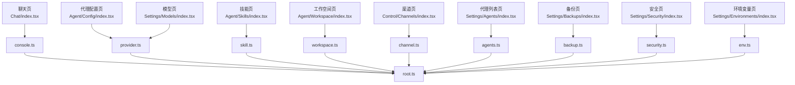

图表来源
- [console/src/pages/Chat/index.tsx:688-696](file://console/src/pages/Chat/index.tsx#L688-L696)
- [console/src/pages/Agent/Config/index.tsx:1-201](file://console/src/pages/Agent/Config/index.tsx#L1-L201)
- [console/src/pages/Agent/Skills/index.tsx:1-218](file://console/src/pages/Agent/Skills/index.tsx#L1-L218)
- [console/src/pages/Agent/Workspace/index.tsx:1-186](file://console/src/pages/Agent/Workspace/index.tsx#L1-L186)
- [console/src/pages/Control/Channels/index.tsx:1-164](file://console/src/pages/Control/Channels/index.tsx#L1-L164)
- [console/src/pages/Settings/Agents/index.tsx:1-216](file://console/src/pages/Settings/Agents/index.tsx#L1-L216)
- [console/src/pages/Settings/Backups/index.tsx:1-147](file://console/src/pages/Settings/Backups/index.tsx#L1-L147)
- [console/src/pages/Settings/Models/index.tsx:1-180](file://console/src/pages/Settings/Models/index.tsx#L1-L180)
- [console/src/pages/Settings/Security/index.tsx:1-438](file://console/src/pages/Settings/Security/index.tsx#L1-L438)
- [console/src/pages/Settings/Environments/index.tsx:1-326](file://console/src/pages/Settings/Environments/index.tsx#L1-L326)
- [console/src/api/modules/console.ts](file://console/src/api/modules/console.ts)
- [console/src/api/modules/root.ts](file://console/src/api/modules/root.ts)

## 详细组件分析

### 聊天界面与会话管理
- 功能要点
  - 流式对话：通过统一的聊天API发起请求，支持取消与错误处理。
  - 会话管理：自动选择/创建会话，URL与会话ID同步，移除/创建时自动跳转。
  - 历史消息导航：支持在输入框中使用上下箭头浏览用户消息历史。
  - 附件上传：限制大小与类型，支持图片/视频能力提示与预览。
  - 命令与快捷键：支持清屏、压缩上下文、审批、任务、技能查询等命令。
- 关键流程（发送消息）
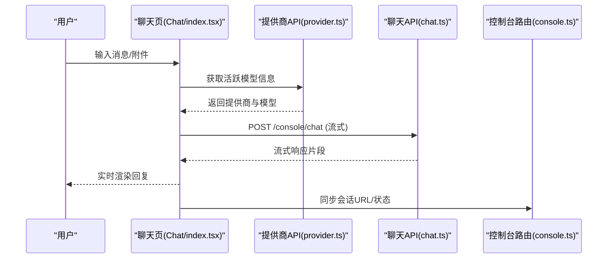

图表来源
- [console/src/pages/Chat/index.tsx:622-698](file://console/src/pages/Chat/index.tsx#L622-L698)
- [console/src/api/modules/provider.ts](file://console/src/api/modules/provider.ts)
- [console/src/api/modules/chat.ts](file://console/src/api/modules/chat.ts)
- [console/src/api/modules/console.ts](file://console/src/api/modules/console.ts)

章节来源
- [console/src/pages/Chat/index.tsx:446-980](file://console/src/pages/Chat/index.tsx#L446-L980)

### 代理配置（个性化设置）
- 功能要点
  - React Agent参数：语言、时区等动态保存。
  - LLM重试与限流：卡片化配置，支持启用/禁用与参数调整。
  - 上下文/记忆后端：根据当前选择动态注入对应配置卡片。
- 配置流程
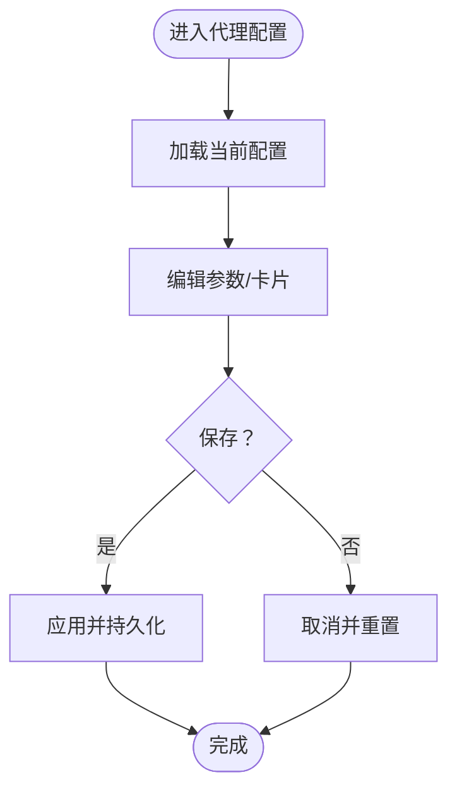

图表来源
- [console/src/pages/Agent/Config/index.tsx:1-201](file://console/src/pages/Agent/Config/index.tsx#L1-L201)

章节来源
- [console/src/pages/Agent/Config/index.tsx:1-201](file://console/src/pages/Agent/Config/index.tsx#L1-L201)

### 技能管理（技能池与工作空间）
- 功能要点
  - 技能卡片与列表：支持卡片/列表视图、标签过滤、搜索。
  - 抽屉表单：新增/编辑技能，支持标签选择与启用状态切换。
  - 技能池：支持从外部Hub导入、上传/下载至技能池。
  - 批量操作：全选、批量删除、批量启用/禁用。
- 技能导入/导出流程
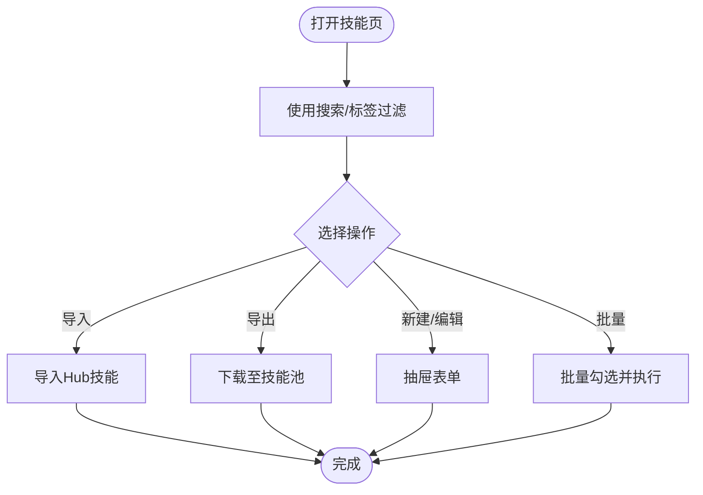

图表来源
- [console/src/pages/Agent/Skills/index.tsx:1-218](file://console/src/pages/Agent/Skills/index.tsx#L1-L218)
- [console/src/constants/skill.ts](file://console/src/constants/skill.ts)

章节来源
- [console/src/pages/Agent/Skills/index.tsx:1-218](file://console/src/pages/Agent/Skills/index.tsx#L1-L218)

### 渠道设置（多渠道集成）
- 功能要点
  - 内置/自定义渠道：支持启用/禁用、前缀、工具消息过滤、思考内容过滤等。
  - 过滤器：全部/内置/自定义三类筛选。
  - 表单保存：抽屉内表单提交后刷新渠道列表。
- 渠道配置流程
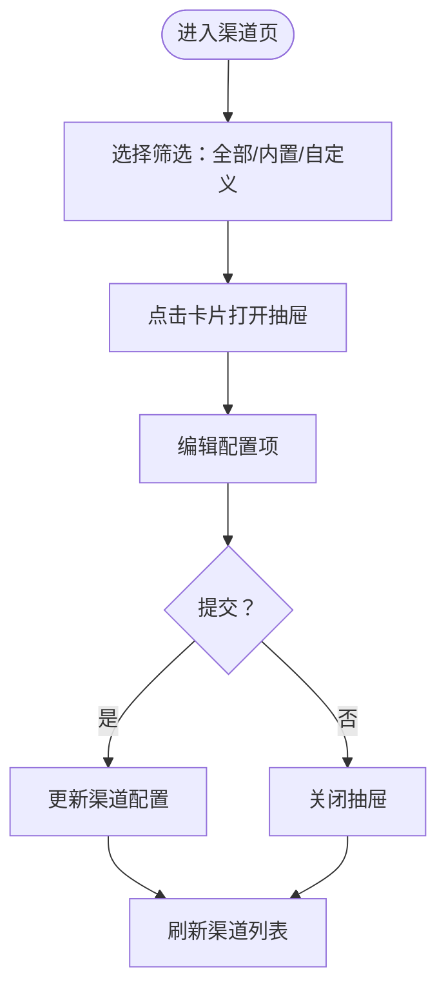

图表来源
- [console/src/pages/Control/Channels/index.tsx:1-164](file://console/src/pages/Control/Channels/index.tsx#L1-L164)
- [console/src/constants/channel.ts](file://console/src/constants/channel.ts)

章节来源
- [console/src/pages/Control/Channels/index.tsx:1-164](file://console/src/pages/Control/Channels/index.tsx#L1-L164)

### 代理列表与工作空间
- 代理列表
  - 新建/编辑/删除/启用/禁用代理；支持拖拽重排；可为代理绑定活跃模型与技能。
- 工作空间
  - 文件列表与编辑器：启用/禁用、排序；支持下载/上传ZIP包。
- 代理与工作空间流程
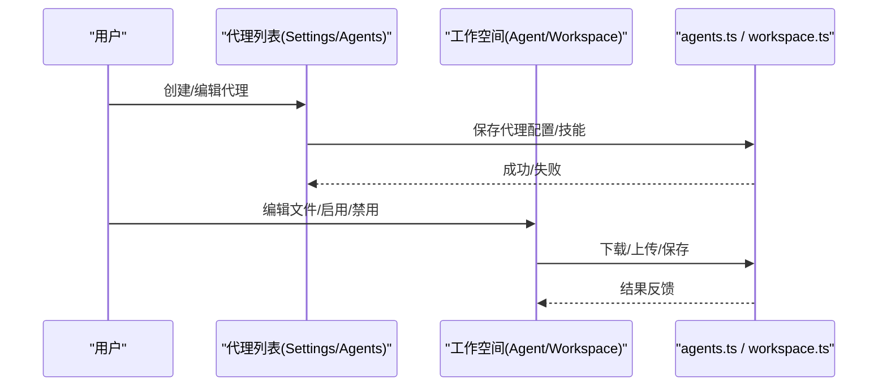

图表来源
- [console/src/pages/Settings/Agents/index.tsx:1-216](file://console/src/pages/Settings/Agents/index.tsx#L1-L216)
- [console/src/pages/Agent/Workspace/index.tsx:1-186](file://console/src/pages/Agent/Workspace/index.tsx#L1-L186)
- [console/src/api/modules/agents.ts](file://console/src/api/modules/agents.ts)
- [console/src/api/modules/workspace.ts](file://console/src/api/modules/workspace.ts)

章节来源
- [console/src/pages/Settings/Agents/index.tsx:1-216](file://console/src/pages/Settings/Agents/index.tsx#L1-L216)
- [console/src/pages/Agent/Workspace/index.tsx:1-186](file://console/src/pages/Agent/Workspace/index.tsx#L1-L186)

### 模型与提供商
- 功能要点
  - 提供商列表：区分本地/常规提供商，支持搜索与刷新。
  - 模型选择：展示活跃模型，支持新增自定义提供商。
- 模型配置流程
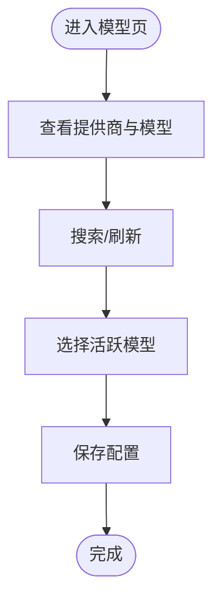

图表来源
- [console/src/pages/Settings/Models/index.tsx:1-180](file://console/src/pages/Settings/Models/index.tsx#L1-L180)
- [console/src/api/modules/provider.ts](file://console/src/api/modules/provider.ts)

章节来源
- [console/src/pages/Settings/Models/index.tsx:1-180](file://console/src/pages/Settings/Models/index.tsx#L1-L180)

### 安全策略（工具守卫/文件保护/技能扫描）
- 功能要点
  - 工具守卫：开启/关闭、受保护工具、禁止工具、自定义规则增删改查与预览。
  - 文件保护：文件守卫配置保存与重置。
  - 技能扫描：扫描策略与签名规则管理。
- 安全策略流程
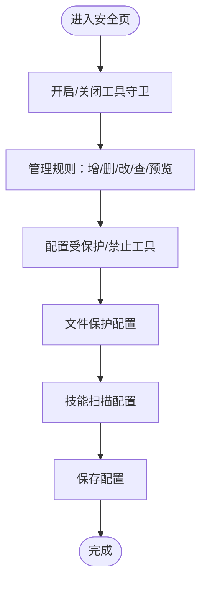

图表来源
- [console/src/pages/Settings/Security/index.tsx:1-438](file://console/src/pages/Settings/Security/index.tsx#L1-L438)

章节来源
- [console/src/pages/Settings/Security/index.tsx:1-438](file://console/src/pages/Settings/Security/index.tsx#L1-L438)

### 环境变量
- 功能要点
  - 表格化编辑：新增、插入、删除、全选/反选、批量删除。
  - 校验：键名格式、重复键、必填校验。
  - 保存与重置：一次性保存所有变更。
- 环境变量流程
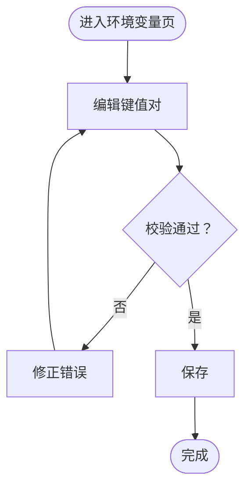

图表来源
- [console/src/pages/Settings/Environments/index.tsx:1-326](file://console/src/pages/Settings/Environments/index.tsx#L1-L326)
- [console/src/api/modules/env.ts](file://console/src/api/modules/env.ts)

章节来源
- [console/src/pages/Settings/Environments/index.tsx:1-326](file://console/src/pages/Settings/Environments/index.tsx#L1-L326)

### 备份与恢复
- 功能要点
  - 列表：搜索、刷新、恢复、删除。
  - 导入：冲突处理（覆盖/保留）。
  - 创建：创建备份弹窗。
  - 恢复：预恢复确认、静默备份、最终恢复。
- 备份恢复流程
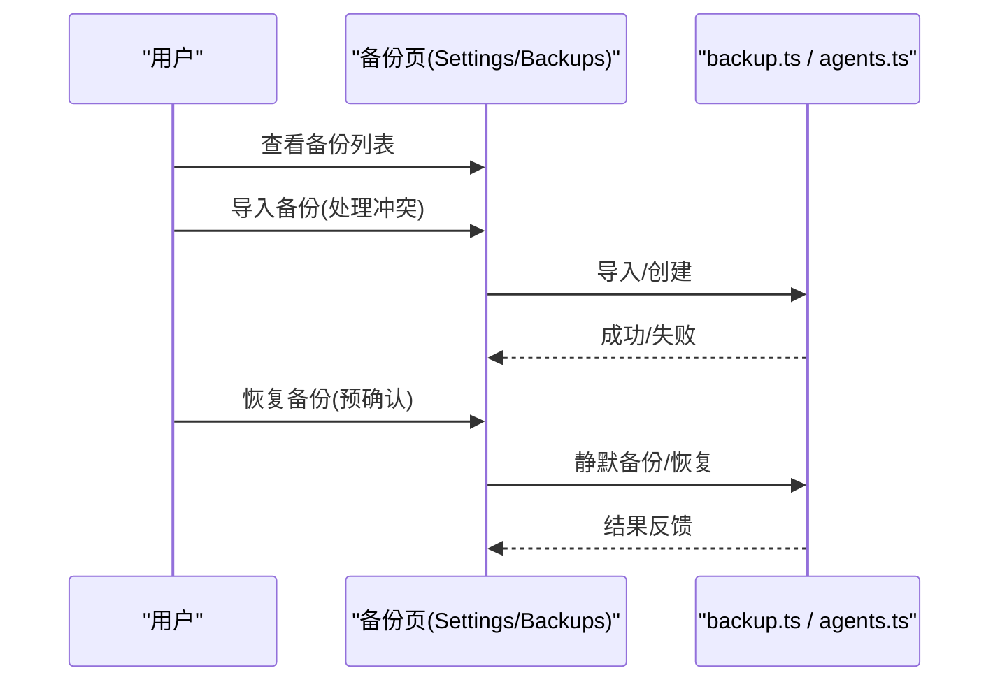

图表来源
- [console/src/pages/Settings/Backups/index.tsx:1-147](file://console/src/pages/Settings/Backups/index.tsx#L1-L147)
- [console/src/api/modules/backup.ts](file://console/src/api/modules/backup.ts)
- [console/src/api/modules/agents.ts](file://console/src/api/modules/agents.ts)

章节来源
- [console/src/pages/Settings/Backups/index.tsx:1-147](file://console/src/pages/Settings/Backups/index.tsx#L1-L147)

## 依赖关系分析
- 页面与API模块
  - 聊天页依赖提供商与聊天API；渠道页依赖通道API；代理/技能/备份/模型/安全/环境变量页分别依赖对应API模块。
- 组件耦合
  - 页面组件通过API模块解耦后端接口，避免直接耦合具体服务实现。
- 外部依赖
  - 使用Ant Design与自研设计库组件，统一风格与交互体验。

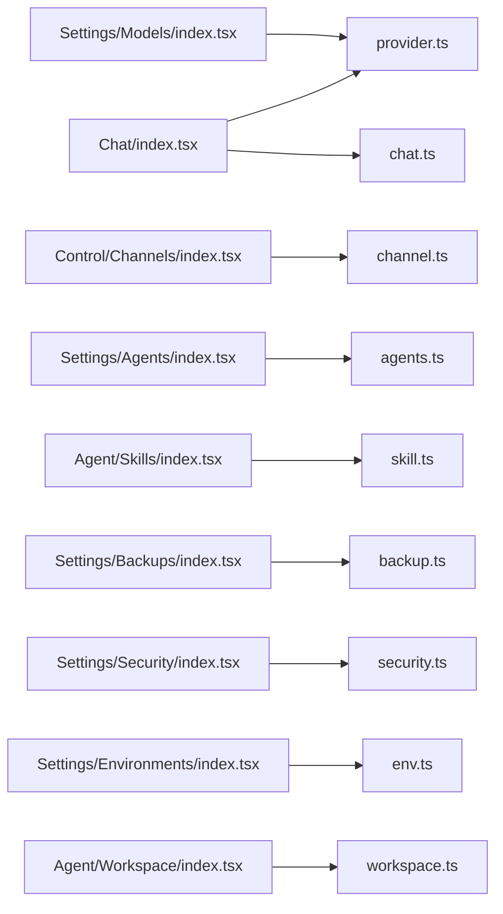

图表来源
- [console/src/pages/Chat/index.tsx:622-698](file://console/src/pages/Chat/index.tsx#L622-L698)
- [console/src/pages/Control/Channels/index.tsx:1-164](file://console/src/pages/Control/Channels/index.tsx#L1-L164)
- [console/src/pages/Settings/Agents/index.tsx:1-216](file://console/src/pages/Settings/Agents/index.tsx#L1-L216)
- [console/src/pages/Agent/Skills/index.tsx:1-218](file://console/src/pages/Agent/Skills/index.tsx#L1-L218)
- [console/src/pages/Settings/Backups/index.tsx:1-147](file://console/src/pages/Settings/Backups/index.tsx#L1-L147)
- [console/src/pages/Settings/Models/index.tsx:1-180](file://console/src/pages/Settings/Models/index.tsx#L1-L180)
- [console/src/pages/Settings/Security/index.tsx:1-438](file://console/src/pages/Settings/Security/index.tsx#L1-L438)
- [console/src/pages/Settings/Environments/index.tsx:1-326](file://console/src/pages/Settings/Environments/index.tsx#L1-L326)
- [console/src/pages/Agent/Workspace/index.tsx:1-186](file://console/src/pages/Agent/Workspace/index.tsx#L1-L186)

## 性能与可用性建议
- 聊天性能
  - 合理设置模型与上下文长度，避免过长上下文导致延迟。
  - 使用“压缩上下文”命令清理冗余历史，提升响应速度。
- 附件上传
  - 控制附件大小与类型，优先使用图片/视频能力明确的模型。
- 技能与工作空间
  - 只启用必要的技能，减少加载与执行开销。
  - 对大文件工作空间定期打包下载，避免频繁读写。
- 安全策略
  - 自定义规则尽量精确，避免过度拦截导致误伤。
- 备份
  - 定期创建备份，恢复前先进行静默备份，降低风险。

## 故障排查指南
- 聊天无响应或报错
  - 检查活跃模型是否配置正确；若未配置，页面会提示并阻止发送。
  - 查看网络与后端日志，确认/consolse/chat接口可达。
- 渠道无法接收消息
  - 确认渠道已启用且配置项正确；检查过滤设置是否误屏蔽。
- 技能导入失败
  - 检查网络与Hub连通性；确认目标工作空间ID有效。
- 备份/恢复异常
  - 导入冲突时按提示选择覆盖或保留；恢复前确保有静默备份。
- 环境变量保存失败
  - 检查键名格式与重复情况；修正后再保存。

章节来源
- [console/src/pages/Chat/index.tsx:622-698](file://console/src/pages/Chat/index.tsx#L622-L698)
- [console/src/pages/Control/Channels/index.tsx:70-100](file://console/src/pages/Control/Channels/index.tsx#L70-L100)
- [console/src/pages/Agent/Skills/index.tsx:100-107](file://console/src/pages/Agent/Skills/index.tsx#L100-L107)
- [console/src/pages/Settings/Backups/index.tsx:105-143](file://console/src/pages/Settings/Backups/index.tsx#L105-L143)
- [console/src/pages/Settings/Environments/index.tsx:212-251](file://console/src/pages/Settings/Environments/index.tsx#L212-L251)

## 结论
QwenPaw Web控制台提供了从“代理配置—技能管理—渠道对接—聊天交互—工作空间—安全策略—备份恢复—环境变量”的完整闭环。通过本文档的操作步骤与最佳实践，您可以高效地搭建与维护个人或团队智能体工作流，并在多渠道即时通讯平台上稳定运行。

## 附录：多渠道集成操作步骤
以下为常见即时通讯平台的接入与配置步骤（以Web控制台为入口）：
- 钉钉（DingTalk）
  - 在渠道页启用对应渠道卡片，填写企业/应用相关参数（如应用ID、密钥等），保存后生效。
  - 参考：渠道常量与卡片组件
- 飞书（Feishu）
  - 同上，按飞书平台要求配置回调地址与应用凭证，保存并测试连接。
- QQ
  - 启用QQ渠道，按平台要求配置机器人参数与权限，保存后验证消息收发。
- Discord
  - 启用Discord渠道，配置Bot令牌与频道权限，保存后进行消息互通测试。

章节来源
- [console/src/pages/Control/Channels/index.tsx:1-164](file://console/src/pages/Control/Channels/index.tsx#L1-L164)
- [console/src/constants/channel.ts](file://console/src/constants/channel.ts)
- [src/qwenpaw/app/channels/dingtalk/](file://src/qwenpaw/app/channels/dingtalk/)
- [src/qwenpaw/app/channels/feishu/](file://src/qwenpaw/app/channels/feishu/)
- [src/qwenpaw/app/channels/qq/](file://src/qwenpaw/app/channels/qq/)
- [src/qwenpaw/app/channels/discord_/](file://src/qwenpaw/app/channels/discord_/)