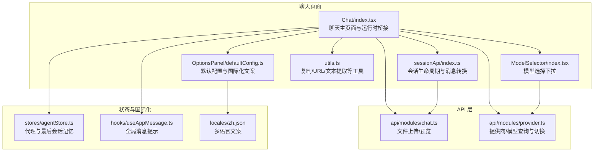
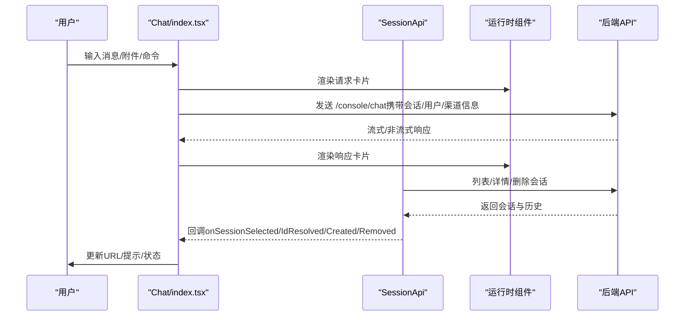
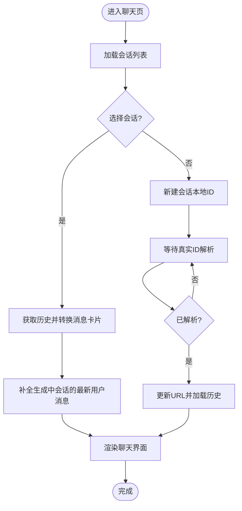
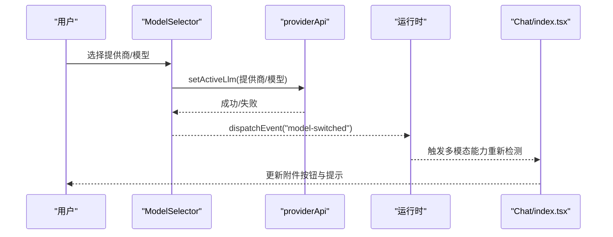
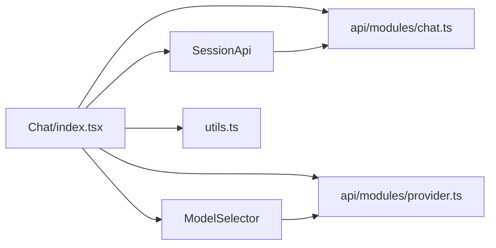

# 聊天界面

<cite>
**本文引用的文件**
- [console/src/pages/Chat/index.tsx](file://console/src/pages/Chat/index.tsx)
- [console/src/pages/Chat/utils.ts](file://console/src/pages/Chat/utils.ts)
- [console/src/pages/Chat/sessionApi/index.ts](file://console/src/pages/Chat/sessionApi/index.ts)
- [console/src/pages/Chat/OptionsPanel/defaultConfig.ts](file://console/src/pages/Chat/OptionsPanel/defaultConfig.ts)
- [console/src/pages/Chat/ModelSelector/index.tsx](file://console/src/pages/Chat/ModelSelector/index.tsx)
- [console/src/api/modules/chat.ts](file://console/src/api/modules/chat.ts)
- [console/src/api/modules/provider.ts](file://console/src/api/modules/provider.ts)
- [console/src/stores/agentStore.ts](file://console/src/stores/agentStore.ts)
- [console/src/hooks/useAppMessage.ts](file://console/src/hooks/useAppMessage.ts)
- [console/src/locales/zh.json](file://console/src/locales/zh.json)
</cite>

## 目录
1. [简介](#简介)
2. [项目结构](#项目结构)
3. [核心组件](#核心组件)
4. [架构总览](#架构总览)
5. [详细组件分析](#详细组件分析)
6. [依赖关系分析](#依赖关系分析)
7. [性能与可用性建议](#性能与可用性建议)
8. [故障排查指南](#故障排查指南)
9. [结论](#结论)
10. [附录：命令与配置速查](#附录：命令与配置速查)

## 简介
本指南面向使用控制台“聊天界面”的用户与维护者，系统讲解以下内容：
- 聊天窗口基本操作：消息发送、历史记录查看、会话管理
- 会话抽屉（会话列表）使用：会话列表、搜索过滤、会话详情
- 消息格式与特殊命令：支持的输入格式、内置命令及行为
- 聊天选项面板配置：模型选择、参数调整、主题与欢迎语
- 消息搜索与导出：如何在界面中检索与导出对话
- 实时消息推送与通知：浏览器通知、会话状态变化提示

## 项目结构
聊天界面由前端页面、会话管理、消息工具集、模型选择器与选项面板构成，采用模块化组织，便于扩展与维护。

图表来源
- [console/src/pages/Chat/index.tsx:446-800](file://console/src/pages/Chat/index.tsx#L446-L800)
- [console/src/pages/Chat/sessionApi/index.ts:339-735](file://console/src/pages/Chat/sessionApi/index.ts#L339-L735)
- [console/src/pages/Chat/OptionsPanel/defaultConfig.ts:1-80](file://console/src/pages/Chat/OptionsPanel/defaultConfig.ts#L1-L80)
- [console/src/pages/Chat/ModelSelector/index.tsx:1-278](file://console/src/pages/Chat/ModelSelector/index.tsx#L1-L278)
- [console/src/pages/Chat/utils.ts:1-208](file://console/src/pages/Chat/utils.ts#L1-L208)
- [console/src/api/modules/chat.ts](file://console/src/api/modules/chat.ts)
- [console/src/api/modules/provider.ts](file://console/src/api/modules/provider.ts)
- [console/src/stores/agentStore.ts](file://console/src/stores/agentStore.ts)
- [console/src/hooks/useAppMessage.ts](file://console/src/hooks/useAppMessage.ts)
- [console/src/locales/zh.json](file://console/src/locales/zh.json)

章节来源
- [console/src/pages/Chat/index.tsx:446-800](file://console/src/pages/Chat/index.tsx#L446-L800)
- [console/src/pages/Chat/sessionApi/index.ts:339-735](file://console/src/pages/Chat/sessionApi/index.ts#L339-L735)

## 核心组件
- 聊天主页面（Chat/index.tsx）
  - 集成运行时组件与会话管理，负责消息发送、附件上传、命令建议、URL 同步、主题与国际化注入。
- 会话 API（sessionApi/index.ts）
  - 统一管理会话列表、会话选择、历史加载、消息卡片转换、本地草稿缓存与 URL 同步回调。
- 模型选择器（ModelSelector/index.tsx）
  - 提供模型切换、提供商与模型分层展示、免费模型切换确认、与运行时能力联动。
- 选项面板默认配置（OptionsPanel/defaultConfig.ts）
  - 默认主题、欢迎语、发送器配置、国际化文案提供。
- 工具集（utils.ts）
  - 复制助手文本、URL 规范化、错误响应构建、文本提取、DOM 值设置等。
- API 模块
  - 文件上传/预览（chat.ts）、提供商/模型查询与激活（provider.ts）

章节来源
- [console/src/pages/Chat/index.tsx:446-800](file://console/src/pages/Chat/index.tsx#L446-L800)
- [console/src/pages/Chat/sessionApi/index.ts:339-735](file://console/src/pages/Chat/sessionApi/index.ts#L339-L735)
- [console/src/pages/Chat/ModelSelector/index.tsx:1-278](file://console/src/pages/Chat/ModelSelector/index.tsx#L1-L278)
- [console/src/pages/Chat/OptionsPanel/defaultConfig.ts:1-80](file://console/src/pages/Chat/OptionsPanel/defaultConfig.ts#L1-L80)
- [console/src/pages/Chat/utils.ts:1-208](file://console/src/pages/Chat/utils.ts#L1-L208)
- [console/src/api/modules/chat.ts](file://console/src/api/modules/chat.ts)
- [console/src/api/modules/provider.ts](file://console/src/api/modules/provider.ts)

## 架构总览
聊天界面以“页面 + 会话 API + 运行时组件”为核心，通过统一的会话生命周期与消息转换逻辑，实现历史加载、URL 同步、实时状态更新与多模态能力检测。

图表来源
- [console/src/pages/Chat/index.tsx:446-800](file://console/src/pages/Chat/index.tsx#L446-L800)
- [console/src/pages/Chat/sessionApi/index.ts:339-735](file://console/src/pages/Chat/sessionApi/index.ts#L339-L735)

## 详细组件分析

### 聊天窗口与消息交互
- 消息发送
  - 支持文本、图片、音频、视频、文件等多模态内容；内容中的 URL 将被规范化为后端可识别路径。
  - 发送前进行 IME 组合状态检查，避免输入法导致的提前提交。
  - 当未配置模型时，返回错误响应，引导用户先选择模型。
- 历史记录查看
  - 会话切换时加载对应历史；若会话正在生成，会从 sessionStorage 中补回最新用户消息。
  - 历史消息按“用户消息 + 连续非用户消息组”的规则转换为卡片格式。
- 会话管理
  - 新建/删除/重命名会话；URL 与会话状态保持同步；首次新建会话使用本地时间戳作为临时 ID，随后解析为真实 UUID。
- 命令建议与特殊命令
  - 文本框以“/”开头触发命令建议弹窗，包含清空、压缩、审批、拒绝、任务、技能等命令，点击即插入到输入框。
  - 特殊命令 payload 中可包含“清除历史”等元数据标记，运行时可据此清理历史或完成响应。
- 附件上传
  - 限制最大大小；根据当前模型多模态能力给出警告；上传成功后生成预览链接。
- 复制与导出
  - 支持复制助手输出文本；导出可通过复制或后端接口完成（具体导出入口以实际 UI 为准）。

章节来源
- [console/src/pages/Chat/index.tsx:125-182](file://console/src/pages/Chat/index.tsx#L125-L182)
- [console/src/pages/Chat/index.tsx:610-742](file://console/src/pages/Chat/index.tsx#L610-L742)
- [console/src/pages/Chat/index.tsx:744-800](file://console/src/pages/Chat/index.tsx#L744-L800)
- [console/src/pages/Chat/utils.ts:29-76](file://console/src/pages/Chat/utils.ts#L29-L76)
- [console/src/pages/Chat/utils.ts:114-123](file://console/src/pages/Chat/utils.ts#L114-L123)
- [console/src/pages/Chat/utils.ts:165-185](file://console/src/pages/Chat/utils.ts#L165-L185)

### 会话抽屉与会话管理
- 会话列表
  - 通过会话 API 获取后端会话列表，支持将首选会话置顶；会话项包含名称、创建时间、状态与固定标记。
- 搜索与过滤
  - 可在会话列表中进行关键词过滤（基于会话名称与最近消息），提升多会话场景下的查找效率。
- 会话详情
  - 点击进入会话后，页面根据会话状态渲染“生成中/已完成”，并自动补全最新用户消息。
- URL 同步
  - 会话选择/创建/移除时，自动更新浏览器地址栏，保证分享与刷新的一致性。

图表来源
- [console/src/pages/Chat/sessionApi/index.ts:522-535](file://console/src/pages/Chat/sessionApi/index.ts#L522-L535)
- [console/src/pages/Chat/sessionApi/index.ts:562-661](file://console/src/pages/Chat/sessionApi/index.ts#L562-L661)
- [console/src/pages/Chat/sessionApi/index.ts:663-731](file://console/src/pages/Chat/sessionApi/index.ts#L663-L731)

章节来源
- [console/src/pages/Chat/sessionApi/index.ts:339-735](file://console/src/pages/Chat/sessionApi/index.ts#L339-L735)

### 模型选择与多模态能力
- 模型选择
  - 下拉菜单展示已配置提供商及其模型；点击模型后触发切换，支持“免费模型切换确认”流程。
  - 切换成功后向运行时广播事件，刷新多模态能力检测。
- 多模态能力
  - 根据当前模型能力动态启用/禁用附件上传与提示；当仅支持图片时对非图片文件发出警告。
- 主题与国际化
  - 选项面板默认配置包含主题色、欢迎语、发送器参数与国际化文案；运行时注入暗色模式与头部组件。

图表来源
- [console/src/pages/Chat/ModelSelector/index.tsx:138-185](file://console/src/pages/Chat/ModelSelector/index.tsx#L138-L185)
- [console/src/pages/Chat/index.tsx:258-267](file://console/src/pages/Chat/index.tsx#L258-L267)

章节来源
- [console/src/pages/Chat/ModelSelector/index.tsx:1-278](file://console/src/pages/Chat/ModelSelector/index.tsx#L1-L278)
- [console/src/pages/Chat/index.tsx:184-268](file://console/src/pages/Chat/index.tsx#L184-L268)

### 选项面板与配置
- 主题与外观
  - 支持主题色、暗色模式、左侧标题与徽标配置；运行时注入头部组件（会话初始化器、模型选择器、操作组）。
- 欢迎语与提示
  - 欢迎语、描述、头像与提示短语均来自默认配置与国际化资源。
- 发送器参数
  - 支持附件开关、最大长度、免责声明等；与运行时发送器组件联动。

章节来源
- [console/src/pages/Chat/OptionsPanel/defaultConfig.ts:1-80](file://console/src/pages/Chat/OptionsPanel/defaultConfig.ts#L1-L80)
- [console/src/pages/Chat/index.tsx:744-800](file://console/src/pages/Chat/index.tsx#L744-L800)

### 消息格式与特殊命令
- 消息格式
  - 用户消息：卡片内含文本/图片/音频/视频/文件等片段；片段 URL 经过显示 URL 规范化处理。
  - 助手响应：连续的非用户消息被合并为单个响应卡片，包含序列号、创建时间、完成时间等元数据。
- 特殊命令
  - 命令建议：以“/”开头，包含清空、压缩、审批、拒绝、任务、技能等；点击插入到输入框。
  - 元数据标记：payload 中可包含“清除历史”等字段，运行时据此执行清理或完成响应。

章节来源
- [console/src/pages/Chat/index.tsx:59-112](file://console/src/pages/Chat/index.tsx#L59-L112)
- [console/src/pages/Chat/index.tsx:744-777](file://console/src/pages/Chat/index.tsx#L744-L777)
- [console/src/pages/Chat/sessionApi/index.ts:122-252](file://console/src/pages/Chat/sessionApi/index.ts#L122-L252)

### 消息搜索与导出
- 搜索
  - 在聊天界面中可使用浏览器快捷键或运行时提供的搜索功能定位消息（具体快捷键以界面提示为准）。
- 导出
  - 可复制助手输出文本；如需导出为文件，请参考后端接口或页面提供的导出入口（以实际 UI 为准）。

章节来源
- [console/src/pages/Chat/utils.ts:29-76](file://console/src/pages/Chat/utils.ts#L29-L76)

### 实时消息推送与通知
- 实时推送
  - 会话处于“生成中”状态时，页面会持续补全最新用户消息；会话状态变化（创建/删除/选择）通过回调驱动 URL 同步与界面更新。
- 通知设置
  - 页面使用全局消息钩子进行提示（成功/失败/警告）；浏览器通知权限由系统控制，可在浏览器设置中开启/关闭。

章节来源
- [console/src/pages/Chat/sessionApi/index.ts:410-442](file://console/src/pages/Chat/sessionApi/index.ts#L410-L442)
- [console/src/pages/Chat/index.tsx:610-620](file://console/src/pages/Chat/index.tsx#L610-L620)
- [console/src/hooks/useAppMessage.ts](file://console/src/hooks/useAppMessage.ts)

## 依赖关系分析
- 组件耦合
  - Chat/index.tsx 与 SessionApi 强耦合，负责 URL 同步与会话生命周期；与 ModelSelector 通过事件解耦。
  - ModelSelector 与 providerApi 强耦合，负责模型切换与能力检测。
- 外部依赖
  - 运行时组件提供卡片渲染与交互；API 模块提供文件上传与模型查询；国际化资源提供文案。
- 循环依赖
  - 未发现循环依赖；各模块职责清晰，通过回调与事件解耦。

图表来源
- [console/src/pages/Chat/index.tsx:446-800](file://console/src/pages/Chat/index.tsx#L446-L800)
- [console/src/pages/Chat/sessionApi/index.ts:339-735](file://console/src/pages/Chat/sessionApi/index.ts#L339-L735)
- [console/src/pages/Chat/ModelSelector/index.tsx:1-278](file://console/src/pages/Chat/ModelSelector/index.tsx#L1-L278)
- [console/src/pages/Chat/utils.ts:1-208](file://console/src/pages/Chat/utils.ts#L1-L208)
- [console/src/api/modules/chat.ts](file://console/src/api/modules/chat.ts)
- [console/src/api/modules/provider.ts](file://console/src/api/modules/provider.ts)

章节来源
- [console/src/pages/Chat/index.tsx:446-800](file://console/src/pages/Chat/index.tsx#L446-L800)
- [console/src/pages/Chat/sessionApi/index.ts:339-735](file://console/src/pages/Chat/sessionApi/index.ts#L339-L735)
- [console/src/pages/Chat/ModelSelector/index.tsx:1-278](file://console/src/pages/Chat/ModelSelector/index.tsx#L1-L278)
- [console/src/pages/Chat/utils.ts:1-208](file://console/src/pages/Chat/utils.ts#L1-L208)
- [console/src/api/modules/chat.ts](file://console/src/api/modules/chat.ts)
- [console/src/api/modules/provider.ts](file://console/src/api/modules/provider.ts)

## 性能与可用性建议
- 附件上传
  - 控制文件大小与类型，避免超出限制；优先使用图片/音频/视频等受支持的媒体类型。
- 历史加载
  - 长历史会话建议分段查看或导出；减少一次性渲染压力。
- 多模态能力
  - 选择具备相应能力的模型，避免不必要的警告与失败。
- URL 同步
  - 使用会话链接分享时，确保接收方已登录且模型已配置，以获得最佳体验。

## 故障排查指南
- 未配置模型
  - 现象：发送消息时报错“模型未配置”。
  - 处理：打开模型选择器，选择合适的提供商与模型；切换后重试。
- 附件上传失败
  - 现象：上传超限或类型不受支持。
  - 处理：检查文件大小与类型；若模型仅支持图片，尝试更换为图片格式。
- 会话无法加载或状态异常
  - 现象：会话列表为空或历史不完整。
  - 处理：刷新页面；若会话正在生成，等待生成完成或手动补全最新用户消息。
- 命令无效或无响应
  - 现象：输入“/”后命令建议未出现或点击无效果。
  - 处理：确保输入框处于焦点状态且未处于 IME 组合中；检查命令是否正确拼写。

章节来源
- [console/src/pages/Chat/utils.ts:114-123](file://console/src/pages/Chat/utils.ts#L114-L123)
- [console/src/pages/Chat/index.tsx:700-742](file://console/src/pages/Chat/index.tsx#L700-L742)
- [console/src/pages/Chat/sessionApi/index.ts:410-442](file://console/src/pages/Chat/sessionApi/index.ts#L410-L442)

## 结论
本聊天界面通过统一的会话管理与运行时组件，提供了稳定的消息发送、历史查看与会话管理能力；结合模型选择器与选项面板，实现了灵活的主题与参数配置。配合多模态能力检测与命令建议，能够满足多样化的对话需求。建议在使用中关注模型配置、附件类型与大小限制，并利用会话 URL 同步与导出功能提升协作效率。

## 附录：命令与配置速查
- 命令建议
  - 清空：清空当前会话历史
  - 压缩：压缩上下文以优化成本
  - 审批：触发审批流程
  - 拒绝：拒绝当前请求
  - 任务：进入任务模式
  - 技能：查看可用技能
- 选项面板
  - 主题色、暗色模式、欢迎语、发送器最大长度、免责声明
- 国际化
  - 文案来源于多语言资源，支持中文等语言

章节来源
- [console/src/pages/Chat/index.tsx:744-777](file://console/src/pages/Chat/index.tsx#L744-L777)
- [console/src/pages/Chat/OptionsPanel/defaultConfig.ts:38-80](file://console/src/pages/Chat/OptionsPanel/defaultConfig.ts#L38-L80)
- [console/src/locales/zh.json](file://console/src/locales/zh.json)