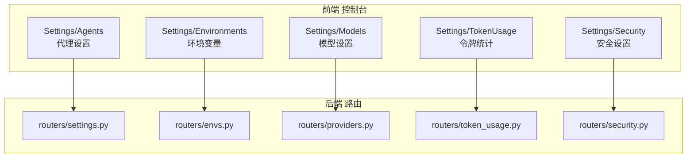
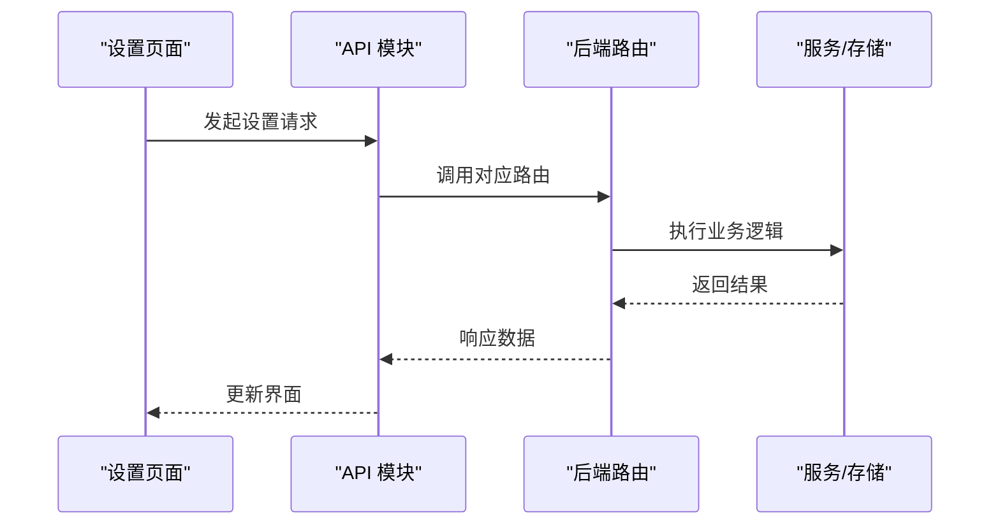
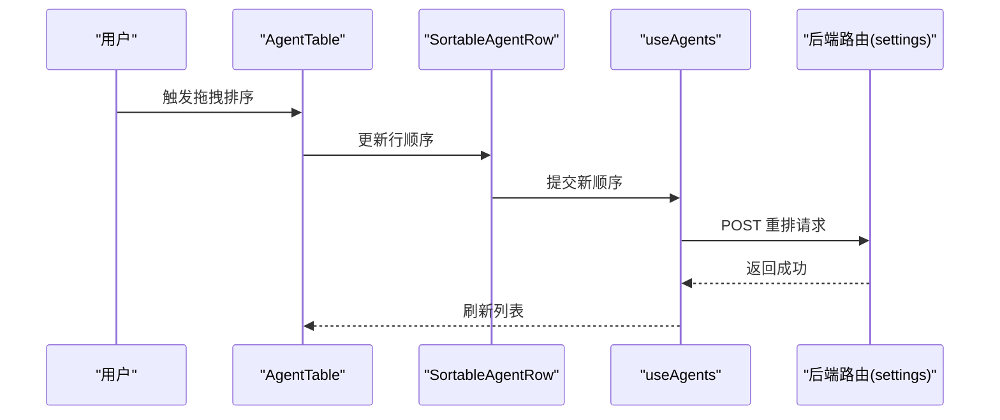
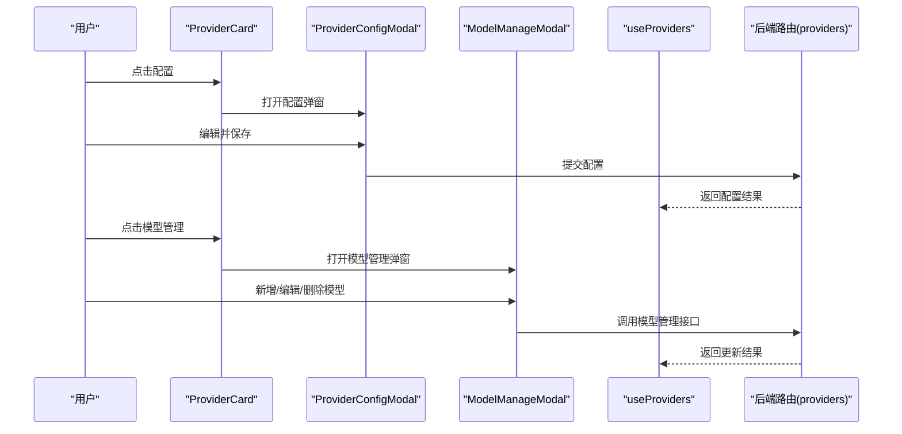
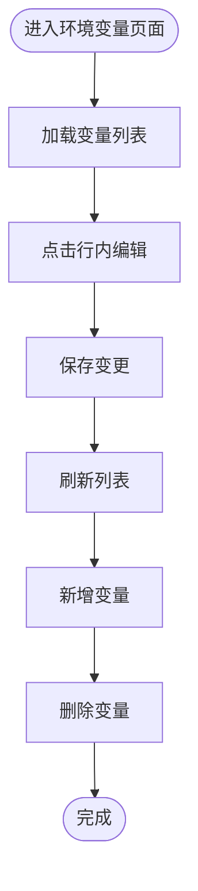
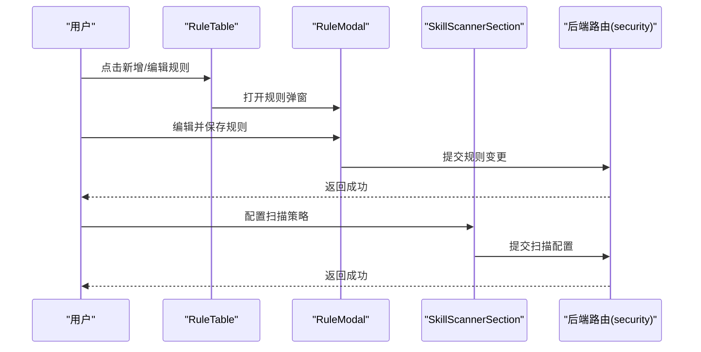
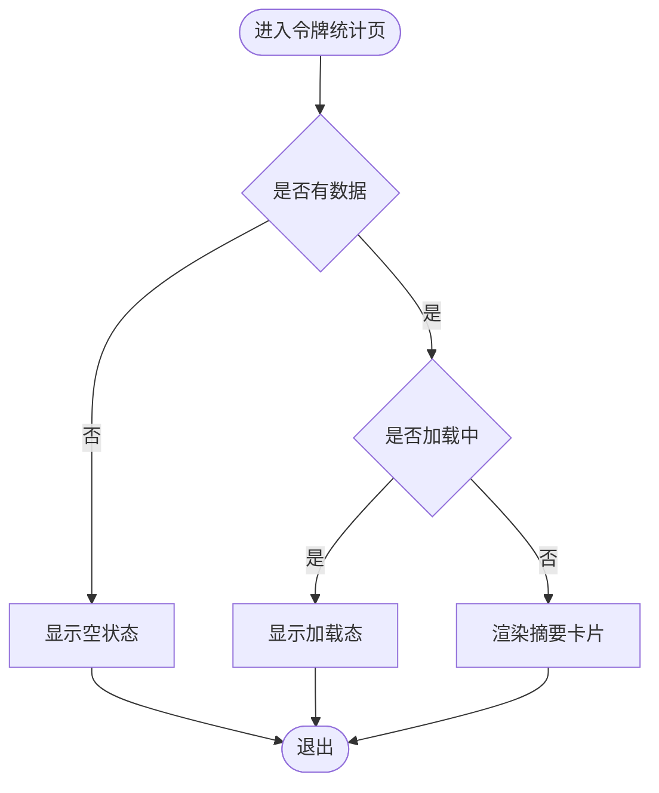
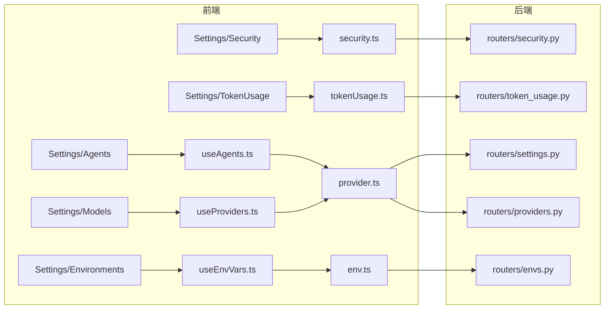

# 设置管理

<cite>
**本文引用的文件**
- [index.tsx](file://console/src/pages/Settings/Agents/index.tsx)
- [AgentTable.tsx](file://console/src/pages/Settings/Agents/components/AgentTable.tsx)
- [SortableAgentRow.tsx](file://console/src/pages/Settings/Agents/components/SortableAgentRow.tsx)
- [reorder.ts](file://console/src/pages/Settings/Agents/reorder.ts)
- [useAgents.ts](file://console/src/pages/Settings/Agents/useAgents.ts)
- [index.tsx](file://console/src/pages/Settings/Models/index.tsx)
- [ProviderCard.tsx](file://console/src/pages/Settings/Models/components/cards/ProviderCard.tsx)
- [RemoteProviderCard.tsx](file://console/src/pages/Settings/Models/components/cards/RemoteProviderCard.tsx)
- [LocalProviderCard.tsx](file://console/src/pages/Settings/Models/components/cards/LocalProviderCard.tsx)
- [ProviderConfigModal.tsx](file://console/src/pages/Settings/Models/components/modals/ProviderConfigModal.tsx)
- [ModelManageModal.tsx](file://console/src/pages/Settings/Models/components/modals/ModelManageModal.tsx)
- [RemoteModelManageModal.tsx](file://console/src/pages/Settings/Models/components/modals/RemoteModelManageModal.tsx)
- [LocalModelManageModal.tsx](file://console/src/pages/Settings/Models/components/modals/LocalModelManageModal.tsx)
- [testConnectionMessage.ts](file://console/src/pages/Settings/Models/components/modals/testConnectionMessage.ts)
- [useProviders.ts](file://console/src/pages/Settings/Models/useProviders.ts)
- [index.tsx](file://console/src/pages/Settings/Environments/index.tsx)
- [EnvRow.tsx](file://console/src/pages/Settings/Environments/components/EnvRow.tsx)
- [useEnvVars.ts](file://console/src/pages/Settings/Environments/useEnvVars.ts)
- [index.tsx](file://console/src/pages/Settings/Security/index.tsx)
- [SkillScannerSection.tsx](file://console/src/pages/Settings/Security/components/SkillScannerSection.tsx)
- [FileGuardSection.tsx](file://console/src/pages/Settings/Security/components/FileGuardSection.tsx)
- [RuleTable.tsx](file://console/src/pages/Settings/Security/components/RuleTable.tsx)
- [RuleModal.tsx](file://console/src/pages/Settings/Security/components/RuleModal.tsx)
- [index.tsx](file://console/src/pages/Settings/TokenUsage/index.tsx)
- [SummaryCard.tsx](file://console/src/pages/Settings/AgentStats/SummaryCard.tsx)
- [index.tsx](file://src/qwenpaw/routers/settings.py)
- [envs.py](file://src/qwenpaw/routers/envs.py)
- [providers.py](file://src/qwenpaw/routers/providers.py)
- [token_usage.py](file://src/qwenpaw/routers/token_usage.py)
- [security.py](file://src/qwenpaw/routers/security.py)
- [env.ts](file://console/src/api/modules/env.ts)
- [provider.ts](file://console/src/api/modules/provider.ts)
- [tokenUsage.ts](file://console/src/api/modules/tokenUsage.ts)
- [security.ts](file://console/src/api/modules/security.ts)
- [envs.py](file://src/qwenpaw/app/workspace/envs.py)
- [secret_store.py](file://src/qwenpaw/security/secret_store.py)
- [scanner.py](file://src/qwenpaw/security/skill_scanner/scanner.py)
- [engine.py](file://src/qwenpaw/security/tool_guard/engine.py)
- [manager.py](file://src/qwenpaw/token_usage/manager.py)
</cite>

## 目录
1. [简介](#简介)
2. [项目结构](#项目结构)
3. [核心组件](#核心组件)
4. [架构总览](#架构总览)
5. [详细组件分析](#详细组件分析)
6. [依赖分析](#依赖分析)
7. [性能考虑](#性能考虑)
8. [故障排查指南](#故障排查指南)
9. [结论](#结论)
10. [附录](#附录)

## 简介
本指南围绕系统设置管理展开，覆盖以下主题：
- 代理设置：代理列表管理、排序调整、批量操作
- 模型设置：提供商配置、模型选择、连接测试、性能优化
- 环境变量管理：变量增删改查与作用域设置
- 安全设置：工具守卫与技能扫描器配置、访问控制
- 令牌使用统计：用量查询、趋势分析、限额设置

文档基于前端页面与后端路由/服务实现进行梳理，并提供最佳实践与注意事项。

## 项目结构
设置模块位于前端控制台的 Settings 页面目录下，按功能划分为多个子页面；后端通过独立路由处理设置相关请求。

**图表来源**
- [index.tsx](file://console/src/pages/Settings/Agents/index.tsx)
- [index.tsx](file://console/src/pages/Settings/Models/index.tsx)
- [index.tsx](file://console/src/pages/Settings/Environments/index.tsx)
- [index.tsx](file://console/src/pages/Settings/Security/index.tsx)
- [index.tsx](file://console/src/pages/Settings/TokenUsage/index.tsx)
- [settings.py](file://src/qwenpaw/routers/settings.py)
- [envs.py](file://src/qwenpaw/routers/envs.py)
- [providers.py](file://src/qwenpaw/routers/providers.py)
- [token_usage.py](file://src/qwenpaw/routers/token_usage.py)
- [security.py](file://src/qwenpaw/routers/security.py)

**章节来源**
- [index.tsx](file://console/src/pages/Settings/Agents/index.tsx)
- [index.tsx](file://console/src/pages/Settings/Models/index.tsx)
- [index.tsx](file://console/src/pages/Settings/Environments/index.tsx)
- [index.tsx](file://console/src/pages/Settings/Security/index.tsx)
- [index.tsx](file://console/src/pages/Settings/TokenUsage/index.tsx)

## 核心组件
- 代理设置：提供代理列表展示、拖拽排序、批量操作（启用/禁用、删除）等能力
- 模型设置：支持提供商卡片化展示、配置弹窗、模型管理弹窗、连接测试提示
- 环境变量：支持变量行内编辑、新增、删除、作用域标签
- 安全设置：工具守卫规则表格与弹窗、技能扫描器策略配置
- 令牌统计：摘要卡片与空状态/加载态组件

**章节来源**
- [AgentTable.tsx](file://console/src/pages/Settings/Agents/components/AgentTable.tsx)
- [SortableAgentRow.tsx](file://console/src/pages/Settings/Agents/components/SortableAgentRow.tsx)
- [ProviderCard.tsx](file://console/src/pages/Settings/Models/components/cards/ProviderCard.tsx)
- [ProviderConfigModal.tsx](file://console/src/pages/Settings/Models/components/modals/ProviderConfigModal.tsx)
- [ModelManageModal.tsx](file://console/src/pages/Settings/Models/components/modals/ModelManageModal.tsx)
- [EnvRow.tsx](file://console/src/pages/Settings/Environments/components/EnvRow.tsx)
- [RuleTable.tsx](file://console/src/pages/Settings/Security/components/RuleTable.tsx)
- [RuleModal.tsx](file://console/src/pages/Settings/Security/components/RuleModal.tsx)
- [SummaryCard.tsx](file://console/src/pages/Settings/AgentStats/SummaryCard.tsx)

## 架构总览
前端通过 API 模块调用后端路由，后端路由再委托到对应的服务层或存储层完成业务逻辑。

**图表来源**
- [env.ts](file://console/src/api/modules/env.ts)
- [provider.ts](file://console/src/api/modules/provider.ts)
- [tokenUsage.ts](file://console/src/api/modules/tokenUsage.ts)
- [security.ts](file://console/src/api/modules/security.ts)
- [envs.py](file://src/qwenpaw/routers/envs.py)
- [providers.py](file://src/qwenpaw/routers/providers.py)
- [token_usage.py](file://src/qwenpaw/routers/token_usage.py)
- [security.py](file://src/qwenpaw/routers/security.py)

## 详细组件分析

### 代理设置页面
- 列表管理：表格展示代理项，支持行内操作与批量操作
- 排序调整：拖拽排序，提交后调用重排接口
- 批量操作：统一入口进行启用/禁用、删除等

**图表来源**
- [AgentTable.tsx](file://console/src/pages/Settings/Agents/components/AgentTable.tsx)
- [SortableAgentRow.tsx](file://console/src/pages/Settings/Agents/components/SortableAgentRow.tsx)
- [reorder.ts](file://console/src/pages/Settings/Agents/reorder.ts)
- [useAgents.ts](file://console/src/pages/Settings/Agents/useAgents.ts)
- [settings.py](file://src/qwenpaw/routers/settings.py)

**章节来源**
- [index.tsx](file://console/src/pages/Settings/Agents/index.tsx)
- [AgentTable.tsx](file://console/src/pages/Settings/Agents/components/AgentTable.tsx)
- [SortableAgentRow.tsx](file://console/src/pages/Settings/Agents/components/SortableAgentRow.tsx)
- [reorder.ts](file://console/src/pages/Settings/Agents/reorder.ts)
- [useAgents.ts](file://console/src/pages/Settings/Agents/useAgents.ts)

### 模型设置页面
- 提供商卡片：远程/本地/自定义提供商卡片化展示
- 配置弹窗：打开/关闭提供商配置，保存配置
- 模型管理弹窗：远程/本地模型的增删改查与批量操作
- 连接测试：提供连接性提示消息，辅助判断配置有效性

**图表来源**
- [ProviderCard.tsx](file://console/src/pages/Settings/Models/components/cards/ProviderCard.tsx)
- [RemoteProviderCard.tsx](file://console/src/pages/Settings/Models/components/cards/RemoteProviderCard.tsx)
- [LocalProviderCard.tsx](file://console/src/pages/Settings/Models/components/cards/LocalProviderCard.tsx)
- [ProviderConfigModal.tsx](file://console/src/pages/Settings/Models/components/modals/ProviderConfigModal.tsx)
- [ModelManageModal.tsx](file://console/src/pages/Settings/Models/components/modals/ModelManageModal.tsx)
- [RemoteModelManageModal.tsx](file://console/src/pages/Settings/Models/components/modals/RemoteModelManageModal.tsx)
- [LocalModelManageModal.tsx](file://console/src/pages/Settings/Models/components/modals/LocalModelManageModal.tsx)
- [testConnectionMessage.ts](file://console/src/pages/Settings/Models/components/modals/testConnectionMessage.ts)
- [useProviders.ts](file://console/src/pages/Settings/Models/useProviders.ts)
- [providers.py](file://src/qwenpaw/routers/providers.py)

**章节来源**
- [index.tsx](file://console/src/pages/Settings/Models/index.tsx)
- [ProviderCard.tsx](file://console/src/pages/Settings/Models/components/cards/ProviderCard.tsx)
- [RemoteProviderCard.tsx](file://console/src/pages/Settings/Models/components/cards/RemoteProviderCard.tsx)
- [LocalProviderCard.tsx](file://console/src/pages/Settings/Models/components/cards/LocalProviderCard.tsx)
- [ProviderConfigModal.tsx](file://console/src/pages/Settings/Models/components/modals/ProviderConfigModal.tsx)
- [ModelManageModal.tsx](file://console/src/pages/Settings/Models/components/modals/ModelManageModal.tsx)
- [RemoteModelManageModal.tsx](file://console/src/pages/Settings/Models/components/modals/RemoteModelManageModal.tsx)
- [LocalModelManageModal.tsx](file://console/src/pages/Settings/Models/components/modals/LocalModelManageModal.tsx)
- [testConnectionMessage.ts](file://console/src/pages/Settings/Models/components/modals/testConnectionMessage.ts)
- [useProviders.ts](file://console/src/pages/Settings/Models/useProviders.ts)

### 环境变量管理
- 行内编辑：每行变量支持编辑与保存
- 新增/删除：顶部工具栏提供新增按钮与批量删除
- 作用域标签：显示变量适用范围，便于筛选与管理

**图表来源**
- [index.tsx](file://console/src/pages/Settings/Environments/index.tsx)
- [EnvRow.tsx](file://console/src/pages/Settings/Environments/components/EnvRow.tsx)
- [useEnvVars.ts](file://console/src/pages/Settings/Environments/useEnvVars.ts)

**章节来源**
- [index.tsx](file://console/src/pages/Settings/Environments/index.tsx)
- [EnvRow.tsx](file://console/src/pages/Settings/Environments/components/EnvRow.tsx)
- [useEnvVars.ts](file://console/src/pages/Settings/Environments/useEnvVars.ts)

### 安全设置
- 工具守卫：规则表格与弹窗，支持新增/编辑/删除规则
- 技能扫描器：策略配置与扫描开关，支持预览与规则管理

**图表来源**
- [RuleTable.tsx](file://console/src/pages/Settings/Security/components/RuleTable.tsx)
- [RuleModal.tsx](file://console/src/pages/Settings/Security/components/RuleModal.tsx)
- [SkillScannerSection.tsx](file://console/src/pages/Settings/Security/components/SkillScannerSection.tsx)
- [security.py](file://src/qwenpaw/routers/security.py)

**章节来源**
- [index.tsx](file://console/src/pages/Settings/Security/index.tsx)
- [RuleTable.tsx](file://console/src/pages/Settings/Security/components/RuleTable.tsx)
- [RuleModal.tsx](file://console/src/pages/Settings/Security/components/RuleModal.tsx)
- [SkillScannerSection.tsx](file://console/src/pages/Settings/Security/components/SkillScannerSection.tsx)

### 令牌使用统计
- 摘要卡片：展示关键指标（如用量、趋势）
- 空状态/加载态：在无数据或加载中时提供友好提示

**图表来源**
- [index.tsx](file://console/src/pages/Settings/TokenUsage/index.tsx)
- [SummaryCard.tsx](file://console/src/pages/Settings/AgentStats/SummaryCard.tsx)

**章节来源**
- [index.tsx](file://console/src/pages/Settings/TokenUsage/index.tsx)
- [SummaryCard.tsx](file://console/src/pages/Settings/AgentStats/SummaryCard.tsx)

## 依赖分析
- 前端依赖关系：页面组件依赖 hooks/useXxx 与 API 模块，API 模块对接后端路由
- 后端依赖关系：路由层依赖服务层（如环境变量、提供商、令牌统计、安全策略），服务层再依赖存储或外部接口

**图表来源**
- [useAgents.ts](file://console/src/pages/Settings/Agents/useAgents.ts)
- [useProviders.ts](file://console/src/pages/Settings/Models/useProviders.ts)
- [useEnvVars.ts](file://console/src/pages/Settings/Environments/useEnvVars.ts)
- [env.ts](file://console/src/api/modules/env.ts)
- [provider.ts](file://console/src/api/modules/provider.ts)
- [tokenUsage.ts](file://console/src/api/modules/tokenUsage.ts)
- [security.ts](file://console/src/api/modules/security.ts)
- [settings.py](file://src/qwenpaw/routers/settings.py)
- [envs.py](file://src/qwenpaw/routers/envs.py)
- [providers.py](file://src/qwenpaw/routers/providers.py)
- [token_usage.py](file://src/qwenpaw/routers/token_usage.py)
- [security.py](file://src/qwenpaw/routers/security.py)

**章节来源**
- [useAgents.ts](file://console/src/pages/Settings/Agents/useAgents.ts)
- [useProviders.ts](file://console/src/pages/Settings/Models/useProviders.ts)
- [useEnvVars.ts](file://console/src/pages/Settings/Environments/useEnvVars.ts)
- [env.ts](file://console/src/api/modules/env.ts)
- [provider.ts](file://console/src/api/modules/provider.ts)
- [tokenUsage.ts](file://console/src/api/modules/tokenUsage.ts)
- [security.ts](file://console/src/api/modules/security.ts)

## 性能考虑
- 列表渲染优化：代理与模型列表采用虚拟滚动或分页策略，避免一次性渲染大量节点
- 弹窗与懒加载：配置弹窗与模型管理弹窗按需加载，减少初始包体
- 请求合并：对批量操作（如批量删除/启用）尽量合并为单次请求
- 缓存策略：对只读配置（如提供商列表）可加入缓存，降低重复请求
- 图标与资源：提供商标识与字母图标按需加载，避免阻塞主流程

## 故障排查指南
- 代理排序失败
  - 检查后端重排接口返回状态码与错误信息
  - 确认网络请求未被拦截或跨域限制
  - 参考路径：[reorder.ts](file://console/src/pages/Settings/Agents/reorder.ts)，[settings.py](file://src/qwenpaw/routers/settings.py)
- 模型连接测试不通过
  - 查看连接测试提示消息，确认密钥、URL、超时等参数
  - 参考路径：[testConnectionMessage.ts](file://console/src/pages/Settings/Models/components/modals/testConnectionMessage.ts)，[providers.py](file://src/qwenpaw/routers/providers.py)
- 环境变量保存失败
  - 检查字段校验与后端返回的错误详情
  - 参考路径：[useEnvVars.ts](file://console/src/pages/Settings/Environments/useEnvVars.ts)，[envs.py](file://src/qwenpaw/routers/envs.py)
- 安全规则无法生效
  - 确认规则已保存且后端路由返回成功
  - 检查工具守卫引擎与技能扫描器日志
  - 参考路径：[security.py](file://src/qwenpaw/routers/security.py)，[engine.py](file://src/qwenpaw/security/tool_guard/engine.py)，[scanner.py](file://src/qwenpaw/security/skill_scanner/scanner.py)
- 令牌统计为空
  - 确认统计服务正常运行与数据写入
  - 参考路径：[token_usage.py](file://src/qwenpaw/routers/token_usage.py)，[manager.py](file://src/qwenpaw/token_usage/manager.py)

**章节来源**
- [reorder.ts](file://console/src/pages/Settings/Agents/reorder.ts)
- [testConnectionMessage.ts](file://console/src/pages/Settings/Models/components/modals/testConnectionMessage.ts)
- [useEnvVars.ts](file://console/src/pages/Settings/Environments/useEnvVars.ts)
- [security.py](file://src/qwenpaw/routers/security.py)
- [engine.py](file://src/qwenpaw/security/tool_guard/engine.py)
- [scanner.py](file://src/qwenpaw/security/skill_scanner/scanner.py)
- [token_usage.py](file://src/qwenpaw/routers/token_usage.py)
- [manager.py](file://src/qwenpaw/token_usage/manager.py)

## 结论
设置管理模块以页面化方式组织功能，前端通过 API 模块与后端路由解耦，具备良好的扩展性与可维护性。建议在生产环境中关注请求幂等、错误回滚与可观测性，确保各项设置变更的可靠性与安全性。

## 附录
- 最佳实践
  - 代理排序：在变更前进行本地预演，避免频繁网络往返
  - 模型配置：优先使用连接测试，确保密钥与网络连通性
  - 环境变量：区分作用域与敏感度，必要时启用加密存储
  - 安全策略：定期审查规则与扫描策略，结合日志审计
  - 统计限额：结合趋势分析设定告警阈值，避免突发用量导致服务中断
- 注意事项
  - 批量操作需谨慎，建议增加二次确认
  - 配置变更可能影响全局行为，建议在低峰期执行
  - 对外网访问的提供商配置，务必开启最小权限原则与限流