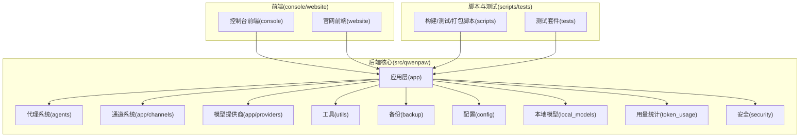
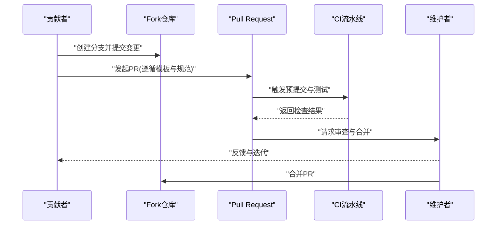
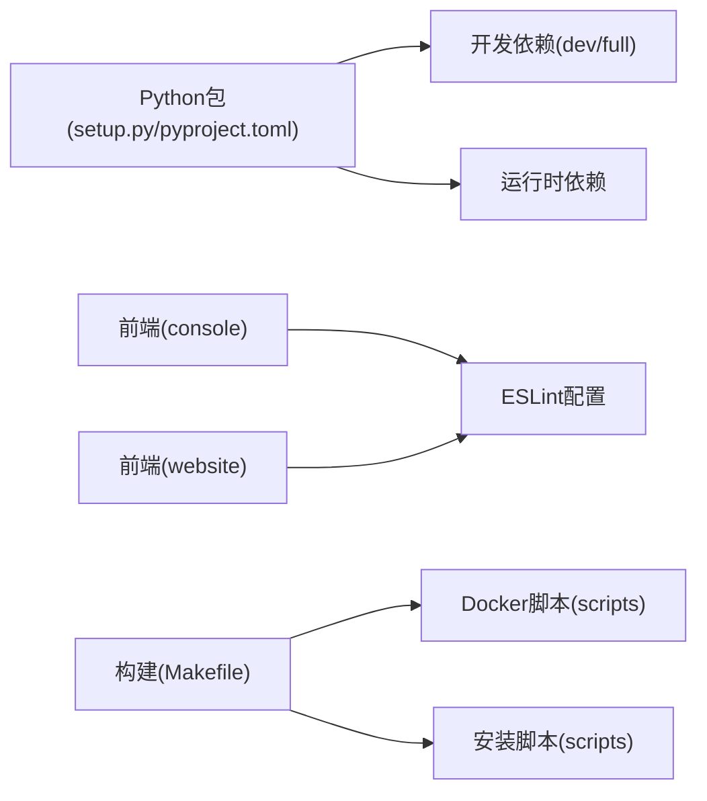

# 贡献指南

<cite>
**本文引用的文件**
- [CONTRIBUTING.md](file://CONTRIBUTING.md)
- [README.md](file://README.md)
- [.github/PULL_REQUEST_TEMPLATE.md](file://.github/PULL_REQUEST_TEMPLATE.md)
- [setup.py](file://setup.py)
- [pyproject.toml](file://pyproject.toml)
- [Makefile](file://Makefile)
- [console/eslint.config.js](file://console/eslint.config.js)
- [console/vite.config.ts](file://console/vite.config.ts)
- [website/vite.config.ts](file://website/vite.config.ts)
- [scripts/run_tests.py](file://scripts/run_tests.py)
- [scripts/check-channels.sh](file://scripts/check-channels.sh)
- [scripts/docker_build.sh](file://scripts/docker_build.sh)
- [scripts/docker_sync_latest.sh](file://scripts/docker_sync_latest.sh)
- [scripts/install.sh](file://scripts/install.sh)
- [scripts/install.ps1](file://scripts/install.ps1)
- [scripts/install.bat](file://scripts/install.bat)
- [tests/conftest.py](file://tests/conftest.py)
- [tests/unit/agents/test_session.py](file://tests/unit/agents/test_session.py)
- [tests/unit/channels/test_console.py](file://tests/unit/channels/test_console.py)
- [tests/contract/channels/test_console_contract.py](file://tests/contract/channels/test_console_contract.py)
- [tests/integration/test_app_startup.py](file://tests/integration/test_app_startup.py)
- [tests/integration/test_version.py](file://tests/integration/test_version.py)
- [src/qwenpaw/app/channels/base.py](file://src/qwenpaw/app/channels/base.py)
- [src/qwenpaw/app/channels/registry.py](file://src/qwenpaw/app/channels/registry.py)
- [src/qwenpaw/providers/provider_manager.py](file://src/qwenpaw/providers/provider_manager.py)
- [website/public/docs/contributing.zh.md](file://website/public/docs/contributing.zh.md)
</cite>

## 目录
1. [简介](#简介)
2. [项目结构](#项目结构)
3. [核心组件](#核心组件)
4. [架构总览](#架构总览)
5. [详细组件分析](#详细组件分析)
6. [依赖分析](#依赖分析)
7. [性能考虑](#性能考虑)
8. [故障排除指南](#故障排除指南)
9. [结论](#结论)
10. [附录](#附录)

## 简介
本贡献指南面向希望参与 QwenPaw 开源项目的开发者与社区成员，提供从开发环境搭建、代码规范、提交流程到测试与质量保障的完整指引。QwenPaw 是一个可本地或云端部署的个人智能助理，支持多通道接入、技能扩展、多代理协作与安全控制。我们鼓励通过新增模型/提供商、通道、技能以及改进文档与测试等方式共同推动项目发展。

## 项目结构
QwenPaw 采用前后端分离与多模块组织的结构：后端以 Python 包形式提供核心能力（应用、代理、通道、技能、工具等），前端由独立的 console 与 website 项目组成，脚本目录提供构建、测试与打包工具，tests 提供单元、集成与契约测试。

图示来源
- [README.md:440-461](file://README.md#L440-L461)
- [console/vite.config.ts](file://console/vite.config.ts)
- [website/vite.config.ts](file://website/vite.config.ts)

章节来源
- [README.md:440-461](file://README.md#L440-L461)

## 核心组件
- 应用层(app)：提供路由、运行器、工作区管理、定时任务、MCP 管理等核心服务。
- 代理系统(agents)：包含上下文管理、记忆、任务执行、工具与技能管理等。
- 通道系统(app/channels)：统一的通道协议与注册机制，支持多种即时通讯平台。
- 模型提供商(providers)：统一的提供商接口与管理器，支持云与本地模型。
- 前端控制台(console)：基于 Vite 的 Web UI，提供聊天、配置与可视化。
- 官网网站(website)：文档站点，承载用户文档与发布信息。
- 测试体系(tests)：覆盖单元、集成与契约测试，确保功能与兼容性。

章节来源
- [README.md:440-461](file://README.md#L440-L461)
- [CONTRIBUTING.md:95-111](file://CONTRIBUTING.md#L95-L111)
- [CONTRIBUTING.md:114-131](file://CONTRIBUTING.md#L114-L131)
- [CONTRIBUTING.md:134-147](file://CONTRIBUTING.md#L134-L147)

## 架构总览
下图展示贡献相关的关键交互：贡献者在本地完成代码修改与测试，通过 PR 提交，经由 CI 与预提交钩子检查，最终由维护者合并。

图示来源
- [CONTRIBUTING.md:23-67](file://CONTRIBUTING.md#L23-L67)
- [.github/PULL_REQUEST_TEMPLATE.md:1-62](file://.github/PULL_REQUEST_TEMPLATE.md#L1-L62)

章节来源
- [CONTRIBUTING.md:23-67](file://CONTRIBUTING.md#L23-L67)
- [.github/PULL_REQUEST_TEMPLATE.md:1-62](file://.github/PULL_REQUEST_TEMPLATE.md#L1-L62)

## 详细组件分析

### 开发环境搭建
- Python 环境
  - 使用 uv 作为包管理器，推荐通过脚本安装（自动检测并安装 uv）。
  - 支持 pip 安装与可编辑安装，便于本地开发。
- 前端环境
  - console 与 website 均使用 Vite，需先安装 Node.js 并执行构建。
  - 构建完成后将 console 输出复制到后端包中以便打包分发。
- 依赖安装
  - 开发依赖与全量依赖可通过可选组安装，满足测试与格式化需求。
- 安装脚本
  - 提供 macOS/Linux、Windows CMD/PowerShell 的一键安装脚本，自动处理 uv 与虚拟环境。

章节来源
- [README.md:132-185](file://README.md#L132-L185)
- [README.md:186-223](file://README.md#L186-L223)
- [README.md:228-273](file://README.md#L228-L273)
- [README.md:288-330](file://README.md#L288-L330)
- [README.md:439-461](file://README.md#L439-L461)
- [scripts/install.sh](file://scripts/install.sh)
- [scripts/install.ps1](file://scripts/install.ps1)
- [scripts/install.bat](file://scripts/install.bat)

### IDE 配置与开发工具
- Python 工具链
  - 使用 flake8 进行 Python 代码风格检查；通过 pre-commit 钩子在提交前自动运行。
  - 推荐在 IDE 中启用 Python LSP 与格式化工具，确保与仓库配置一致。
- 前端工具链
  - console 与 website 使用 ESLint 与 Vite，建议在 IDE 中启用 ESLint 与 TypeScript 支持。
  - 前端格式化命令需在相应目录执行，确保提交前一致性。
- Docker 开发
  - 提供 Docker 构建与同步脚本，便于在容器环境中复现问题与验证。

章节来源
- [CONTRIBUTING.md:70-86](file://CONTRIBUTING.md#L70-L86)
- [console/eslint.config.js](file://console/eslint.config.js)
- [console/vite.config.ts](file://console/vite.config.ts)
- [website/vite.config.ts](file://website/vite.config.ts)
- [scripts/docker_build.sh](file://scripts/docker_build.sh)
- [scripts/docker_sync_latest.sh](file://scripts/docker_sync_latest.sh)

### 代码规范与风格指南
- 提交信息格式
  - 遵循 Conventional Commits，类型包括 feat、fix、docs、style、refactor、perf、test、chore 等。
  - PR 标题格式与提交信息一致，保持简洁描述。
- 前端格式化
  - 变更涉及 console 或 website 目录时，需在对应目录执行格式化命令。
- 文档更新
  - 用户可见行为变更需同步更新文档，文档位于 website/public/docs/ 下。

章节来源
- [CONTRIBUTING.md:23-67](file://CONTRIBUTING.md#L23-L67)
- [CONTRIBUTING.md:80-86](file://CONTRIBUTING.md#L80-L86)

### 分支策略、提交与审查流程
- 分支策略
  - 建议基于主分支创建特性分支进行开发，避免在主分支直接提交。
- 提交信息与 PR 规范
  - 严格遵循提交信息与 PR 模板，填写相关组件影响范围、测试方法与验证证据。
  - 对于通道变更，需运行通道检查脚本并通过契约测试。
- CI 与预提交
  - PR 必须通过预提交检查与测试，失败的 PR 不具备合并条件。

章节来源
- [CONTRIBUTING.md:15-22](file://CONTRIBUTING.md#L15-L22)
- [.github/PULL_REQUEST_TEMPLATE.md:1-62](file://.github/PULL_REQUEST_TEMPLATE.md#L1-L62)
- [scripts/check-channels.sh](file://scripts/check-channels.sh)

### 测试要求与质量保障
- 测试类型
  - 单元测试：覆盖代理、通道、提供商、本地模型、工具等模块。
  - 集成测试：验证应用启动与版本信息等关键流程。
  - 契约测试：通道契约测试确保协议一致性与实现完整性。
- 运行方式
  - 使用 pytest 执行测试套件，支持集中式测试入口与按模块运行。
  - 通道变更需通过专用检查脚本与契约测试。
- 质量门禁
  - 本地必须通过 pre-commit 与 pytest 后方可提交或发起 PR。

章节来源
- [CONTRIBUTING.md:70-86](file://CONTRIBUTING.md#L70-L86)
- [scripts/run_tests.py](file://scripts/run_tests.py)
- [tests/unit/agents/test_session.py](file://tests/unit/agents/test_session.py)
- [tests/unit/channels/test_console.py](file://tests/unit/channels/test_console.py)
- [tests/contract/channels/test_console_contract.py](file://tests/contract/channels/test_console_contract.py)
- [tests/integration/test_app_startup.py](file://tests/integration/test_app_startup.py)
- [tests/integration/test_version.py](file://tests/integration/test_version.py)

### 新增模型/提供商贡献流程
- 兼容性要求
  - 优先支持与 OpenAI chat.completions 或 Anthropic messages API 兼容的提供商。
  - 建议提供 /model/list 端点以自动获取模型列表。
- 实现步骤
  - 在提供商管理器中注册新的 Provider 实例，并提供至少一个可测模型。
  - 更新文档与截图，必要时预设模型能力标签。
- PR 要求
  - 至少包含一个已测试模型与连接测试截图。
  - 更新网站文档中的提供商列表与配置说明。

章节来源
- [CONTRIBUTING.md:95-111](file://CONTRIBUTING.md#L95-L111)

### 新增通道贡献流程
- 协议与实现
  - 统一的通道协议：原生负载 → content_parts → AgentRequest → 回复发送。
  - 实现 BaseChannel 子类，设置唯一 channel 键，实现生命周期与消息处理。
- 注册与发现
  - 内置通道在注册表中注册；自定义通道从工作目录加载。
- CLI 支持
  - 通过 qwenpaw channels 命令安装、添加、移除与配置通道。
- 文档与契约
  - 新通道需补充文档并在网站文档中记录认证、Webhook 等细节。
  - 通道契约测试需覆盖初始化与 19 个验证点。

章节来源
- [CONTRIBUTING.md:114-131](file://CONTRIBUTING.md#L114-L131)
- [src/qwenpaw/app/channels/base.py](file://src/qwenpaw/app/channels/base.py)
- [src/qwenpaw/app/channels/registry.py](file://src/qwenpaw/app/channels/registry.py)

### 新增基础技能贡献流程
- 结构与内容
  - 技能为目录结构，包含 SKILL.md（至少包含 name 与 description）、可选 references 与 scripts。
  - 内置技能位于 agents/skills/<skill_name>/，内置与自定义技能合并为 active_skills。
- 描述编写最佳实践
  - 明确触发时机与关键词，具体描述技能范围，提供使用示例。
- 文档同步
  - 在网站文档中添加简要条目并确保同步到工作目录。

章节来源
- [CONTRIBUTING.md:134-147](file://CONTRIBUTING.md#L134-L147)

### 平台支持与兼容性
- 跨平台目标
  - 支持 Windows、Linux、macOS，关注路径处理、换行符、Shell 命令与依赖差异。
- 安装与运行
  - 一行安装脚本、pip 安装与 qwenpaw init/app 应在各平台可用。
- 文档与测试
  - 在 PR 中测试并说明受影响平台，文档中记录已知限制与推荐配置。

章节来源
- [CONTRIBUTING.md:186-196](file://CONTRIBUTING.md#L186-L196)

### 其他贡献方向
- MCP（模型上下文协议）：支持运行时 MCP 工具发现与热插拔。
- 文档：修复与改进官网文档与 README。
- 缺陷修复与重构：小改动优先，大改动建议先开 issue 讨论。
- 示例与工作流：提供教程或示例（如“每日摘要到钉钉”、“本地模型 + 定时任务”）。

章节来源
- [CONTRIBUTING.md:199-206](file://CONTRIBUTING.md#L199-L206)

### 社区参与与问题报告
- 讨论渠道
  - GitHub Discussions、Issues、社区群组与 Discord。
- 问题报告
  - 使用标准模板，提供复现步骤、期望与实际结果、环境信息与日志。
- 行为准则
  - 尊重与建设性的交流，遵守欢迎的社区行为准则。

章节来源
- [CONTRIBUTING.md:229-236](file://CONTRIBUTING.md#L229-L236)

## 依赖分析
- Python 依赖
  - setup.py 与 pyproject.toml 定义核心与可选依赖，开发与全量依赖用于测试与格式化。
- 前端依赖
  - console 与 website 使用 Vite 与相关生态，ESLint 用于前端代码风格。
- 构建与打包
  - Makefile 提供常用构建目标，脚本目录提供 Docker 构建与同步、安装脚本等。

图示来源
- [setup.py](file://setup.py)
- [pyproject.toml](file://pyproject.toml)
- [Makefile](file://Makefile)
- [console/eslint.config.js](file://console/eslint.config.js)
- [scripts/docker_build.sh](file://scripts/docker_build.sh)
- [scripts/install.sh](file://scripts/install.sh)

章节来源
- [setup.py](file://setup.py)
- [pyproject.toml](file://pyproject.toml)
- [Makefile](file://Makefile)

## 性能考虑
- 启动与构建
  - 前端构建需在 console 目录执行，构建产物复制到后端包中，避免重复下载与构建。
- Docker 环境
  - 使用 host.docker.internal 或 host 网络模式访问宿主机服务，减少网络延迟。
- 本地模型
  - 优先使用 llama.cpp、Ollama 或 LM Studio，减少网络往返与 API 调用开销。

章节来源
- [README.md:245-271](file://README.md#L245-L271)
- [README.md:347-356](file://README.md#L347-L356)

## 故障排除指南
- 预提交失败
  - 若被自动修复，请提交修复后的文件并重新运行检查，直至通过。
- 测试失败
  - 使用 pytest 运行单模块测试定位问题，结合契约测试与通道检查脚本排查。
- 前端格式化
  - 变更涉及 console 或 website 时，务必在对应目录执行格式化命令。
- 安装问题
  - Windows 企业版受限语言模式可能导致脚本无法写入环境变量，需手动配置 PATH。

章节来源
- [CONTRIBUTING.md:70-86](file://CONTRIBUTING.md#L70-L86)
- [scripts/check-channels.sh](file://scripts/check-channels.sh)
- [scripts/install.bat](file://scripts/install.bat)
- [scripts/install.ps1](file://scripts/install.ps1)

## 结论
通过本贡献指南，新贡献者可以快速搭建开发环境、理解代码规范与提交流程、掌握测试与质量保障要求，并在模型/提供商、通道、技能等方向上开展高质量贡献。我们期待与您一起推动 QwenPaw 的持续演进与生态繁荣。

## 附录
- 相关文档
  - 官方文档与贡献指南（中文）
    - [website/public/docs/contributing.zh.md](file://website/public/docs/contributing.zh.md)
- 关键文件索引
  - 贡献指南与规范：[CONTRIBUTING.md](file://CONTRIBUTING.md)
  - 项目总览与安装：[README.md](file://README.md)
  - PR 模板：[.github/PULL_REQUEST_TEMPLATE.md](file://.github/PULL_REQUEST_TEMPLATE.md)
  - 依赖与构建：[setup.py](file://setup.py)、[pyproject.toml](file://pyproject.toml)、[Makefile](file://Makefile)
  - 前端工具链：[console/eslint.config.js](file://console/eslint.config.js)、[console/vite.config.ts](file://console/vite.config.ts)、[website/vite.config.ts](file://website/vite.config.ts)
  - 测试与脚本：[scripts/run_tests.py](file://scripts/run_tests.py)、[scripts/check-channels.sh](file://scripts/check-channels.sh)、[scripts/docker_build.sh](file://scripts/docker_build.sh)、[scripts/docker_sync_latest.sh](file://scripts/docker_sync_latest.sh)
  - 通道基类与注册：[src/qwenpaw/app/channels/base.py](file://src/qwenpaw/app/channels/base.py)、[src/qwenpaw/app/channels/registry.py](file://src/qwenpaw/app/channels/registry.py)
  - 提供商管理：[src/qwenpaw/providers/provider_manager.py](file://src/qwenpaw/providers/provider_manager.py)