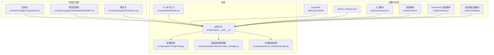
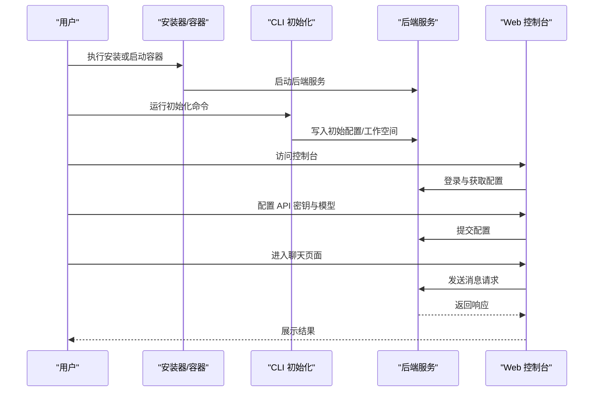
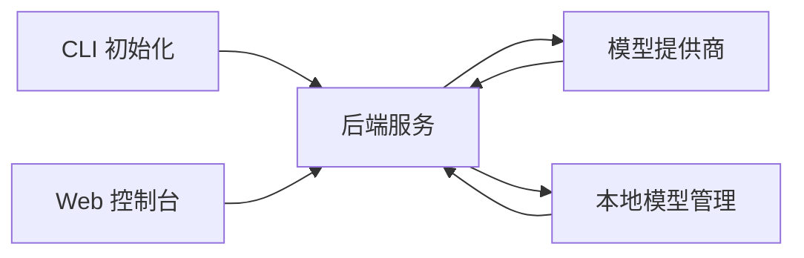

# 快速开始

<cite>
**本文引用的文件**
- [README.md](file://README.md)
- [scripts/install.sh](file://scripts/install.sh)
- [scripts/install.ps1](file://scripts/install.ps1)
- [scripts/install.bat](file://scripts/install.bat)
- [deploy/Dockerfile](file://deploy/Dockerfile)
- [docker-compose.yml](file://docker-compose.yml)
- [deploy/entrypoint.sh](file://deploy/entrypoint.sh)
- [src/qwenpaw/cli/main.py](file://src/qwenpaw/cli/main.py)
- [src/qwenpaw/cli/init_cmd.py](file://src/qwenpaw/cli/init_cmd.py)
- [src/qwenpaw/__main__.py](file://src/qwenpaw/__main__.py)
- [src/qwenpaw/config/config.py](file://src/qwenpaw/config/config.py)
- [src/qwenpaw/providers/provider_manager.py](file://src/qwenpaw/providers/provider_manager.py)
- [src/qwenpaw/local_models/manager.py](file://src/qwenpaw/local_models/manager.py)
- [console/src/pages/Login/index.tsx](file://console/src/pages/Login/index.tsx)
- [console/src/pages/Settings/Models/index.tsx](file://console/src/pages/Settings/Models/index.tsx)
- [console/src/pages/Chat/index.tsx](file://console/src/pages/Chat/index.tsx)
- [website/public/docs/quickstart.en.md](file://website/public/docs/quickstart.en.md)
- [website/public/docs/console.en.md](file://website/public/docs/console.en.md)
</cite>

## 目录
1. [简介](#简介)
2. [项目结构](#项目结构)
3. [核心组件](#核心组件)
4. [架构总览](#架构总览)
5. [详细组件分析](#详细组件分析)
6. [依赖分析](#依赖分析)
7. [性能考虑](#性能考虑)
8. [故障排除指南](#故障排除指南)
9. [结论](#结论)
10. [附录](#附录)

## 简介
本快速开始指南面向首次接触 QwenPaw 的用户，帮助你在 Windows、macOS、Linux 等主流操作系统上完成安装与首次运行配置，并提供 Web 控制台的快速上手教程。你将学会：
- 多种安装方式：pip 安装、脚本安装、Docker 部署、桌面应用安装
- 首次运行的初始化设置：API 密钥配置、模型选择、工作空间初始化
- 常见问题排查与解决方案
- 启动后基本使用示例与控制台操作

## 项目结构
QwenPaw 是一个基于 Python 的多通道智能体平台，包含后端服务、Web 控制台前端、CLI 工具以及 Docker 部署支持。核心模块包括：
- 后端服务：提供代理、技能、工具、通道、定时任务等功能
- Web 控制台：提供图形化界面进行配置与管理
- CLI 工具：提供命令行初始化、更新、守护进程等能力
- Docker 部署：提供容器化一键部署方案

**图表来源**
- [src/qwenpaw/cli/main.py](file://src/qwenpaw/cli/main.py)
- [src/qwenpaw/__main__.py](file://src/qwenpaw/__main__.py)
- [src/qwenpaw/config/config.py](file://src/qwenpaw/config/config.py)
- [src/qwenpaw/providers/provider_manager.py](file://src/qwenpaw/providers/provider_manager.py)
- [src/qwenpaw/local_models/manager.py](file://src/qwenpaw/local_models/manager.py)
- [console/src/pages/Login/index.tsx](file://console/src/pages/Login/index.tsx)
- [console/src/pages/Settings/Models/index.tsx](file://console/src/pages/Settings/Models/index.tsx)
- [console/src/pages/Chat/index.tsx](file://console/src/pages/Chat/index.tsx)
- [deploy/Dockerfile](file://deploy/Dockerfile)
- [docker-compose.yml](file://docker-compose.yml)
- [deploy/entrypoint.sh](file://deploy/entrypoint.sh)
- [scripts/install.sh](file://scripts/install.sh)
- [scripts/install.ps1](file://scripts/install.ps1)
- [scripts/install.bat](file://scripts/install.bat)

**章节来源**
- [README.md](file://README.md)
- [src/qwenpaw/cli/main.py](file://src/qwenpaw/cli/main.py)
- [src/qwenpaw/__main__.py](file://src/qwenpaw/__main__.py)

## 核心组件
- CLI 初始化与守护：通过命令行初始化配置并启动后台服务，便于自动化与集成
- 配置系统：集中管理运行时配置，支持环境变量与配置文件合并
- 模型提供商：统一接入多家大模型服务，支持 OpenAI、Anthropic、Google Gemini 等
- 本地模型：支持 llama.cpp 后端的本地推理模型下载与管理
- Web 控制台：提供登录、模型配置、聊天对话等图形化界面

**章节来源**
- [src/qwenpaw/cli/init_cmd.py](file://src/qwenpaw/cli/init_cmd.py)
- [src/qwenpaw/config/config.py](file://src/qwenpaw/config/config.py)
- [src/qwenpaw/providers/provider_manager.py](file://src/qwenpaw/providers/provider_manager.py)
- [src/qwenpaw/local_models/manager.py](file://src/qwenpaw/local_models/manager.py)

## 架构总览
下图展示了从安装到首次运行的关键流程：安装脚本或 Docker 引导后端服务，CLI 初始化配置，随后通过 Web 控制台进行 API 密钥与模型配置，最终进入聊天会话。

**图表来源**
- [scripts/install.sh](file://scripts/install.sh)
- [deploy/Dockerfile](file://deploy/Dockerfile)
- [src/qwenpaw/cli/init_cmd.py](file://src/qwenpaw/cli/init_cmd.py)
- [src/qwenpaw/__main__.py](file://src/qwenpaw/__main__.py)
- [console/src/pages/Login/index.tsx](file://console/src/pages/Login/index.tsx)
- [console/src/pages/Settings/Models/index.tsx](file://console/src/pages/Settings/Models/index.tsx)
- [console/src/pages/Chat/index.tsx](file://console/src/pages/Chat/index.tsx)

## 详细组件分析

### 安装方式与步骤

#### pip 安装（推荐）
- 在目标环境中安装 Python 3.9+ 并确保网络可访问 PyPI
- 使用包管理器安装项目主包，安装完成后可通过命令行入口启动服务
- 安装后建议立即执行初始化命令生成默认配置与工作空间

**章节来源**
- [README.md](file://README.md)
- [src/qwenpaw/cli/main.py](file://src/qwenpaw/cli/main.py)

#### 脚本安装（Windows/macOS/Linux）
- Windows：提供 PowerShell 与批处理脚本，自动检测依赖并安装
- macOS/Linux：提供 Bash 脚本，支持交互式安装与依赖检查
- 脚本安装会根据系统环境自动配置运行所需的依赖项

**章节来源**
- [scripts/install.ps1](file://scripts/install.ps1)
- [scripts/install.bat](file://scripts/install.bat)
- [scripts/install.sh](file://scripts/install.sh)

#### Docker 部署
- 使用提供的 Dockerfile 构建镜像，或直接使用官方镜像
- 使用 docker-compose 编排服务，一键启动后端与控制台
- 容器启动后，通过浏览器访问控制台进行首次配置

**章节来源**
- [deploy/Dockerfile](file://deploy/Dockerfile)
- [docker-compose.yml](file://docker-compose.yml)
- [deploy/entrypoint.sh](file://deploy/entrypoint.sh)

#### 桌面应用安装
- 仓库提供打包脚本与构建模板，可用于生成跨平台桌面应用
- 桌面应用本质仍基于后端服务与 Web 控制台，安装后按首次运行流程配置

**章节来源**
- [scripts/pack/build_win.ps1](file://scripts/pack/build_win.ps1)
- [scripts/pack/build_macos.sh](file://scripts/pack/build_macos.sh)
- [scripts/pack/desktop.nsi](file://scripts/pack/desktop.nsi)

### 首次运行配置流程

#### 初始化设置
- 运行初始化命令，系统将创建默认配置文件与工作空间目录
- 初始化过程会生成必要的权限与默认代理配置，确保后续功能可用

**章节来源**
- [src/qwenpaw/cli/init_cmd.py](file://src/qwenpaw/cli/init_cmd.py)
- [src/qwenpaw/__main__.py](file://src/qwenpaw/__main__.py)

#### API 密钥配置
- 在控制台“设置/模型”页面中添加或切换模型提供商
- 输入对应提供商的 API 密钥，保存后系统将进行连通性测试
- 若测试失败，请检查网络与密钥有效性

**章节来源**
- [console/src/pages/Settings/Models/index.tsx](file://console/src/pages/Settings/Models/index.tsx)
- [src/qwenpaw/providers/provider_manager.py](file://src/qwenpaw/providers/provider_manager.py)

#### 模型选择
- 支持在线模型（通过提供商接口）与本地模型（llama.cpp）
- 在线模型需配置相应提供商；本地模型可直接下载与管理

**章节来源**
- [src/qwenpaw/local_models/manager.py](file://src/qwenpaw/local_models/manager.py)
- [console/src/pages/Settings/Models/index.tsx](file://console/src/pages/Settings/Models/index.tsx)

#### 登录与工作空间
- 首次访问控制台需要登录，登录成功后可进入工作空间进行配置
- 控制台提供多语言支持，可根据需要切换界面语言

**章节来源**
- [console/src/pages/Login/index.tsx](file://console/src/pages/Login/index.tsx)
- [console/src/pages/Settings/Models/index.tsx](file://console/src/pages/Settings/Models/index.tsx)

### Web 控制台快速上手

#### 登录与导航
- 访问控制台首页，输入凭据登录
- 通过侧边栏导航至“聊天”、“设置”、“技能”等模块

**章节来源**
- [console/src/pages/Login/index.tsx](file://console/src/pages/Login/index.tsx)
- [console/src/pages/Chat/index.tsx](file://console/src/pages/Chat/index.tsx)

#### 基本使用示例
- 在聊天页发起对话，选择已配置的模型与代理
- 查看响应与上下文历史，必要时调整参数或切换模型

**章节来源**
- [console/src/pages/Chat/index.tsx](file://console/src/pages/Chat/index.tsx)

## 依赖分析
- 组件耦合：CLI 与后端服务紧密耦合，负责初始化与守护；控制台通过 HTTP 接口与后端通信
- 外部依赖：模型提供商（OpenAI、Anthropic、Google Gemini 等）、本地模型（llama.cpp）、数据库与缓存
- 可能的循环依赖：当前结构以 CLI 与控制台为入口，后端服务为核心，未发现明显循环依赖

**图表来源**
- [src/qwenpaw/cli/main.py](file://src/qwenpaw/cli/main.py)
- [src/qwenpaw/__main__.py](file://src/qwenpaw/__main__.py)
- [src/qwenpaw/providers/provider_manager.py](file://src/qwenpaw/providers/provider_manager.py)
- [src/qwenpaw/local_models/manager.py](file://src/qwenpaw/local_models/manager.py)

**章节来源**
- [src/qwenpaw/cli/main.py](file://src/qwenpaw/cli/main.py)
- [src/qwenpaw/providers/provider_manager.py](file://src/qwenpaw/providers/provider_manager.py)
- [src/qwenpaw/local_models/manager.py](file://src/qwenpaw/local_models/manager.py)

## 性能考虑
- 本地模型推理受硬件限制，建议在具备足够内存与显卡资源的设备上运行
- 在线模型调用受网络与提供商限流影响，建议合理配置并发与重试策略
- 控制台前端资源占用与渲染性能取决于浏览器与网络状况

## 故障排除指南
- 安装失败或依赖缺失
  - 检查 Python 版本与网络连通性
  - 使用脚本安装器自动修复依赖
- Docker 启动异常
  - 确认端口未被占用，查看容器日志定位错误
  - 使用 compose 文件中的环境变量与挂载卷配置
- 控制台无法登录或配置无效
  - 确认初始化已完成且配置文件存在
  - 检查 API 密钥格式与提供商可用性
- 本地模型无法加载
  - 确认模型文件完整性与路径正确
  - 检查系统架构与二进制兼容性

**章节来源**
- [scripts/install.sh](file://scripts/install.sh)
- [scripts/install.ps1](file://scripts/install.ps1)
- [scripts/install.bat](file://scripts/install.bat)
- [deploy/Dockerfile](file://deploy/Dockerfile)
- [docker-compose.yml](file://docker-compose.yml)
- [deploy/entrypoint.sh](file://deploy/entrypoint.sh)
- [src/qwenpaw/cli/init_cmd.py](file://src/qwenpaw/cli/init_cmd.py)
- [src/qwenpaw/providers/provider_manager.py](file://src/qwenpaw/providers/provider_manager.py)
- [src/qwenpaw/local_models/manager.py](file://src/qwenpaw/local_models/manager.py)

## 结论
通过本快速开始指南，你可以在多种平台上完成 QwenPaw 的安装与首次运行配置，并利用 Web 控制台进行日常管理与使用。若遇到问题，可参考故障排除章节逐步定位与解决。随着对系统的深入使用，建议进一步探索 CLI 命令、技能扩展与多通道集成能力。

## 附录
- 更多文档与教程请参阅网站文档目录
- 快速开始与控制台使用指南可在网站文档中找到英文版本

**章节来源**
- [website/public/docs/quickstart.en.md](file://website/public/docs/quickstart.en.md)
- [website/public/docs/console.en.md](file://website/public/docs/console.en.md)