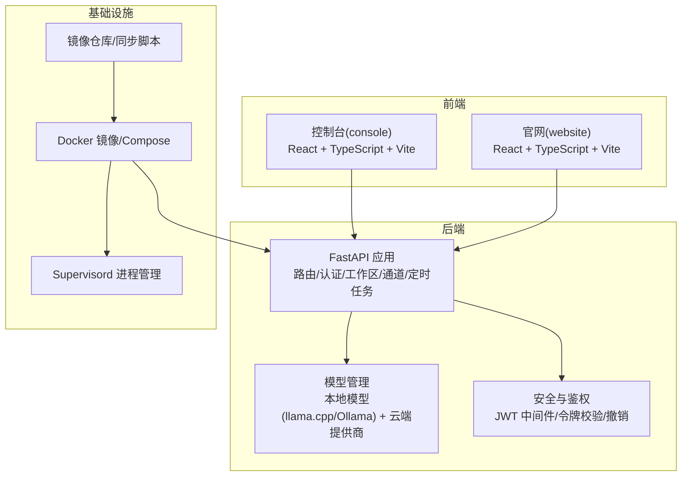
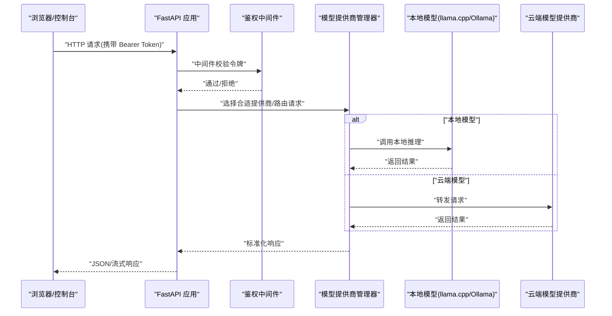
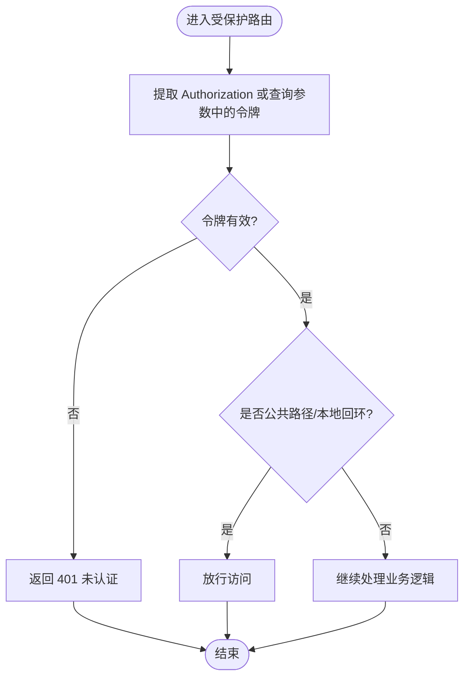
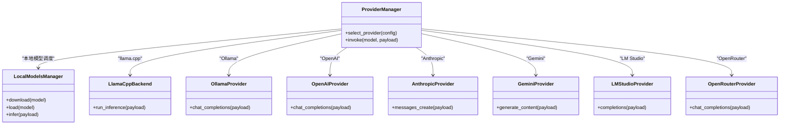
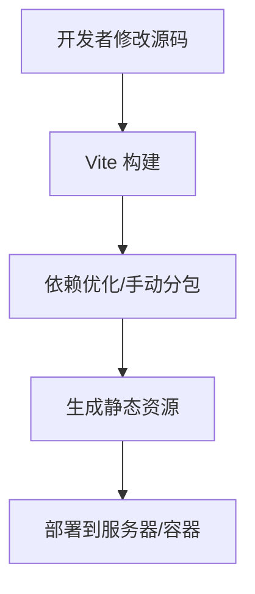
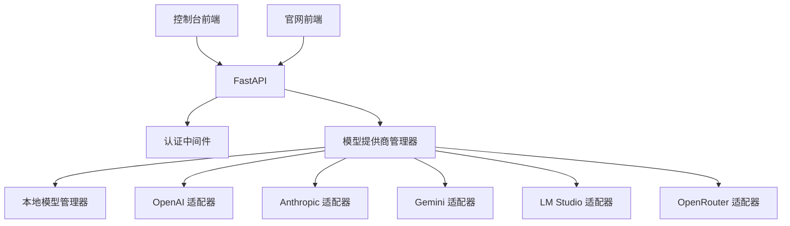

# 技术栈

<cite>
**本文引用的文件**
- [pyproject.toml](file://pyproject.toml)
- [docker-compose.yml](file://docker-compose.yml)
- [deploy/Dockerfile](file://deploy/Dockerfile)
- [deploy/config/supervisord.conf.template](file://deploy/config/supervisord.conf.template)
- [deploy/entrypoint.sh](file://deploy/entrypoint.sh)
- [console/package.json](file://console/package.json)
- [console/vite.config.ts](file://console/vite.config.ts)
- [website/package.json](file://website/package.json)
- [website/vite.config.ts](file://website/vite.config.ts)
- [website/tsconfig.json](file://website/tsconfig.json)
- [src/qwenpaw/app/routers/auth.py](file://src/qwenpaw/app/routers/auth.py)
- [src/qwenpaw/app/auth.py](file://src/qwenpaw/app/auth.py)
- [src/qwenpaw/providers/provider_manager.py](file://src/qwenpaw/providers/provider_manager.py)
- [src/qwenpaw/local_models/manager.py](file://src/qwenpaw/local_models/manager.py)
- [src/qwenpaw/local_models/llamacpp.py](file://src/qwenpaw/local_models/llamacpp.py)
- [src/qwenpaw/providers/ollama_provider.py](file://src/qwenpaw/providers/ollama_provider.py)
- [src/qwenpaw/providers/openai_provider.py](file://src/qwenpaw/providers/openai_provider.py)
- [src/qwenpaw/providers/anthropic_provider.py](file://src/qwenpaw/providers/anthropic_provider.py)
- [src/qwenpaw/providers/gemini_provider.py](file://src/qwenpaw/providers/gemini_provider.py)
- [src/qwenpaw/providers/lmstudio_provider.py](file://src/qwenpaw/providers/lmstudio_provider.py)
- [src/qwenpaw/providers/openrouter_provider.py](file://src/qwenpaw/providers/openrouter_provider.py)
- [scripts/docker_build.sh](file://scripts/docker_build.sh)
- [scripts/docker_sync_latest.sh](file://scripts/docker_sync_latest.sh)
- [scripts/install.sh](file://scripts/install.sh)
- [scripts/install.bat](file://scripts/install.bat)
- [scripts/install.ps1](file://scripts/install.ps1)
- [scripts/website_build.sh](file://scripts/website_build.sh)
- [scripts/check-channels.sh](file://scripts/check-channels.sh)
- [scripts/check_channel_contracts.py](file://scripts/check_channel_contracts.py)
- [scripts/run_tests.py](file://scripts/run_tests.py)
- [Makefile](file://Makefile)
</cite>

## 目录
1. [简介](#简介)
2. [项目结构](#项目结构)
3. [核心组件](#核心组件)
4. [架构总览](#架构总览)
5. [详细组件分析](#详细组件分析)
6. [依赖关系分析](#依赖关系分析)
7. [性能考量](#性能考量)
8. [故障排查指南](#故障排查指南)
9. [结论](#结论)
10. [附录](#附录)

## 简介
本文件为 QwenPaw 的技术栈概览文档，面向后端、前端、容器化与部署、模型集成以及开发工具链进行系统性梳理，并给出技术选型理由与替代方案对比，帮助读者快速理解并高效参与开发与运维。

## 项目结构
QwenPaw 采用前后端分离架构：后端以 Python 为核心，基于 FastAPI 提供 REST/WS 接口；前端包含控制台与官网两套应用，分别使用 React + TypeScript + Vite 进行构建；容器化与部署通过 Docker、Docker Compose 与 Supervisord 协同实现；模型集成覆盖本地 llama.cpp/Ollama 与多家云端模型提供商。



图表来源
- [console/vite.config.ts:1-47](file://console/vite.config.ts#L1-L47)
- [website/vite.config.ts:1-47](file://website/vite.config.ts#L1-L47)
- [src/qwenpaw/app/routers/auth.py:1-63](file://src/qwenpaw/app/routers/auth.py#L1-L63)
- [src/qwenpaw/app/auth.py:567-636](file://src/qwenpaw/app/auth.py#L567-L636)
- [deploy/Dockerfile](file://deploy/Dockerfile)
- [deploy/config/supervisord.conf.template](file://deploy/config/supervisord.conf.template)
- [scripts/docker_build.sh](file://scripts/docker_build.sh)
- [scripts/docker_sync_latest.sh](file://scripts/docker_sync_latest.sh)

章节来源
- [console/package.json](file://console/package.json)
- [website/package.json](file://website/package.json)
- [pyproject.toml](file://pyproject.toml)

## 核心组件
- 后端语言与框架
  - Python 版本与包管理：通过项目配置文件定义运行时与依赖管理策略。
  - Web 框架：FastAPI，提供类型安全的接口与自动 OpenAPI 文档。
- 数据库与存储
  - 代码中未发现显式数据库驱动或 ORM 引入，系统主要依赖文件系统与内存状态管理，结合环境变量与配置文件进行持久化。
- 消息队列
  - 未在代码中发现专用的消息队列组件或 AMQP/Kafka 客户端，系统通过同步接口与后台任务调度实现异步能力。
- 前端技术栈
  - 控制台与官网均采用 React + TypeScript + Vite，具备现代化开发体验与按需打包能力。
- 容器化与部署
  - Dockerfile 定义镜像构建；Docker Compose 编排服务；Supervisord 负责进程生命周期管理；提供镜像构建与同步脚本。
- 模型集成
  - 本地模型：llama.cpp 与 Ollama 管理器；云端模型：OpenAI、Anthropic、Gemini、LM Studio、OpenRouter 等提供商适配器。
- 开发工具链与构建流程
  - 前端：Vite 构建、依赖优化与分包；后端：Python 包管理与测试脚本；提供一键安装脚本与网站构建脚本。

章节来源
- [pyproject.toml](file://pyproject.toml)
- [console/vite.config.ts:1-47](file://console/vite.config.ts#L1-L47)
- [website/vite.config.ts:1-47](file://website/vite.config.ts#L1-L47)
- [deploy/Dockerfile](file://deploy/Dockerfile)
- [deploy/config/supervisord.conf.template](file://deploy/config/supervisord.conf.template)
- [scripts/docker_build.sh](file://scripts/docker_build.sh)
- [scripts/docker_sync_latest.sh](file://scripts/docker_sync_latest.sh)
- [scripts/install.sh](file://scripts/install.sh)
- [scripts/install.bat](file://scripts/install.bat)
- [scripts/install.ps1](file://scripts/install.ps1)
- [scripts/website_build.sh](file://scripts/website_build.sh)

## 架构总览
下图展示从浏览器到后端 API，再到模型提供方的整体调用路径与鉴权流程。



图表来源
- [src/qwenpaw/app/routers/auth.py:1-63](file://src/qwenpaw/app/routers/auth.py#L1-L63)
- [src/qwenpaw/app/auth.py:567-636](file://src/qwenpaw/app/auth.py#L567-L636)
- [src/qwenpaw/providers/provider_manager.py](file://src/qwenpaw/providers/provider_manager.py)
- [src/qwenpaw/local_models/manager.py](file://src/qwenpaw/local_models/manager.py)
- [src/qwenpaw/local_models/llamacpp.py](file://src/qwenpaw/local_models/llamacpp.py)
- [src/qwenpaw/providers/ollama_provider.py](file://src/qwenpaw/providers/ollama_provider.py)

## 详细组件分析

### 后端框架与认证
- FastAPI 路由与认证
  - 认证路由模块提供登录、注册、令牌校验与撤销等接口，配合中间件对受保护路径进行统一鉴权。
  - 中间件支持从 Authorization 头或查询参数提取 Bearer 令牌，并对公共路径与本地回环地址放行。
- 令牌策略
  - 支持可配置过期时间与永久令牌；提供批量撤销令牌机制，通过轮换 JWT 密钥实现强制失效。



图表来源
- [src/qwenpaw/app/routers/auth.py:49-63](file://src/qwenpaw/app/routers/auth.py#L49-L63)
- [src/qwenpaw/app/auth.py:567-636](file://src/qwenpaw/app/auth.py#L567-L636)

章节来源
- [src/qwenpaw/app/routers/auth.py:1-63](file://src/qwenpaw/app/routers/auth.py#L1-L63)
- [src/qwenpaw/app/auth.py:526-636](file://src/qwenpaw/app/auth.py#L526-L636)

### 模型集成组件
- 本地模型
  - llama.cpp 与 Ollama 提供本地推理能力，通过管理器封装下载、加载与推理接口。
- 云端模型提供商
  - 提供 OpenAI、Anthropic、Gemini、LM Studio、OpenRouter 等适配器，统一抽象为 Provider 接口，便于扩展与切换。
- 模型管理器
  - 统一调度本地与云端模型，负责模型选择、参数传递与结果聚合。



图表来源
- [src/qwenpaw/providers/provider_manager.py](file://src/qwenpaw/providers/provider_manager.py)
- [src/qwenpaw/local_models/manager.py](file://src/qwenpaw/local_models/manager.py)
- [src/qwenpaw/local_models/llamacpp.py](file://src/qwenpaw/local_models/llamacpp.py)
- [src/qwenpaw/providers/ollama_provider.py](file://src/qwenpaw/providers/ollama_provider.py)
- [src/qwenpaw/providers/openai_provider.py](file://src/qwenpaw/providers/openai_provider.py)
- [src/qwenpaw/providers/anthropic_provider.py](file://src/qwenpaw/providers/anthropic_provider.py)
- [src/qwenpaw/providers/gemini_provider.py](file://src/qwenpaw/providers/gemini_provider.py)
- [src/qwenpaw/providers/lmstudio_provider.py](file://src/qwenpaw/providers/lmstudio_provider.py)
- [src/qwenpaw/providers/openrouter_provider.py](file://src/qwenpaw/providers/openrouter_provider.py)

章节来源
- [src/qwenpaw/local_models/manager.py](file://src/qwenpaw/local_models/manager.py)
- [src/qwenpaw/local_models/llamacpp.py](file://src/qwenpaw/local_models/llamacpp.py)
- [src/qwenpaw/providers/ollama_provider.py](file://src/qwenpaw/providers/ollama_provider.py)
- [src/qwenpaw/providers/openai_provider.py](file://src/qwenpaw/providers/openai_provider.py)
- [src/qwenpaw/providers/anthropic_provider.py](file://src/qwenpaw/providers/anthropic_provider.py)
- [src/qwenpaw/providers/gemini_provider.py](file://src/qwenpaw/providers/gemini_provider.py)
- [src/qwenpaw/providers/lmstudio_provider.py](file://src/qwenpaw/providers/lmstudio_provider.py)
- [src/qwenpaw/providers/openrouter_provider.py](file://src/qwenpaw/providers/openrouter_provider.py)

### 前端技术栈与构建
- 控制台(console)
  - 使用 React + TypeScript + Vite，配置包含插件、别名、基础路径与手动分包策略，优化常用依赖预构建。
- 官网(website)
  - 同样采用 React + TypeScript + Vite，具备 TailwindCSS、i18n、Markdown 渲染等生态集成。
- 类型与编译
  - tsconfig 明确目标、严格模式与模块解析策略，确保类型安全与模块解析一致性。



图表来源
- [console/vite.config.ts:1-47](file://console/vite.config.ts#L1-L47)
- [website/vite.config.ts:1-47](file://website/vite.config.ts#L1-L47)
- [website/tsconfig.json:1-25](file://website/tsconfig.json#L1-L25)

章节来源
- [console/package.json](file://console/package.json)
- [console/vite.config.ts:1-47](file://console/vite.config.ts#L1-L47)
- [website/package.json](file://website/package.json)
- [website/vite.config.ts:1-47](file://website/vite.config.ts#L1-L47)
- [website/tsconfig.json:1-25](file://website/tsconfig.json#L1-L25)

### 容器化与部署
- Docker 镜像
  - Dockerfile 定义基础镜像、工作目录、依赖安装与入口命令。
- Docker Compose
  - 通过 compose 文件编排后端服务与其他依赖项。
- Supervisord
  - 使用模板配置进程管理，保证主进程稳定重启与日志输出。
- 构建与同步
  - 提供镜像构建脚本与 latest 标签同步脚本，便于 CI/CD 流水线集成。
- 入口脚本
  - entrypoint.sh 负责初始化环境与启动命令。

```mermaid
graph LR
SRC["源代码"] --> DF["Dockerfile"]
DF --> IMG["镜像"]
IMG --> DC["Docker Compose"]
DC --> SVC["服务容器"]
SVC --> SD["Supervisord 进程管理"]
REG["镜像仓库"] <- --> IMG
```

图表来源
- [deploy/Dockerfile](file://deploy/Dockerfile)
- [docker-compose.yml](file://docker-compose.yml)
- [deploy/config/supervisord.conf.template](file://deploy/config/supervisord.conf.template)
- [deploy/entrypoint.sh](file://deploy/entrypoint.sh)
- [scripts/docker_build.sh](file://scripts/docker_build.sh)
- [scripts/docker_sync_latest.sh](file://scripts/docker_sync_latest.sh)

章节来源
- [deploy/Dockerfile](file://deploy/Dockerfile)
- [docker-compose.yml](file://docker-compose.yml)
- [deploy/config/supervisord.conf.template](file://deploy/config/supervisord.conf.template)
- [deploy/entrypoint.sh](file://deploy/entrypoint.sh)
- [scripts/docker_build.sh](file://scripts/docker_build.sh)
- [scripts/docker_sync_latest.sh](file://scripts/docker_sync_latest.sh)

### 开发工具链与构建流程
- 后端
  - 通过包管理与测试脚本组织单元/集成/契约测试，支持多平台安装脚本与桌面打包脚本。
- 前端
  - Vite 提供热更新与生产构建；网站构建脚本用于生成静态站点。
- 通用
  - Makefile 提供常用命令聚合；检查脚本用于通道兼容性与合约验证。

章节来源
- [scripts/run_tests.py](file://scripts/run_tests.py)
- [scripts/install.sh](file://scripts/install.sh)
- [scripts/install.bat](file://scripts/install.bat)
- [scripts/install.ps1](file://scripts/install.ps1)
- [scripts/website_build.sh](file://scripts/website_build.sh)
- [scripts/check-channels.sh](file://scripts/check-channels.sh)
- [scripts/check_channel_contracts.py](file://scripts/check_channel_contracts.py)
- [Makefile](file://Makefile)

## 依赖关系分析
- 后端依赖
  - FastAPI 作为核心 Web 框架；认证模块依赖 JWT 与会话数据；模型层依赖各提供商 SDK 或本地推理引擎。
- 前端依赖
  - 控制台与官网共享 React 生态，分别引入路由、国际化、Markdown 渲染与 TailwindCSS 插件。
- 基础设施依赖
  - Docker 与 Compose 用于容器化；Supervisord 用于进程守护；构建脚本与镜像仓库支撑发布流程。



图表来源
- [src/qwenpaw/app/auth.py:567-636](file://src/qwenpaw/app/auth.py#L567-L636)
- [src/qwenpaw/providers/provider_manager.py](file://src/qwenpaw/providers/provider_manager.py)
- [src/qwenpaw/local_models/manager.py](file://src/qwenpaw/local_models/manager.py)
- [src/qwenpaw/providers/openai_provider.py](file://src/qwenpaw/providers/openai_provider.py)
- [src/qwenpaw/providers/anthropic_provider.py](file://src/qwenpaw/providers/anthropic_provider.py)
- [src/qwenpaw/providers/gemini_provider.py](file://src/qwenpaw/providers/gemini_provider.py)
- [src/qwenpaw/providers/lmstudio_provider.py](file://src/qwenpaw/providers/lmstudio_provider.py)
- [src/qwenpaw/providers/openrouter_provider.py](file://src/qwenpaw/providers/openrouter_provider.py)
- [console/vite.config.ts:1-47](file://console/vite.config.ts#L1-L47)
- [website/vite.config.ts:1-47](file://website/vite.config.ts#L1-L47)

## 性能考量
- 后端
  - 使用 FastAPI 的异步与类型安全特性提升接口吞吐与稳定性；鉴权中间件避免重复校验逻辑。
- 前端
  - Vite 手动分包策略减少首屏体积；依赖预优化缩短冷启动时间。
- 模型推理
  - 本地模型适合低延迟与隐私场景；云端模型适合高算力需求，需注意网络与速率限制。
- 容器化
  - 合理设置资源限制与健康检查，结合 Supervisord 实现快速恢复。

## 故障排查指南
- 认证失败
  - 检查令牌是否过期或被撤销；确认中间件是否正确提取 Authorization 头或查询参数。
- 模型无法加载
  - 核对本地模型路径与权限；确认 Ollama 服务可用；检查提供商密钥与网络连通性。
- 前端构建异常
  - 查看 Vite 日志与 tsconfig 配置；确认依赖安装与 Node 版本兼容性。
- 容器启动问题
  - 查看 Supervisord 日志与容器标准输出；核对环境变量与挂载卷权限。

章节来源
- [src/qwenpaw/app/auth.py:567-636](file://src/qwenpaw/app/auth.py#L567-L636)
- [src/qwenpaw/local_models/manager.py](file://src/qwenpaw/local_models/manager.py)
- [src/qwenpaw/providers/ollama_provider.py](file://src/qwenpaw/providers/ollama_provider.py)
- [console/vite.config.ts:1-47](file://console/vite.config.ts#L1-L47)
- [website/vite.config.ts:1-47](file://website/vite.config.ts#L1-L47)
- [deploy/config/supervisord.conf.template](file://deploy/config/supervisord.conf.template)

## 结论
QwenPaw 在技术选型上强调“高性能、易部署、可扩展”。后端以 FastAPI 为基础，结合本地与云端模型能力；前端采用现代工程化工具链；容器化与进程管理保障生产稳定性。该架构既满足个人与小团队自托管需求，也为后续横向扩展与多云集成打下基础。

## 附录
- 技术选型理由与替代方案对比
  - FastAPI vs Django/Tornado：类型安全与自动生成文档更利于 API 设计与联调。
  - React + Vite vs Create React App：更快的冷启动与更灵活的插件体系。
  - Docker + Supervisord vs Kubernetes：单机/轻量部署首选，简化运维复杂度。
  - 本地模型 vs 云端模型：隐私与低延迟优先选本地，算力与多样性优先选云端。
- 参考文件
  - [pyproject.toml](file://pyproject.toml)
  - [docker-compose.yml](file://docker-compose.yml)
  - [deploy/Dockerfile](file://deploy/Dockerfile)
  - [deploy/config/supervisord.conf.template](file://deploy/config/supervisord.conf.template)
  - [console/vite.config.ts:1-47](file://console/vite.config.ts#L1-L47)
  - [website/vite.config.ts:1-47](file://website/vite.config.ts#L1-L47)
  - [src/qwenpaw/app/routers/auth.py:1-63](file://src/qwenpaw/app/routers/auth.py#L1-L63)
  - [src/qwenpaw/app/auth.py:567-636](file://src/qwenpaw/app/auth.py#L567-L636)
  - [src/qwenpaw/providers/provider_manager.py](file://src/qwenpaw/providers/provider_manager.py)
  - [src/qwenpaw/local_models/manager.py](file://src/qwenpaw/local_models/manager.py)
  - [src/qwenpaw/local_models/llamacpp.py](file://src/qwenpaw/local_models/llamacpp.py)
  - [src/qwenpaw/providers/ollama_provider.py](file://src/qwenpaw/providers/ollama_provider.py)
  - [src/qwenpaw/providers/openai_provider.py](file://src/qwenpaw/providers/openai_provider.py)
  - [src/qwenpaw/providers/anthropic_provider.py](file://src/qwenpaw/providers/anthropic_provider.py)
  - [src/qwenpaw/providers/gemini_provider.py](file://src/qwenpaw/providers/gemini_provider.py)
  - [src/qwenpaw/providers/lmstudio_provider.py](file://src/qwenpaw/providers/lmstudio_provider.py)
  - [src/qwenpaw/providers/openrouter_provider.py](file://src/qwenpaw/providers/openrouter_provider.py)
  - [scripts/docker_build.sh](file://scripts/docker_build.sh)
  - [scripts/docker_sync_latest.sh](file://scripts/docker_sync_latest.sh)
  - [scripts/install.sh](file://scripts/install.sh)
  - [scripts/install.bat](file://scripts/install.bat)
  - [scripts/install.ps1](file://scripts/install.ps1)
  - [scripts/website_build.sh](file://scripts/website_build.sh)
  - [scripts/check-channels.sh](file://scripts/check-channels.sh)
  - [scripts/check_channel_contracts.py](file://scripts/check_channel_contracts.py)
  - [scripts/run_tests.py](file://scripts/run_tests.py)
  - [Makefile](file://Makefile)