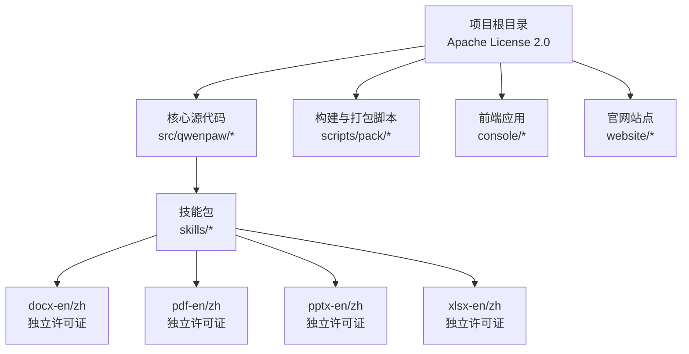
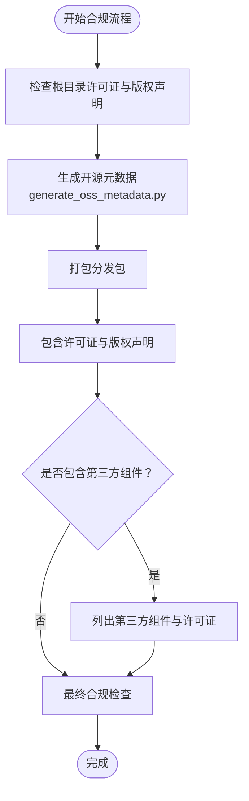

# 许可证信息

<cite>
**本文引用的文件**
- [LICENSE](file://LICENSE)
- [setup.py](file://setup.py)
- [pyproject.toml](file://pyproject.toml)
- [src/qwenpaw/agents/skills/docx-en/LICENSE.txt](file://src/qwenpaw/agents/skills/docx-en/LICENSE.txt)
- [src/qwenpaw/agents/skills/docx-zh/LICENSE.txt](file://src/qwenpaw/agents/skills/docx-zh/LICENSE.txt)
- [src/qwenpaw/agents/skills/pdf-en/LICENSE.txt](file://src/qwenpaw/agents/skills/pdf-en/LICENSE.txt)
- [src/qwenpaw/agents/skills/pdf-zh/LICENSE.txt](file://src/qwenpaw/agents/skills/pdf-zh/LICENSE.txt)
- [src/qwenpaw/agents/skills/pptx-en/LICENSE.txt](file://src/qwenpaw/agents/skills/pptx-en/LICENSE.txt)
- [src/qwenpaw/agents/skills/pptx-zh/LICENSE.txt](file://src/qwenpaw/agents/skills/pptx-zh/LICENSE.txt)
- [src/qwenpaw/agents/skills/xlsx-en/LICENSE.txt](file://src/qwenpaw/agents/skills/xlsx-en/LICENSE.txt)
- [src/qwenpaw/agents/skills/xlsx-zh/LICENSE.txt](file://src/qwenpaw/agents/skills/xlsx-zh/LICENSE.txt)
- [scripts/pack/generate_oss_metadata.py](file://scripts/pack/generate_oss_metadata.py)
- [scripts/pack/build_common.py](file://scripts/pack/build_common.py)
- [CONTRIBUTING.md](file://CONTRIBUTING.md)
- [SECURITY.md](file://SECURITY.md)
- [console/package.json](file://console/package.json)
- [website/package.json](file://website/package.json)
</cite>

## 目录
1. [引言](#引言)
2. [项目结构与许可证范围](#项目结构与许可证范围)
3. [核心许可证条款解析](#核心许可证条款解析)
4. [Apache License 2.0 条款详解](#apache-license-20-条款详解)
5. [用户使用权限与义务](#用户使用权限与义务)
6. [贡献者权利与义务](#贡献者权利与义务)
7. [分发与再许可要求](#分发与再许可要求)
8. [商标与专利特殊条款](#商标与专利特殊条款)
9. [第三方组件许可证兼容性](#第三方组件许可证兼容性)
10. [合规操作指南](#合规操作指南)
11. [法律声明与免责声明](#法律声明与免责声明)
12. [故障排除与常见问题](#故障排除与常见问题)
13. [结论](#结论)

## 引言
本文件为 QwenPaw 项目的许可证信息权威说明，基于仓库中实际存在的 LICENSE 文件以及各子模块的许可证标注，系统阐述 Apache License 2.0 的适用范围、使用权限、分发条件、商标与专利条款，并提供合规实践指南。同时，针对项目内部分第三方组件的许可证情况给出兼容性评估与处理建议。

## 项目结构与许可证范围
- 根级许可证：项目采用 Apache License 2.0，适用于大部分源代码与文档内容。
- 子模块例外：项目内某些技能包（docx、pdf、pptx、xlsx）包含独立的第三方许可证文件，需遵循其特定条款。
- 构建与打包脚本：包含生成 OSS 元数据的脚本，体现对开源合规的关注。

**图表来源**
- [LICENSE](file://LICENSE)
- [src/qwenpaw/agents/skills/docx-en/LICENSE.txt](file://src/qwenpaw/agents/skills/docx-en/LICENSE.txt)
- [src/qwenpaw/agents/skills/pdf-en/LICENSE.txt](file://src/qwenpaw/agents/skills/pdf-en/LICENSE.txt)
- [src/qwenpaw/agents/skills/pptx-en/LICENSE.txt](file://src/qwenpaw/agents/skills/pptx-en/LICENSE.txt)
- [src/qwenpaw/agents/skills/xlsx-en/LICENSE.txt](file://src/qwenpaw/agents/skills/xlsx-en/LICENSE.txt)

**章节来源**
- [LICENSE](file://LICENSE)
- [scripts/pack/generate_oss_metadata.py](file://scripts/pack/generate_oss_metadata.py)

## 核心许可证条款解析
- 许可类型：允许商业使用、修改、分发与再许可，但需保留版权声明与许可证文本。
- 责任限制：软件按“现状”提供，不提供任何明示或暗示担保。
- 专利授权：明确授予专利使用权，但不承担专利侵权责任。
- 商标禁止：许可证未授予商标使用许可，不得使用贡献者的商标。

**章节来源**
- [LICENSE](file://LICENSE)

## Apache License 2.0 条款详解
以下条款摘自 Apache License 2.0，用于指导用户与贡献者的权利与义务：

- 使用权限
  - 可在任何目的下使用、复制、修改、合并、发布、分发、再许可及销售软件副本。
  - 可在受适用法律约束的前提下，将软件用于商业用途。
- 分发条件
  - 必须在所有副本或重要部分保留原始版权通知与许可证文本。
  - 如对软件进行修改，需在修改文件中标注变更详情。
- 商标使用限制
  - 许可证不授予商标使用许可，不得使用原作者或贡献者的商标。
- 专利授权
  - 明确授予专利使用权，但不承担专利侵权责任。
- 无担保声明
  - 软件按“现状”提供，不提供任何明示或暗示担保。
- 责任限制
  - 在任何情况下，作者或版权持有人均不对因使用或无法使用软件而产生的任何直接、间接、附带、特殊、惩罚性或后果性损害承担责任。

**章节来源**
- [LICENSE](file://LICENSE)

## 用户使用权限与义务
- 权利
  - 可在个人或商业环境中自由使用 QwenPaw。
  - 可根据需要修改源代码以满足自身需求。
  - 可将修改后的版本进行分发或再许可。
- 义务
  - 在分发或再分发时必须保留原始版权声明与许可证文本。
  - 对于修改的文件，需注明变更信息。
  - 不得使用项目方或贡献者的商标进行推广或背书。

**章节来源**
- [LICENSE](file://LICENSE)

## 贡献者权利与义务
- 权利
  - 贡献的代码默认采用 Apache License 2.0 授权，贡献者保留版权。
  - 贡献者可通过提交 PR 的形式参与项目改进。
- 义务
  - 提交的代码需符合项目贡献流程与规范。
  - 遵守 Apache License 2.0 的分发与再许可要求。
  - 不得在未授权的情况下使用项目方或贡献者的商标。

**章节来源**
- [CONTRIBUTING.md](file://CONTRIBUTING.md)
- [LICENSE](file://LICENSE)

## 分发与再许可要求
- 基本要求
  - 在分发软件或其衍生作品时，必须包含原始版权声明与许可证文本。
  - 若对软件进行了修改，需在修改文件中记录变更。
- 再许可策略
  - 可将修改后的版本以相同或兼容的许可证进行再许可。
  - 若引入第三方组件，需确保其许可证与 Apache License 2.0 兼容。

**章节来源**
- [LICENSE](file://LICENSE)

## 商标与专利特殊条款
- 商标使用
  - 许可证未授予商标使用许可，不得擅自使用项目方或贡献者的商标。
- 专利授权
  - 明确授予专利使用权，但不承担专利侵权责任。
- 专利保障
  - 贡献者承诺不以专利侵权起诉使用、复制、修改、分发或再许可该软件的主体。

**章节来源**
- [LICENSE](file://LICENSE)

## 第三方组件许可证兼容性
项目内部分技能包包含独立的第三方许可证文件，需分别遵循其条款：

- docx 技能包
  - 独立许可证文件存在于英文与中文目录下，使用前需查阅对应 LICENSE.txt 并遵守其条款。
- pdf 技能包
  - 同样包含独立许可证文件，使用前需查阅并遵守。
- pptx 技能包
  - 包含独立许可证文件，使用前需查阅并遵守。
- xlsx 技能包
  - 包含独立许可证文件，使用前需查阅并遵守。

兼容性评估与处理建议：
- 在集成这些技能包时，应确保其许可证与 Apache License 2.0 兼容。
- 若存在冲突条款，应在分发前进行合规审查并采取必要的技术或法律措施。

**章节来源**
- [src/qwenpaw/agents/skills/docx-en/LICENSE.txt](file://src/qwenpaw/agents/skills/docx-en/LICENSE.txt)
- [src/qwenpaw/agents/skills/docx-zh/LICENSE.txt](file://src/qwenpaw/agents/skills/docx-zh/LICENSE.txt)
- [src/qwenpaw/agents/skills/pdf-en/LICENSE.txt](file://src/qwenpaw/agents/skills/pdf-en/LICENSE.txt)
- [src/qwenpaw/agents/skills/pdf-zh/LICENSE.txt](file://src/qwenpaw/agents/skills/pdf-zh/LICENSE.txt)
- [src/qwenpaw/agents/skills/pptx-en/LICENSE.txt](file://src/qwenpaw/agents/skills/pptx-en/LICENSE.txt)
- [src/qwenpaw/agents/skills/pptx-zh/LICENSE.txt](file://src/qwenpaw/agents/skills/pptx-zh/LICENSE.txt)
- [src/qwenpaw/agents/skills/xlsx-en/LICENSE.txt](file://src/qwenpaw/agents/skills/xlsx-en/LICENSE.txt)
- [src/qwenpaw/agents/skills/xlsx-zh/LICENSE.txt](file://src/qwenpaw/agents/skills/xlsx-zh/LICENSE.txt)

## 合规操作指南
- 开发阶段
  - 在项目根目录保留 LICENSE 文件与版权声明。
  - 对修改的文件添加变更说明。
- 构建与打包
  - 使用 scripts/pack/generate_oss_metadata.py 生成开源元数据，确保第三方组件信息完整。
  - 在构建产物中包含必要的版权声明与许可证文本。
- 发布与分发
  - 在分发包中包含原始版权声明与 Apache License 2.0 文本。
  - 对于包含第三方组件的分发版本，提供完整的第三方许可证列表与来源链接。
- 版本管理
  - 在 setup.py 与 pyproject.toml 中明确声明许可证信息与依赖关系。
  - 前端与网站项目在 package.json 中也应体现开源合规要求。

**图表来源**
- [scripts/pack/generate_oss_metadata.py](file://scripts/pack/generate_oss_metadata.py)
- [LICENSE](file://LICENSE)

**章节来源**
- [scripts/pack/generate_oss_metadata.py](file://scripts/pack/generate_oss_metadata.py)
- [scripts/pack/build_common.py](file://scripts/pack/build_common.py)
- [setup.py](file://setup.py)
- [pyproject.toml](file://pyproject.toml)
- [console/package.json](file://console/package.json)
- [website/package.json](file://website/package.json)

## 法律声明与免责声明
- 软件按“现状”提供，不提供任何明示或暗示担保。
- 在任何情况下，作者或版权持有人均不对因使用或无法使用软件而产生的任何直接、间接、附带、特殊、惩罚性或后果性损害承担责任。
- 不得使用项目方或贡献者的商标进行推广或背书。

**章节来源**
- [LICENSE](file://LICENSE)

## 故障排除与常见问题
- 未发现根级 LICENSE 文件
  - 确认仓库根目录存在 LICENSE 文件；若缺失，请补充并重新发布。
- 第三方组件许可证冲突
  - 对照独立许可证文件进行兼容性评估，必要时移除或替换组件。
- 分发包缺少许可证文本
  - 检查打包脚本是否正确生成并包含许可证文件。
- 前端与网站项目的开源合规
  - 确保 console/package.json 与 website/package.json 中包含必要的开源合规信息。

**章节来源**
- [LICENSE](file://LICENSE)
- [src/qwenpaw/agents/skills/docx-en/LICENSE.txt](file://src/qwenpaw/agents/skills/docx-en/LICENSE.txt)
- [src/qwenpaw/agents/skills/pdf-en/LICENSE.txt](file://src/qwenpaw/agents/skills/pdf-en/LICENSE.txt)
- [src/qwenpaw/agents/skills/pptx-en/LICENSE.txt](file://src/qwenpaw/agents/skills/pptx-en/LICENSE.txt)
- [src/qwenpaw/agents/skills/xlsx-en/LICENSE.txt](file://src/qwenpaw/agents/skills/xlsx-en/LICENSE.txt)
- [console/package.json](file://console/package.json)
- [website/package.json](file://website/package.json)

## 结论
QwenPaw 项目整体遵循 Apache License 2.0，为用户与贡献者提供了广泛的使用与分发权利。在使用与分发过程中，务必保留版权声明与许可证文本，并对第三方组件进行合规审查。通过遵循本文提供的合规指南与注意事项，可以有效降低法律风险，确保项目的可持续发展与广泛传播。