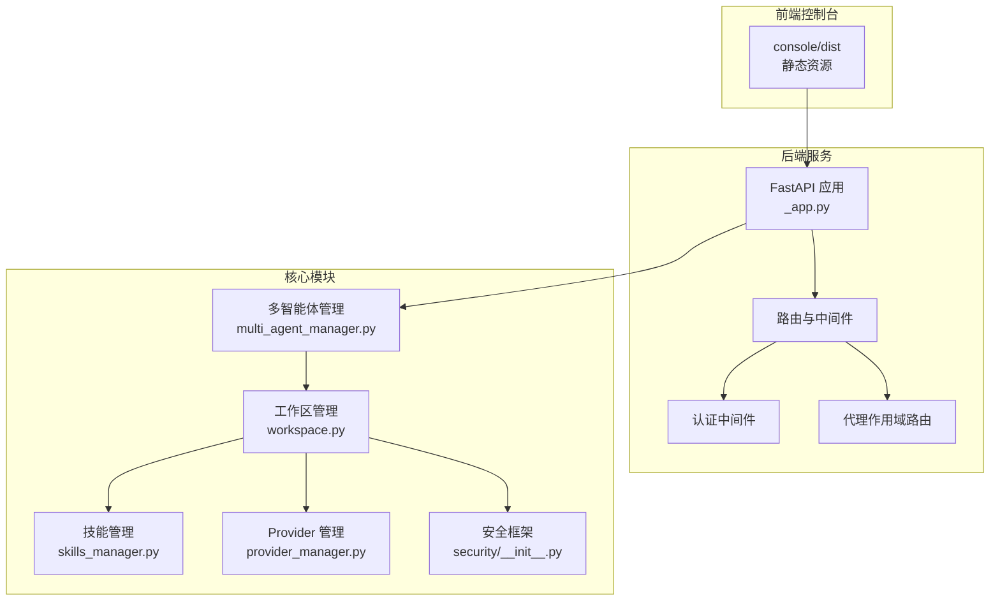
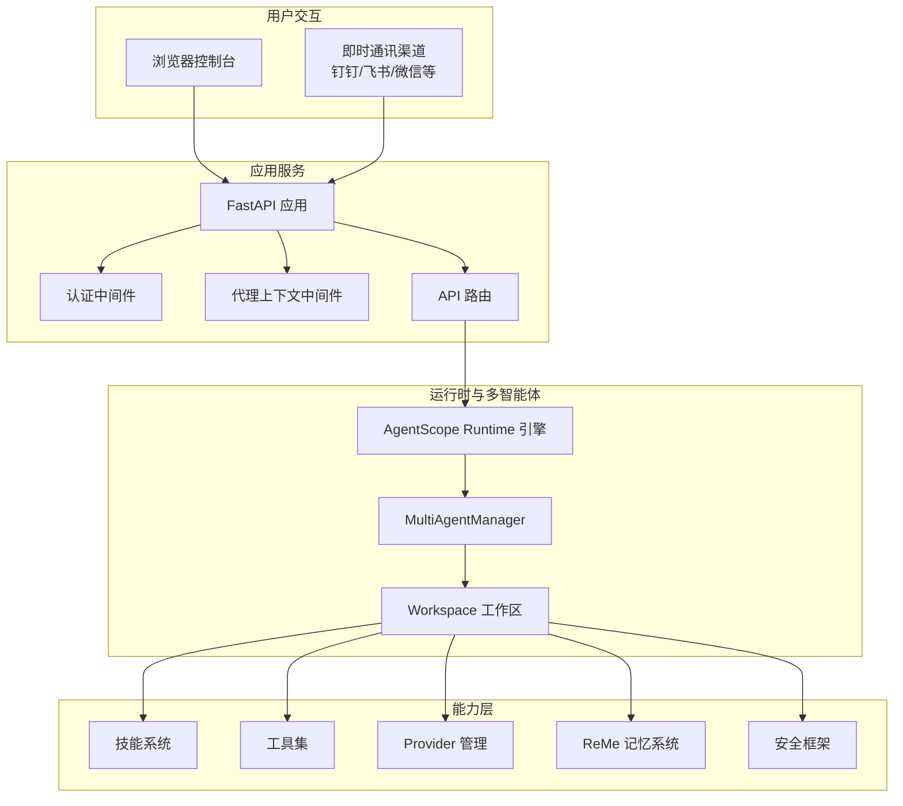
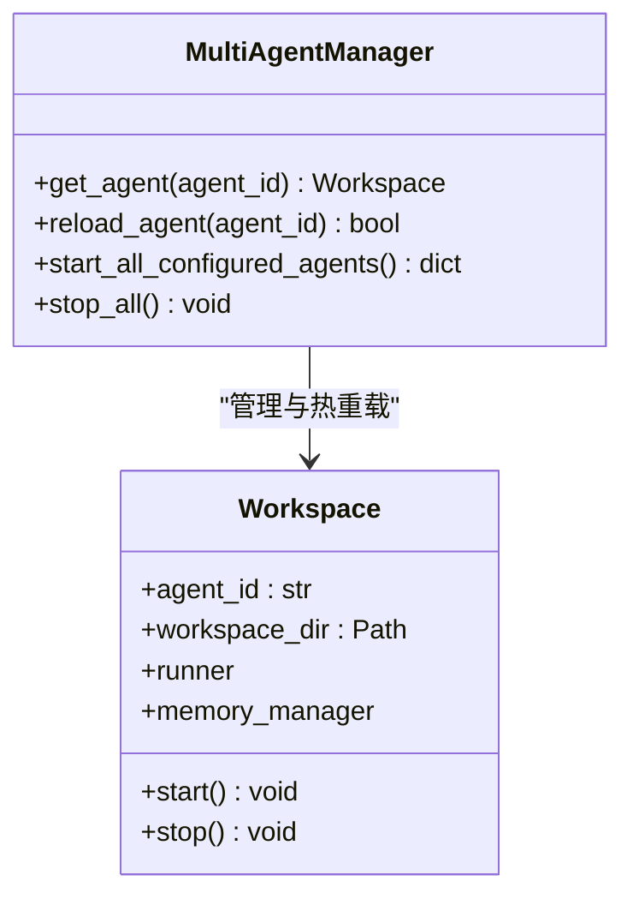
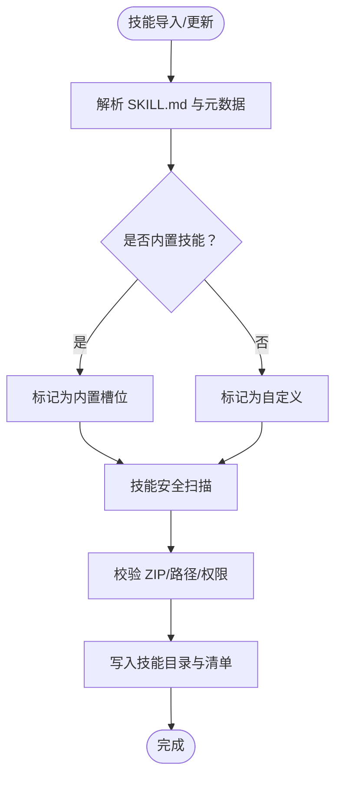
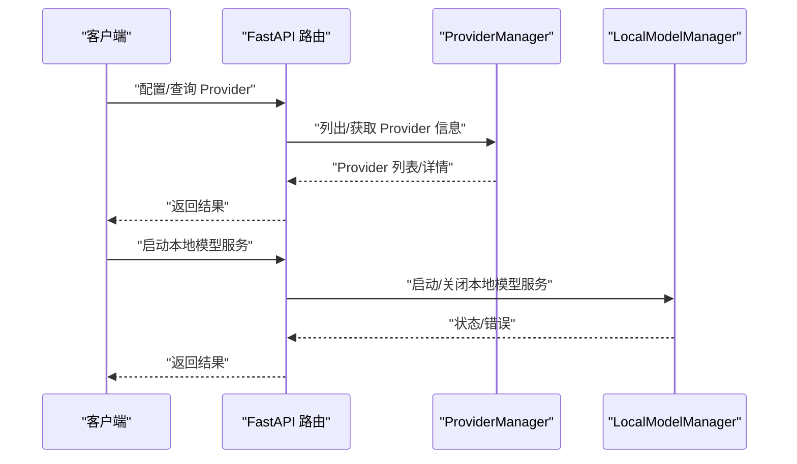
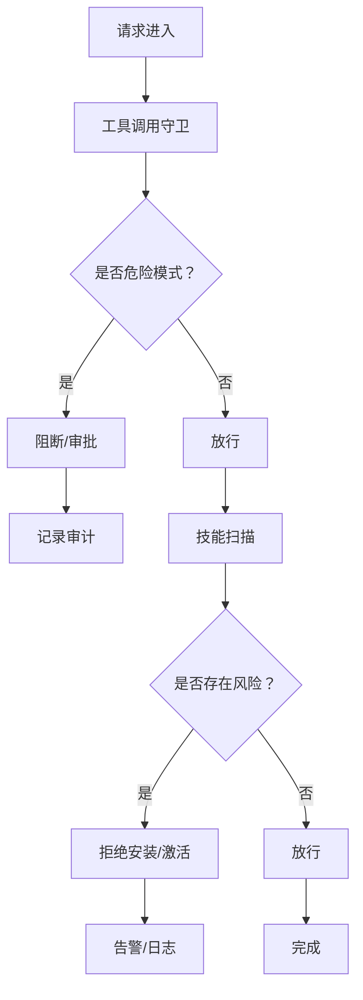
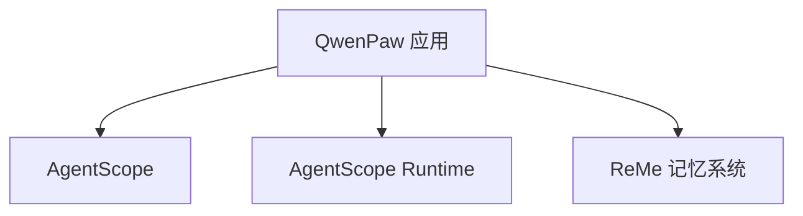

# 项目介绍

<cite>
**本文引用的文件**
- [README.md](file://README.md)
- [website/public/docs/intro.zh.md](file://website/public/docs/intro.zh.md)
- [website/public/docs/roadmap.zh.md](file://website/public/docs/roadmap.zh.md)
- [website/public/docs/comparison.zh.md](file://website/public/docs/comparison.zh.md)
- [src/qwenpaw/__init__.py](file://src/qwenpaw/__init__.py)
- [src/qwenpaw/__main__.py](file://src/qwenpaw/__main__.py)
- [src/qwenpaw/constant.py](file://src/qwenpaw/constant.py)
- [src/qwenpaw/app/_app.py](file://src/qwenpaw/app/_app.py)
- [src/qwenpaw/app/multi_agent_manager.py](file://src/qwenpaw/app/multi_agent_manager.py)
- [src/qwenpaw/app/workspace/workspace.py](file://src/qwenpaw/app/workspace/workspace.py)
- [src/qwenpaw/agents/__init__.py](file://src/qwenpaw/agents/__init__.py)
- [src/qwenpaw/agents/skills_manager.py](file://src/qwenpaw/agents/skills_manager.py)
- [src/qwenpaw/providers/provider_manager.py](file://src/qwenpaw/providers/provider_manager.py)
- [src/qwenpaw/security/__init__.py](file://src/qwenpaw/security/__init__.py)
- [pyproject.toml](file://pyproject.toml)
</cite>

## 目录
1. [简介](#简介)
2. [项目结构](#项目结构)
3. [核心组件](#核心组件)
4. [架构总览](#架构总览)
5. [详细组件分析](#详细组件分析)
6. [依赖关系分析](#依赖关系分析)
7. [性能考量](#性能考量)
8. [故障排查指南](#故障排查指南)
9. [结论](#结论)
10. [附录](#附录)

## 简介
QwenPaw 是一款面向个人用户的智能助手工作站，强调“在你自己的环境中运行”。其核心价值主张包括：
- 本地可控：数据与记忆完全在本地，支持本地模型与云端模型双模式；可选择本地部署或容器化部署。
- 多渠道接入：支持钉钉、飞书、微信、Discord、Telegram、iMessage 等主流即时通讯渠道，统一在控制台配置与管理。
- 技能扩展：内置多种技能（如定时任务、PDF/Office 处理、新闻摘要、文件阅读等），支持自定义技能与插件生态，技能决定能力边界。
- 多智能体协作：支持创建多个独立智能体，各自拥有独立工作区、记忆与技能，可通过协作技能实现跨智能体通信与协同。
- 多层安全：工具调用守卫、文件访问控制、技能安全扫描、密钥透明加密存储、可选 Web 登录认证等，确保运行安全。

QwenPaw 是 AgentScope 生态的一部分，依托 AgentScope 与 AgentScope Runtime 构建，同时与 ReMe 记忆系统深度集成，形成“模型层 + 记忆层 + 通道层 + 技能层”的完整能力闭环。

**章节来源**
- [README.md: 29-56:29-56](file://README.md#L29-L56)
- [website/public/docs/intro.zh.md: 7-26:7-26](file://website/public/docs/intro.zh.md#L7-L26)

## 项目结构
QwenPaw 采用前后端分离与模块化组织：
- 前端控制台：位于 console/ 目录，构建产物打包进 Python 包，随应用发布。
- 后端服务：FastAPI 应用，负责路由、认证、多智能体管理、技能与工具调度、频道接入、本地模型与 Provider 管理等。
- 核心模块：
  - agents：智能体实现与工具、技能、记忆管理。
  - providers：模型 Provider 管理与统一接口。
  - security：工具守卫、技能扫描、密钥存储等安全机制。
  - app：应用生命周期、多智能体管理、工作区、路由与中间件。
  - local_models：本地模型下载与运行时管理。
  - backup、plugins、crons 等支撑模块。

**图表来源**
- [src/qwenpaw/app/_app.py: 517-732:517-732](file://src/qwenpaw/app/_app.py#L517-L732)
- [src/qwenpaw/app/multi_agent_manager.py: 22-521:22-521](file://src/qwenpaw/app/multi_agent_manager.py#L22-L521)
- [src/qwenpaw/app/workspace/workspace.py: 50-86:50-86](file://src/qwenpaw/app/workspace/workspace.py#L50-L86)
- [src/qwenpaw/agents/skills_manager.py: 1-120:1-120](file://src/qwenpaw/agents/skills_manager.py#L1-L120)
- [src/qwenpaw/providers/provider_manager.py: 720-800:720-800](file://src/qwenpaw/providers/provider_manager.py#L720-L800)
- [src/qwenpaw/security/__init__.py: 1-21:1-21](file://src/qwenpaw/security/__init__.py#L1-L21)

**章节来源**
- [pyproject.toml: 58-67:58-67](file://pyproject.toml#L58-L67)
- [src/qwenpaw/app/_app.py: 517-732:517-732](file://src/qwenpaw/app/_app.py#L517-L732)

## 核心组件
- 应用入口与生命周期
  - 包初始化与日志：在包导入阶段设置日志级别与环境变量加载。
  - 应用入口：通过命令行入口启动 FastAPI 应用，注册路由、中间件与静态资源。
  - 生命周期：在 lifespan 中完成启动阶段的轻量同步初始化与后台重资源初始化，确保快速响应与后台懒加载。
- 多智能体管理
  - 支持并发启动、零停机热重载、延迟清理旧实例、任务追踪与优雅停止。
  - 通过工作区 Workspace 封装服务管理与组件生命周期。
- 技能系统
  - 技能池与工作区技能：支持内置技能与自定义技能，具备语言偏好、版本管理、安全扫描与导入校验。
  - 技能树与清单：提供技能清单、树形展示、需求声明与环境变量注入。
- Provider 管理
  - 统一 Provider 接口，内置多家云模型与本地模型（Ollama、LM Studio、llama.cpp）。
  - 支持连接探测、模型发现、速率限制与重试策略。
- 安全框架
  - 工具守卫：拦截危险命令与参数注入。
  - 技能扫描：安装/激活前静态扫描，识别风险。
  - 密钥存储：透明加密存储敏感字段，基于 OS Keychain 或回退文件。
- 配置与常量
  - 工作目录、媒体目录、备份目录、插件目录、本地模型目录等路径与行为由常量与环境变量驱动。
  - 日志级别、容器运行标记、CORS、LLM 限流与并发控制等运行时参数集中管理。

**章节来源**
- [src/qwenpaw/__init__.py: 11-33:11-33](file://src/qwenpaw/__init__.py#L11-L33)
- [src/qwenpaw/__main__.py: 1-7:1-7](file://src/qwenpaw/__main__.py#L1-L7)
- [src/qwenpaw/app/_app.py: 219-516:219-516](file://src/qwenpaw/app/_app.py#L219-L516)
- [src/qwenpaw/app/multi_agent_manager.py: 22-521:22-521](file://src/qwenpaw/app/multi_agent_manager.py#L22-L521)
- [src/qwenpaw/app/workspace/workspace.py: 50-86:50-86](file://src/qwenpaw/app/workspace/workspace.py#L50-L86)
- [src/qwenpaw/agents/skills_manager.py: 1-120:1-120](file://src/qwenpaw/agents/skills_manager.py#L1-L120)
- [src/qwenpaw/providers/provider_manager.py: 720-800:720-800](file://src/qwenpaw/providers/provider_manager.py#L720-L800)
- [src/qwenpaw/security/__init__.py: 1-21:1-21](file://src/qwenpaw/security/__init__.py#L1-L21)
- [src/qwenpaw/constant.py: 89-230:89-230](file://src/qwenpaw/constant.py#L89-L230)

## 架构总览
QwenPaw 的整体架构围绕“控制台 + 应用服务 + 多智能体 + 技能与工具 + Provider + 安全”展开，采用 AgentScope Runtime 作为运行时引擎，支持多智能体并行与协作，结合 ReMe 记忆系统实现长期记忆与上下文压缩。

**图表来源**
- [src/qwenpaw/app/_app.py: 517-732:517-732](file://src/qwenpaw/app/_app.py#L517-L732)
- [src/qwenpaw/app/multi_agent_manager.py: 22-521:22-521](file://src/qwenpaw/app/multi_agent_manager.py#L22-L521)
- [src/qwenpaw/app/workspace/workspace.py: 50-86:50-86](file://src/qwenpaw/app/workspace/workspace.py#L50-L86)
- [src/qwenpaw/agents/skills_manager.py: 1-120:1-120](file://src/qwenpaw/agents/skills_manager.py#L1-L120)
- [src/qwenpaw/providers/provider_manager.py: 720-800:720-800](file://src/qwenpaw/providers/provider_manager.py#L720-L800)
- [src/qwenpaw/security/__init__.py: 1-21:1-21](file://src/qwenpaw/security/__init__.py#L1-L21)

## 详细组件分析

### 多智能体与工作区
- 多智能体管理器负责并发启动、原子替换与零停机热重载，确保在有活跃任务时延后清理旧实例，避免中断。
- 工作区封装服务管理器与组件生命周期，提供 Runner、内存管理器等服务属性访问。

**图表来源**
- [src/qwenpaw/app/multi_agent_manager.py: 22-521:22-521](file://src/qwenpaw/app/multi_agent_manager.py#L22-L521)
- [src/qwenpaw/app/workspace/workspace.py: 50-86:50-86](file://src/qwenpaw/app/workspace/workspace.py#L50-L86)

**章节来源**
- [src/qwenpaw/app/multi_agent_manager.py: 22-521:22-521](file://src/qwenpaw/app/multi_agent_manager.py#L22-L521)
- [src/qwenpaw/app/workspace/workspace.py: 50-86:50-86](file://src/qwenpaw/app/workspace/workspace.py#L50-L86)

### 技能系统与安全扫描
- 技能池与工作区技能：支持内置技能语言偏好、版本提取、清单生成与导入校验；具备 ZIP 上传安全校验与树形文件写入。
- 安全扫描：在安装/激活前对技能目录进行静态分析，识别风险模式。

**图表来源**
- [src/qwenpaw/agents/skills_manager.py: 120-200:120-200](file://src/qwenpaw/agents/skills_manager.py#L120-L200)
- [src/qwenpaw/agents/skills_manager.py: 615-636:615-636](file://src/qwenpaw/agents/skills_manager.py#L615-L636)
- [src/qwenpaw/agents/skills_manager.py: 705-745:705-745](file://src/qwenpaw/agents/skills_manager.py#L705-L745)

**章节来源**
- [src/qwenpaw/agents/skills_manager.py: 1-120:1-120](file://src/qwenpaw/agents/skills_manager.py#L1-L120)
- [src/qwenpaw/agents/skills_manager.py: 615-636:615-636](file://src/qwenpaw/agents/skills_manager.py#L615-L636)
- [src/qwenpaw/agents/skills_manager.py: 705-745:705-745](file://src/qwenpaw/agents/skills_manager.py#L705-L745)

### Provider 管理与本地模型
- ProviderManager 统一管理内置与自定义 Provider，内置覆盖多家云模型与本地模型（Ollama、LM Studio、llama.cpp 等），并支持连接探测、模型发现与限流。
- 本地模型管理器负责本地模型的下载、启动与关闭，支持 llama.cpp、Ollama、LM Studio 等后端。

**图表来源**
- [src/qwenpaw/providers/provider_manager.py: 720-800:720-800](file://src/qwenpaw/providers/provider_manager.py#L720-L800)
- [src/qwenpaw/app/_app.py: 258-272:258-272](file://src/qwenpaw/app/_app.py#L258-L272)

**章节来源**
- [src/qwenpaw/providers/provider_manager.py: 720-800:720-800](file://src/qwenpaw/providers/provider_manager.py#L720-L800)
- [src/qwenpaw/app/_app.py: 258-272:258-272](file://src/qwenpaw/app/_app.py#L258-L272)

### 安全框架
- 工具守卫：拦截危险命令与参数注入，支持超时审批流程。
- 技能扫描：安装/激活前静态扫描，识别风险。
- 密钥存储：透明加密存储敏感字段，基于 OS Keychain 或回退文件。

**图表来源**
- [src/qwenpaw/security/__init__.py: 1-21:1-21](file://src/qwenpaw/security/__init__.py#L1-L21)

**章节来源**
- [src/qwenpaw/security/__init__.py: 1-21:1-21](file://src/qwenpaw/security/__init__.py#L1-L21)

## 依赖关系分析
- 运行时与生态
  - 依赖 AgentScope 与 AgentScope Runtime 作为智能体运行时与引擎。
  - 依赖 ReMe 记忆系统提供长期记忆与上下文压缩能力。
- 前端与静态资源
  - 控制台前端构建产物打包进 Python 包，随应用发布，支持 SPA 路由与静态资源服务。
- 外部集成
  - 频道接入：钉钉、飞书、微信、Discord、Telegram、iMessage、MQTT 等。
  - 本地模型：llama.cpp、Ollama、LM Studio。
  - Provider：OpenAI、DashScope、Gemini、Anthropic、OpenRouter、Azure OpenAI 等。

**图表来源**
- [pyproject.toml: 8-47:8-47](file://pyproject.toml#L8-L47)
- [README.md: 482-484:482-484](file://README.md#L482-L484)

**章节来源**
- [pyproject.toml: 8-47:8-47](file://pyproject.toml#L8-L47)
- [README.md: 482-484:482-484](file://README.md#L482-L484)

## 性能考量
- 启动与懒加载：应用在 lifespan 中完成轻量同步初始化，后台异步启动多智能体与插件，确保快速响应。
- 并发与限流：Provider 层面支持 QPM 滑动窗口与并发信号量，避免 429 与拥塞。
- 记忆与上下文：ReMe 记忆系统支持上下文压缩与摘要沉淀，减少 Token 消耗与延迟。
- 零停机热重载：多智能体管理器在新实例就绪后原子替换，旧实例延后清理，避免服务中断。

**章节来源**
- [src/qwenpaw/app/_app.py: 297-445:297-445](file://src/qwenpaw/app/_app.py#L297-L445)
- [src/qwenpaw/constant.py: 232-295:232-295](file://src/qwenpaw/constant.py#L232-L295)
- [src/qwenpaw/app/multi_agent_manager.py: 255-366:255-366](file://src/qwenpaw/app/multi_agent_manager.py#L255-L366)

## 故障排查指南
- 启动与日志
  - 包初始化阶段设置日志级别，若环境变量加载失败会记录警告。
  - 应用启动阶段打印运行信息与后台启动耗时，便于定位启动慢的问题。
- 插件与控制命令
  - 插件启动/关闭钩子执行异常会被记录并继续后续流程。
  - 控制命令注册失败会输出错误日志，便于定位插件问题。
- 本地模型与 Provider
  - Provider 连接探测失败或模型不可用时，检查网络与 Base URL 配置。
  - 本地模型服务启动失败时，检查端口占用与二进制路径。
- 安全相关
  - 工具守卫拦截会记录审计日志，必要时调整审批超时或规则。
  - 技能扫描失败会阻止安装/激活，检查技能目录与 ZIP 安全性。

**章节来源**
- [src/qwenpaw/__init__.py: 11-33:11-33](file://src/qwenpaw/__init__.py#L11-L33)
- [src/qwenpaw/app/_app.py: 434-490:434-490](file://src/qwenpaw/app/_app.py#L434-L490)
- [src/qwenpaw/app/_app.py: 492-514:492-514](file://src/qwenpaw/app/_app.py#L492-L514)

## 结论
QwenPaw 以“本地可控、多渠道、可扩展、可协作、可安全”为核心，构建了面向个人用户的智能助手平台。依托 AgentScope 生态与 ReMe 记忆系统，QwenPaw 在多智能体协作、上下文压缩、Provider 统一管理与安全框架方面形成了差异化优势。对于初学者，控制台与一键安装提供了极低门槛；对于开发者，插件体系、技能系统与多智能体管理则提供了强大的扩展空间。

## 附录

### 设计理念与目标用户
- 设计理念
  - 以“个人助理”为目标，强调本地可控与隐私保护。
  - 以“技能”为能力边界，通过内置与自定义技能扩展。
  - 以“多智能体”为协作基础，支持独立工作区与跨智能体通信。
- 目标用户
  - 个人用户：希望在本地或云端部署，统一管理多渠道对话与自动化任务。
  - 开发者与团队：需要可扩展的技能系统、Provider 管理与多智能体协作能力。

**章节来源**
- [website/public/docs/intro.zh.md: 29-92:29-92](file://website/public/docs/intro.zh.md#L29-L92)

### 发展历程、版本演进与未来规划
- 版本演进
  - v1.1.3：新增备份与恢复系统、QwenPaw 作为 ACP Server、主动消息、控制台插件系统、代理统计页面、内置技能语言切换、Shell 逃逸守卫等。
- 未来规划
  - 横向扩展：更多频道、模型、技能、MCP。
  - 多智能体：HiClaw 接入、Agent Swarm/Team。
  - 大小模型协同：端云模型智能切换。
  - 记忆系统：场景感知主动推送。
  - 版本与迁移：一键打包、多版本/多设备迁移。
  - 安全：细粒度安全控制与 LLM-based 安全控制。

**章节来源**
- [README.md: 61-84:61-84](file://README.md#L61-L84)
- [website/public/docs/roadmap.zh.md: 1-38:1-38](file://website/public/docs/roadmap.zh.md#L1-L38)

### 与其他类似产品的差异化优势
- 技术栈与生态：基于 AgentScope 与 AgentScope Runtime，与 ReMe 记忆系统深度集成。
- 记忆系统：ReMe 驱动的长期记忆与上下文压缩，支持检索融合与摘要沉淀。
- 多智能体：同一实例内并行多个智能体，独立工作区与热重载。
- 安全机制：工具守卫、技能扫描、文件防护与密钥透明加密。
- 频道与安装：覆盖主流即时通讯渠道，安装方式多样（脚本、Docker、桌面应用）。

**章节来源**
- [website/public/docs/comparison.zh.md: 1-22:1-22](file://website/public/docs/comparison.zh.md#L1-L22)