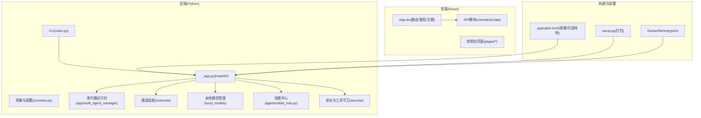
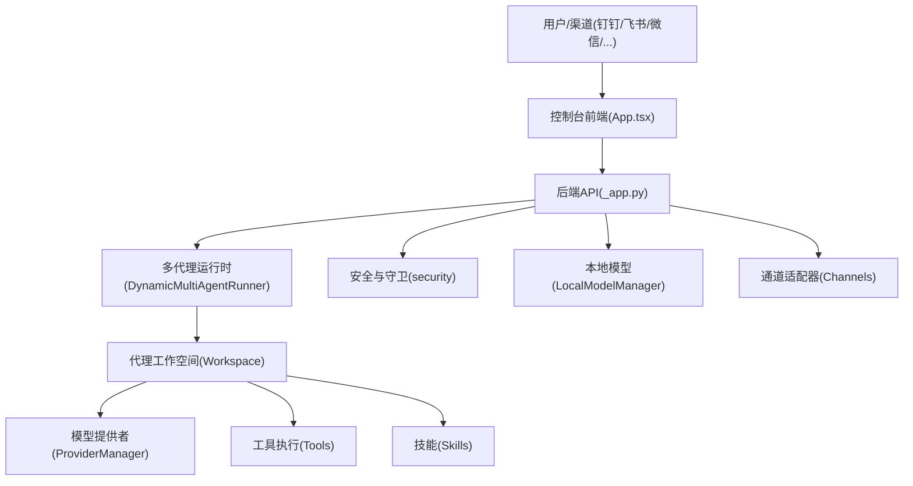
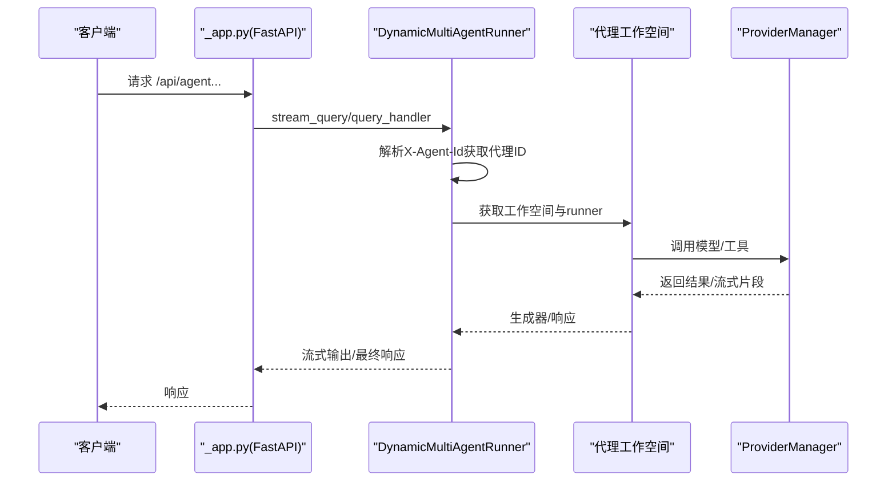
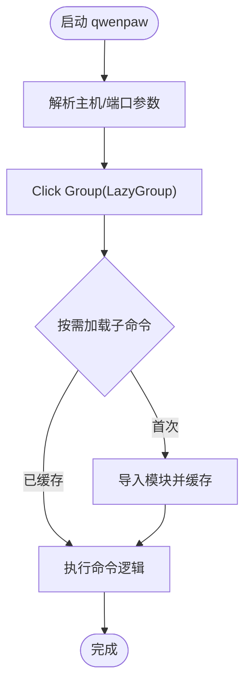
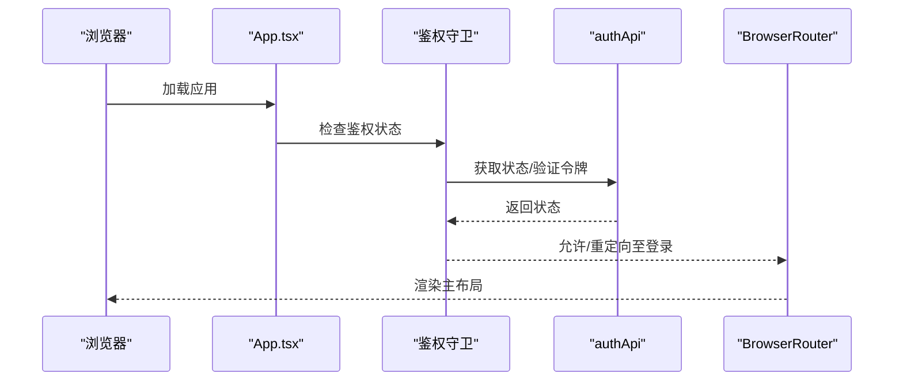
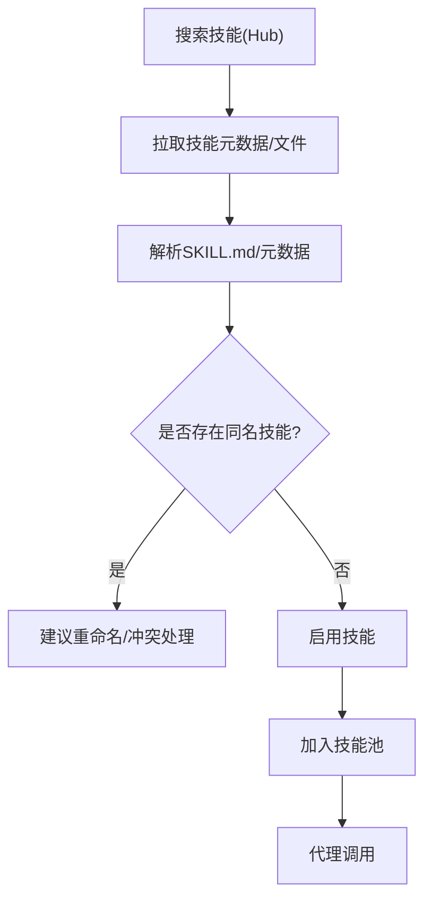
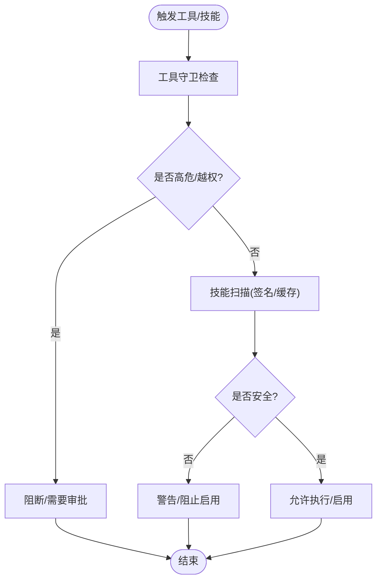
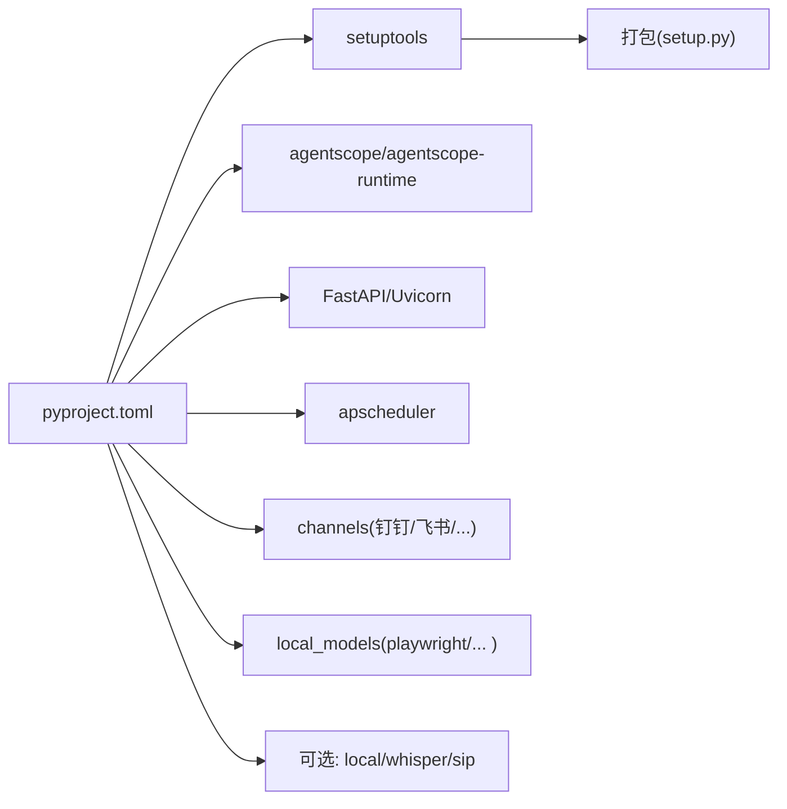

# 项目概述

<cite>
**本文引用的文件**
- [README.md](file://README.md)
- [src/qwenpaw/__init__.py](file://src/qwenpaw/__init__.py)
- [src/qwenpaw/__version__.py](file://src/qwenpaw/__version__.py)
- [setup.py](file://setup.py)
- [pyproject.toml](file://pyproject.toml)
- [src/qwenpaw/app/_app.py](file://src/qwenpaw/app/_app.py)
- [src/qwenpaw/cli/main.py](file://src/qwenpaw/cli/main.py)
- [src/qwenpaw/constant.py](file://src/qwenpaw/constant.py)
- [console/src/App.tsx](file://console/src/App.tsx)
- [src/qwenpaw/agents/__init__.py](file://src/qwenpaw/agents/__init__.py)
- [src/qwenpaw/agents/skills_hub.py](file://src/qwenpaw/agents/skills_hub.py)
- [website/public/docs/comparison.en.md](file://website/public/docs/comparison.en.md)
- [website/public/docs/security.en.md](file://website/public/docs/security.en.md)
- [website/public/docs/roadmap.en.md](file://website/public/docs/roadmap.en.md)
- [website/public/release-notes/v1.1.3.md](file://website/public/release-notes/v1.1.3.md)
- [website/public/release-notes/v1.1.2.md](file://website/public/release-notes/v1.1.2.md)
</cite>

## 目录
1. [引言](#引言)
2. [项目结构](#项目结构)
3. [核心组件](#核心组件)
4. [架构总览](#架构总览)
5. [详细组件分析](#详细组件分析)
6. [依赖关系分析](#依赖关系分析)
7. [性能考量](#性能考量)
8. [故障排查指南](#故障排查指南)
9. [结论](#结论)
10. [附录](#附录)

## 引言
QwenPaw 是一个面向个人用户的智能助手平台，强调“在你身边、与你共同成长”。其核心价值主张包括：
- 在本地或云端可控部署，数据隐私由用户掌控
- 可扩展的“技能”体系，内置多种实用技能并支持自定义扩展
- 多通道接入（如钉钉、飞书、微信、Discord、Telegram 等），统一管理
- 多代理协作与安全机制（工具守卫、文件访问控制、技能安全扫描）
- 提供桌面应用、Docker 部署等多种安装方式，降低使用门槛

项目当前版本为 1.1.4b1，并持续通过发布说明与路线图迭代增强备份恢复、ACP 服务、插件系统、代理统计、技能语言切换、Shell 潜逃检测等能力。

章节来源
- [README.md:1-528](file://README.md#L1-L528)
- [src/qwenpaw/__version__.py:1-3](file://src/qwenpaw/__version__.py#L1-L3)
- [website/public/release-notes/v1.1.3.md:1-62](file://website/public/release-notes/v1.1.3.md#L1-L62)

## 项目结构
QwenPaw 采用前后端分离与多模块组织方式：
- 后端（Python）：FastAPI 应用、CLI、配置与常量、通道适配器、多代理运行时、本地模型管理、技能中心、安全扫描与工具守卫等
- 前端（React）：控制台界面，路由、主题、国际化、鉴权守卫、插件系统等
- 配置与打包：pyproject.toml 定义依赖与可选特性；setup.py 用于打包；Dockerfile 与脚本支持容器化部署
- 文档与网站：官网文档、发布说明、路线图等

图表来源
- [src/qwenpaw/app/_app.py:517-732](file://src/qwenpaw/app/_app.py#L517-L732)
- [src/qwenpaw/cli/main.py:95-178](file://src/qwenpaw/cli/main.py#L95-L178)
- [src/qwenpaw/constant.py:89-325](file://src/qwenpaw/constant.py#L89-L325)
- [console/src/App.tsx:118-220](file://console/src/App.tsx#L118-L220)
- [pyproject.toml:1-147](file://pyproject.toml#L1-L147)
- [setup.py:1-5](file://setup.py#L1-L5)

章节来源
- [pyproject.toml:1-147](file://pyproject.toml#L1-L147)
- [src/qwenpaw/app/_app.py:517-732](file://src/qwenpaw/app/_app.py#L517-L732)
- [console/src/App.tsx:118-220](file://console/src/App.tsx#L118-L220)

## 核心组件
- 应用入口与生命周期（FastAPI + AgentApp）
  - 使用 FastAPI 构建 API 服务，结合 AgentScope 的 AgentApp 实现流式任务与多代理运行时
  - 生命周期中完成环境初始化、迁移、后台启动（插件加载、代理启动、本地模型恢复）、健康检查与优雅停机
- CLI 与命令分发
  - 通过 Click 分组实现延迟加载子命令，支持 app、channels、cron、skills、agents、doctor 等
- 控制台前端
  - 路由守卫、鉴权、主题与国际化、插件系统、动态懒加载
- 技能中心与技能池
  - 支持从 Hub 搜索、导入、启用、禁用与冲突处理；提供两层技能池架构
- 安全与工具守卫
  - 工具守卫拦截高危命令、文件访问控制、技能扫描（签名规则、缓存、超时保护）

章节来源
- [src/qwenpaw/app/_app.py:219-515](file://src/qwenpaw/app/_app.py#L219-L515)
- [src/qwenpaw/cli/main.py:58-178](file://src/qwenpaw/cli/main.py#L58-L178)
- [console/src/App.tsx:57-220](file://console/src/App.tsx#L57-L220)
- [src/qwenpaw/agents/skills_hub.py:1-1566](file://src/qwenpaw/agents/skills_hub.py#L1-L1566)
- [website/public/docs/security.en.md:289-434](file://website/public/docs/security.en.md#L289-L434)

## 架构总览
下图展示 QwenPaw 的端到端交互：客户端通过控制台或各渠道与后端通信，后端根据请求选择代理工作空间，调用模型提供者与工具执行，同时受安全与上下文管理约束。

图表来源
- [src/qwenpaw/app/_app.py:72-216](file://src/qwenpaw/app/_app.py#L72-L216)
- [src/qwenpaw/app/_app.py:517-732](file://src/qwenpaw/app/_app.py#L517-L732)

章节来源
- [src/qwenpaw/app/_app.py:72-216](file://src/qwenpaw/app/_app.py#L72-L216)
- [src/qwenpaw/app/_app.py:517-732](file://src/qwenpaw/app/_app.py#L517-L732)

## 详细组件分析

### 组件A：应用生命周期与多代理运行时
- 动态多代理运行器根据请求头选择代理工作空间，统一注册外部任务并在关闭时清理
- AgentApp 集成流式查询与超时控制，支持后台启动插件与代理
- 启动阶段完成配置迁移、默认代理与问答代理确保、本地模型恢复、插件注册与启动钩子执行
- 停机阶段执行插件关闭钩子、停止本地模型服务与多代理管理器

图表来源
- [src/qwenpaw/app/_app.py:72-216](file://src/qwenpaw/app/_app.py#L72-L216)
- [src/qwenpaw/app/_app.py:219-515](file://src/qwenpaw/app/_app.py#L219-L515)

章节来源
- [src/qwenpaw/app/_app.py:72-216](file://src/qwenpaw/app/_app.py#L72-L216)
- [src/qwenpaw/app/_app.py:219-515](file://src/qwenpaw/app/_app.py#L219-L515)

### 组件B：CLI 与命令分发
- 使用 Click Group 实现延迟加载，按需导入子命令模块，减少启动开销
- 支持 app、channels、cron、skills、agents、doctor 等命令族
- 初始化阶段记录关键耗时点，便于诊断启动性能

图表来源
- [src/qwenpaw/cli/main.py:58-178](file://src/qwenpaw/cli/main.py#L58-L178)

章节来源
- [src/qwenpaw/cli/main.py:58-178](file://src/qwenpaw/cli/main.py#L58-L178)

### 组件C：控制台前端与鉴权
- 路由守卫根据后端鉴权状态决定是否跳转登录页
- 国际化与主题切换、插件系统加载完成后渲染路由
- 通过 API 模块与后端交互，支持登录状态校验与令牌管理

图表来源
- [console/src/App.tsx:57-112](file://console/src/App.tsx#L57-L112)
- [console/src/App.tsx:166-207](file://console/src/App.tsx#L166-L207)

章节来源
- [console/src/App.tsx:57-112](file://console/src/App.tsx#L57-L112)
- [console/src/App.tsx:166-207](file://console/src/App.tsx#L166-L207)

### 组件D：技能中心与技能池
- 支持 Hub 搜索、拉取、解析 SKILL.md、冲突建议命名
- 与技能池服务配合，实现启用/禁用、批量管理与导入导出
- 提供两层技能池架构，便于隔离与复用

图表来源
- [src/qwenpaw/agents/skills_hub.py:1-1566](file://src/qwenpaw/agents/skills_hub.py#L1-L1566)

章节来源
- [src/qwenpaw/agents/skills_hub.py:1-1566](file://src/qwenpaw/agents/skills_hub.py#L1-L1566)

### 组件E：安全与工具守卫
- 工具守卫拦截高危命令、路径访问限制、Shell 潜逃模式检测
- 技能扫描基于签名规则，支持策略配置、缓存与超时保护
- 文件访问控制列表可即时生效，白名单与告警提示

图表来源
- [website/public/docs/security.en.md:289-434](file://website/public/docs/security.en.md#L289-L434)

章节来源
- [website/public/docs/security.en.md:289-434](file://website/public/docs/security.en.md#L289-L434)

## 依赖关系分析
- 运行时依赖
  - AgentScope 与 AgentScope-Runtime：多代理运行时与协议支持
  - FastAPI、Uvicorn：Web 服务与 ASGI 服务器
  - APScheduler：定时任务与心跳
  - Playwright、Twilio、MQTT、Matrix 等：通道适配与多媒体
  - cryptography、keyring、pyyaml、json-repair、pillow 等：加密、配置、修复与图像处理
- 可选依赖
  - local：HuggingFace Hub
  - whisper：语音识别
  - sip/livekit：语音通话相关
- 包管理与打包
  - setuptools 动态版本与包数据；pyproject.toml 定义脚本入口与测试覆盖

图表来源
- [pyproject.toml:1-147](file://pyproject.toml#L1-L147)
- [setup.py:1-5](file://setup.py#L1-L5)

章节来源
- [pyproject.toml:1-147](file://pyproject.toml#L1-L147)
- [setup.py:1-5](file://setup.py#L1-L5)

## 性能考量
- 启动优化
  - FastAPI 同步阶段轻量初始化，后台异步加载代理、插件与本地模型，缩短首开时间
  - CLI 延迟加载子命令，避免不必要的导入
- 并发与限流
  - LLM 最大并发、每分钟请求数（QPM）滑动窗口限制、退避与抖动，防止 429
- 日志与可观测性
  - 启动阶段记录耗时，后台任务跟踪，支持诊断命令 doctor
- 前端体验
  - 插件系统加载完成后渲染路由，避免空白屏；SPA 回退与静态资源服务

章节来源
- [src/qwenpaw/app/_app.py:219-515](file://src/qwenpaw/app/_app.py#L219-L515)
- [src/qwenpaw/cli/main.py:58-178](file://src/qwenpaw/cli/main.py#L58-L178)
- [src/qwenpaw/constant.py:232-294](file://src/qwenpaw/constant.py#L232-L294)

## 故障排查指南
- 环境与诊断
  - 使用 doctor 命令检查环境、配置、提供商、通道、技能、MCP、内存、安全等
  - 查看后端日志文件与控制台调试页
- 常见问题
  - Docker 内部 localhost 访问宿主机服务：使用 host.docker.internal 或 host 网络
  - Windows Constrained Language Mode：手动配置 uv 与路径
  - 控制台前端过期：源码安装后需重新构建 console 前端
- 安全相关
  - 工具守卫阻断高危命令与 Shell 潜逃模式
  - 技能扫描模式与超时可在线调整，变更即时生效

章节来源
- [README.md:156-177](file://README.md#L156-L177)
- [README.md:245-271](file://README.md#L245-L271)
- [website/public/docs/security.en.md:289-434](file://website/public/docs/security.en.md#L289-L434)

## 结论
QwenPaw 以“个人 AI 助手”的定位，围绕本地可控、多通道接入、可扩展技能与安全治理构建了完整的开源生态。其后端基于 FastAPI 与 AgentScope 的多代理运行时，前端提供现代化控制台与插件系统，配合丰富的安装与部署选项，适合从个人到企业场景的多样化需求。未来在多代理协作、小大模型协同、记忆系统与安全控制方面将持续演进。

## 附录

### A. 开源生态与 AgentScope 关系
- QwenPaw 与 AgentScope 生态紧密关联，使用 AgentScope 与 AgentScope-Runtime 作为运行时与协议基础
- 项目文档对比显示两者在技术栈、多代理、记忆系统、技能生态等方面存在互补与协同

章节来源
- [website/public/docs/comparison.en.md:1-22](file://website/public/docs/comparison.en.md#L1-L22)

### B. 版本演进与未来规划
- 版本演进
  - v1.1.3：新增备份/恢复、ACP 服务、主动消息、跨提供商消息归一化、控制台插件系统、代理统计页、内置技能语言切换、Shell 潜逃守卫等
  - v1.1.2：新增 Mission 模式、自动继续文本推理、自定义代理 ID、ACP 外部代理委托、Agent CLI、调试页、WeChat 引用消息等
- 未来规划
  - 多代理协作（HiClaw 集成、Agent Swarm/Team）、小大模型协同、自更新与回滚、细粒度安全控制、上下文智能压缩等

章节来源
- [website/public/release-notes/v1.1.3.md:1-62](file://website/public/release-notes/v1.1.3.md#L1-L62)
- [website/public/release-notes/v1.1.2.md:1-67](file://website/public/release-notes/v1.1.2.md#L1-L67)
- [website/public/docs/roadmap.en.md:1-24](file://website/public/docs/roadmap.en.md#L1-L24)

### C. 系统要求与兼容性
- Python 版本：3.10 ≤ 版本 < 3.14
- 平台：macOS / Linux / Windows（PowerShell/CMD）
- 容器：Docker（支持 host.docker.internal 与 host 网络）
- 本地模型：llama.cpp、Ollama、LM Studio（无需 API Key）

章节来源
- [README.md:8-9](file://README.md#L8-L9)
- [README.md:347-356](file://README.md#L347-L356)
- [README.md:228-271](file://README.md#L228-L271)

### D. 许可证信息
- 采用 Apache License 2.0

章节来源
- [README.md:515-518](file://README.md#L515-L518)