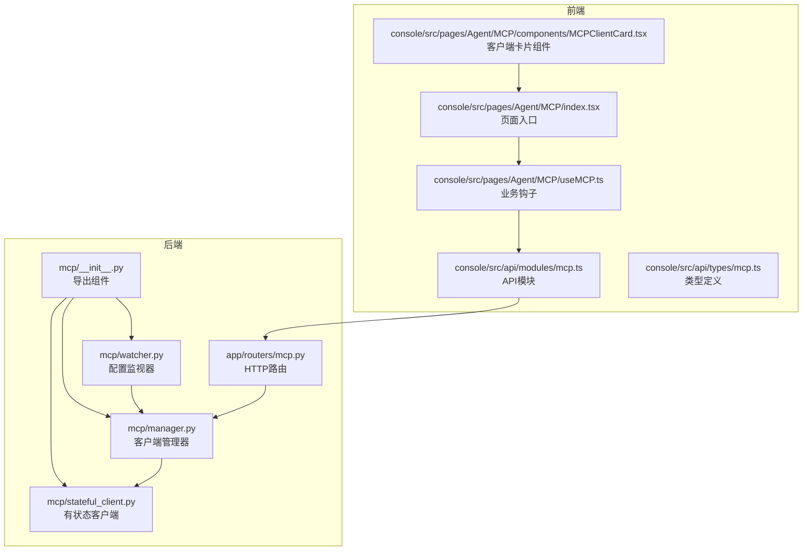
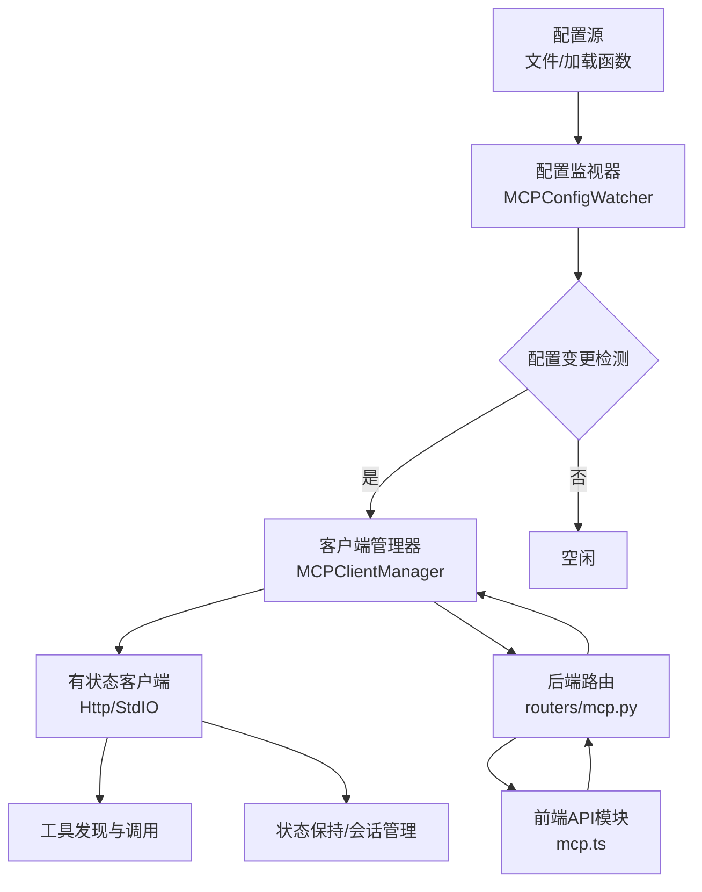
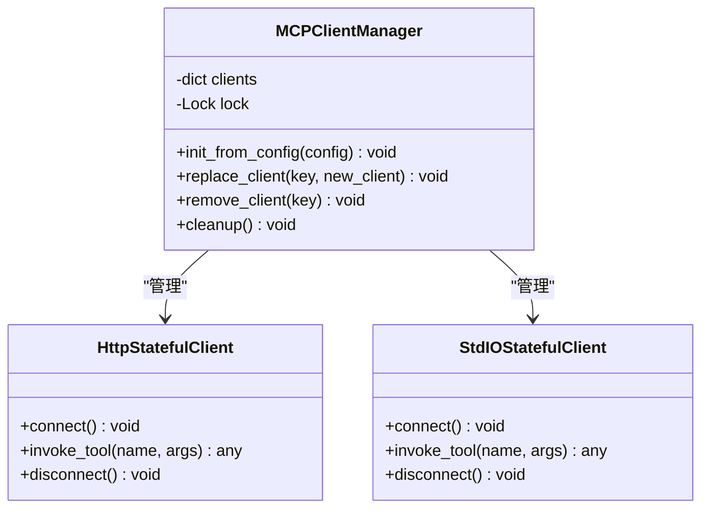
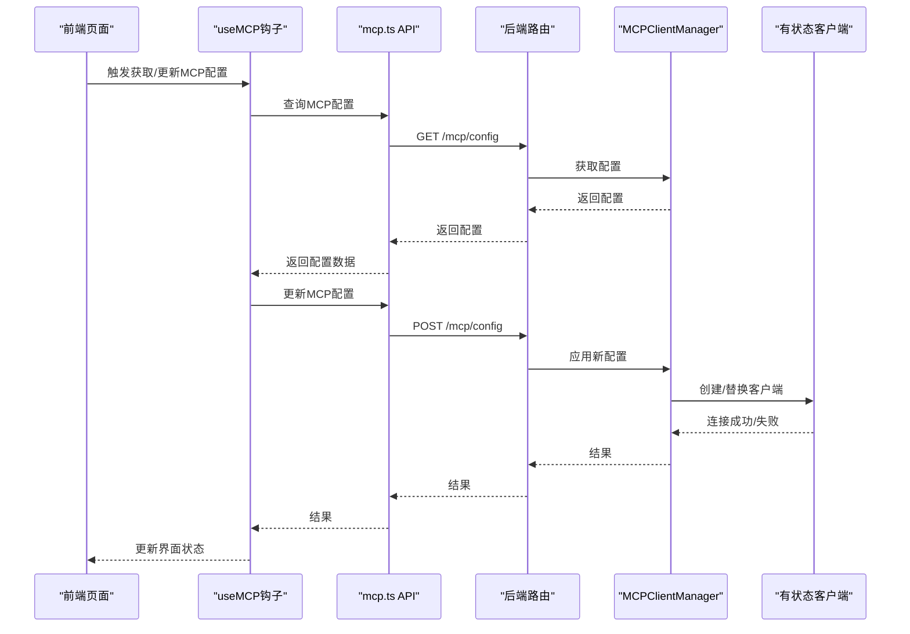
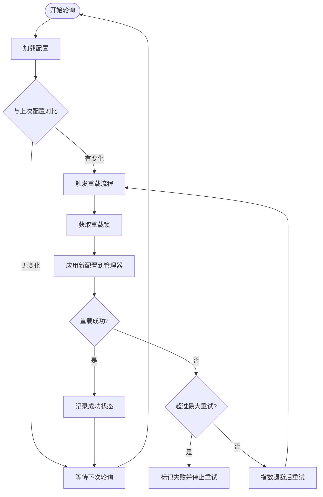
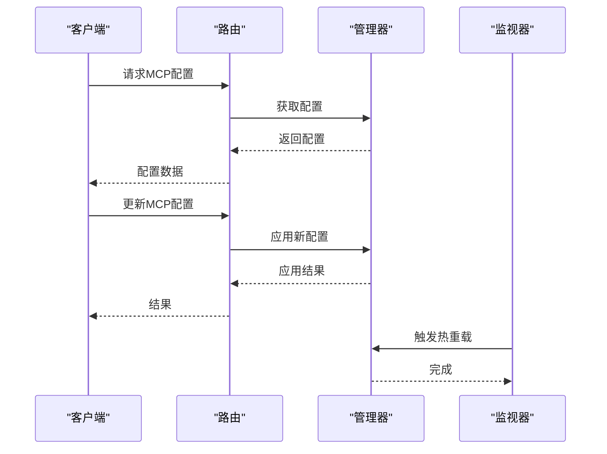
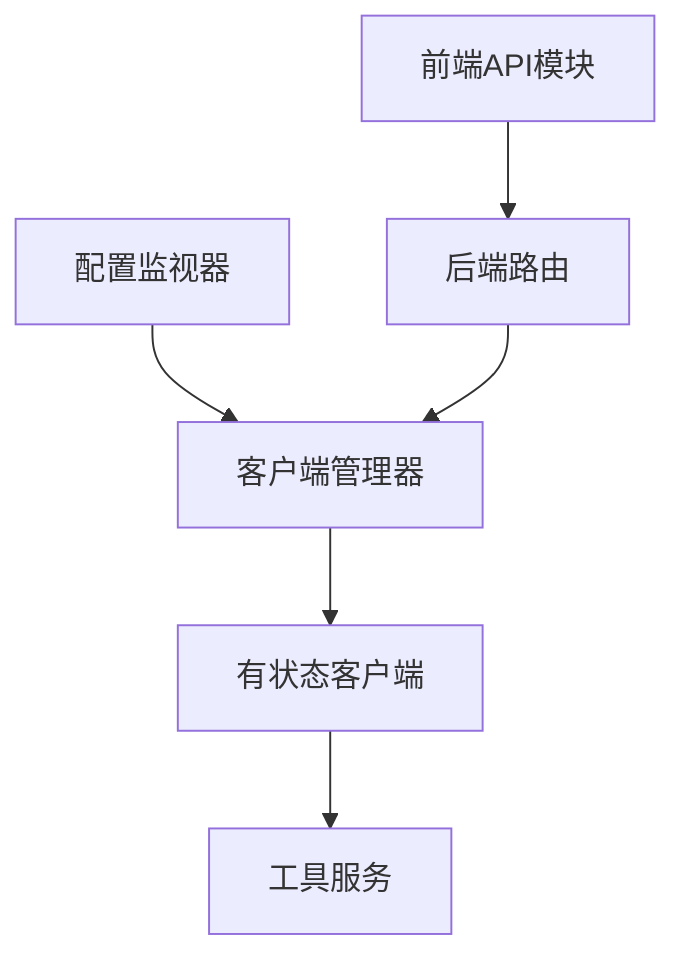

# MCP集成

<cite>
**本文引用的文件**
- [src/qwenpaw/app/mcp/__init__.py](file://src/qwenpaw/app/mcp/__init__.py)
- [src/qwenpaw/app/mcp/manager.py](file://src/qwenpaw/app/mcp/manager.py)
- [src/qwenpaw/app/mcp/stateful_client.py](file://src/qwenpaw/app/mcp/stateful_client.py)
- [src/qwenpaw/app/mcp/watcher.py](file://src/qwenpaw/app/mcp/watcher.py)
- [src/qwenpaw/app/routers/mcp.py](file://src/qwenpaw/app/routers/mcp.py)
- [console/src/api/modules/mcp.ts](file://console/src/api/modules/mcp.ts)
- [console/src/api/types/mcp.ts](file://console/src/api/types/mcp.ts)
- [console/src/pages/Agent/MCP/index.tsx](file://console/src/pages/Agent/MCP/index.tsx)
- [console/src/pages/Agent/MCP/useMCP.ts](file://console/src/pages/Agent/MCP/useMCP.ts)
- [console/src/pages/Agent/MCP/components/MCPClientCard.tsx](file://console/src/pages/Agent/MCP/components/MCPClientCard.tsx)
- [website/public/docs/mcp.en.md](file://website/public/docs/mcp.en.md)
- [website/public/docs/mcp.zh.md](file://website/public/docs/mcp.zh.md)
</cite>

## 目录
1. [简介](#简介)
2. [项目结构](#项目结构)
3. [核心组件](#核心组件)
4. [架构总览](#架构总览)
5. [详细组件分析](#详细组件分析)
6. [依赖关系分析](#依赖关系分析)
7. [性能考虑](#性能考虑)
8. [故障排除指南](#故障排除指南)
9. [结论](#结论)
10. [附录](#附录)

## 简介
本文件为QwenPaw中MCP（模型上下文协议）集成的系统化技术文档。重点覆盖以下方面：
- MCP协议工作原理与工具发现机制
- 状态管理与客户端生命周期管理
- 客户端状态保持、连接管理与错误处理策略
- MCP监视器的实现原理：工具变更监听与自动重连
- 配置方法、API使用示例与最佳实践
- 版本兼容性、性能优化建议与故障排除指南
- 为开发者提供的MCP工具开发与集成完整指导

## 项目结构
MCP集成由后端Python模块与前端TypeScript模块共同构成，形成“配置—客户端—监视器—路由—前端控制台”的完整链路。

**图表来源**
- [src/qwenpaw/app/mcp/__init__.py:1-20](file://src/qwenpaw/app/mcp/__init__.py#L1-L20)
- [src/qwenpaw/app/mcp/manager.py:1-120](file://src/qwenpaw/app/mcp/manager.py#L1-L120)
- [src/qwenpaw/app/mcp/stateful_client.py:1-200](file://src/qwenpaw/app/mcp/stateful_client.py#L1-L200)
- [src/qwenpaw/app/mcp/watcher.py:1-120](file://src/qwenpaw/app/mcp/watcher.py#L1-L120)
- [src/qwenpaw/app/routers/mcp.py:1-200](file://src/qwenpaw/app/routers/mcp.py#L1-L200)
- [console/src/api/modules/mcp.ts:1-200](file://console/src/api/modules/mcp.ts#L1-L200)
- [console/src/api/types/mcp.ts:1-150](file://console/src/api/types/mcp.ts#L1-L150)
- [console/src/pages/Agent/MCP/index.tsx:1-200](file://console/src/pages/Agent/MCP/index.tsx#L1-L200)
- [console/src/pages/Agent/MCP/useMCP.ts:1-200](file://console/src/pages/Agent/MCP/useMCP.ts#L1-L200)
- [console/src/pages/Agent/MCP/components/MCPClientCard.tsx:1-150](file://console/src/pages/Agent/MCP/components/MCPClientCard.tsx#L1-L150)

**章节来源**
- [src/qwenpaw/app/mcp/__init__.py:1-20](file://src/qwenpaw/app/mcp/__init__.py#L1-L20)
- [src/qwenpaw/app/mcp/manager.py:1-120](file://src/qwenpaw/app/mcp/manager.py#L1-L120)
- [src/qwenpaw/app/mcp/stateful_client.py:1-200](file://src/qwenpaw/app/mcp/stateful_client.py#L1-L200)
- [src/qwenpaw/app/mcp/watcher.py:1-120](file://src/qwenpaw/app/mcp/watcher.py#L1-L120)
- [src/qwenpaw/app/routers/mcp.py:1-200](file://src/qwenpaw/app/routers/mcp.py#L1-L200)
- [console/src/api/modules/mcp.ts:1-200](file://console/src/api/modules/mcp.ts#L1-L200)
- [console/src/api/types/mcp.ts:1-150](file://console/src/api/types/mcp.ts#L1-L150)
- [console/src/pages/Agent/MCP/index.tsx:1-200](file://console/src/pages/Agent/MCP/index.tsx#L1-L200)
- [console/src/pages/Agent/MCP/useMCP.ts:1-200](file://console/src/pages/Agent/MCP/useMCP.ts#L1-L200)
- [console/src/pages/Agent/MCP/components/MCPClientCard.tsx:1-150](file://console/src/pages/Agent/MCP/components/MCPClientCard.tsx#L1-L150)

## 核心组件
- 客户端管理器（MCPClientManager）
  - 负责从配置初始化客户端、运行时替换、清理与并发安全
  - 提供统一的客户端生命周期管理接口
- 有状态客户端（HttpStatefulClient / StdIOStatefulClient）
  - 支持HTTP与标准输入输出两种传输方式
  - 实现状态保持、会话管理与工具调用封装
- 配置监视器（MCPConfigWatcher）
  - 周期性轮询配置文件或配置加载函数
  - 检测变更并触发客户端热重载，带失败重试保护
- 后端路由（app/routers/mcp.py）
  - 提供MCP相关HTTP接口，与管理器交互
- 前端API与控制台（console/src/api/modules/mcp.ts, 页面与组件）
  - 提供MCP配置查询、更新、客户端状态展示与操作

**章节来源**
- [src/qwenpaw/app/mcp/manager.py:23-120](file://src/qwenpaw/app/mcp/manager.py#L23-L120)
- [src/qwenpaw/app/mcp/stateful_client.py:1-200](file://src/qwenpaw/app/mcp/stateful_client.py#L1-L200)
- [src/qwenpaw/app/mcp/watcher.py:1-120](file://src/qwenpaw/app/mcp/watcher.py#L1-L120)
- [src/qwenpaw/app/routers/mcp.py:1-200](file://src/qwenpaw/app/routers/mcp.py#L1-L200)
- [console/src/api/modules/mcp.ts:1-200](file://console/src/api/modules/mcp.ts#L1-L200)
- [console/src/pages/Agent/MCP/index.tsx:1-200](file://console/src/pages/Agent/MCP/index.tsx#L1-L200)

## 架构总览
下图展示了MCP从配置到客户端、再到监视与路由的整体架构，以及前后端交互路径。

**图表来源**
- [src/qwenpaw/app/mcp/watcher.py:1-120](file://src/qwenpaw/app/mcp/watcher.py#L1-L120)
- [src/qwenpaw/app/mcp/manager.py:23-120](file://src/qwenpaw/app/mcp/manager.py#L23-L120)
- [src/qwenpaw/app/mcp/stateful_client.py:1-200](file://src/qwenpaw/app/mcp/stateful_client.py#L1-L200)
- [src/qwenpaw/app/routers/mcp.py:1-200](file://src/qwenpaw/app/routers/mcp.py#L1-L200)
- [console/src/api/modules/mcp.ts:1-200](file://console/src/api/modules/mcp.ts#L1-L200)

## 详细组件分析

### 客户端管理器（MCPClientManager）
- 职责
  - 初始化：从配置加载多个客户端实例
  - 运行时替换：在配置变更时平滑替换客户端，避免重启应用
  - 清理：关闭与释放资源
  - 并发安全：通过锁保证多任务环境下的状态一致性
- 关键点
  - 客户端字典按唯一键维护，支持动态增删改
  - 与有状态客户端解耦，便于扩展不同传输方式
  - 设计上与通道管理器模式一致，便于理解与维护

**图表来源**
- [src/qwenpaw/app/mcp/manager.py:23-120](file://src/qwenpaw/app/mcp/manager.py#L23-L120)
- [src/qwenpaw/app/mcp/stateful_client.py:1-200](file://src/qwenpaw/app/mcp/stateful_client.py#L1-L200)

**章节来源**
- [src/qwenpaw/app/mcp/manager.py:23-120](file://src/qwenpaw/app/mcp/manager.py#L23-L120)

### 有状态客户端（HttpStatefulClient / StdIOStatefulClient）
- 职责
  - 封装与远端MCP服务的连接与通信
  - 维护会话状态，支持工具发现与调用
  - 处理连接异常与重连逻辑
- 传输方式
  - HTTP：基于HTTP请求/响应的同步/异步交互
  - 标准输入输出：通过进程I/O进行双向通信
- 状态保持
  - 保存当前会话上下文，避免重复握手
  - 在工具调用前后维持一致性

**图表来源**
- [console/src/pages/Agent/MCP/useMCP.ts:1-200](file://console/src/pages/Agent/MCP/useMCP.ts#L1-L200)
- [console/src/api/modules/mcp.ts:1-200](file://console/src/api/modules/mcp.ts#L1-L200)
- [src/qwenpaw/app/routers/mcp.py:1-200](file://src/qwenpaw/app/routers/mcp.py#L1-L200)
- [src/qwenpaw/app/mcp/manager.py:23-120](file://src/qwenpaw/app/mcp/manager.py#L23-L120)
- [src/qwenpaw/app/mcp/stateful_client.py:1-200](file://src/qwenpaw/app/mcp/stateful_client.py#L1-L200)

**章节来源**
- [src/qwenpaw/app/mcp/stateful_client.py:1-200](file://src/qwenpaw/app/mcp/stateful_client.py#L1-L200)

### 配置监视器（MCPConfigWatcher）
- 职责
  - 周期性轮询配置（文件mtime或加载函数返回值）
  - 对比上次快照，检测配置变更
  - 触发管理器进行客户端热重载
- 变更检测
  - 文件路径：记录上次修改时间，比较变化
  - 加载函数：对配置对象计算哈希，比较差异
- 重试与防抖
  - 记录每个客户端的失败次数与最近配置哈希
  - 限制最大重试次数，避免无限重试导致资源耗尽
- 并发控制
  - 使用任务跟踪正在进行的重载，防止阻塞

**图表来源**
- [src/qwenpaw/app/mcp/watcher.py:1-120](file://src/qwenpaw/app/mcp/watcher.py#L1-L120)

**章节来源**
- [src/qwenpaw/app/mcp/watcher.py:1-120](file://src/qwenpaw/app/mcp/watcher.py#L1-L120)

### 后端路由（app/routers/mcp.py）
- 职责
  - 提供MCP配置的查询与更新接口
  - 与客户端管理器交互，执行配置应用与状态查询
- 接口要点
  - GET /mcp/config：返回当前MCP配置
  - POST /mcp/config：接收新配置并应用
  - 其他工具相关接口：如工具列表、调用等（根据具体实现）

**图表来源**
- [src/qwenpaw/app/routers/mcp.py:1-200](file://src/qwenpaw/app/routers/mcp.py#L1-L200)
- [src/qwenpaw/app/mcp/manager.py:23-120](file://src/qwenpaw/app/mcp/manager.py#L23-L120)
- [src/qwenpaw/app/mcp/watcher.py:1-120](file://src/qwenpaw/app/mcp/watcher.py#L1-L120)

**章节来源**
- [src/qwenpaw/app/routers/mcp.py:1-200](file://src/qwenpaw/app/routers/mcp.py#L1-L200)

### 前端API与控制台（console/src/api/modules/mcp.ts, 类型与页面）
- API模块
  - 提供查询与更新MCP配置的函数
  - 封装HTTP请求与错误处理
- 类型定义
  - 定义MCP配置、客户端状态、工具描述等类型
- 页面与组件
  - 页面入口负责渲染MCP客户端卡片
  - 卡片组件展示单个客户端状态与操作按钮
  - useMCP钩子集中处理状态与副作用

**图表来源**
- [console/src/api/types/mcp.ts:1-150](file://console/src/api/types/mcp.ts#L1-L150)
- [console/src/api/modules/mcp.ts:1-200](file://console/src/api/modules/mcp.ts#L1-L200)
- [console/src/pages/Agent/MCP/index.tsx:1-200](file://console/src/pages/Agent/MCP/index.tsx#L1-L200)
- [console/src/pages/Agent/MCP/useMCP.ts:1-200](file://console/src/pages/Agent/MCP/useMCP.ts#L1-L200)
- [console/src/pages/Agent/MCP/components/MCPClientCard.tsx:1-150](file://console/src/pages/Agent/MCP/components/MCPClientCard.tsx#L1-L150)

**章节来源**
- [console/src/api/modules/mcp.ts:1-200](file://console/src/api/modules/mcp.ts#L1-L200)
- [console/src/api/types/mcp.ts:1-150](file://console/src/api/types/mcp.ts#L1-L150)
- [console/src/pages/Agent/MCP/index.tsx:1-200](file://console/src/pages/Agent/MCP/index.tsx#L1-L200)
- [console/src/pages/Agent/MCP/useMCP.ts:1-200](file://console/src/pages/Agent/MCP/useMCP.ts#L1-L200)
- [console/src/pages/Agent/MCP/components/MCPClientCard.tsx:1-150](file://console/src/pages/Agent/MCP/components/MCPClientCard.tsx#L1-L150)

## 依赖关系分析
- 组件内聚与耦合
  - 客户端管理器与有状态客户端松耦合，通过统一接口交互
  - 配置监视器仅依赖配置加载与管理器接口，职责清晰
  - 前端API模块与后端路由通过HTTP协议解耦
- 外部依赖
  - 异步事件循环（asyncio）用于并发与定时任务
  - HTTP客户端库用于与后端通信
  - 文件系统监控（mtime）或配置加载函数用于变更检测

**图表来源**
- [src/qwenpaw/app/mcp/watcher.py:1-120](file://src/qwenpaw/app/mcp/watcher.py#L1-L120)
- [src/qwenpaw/app/mcp/manager.py:23-120](file://src/qwenpaw/app/mcp/manager.py#L23-L120)
- [src/qwenpaw/app/mcp/stateful_client.py:1-200](file://src/qwenpaw/app/mcp/stateful_client.py#L1-L200)
- [console/src/api/modules/mcp.ts:1-200](file://console/src/api/modules/mcp.ts#L1-L200)
- [src/qwenpaw/app/routers/mcp.py:1-200](file://src/qwenpaw/app/routers/mcp.py#L1-L200)

**章节来源**
- [src/qwenpaw/app/mcp/__init__.py:1-20](file://src/qwenpaw/app/mcp/__init__.py#L1-L20)
- [src/qwenpaw/app/mcp/manager.py:23-120](file://src/qwenpaw/app/mcp/manager.py#L23-L120)
- [src/qwenpaw/app/mcp/stateful_client.py:1-200](file://src/qwenpaw/app/mcp/stateful_client.py#L1-L200)
- [src/qwenpaw/app/mcp/watcher.py:1-120](file://src/qwenpaw/app/mcp/watcher.py#L1-L120)
- [src/qwenpaw/app/routers/mcp.py:1-200](file://src/qwenpaw/app/routers/mcp.py#L1-L200)
- [console/src/api/modules/mcp.ts:1-200](file://console/src/api/modules/mcp.ts#L1-L200)

## 性能考虑
- 并发与锁
  - 使用锁保护客户端字典与重载流程，避免竞态条件
  - 重载任务独立跟踪，避免阻塞轮询线程
- 轮询间隔与退避
  - 合理设置轮询间隔，避免频繁IO与CPU占用
  - 失败重试采用指数退避，降低对远端服务的压力
- 连接复用
  - 有状态客户端应尽量复用连接，减少握手开销
  - 工具调用前检查连接有效性，必要时延迟重连
- 内存与资源
  - 管理器及时清理失效客户端与断开连接
  - 监视器记录失败次数，避免无限重试造成资源泄漏

## 故障排除指南
- 常见问题
  - 配置未生效：检查轮询是否正常、配置哈希是否变化、管理器是否收到新配置
  - 客户端无法连接：查看有状态客户端日志，确认网络/权限/认证信息
  - 自动重连失败：检查失败计数与最大重试阈值，确认是否存在不可恢复错误
- 排查步骤
  - 启用后端日志，观察管理器与监视器输出
  - 前端查看useMCP钩子返回的状态与错误信息
  - 使用后端路由接口手动验证配置与工具可用性
- 临时修复
  - 手动触发一次配置更新以绕过缓存
  - 重启监视器任务（如支持）以刷新内部状态

**章节来源**
- [src/qwenpaw/app/mcp/watcher.py:1-120](file://src/qwenpaw/app/mcp/watcher.py#L1-L120)
- [src/qwenpaw/app/mcp/stateful_client.py:1-200](file://src/qwenpaw/app/mcp/stateful_client.py#L1-L200)
- [console/src/pages/Agent/MCP/useMCP.ts:1-200](file://console/src/pages/Agent/MCP/useMCP.ts#L1-L200)

## 结论
QwenPaw的MCP集成通过“配置监视器 + 客户端管理器 + 有状态客户端”的分层设计，实现了热重载、状态保持与错误处理的平衡。前端通过API模块与路由对接，提供直观的配置与状态展示能力。整体架构具备良好的可扩展性与可维护性，适合在生产环境中稳定运行。

## 附录

### 配置方法与API使用示例
- 后端路由
  - 查询配置：GET /mcp/config
  - 更新配置：POST /mcp/config
- 前端API
  - 查询：mcp.ts中的查询函数
  - 更新：mcp.ts中的更新函数
- 控制台页面
  - 页面入口：Agent/MCP/index.tsx
  - 业务钩子：useMCP.ts
  - 展示组件：MCPClientCard.tsx

**章节来源**
- [src/qwenpaw/app/routers/mcp.py:1-200](file://src/qwenpaw/app/routers/mcp.py#L1-L200)
- [console/src/api/modules/mcp.ts:1-200](file://console/src/api/modules/mcp.ts#L1-L200)
- [console/src/pages/Agent/MCP/index.tsx:1-200](file://console/src/pages/Agent/MCP/index.tsx#L1-L200)
- [console/src/pages/Agent/MCP/useMCP.ts:1-200](file://console/src/pages/Agent/MCP/useMCP.ts#L1-L200)
- [console/src/pages/Agent/MCP/components/MCPClientCard.tsx:1-150](file://console/src/pages/Agent/MCP/components/MCPClientCard.tsx#L1-L150)

### 最佳实践
- 配置管理
  - 使用稳定的配置加载函数，确保返回值可哈希且语义明确
  - 为配置文件设置合理的轮询间隔，兼顾实时性与性能
- 客户端选择
  - 优先使用HTTP客户端以获得更好的可观测性与调试性
  - 标准输入输出适用于本地或受限环境
- 错误处理
  - 为每次重连设置最大重试次数与退避策略
  - 对不可恢复错误进行隔离，避免影响其他客户端
- 前端体验
  - 在页面中提供“刷新/重试”按钮，提升用户可控性
  - 分类展示客户端状态（在线/离线/错误），便于快速定位问题

### 版本兼容性与迁移建议
- 文档参考
  - 英文MCP文档：website/public/docs/mcp.en.md
  - 中文MCP文档：website/public/docs/mcp.zh.md
- 建议
  - 以官方MCP规范为准，逐步适配新版本特性
  - 在升级前先在测试环境验证配置与工具兼容性
  - 保留旧版配置的降级方案，确保平滑过渡

**章节来源**
- [website/public/docs/mcp.en.md:1-200](file://website/public/docs/mcp.en.md#L1-L200)
- [website/public/docs/mcp.zh.md:1-200](file://website/public/docs/mcp.zh.md#L1-L200)