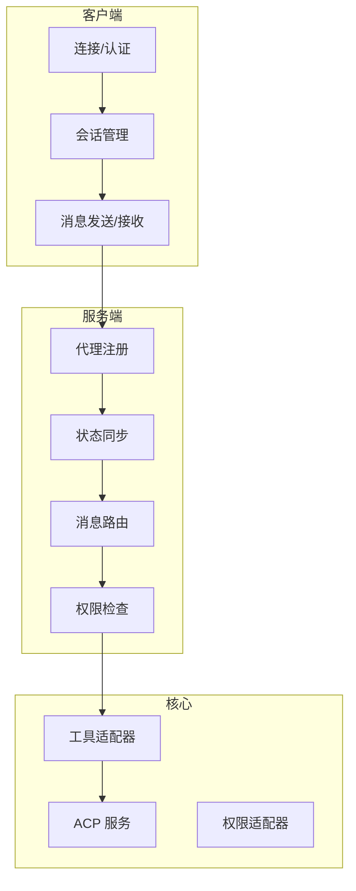
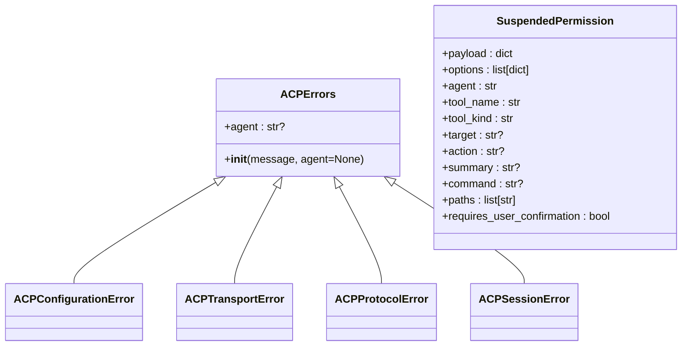
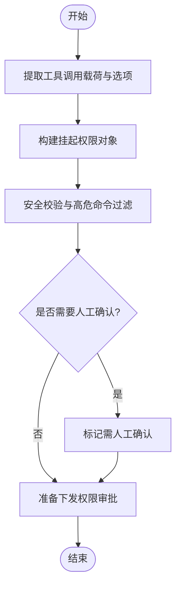
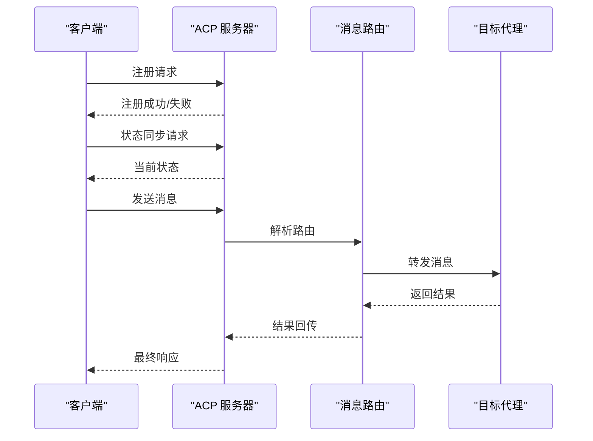
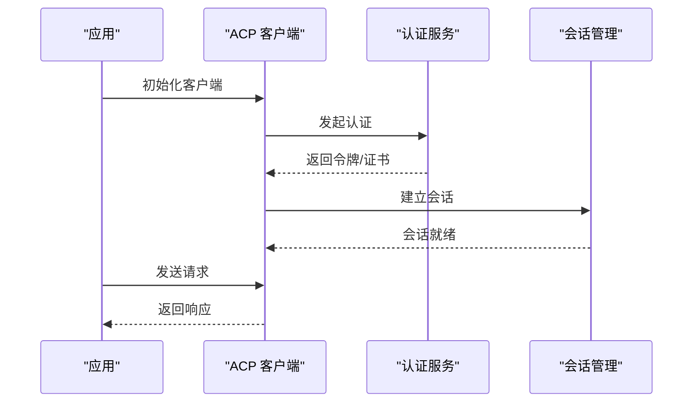
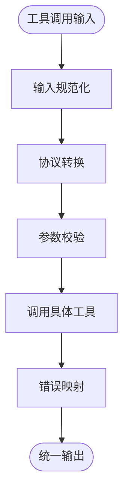
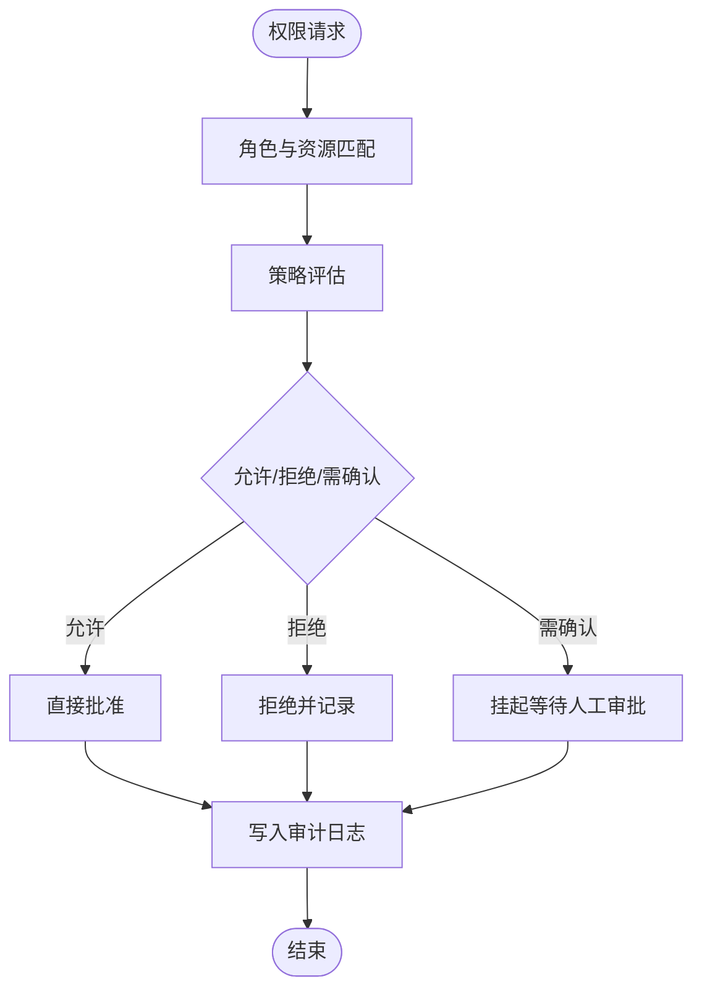
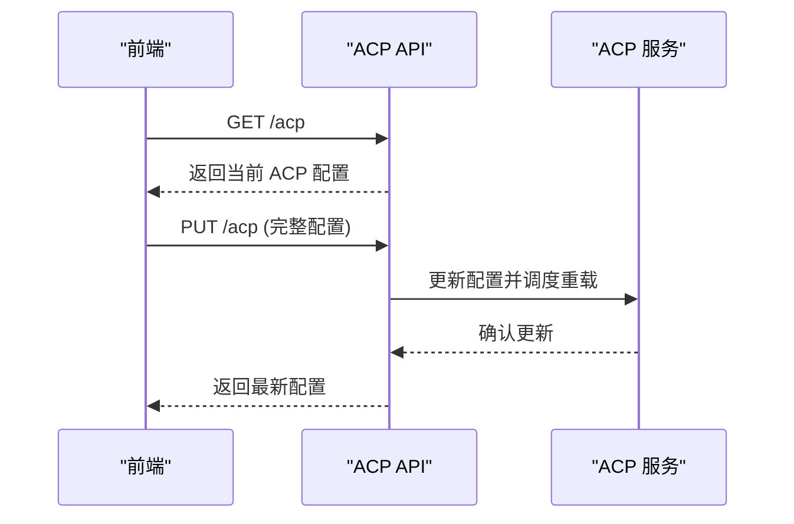
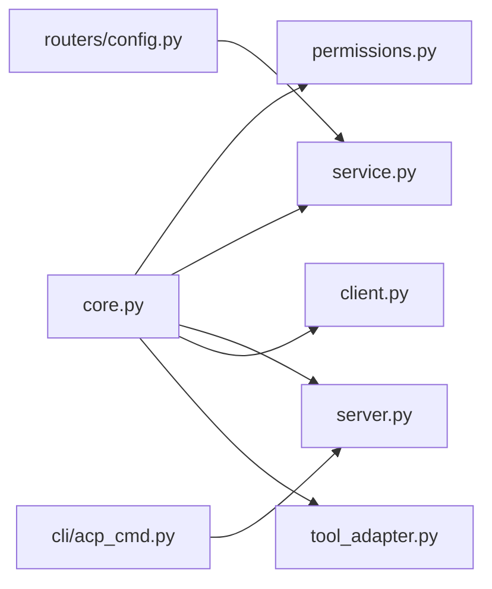

# 代理控制协议

<cite>
**本文引用的文件**
- [src/qwenpaw/agents/acp/__init__.py](file://src/qwenpaw/agents/acp/__init__.py)
- [src/qwenpaw/agents/acp/core.py](file://src/qwenpaw/agents/acp/core.py)
- [src/qwenpaw/agents/acp/permissions.py](file://src/qwenpaw/agents/acp/permissions.py)
- [src/qwenpaw/agents/acp/server.py](file://src/qwenpaw/agents/acp/server.py)
- [src/qwenpaw/agents/acp/client.py](file://src/qwenpaw/agents/acp/client.py)
- [src/qwenpaw/agents/acp/service.py](file://src/qwenpaw/agents/acp/service.py)
- [src/qwenpaw/agents/acp/tool_adapter.py](file://src/qwenpaw/agents/acp/tool_adapter.py)
- [src/qwenpaw/app/routers/config.py](file://src/qwenpaw/app/routers/config.py)
- [src/qwenpaw/cli/acp_cmd.py](file://src/qwenpaw/cli/acp_cmd.py)
- [website/public/docs/acp-integration.zh.md](file://website/public/docs/acp-integration.zh.md)
- [website/public/docs/acp-integration.en.md](file://website/public/docs/acp-integration.en.md)
</cite>

## 目录
1. [引言](#引言)
2. [项目结构](#项目结构)
3. [核心组件](#核心组件)
4. [架构总览](#架构总览)
5. [详细组件分析](#详细组件分析)
6. [依赖关系分析](#依赖关系分析)
7. [性能考量](#性能考量)
8. [故障排除指南](#故障排除指南)
9. [结论](#结论)
10. [附录](#附录)

## 引言
本技术文档系统性阐述 QwenPaw 的代理控制协议（Agent Control Protocol，简称 ACP）：从设计理念、通信机制与权限体系，到服务器端实现（代理注册、状态同步、消息路由）、客户端集成（连接建立、认证流程、会话管理），再到核心模块（代理协调、任务分发、结果聚合）与工具适配器（标准化、协议转换、错误处理）。文档同时提供面向企业级应用的多代理协作与管理方案，并给出完整的集成示例与故障排除建议。

## 项目结构
ACP 在后端 Python 模块中以“agents/acp”为核心目录组织，包含协议共享定义、权限适配、服务层、客户端与工具适配器等；前端 Console 提供 ACP 配置与集成入口；CLI 提供命令行工具；网站文档提供集成教程。

```mermaid
graph TB
subgraph "Python 后端"
ACPInit["agents/acp/__init__.py<br/>导出入口"]
Core["agents/acp/core.py<br/>共享定义/异常"]
Perm["agents/acp/permissions.py<br/>权限适配器"]
Srv["agents/acp/server.py<br/>ACP 服务器"]
Cli["agents/acp/client.py<br/>ACP 客户端"]
Svc["agents/acp/service.py<br/>ACP 服务/生命周期"]
TA["agents/acp/tool_adapter.py<br/>工具适配器"]
end
subgraph "API 路由"
RConfig["app/routers/config.py<br/>/acp 配置接口"]
end
subgraph "CLI"
CLI["cli/acp_cmd.py<br/>ACP 命令行"]
end
subgraph "前端与文档"
FE["console/src/api/modules/acp.ts<br/>前端 ACP API 模块"]
DOCZ["website/public/docs/acp-integration.zh.md"]
DOCE["website/public/docs/acp-integration.en.md"]
end
ACPInit --> Core
ACPInit --> Perm
ACPInit --> Srv
ACPInit --> Cli
ACPInit --> Svc
ACPInit --> TA
RConfig --> Svc
CLI --> Srv
FE --> RConfig
DOCZ -. 集成指引 .-> FE
DOCE -. 集成指引 .-> FE
```

图表来源
- [src/qwenpaw/agents/acp/__init__.py:1-33](file://src/qwenpaw/agents/acp/__init__.py#L1-L33)
- [src/qwenpaw/agents/acp/core.py:1-56](file://src/qwenpaw/agents/acp/core.py#L1-L56)
- [src/qwenpaw/agents/acp/permissions.py:1-52](file://src/qwenpaw/agents/acp/permissions.py#L1-L52)
- [src/qwenpaw/agents/acp/server.py](file://src/qwenpaw/agents/acp/server.py)
- [src/qwenpaw/agents/acp/client.py](file://src/qwenpaw/agents/acp/client.py)
- [src/qwenpaw/agents/acp/service.py:426-469](file://src/qwenpaw/agents/acp/service.py#L426-L469)
- [src/qwenpaw/app/routers/config.py:403-446](file://src/qwenpaw/app/routers/config.py#L403-L446)
- [src/qwenpaw/cli/acp_cmd.py](file://src/qwenpaw/cli/acp_cmd.py)
- [console/src/api/modules/acp.ts](file://console/src/api/modules/acp.ts)

章节来源
- [src/qwenpaw/agents/acp/__init__.py:1-33](file://src/qwenpaw/agents/acp/__init__.py#L1-L33)
- [src/qwenpaw/app/routers/config.py:403-446](file://src/qwenpaw/app/routers/config.py#L403-L446)

## 核心组件
- 协议共享定义与异常体系：统一的错误类型与权限挂起数据结构，确保客户端与服务器端一致的语义与容错。
- 权限适配器：将工具调用抽象为可审计、可阻断的“挂起权限”，并内置常见高危命令模式过滤。
- 服务层：提供 ACP 服务实例化、会话管理、生命周期关闭与优雅退出。
- 服务器端：实现代理注册、状态同步、消息路由与会话生命周期管理。
- 客户端：负责连接建立、认证、会话维护与消息收发。
- 工具适配器：标准化不同工具的输入输出，进行协议转换与错误处理。
- 配置与路由：提供 /acp 获取与更新配置的 API，支持按代理维度配置。
- CLI：提供命令行工具以辅助 ACP 相关操作与诊断。

章节来源
- [src/qwenpaw/agents/acp/core.py:22-56](file://src/qwenpaw/agents/acp/core.py#L22-L56)
- [src/qwenpaw/agents/acp/permissions.py:20-52](file://src/qwenpaw/agents/acp/permissions.py#L20-L52)
- [src/qwenpaw/agents/acp/service.py:426-469](file://src/qwenpaw/agents/acp/service.py#L426-L469)
- [src/qwenpaw/app/routers/config.py:403-446](file://src/qwenpaw/app/routers/config.py#L403-L446)

## 架构总览
ACP 采用“服务端代理 + 客户端会话”的双端架构。服务端负责代理注册、状态同步与消息路由；客户端负责连接、认证与会话管理；权限适配器贯穿工具调用链路，确保安全可控；工具适配器对不同工具进行协议转换与标准化；配置路由提供运行时配置下发与更新。



图表来源
- [src/qwenpaw/agents/acp/server.py](file://src/qwenpaw/agents/acp/server.py)
- [src/qwenpaw/agents/acp/client.py](file://src/qwenpaw/agents/acp/client.py)
- [src/qwenpaw/agents/acp/service.py:426-469](file://src/qwenpaw/agents/acp/service.py#L426-L469)
- [src/qwenpaw/agents/acp/permissions.py:20-52](file://src/qwenpaw/agents/acp/permissions.py#L20-L52)
- [src/qwenpaw/agents/acp/tool_adapter.py](file://src/qwenpaw/agents/acp/tool_adapter.py)

## 详细组件分析

### 协议共享定义与异常体系
- 设计理念：通过统一的数据类与异常类型，确保客户端与服务器端在协议层面保持一致性，便于扩展与维护。
- 关键点：
  - 统一异常基类与子类（配置错误、传输错误、协议错误、会话错误）。
  - 权限挂起数据结构，承载工具调用载荷、选项、目标、动作、摘要、命令与路径等信息。
- 复杂度与性能：数据结构为 O(1) 初始化与字段访问；异常抛出与捕获成本低，适合高频调用场景。



图表来源
- [src/qwenpaw/agents/acp/core.py:22-56](file://src/qwenpaw/agents/acp/core.py#L22-L56)

章节来源
- [src/qwenpaw/agents/acp/core.py:22-56](file://src/qwenpaw/agents/acp/core.py#L22-L56)

### 权限适配器
- 功能概述：将工具调用抽象为“挂起权限”，提取关键元信息（名称、类型、目标、动作、摘要、命令、路径等），并进行高危命令模式过滤。
- 关键点：
  - 构建挂起权限：从工具调用与选项中抽取必要字段，形成统一的权限请求对象。
  - 安全策略：内置常见高危命令模式列表，用于阻断或要求人工确认。
- 复杂度与性能：构建过程线性于选项数量；字符串匹配开销小，适合实时决策。



图表来源
- [src/qwenpaw/agents/acp/permissions.py:20-52](file://src/qwenpaw/agents/acp/permissions.py#L20-L52)

章节来源
- [src/qwenpaw/agents/acp/permissions.py:20-52](file://src/qwenpaw/agents/acp/permissions.py#L20-L52)

### ACP 服务与生命周期
- 服务职责：提供 ACP 服务实例化、获取与关闭；在进程退出时优雅关闭所有会话。
- 关键点：
  - 运行时事件循环检测与任务调度，确保在不同运行环境下都能正确关闭会话。
  - 注册退出钩子，保证服务在进程终止前完成清理。
- 性能与可靠性：异步关闭避免阻塞主线程；并发关闭多个会话提升吞吐。

```mermaid
sequenceDiagram
participant Proc as "进程"
participant Svc as "ACP 服务"
participant Loop as "事件循环"
Proc->>Svc : 初始化服务
Proc->>Loop : 注册退出钩子
Proc->>Svc : 关闭服务
Svc->>Loop : 检测运行状态
alt 运行中
Svc->>Loop : 创建任务关闭会话
else 已停止
Svc->>Loop : 等待事件循环就绪
Svc->>Loop : 批量关闭会话
end
Loop-->>Svc : 完成
Svc-->>Proc : 清理完成
```

图表来源
- [src/qwenpaw/agents/acp/service.py:426-469](file://src/qwenpaw/agents/acp/service.py#L426-L469)

章节来源
- [src/qwenpaw/agents/acp/service.py:426-469](file://src/qwenpaw/agents/acp/service.py#L426-L469)

### ACP 服务器端实现
- 代理注册：接收新代理加入请求，分配标识并初始化状态。
- 状态同步：周期性或触发式同步代理状态，保证一致性。
- 消息路由：根据目标与路由规则转发消息，支持广播与定向。
- 会话管理：维护会话生命周期，处理断线重连与超时。



图表来源
- [src/qwenpaw/agents/acp/server.py](file://src/qwenpaw/agents/acp/server.py)

章节来源
- [src/qwenpaw/agents/acp/server.py](file://src/qwenpaw/agents/acp/server.py)

### ACP 客户端集成
- 连接建立：解析配置，建立持久连接，处理握手与心跳。
- 认证流程：支持令牌或证书认证，失败时重试与降级策略。
- 会话管理：维护会话上下文，处理断线重连、超时与幂等重放。



图表来源
- [src/qwenpaw/agents/acp/client.py](file://src/qwenpaw/agents/acp/client.py)

章节来源
- [src/qwenpaw/agents/acp/client.py](file://src/qwenpaw/agents/acp/client.py)

### 工具适配器
- 作用：标准化不同工具的输入输出格式，进行协议转换与错误处理，降低上层耦合。
- 关键点：
  - 输入规范化：统一参数命名与类型。
  - 输出归一化：统一返回结构与错误码。
  - 错误映射：将底层错误映射为 ACP 友好的错误类型。



图表来源
- [src/qwenpaw/agents/acp/tool_adapter.py](file://src/qwenpaw/agents/acp/tool_adapter.py)

章节来源
- [src/qwenpaw/agents/acp/tool_adapter.py](file://src/qwenpaw/agents/acp/tool_adapter.py)

### 权限控制系统
- 角色定义：基于代理身份与工具调用上下文定义角色与权限集合。
- 访问控制：在消息路由前执行权限检查，结合挂起权限与人工确认流程。
- 审计日志：记录权限请求、审批与执行轨迹，支持回溯与合规。



图表来源
- [src/qwenpaw/agents/acp/permissions.py:20-52](file://src/qwenpaw/agents/acp/permissions.py#L20-L52)

章节来源
- [src/qwenpaw/agents/acp/permissions.py:20-52](file://src/qwenpaw/agents/acp/permissions.py#L20-L52)

### 配置与路由
- 配置接口：提供获取与更新 ACP 配置的 API，支持按代理维度配置。
- 集成要点：前端通过 ACP API 模块与后端路由交互，实现配置下发与变更通知。



图表来源
- [src/qwenpaw/app/routers/config.py:403-446](file://src/qwenpaw/app/routers/config.py#L403-L446)

章节来源
- [src/qwenpaw/app/routers/config.py:403-446](file://src/qwenpaw/app/routers/config.py#L403-L446)

## 依赖关系分析
- 模块内聚：ACP 子模块围绕“共享定义—权限—服务—客户端—工具适配器”形成清晰层次。
- 外部依赖：权限适配器依赖工具调用的 schema；服务层依赖事件循环与会话管理；客户端依赖网络与认证模块。
- 耦合控制：通过统一的共享定义与异常体系降低耦合；工具适配器隔离不同工具差异。



图表来源
- [src/qwenpaw/agents/acp/__init__.py:1-33](file://src/qwenpaw/agents/acp/__init__.py#L1-L33)
- [src/qwenpaw/app/routers/config.py:403-446](file://src/qwenpaw/app/routers/config.py#L403-L446)
- [src/qwenpaw/cli/acp_cmd.py](file://src/qwenpaw/cli/acp_cmd.py)

章节来源
- [src/qwenpaw/agents/acp/__init__.py:1-33](file://src/qwenpaw/agents/acp/__init__.py#L1-L33)
- [src/qwenpaw/app/routers/config.py:403-446](file://src/qwenpaw/app/routers/config.py#L403-L446)

## 性能考量
- 事件驱动与异步：服务层与客户端均采用异步模型，减少阻塞，提高并发处理能力。
- 会话复用：客户端与服务器端尽量复用连接与会话，降低握手与认证开销。
- 权限预检：在进入工具调用前进行权限与安全检查，避免无效调用带来的资源浪费。
- 日志与监控：审计日志与指标埋点有助于定位性能瓶颈与异常路径。

## 故障排除指南
- 连接失败
  - 检查网络连通性与认证凭据。
  - 查看事件循环状态与会话关闭流程，确保无阻塞。
- 权限被拒
  - 核对工具调用是否命中高危命令模式。
  - 检查挂起权限字段是否完整，确认审批流程是否触发。
- 配置不生效
  - 确认 PUT /acp 请求已成功保存并触发代理重载。
  - 核对前端 ACP API 模块与后端路由版本一致性。
- 服务未关闭
  - 检查退出钩子是否注册，事件循环是否处于运行态。
  - 如非运行态，确认是否在新事件循环中完成关闭。

章节来源
- [src/qwenpaw/agents/acp/service.py:426-469](file://src/qwenpaw/agents/acp/service.py#L426-L469)
- [src/qwenpaw/app/routers/config.py:403-446](file://src/qwenpaw/app/routers/config.py#L403-L446)

## 结论
ACP 协议通过清晰的模块划分与统一的异常/权限模型，实现了安全、可观测且可扩展的代理控制能力。其服务端与客户端协同工作，配合权限适配器与工具适配器，能够满足企业级多代理协作与管理需求。建议在生产环境中启用严格的权限策略与审计日志，并结合异步与会话复用优化性能。

## 附录
- 集成示例与配置
  - 参考网站文档中的集成教程，了解前端 ACP API 使用与后端配置下发流程。
  - 使用 CLI 命令行工具辅助诊断与运维。
- 多代理管理
  - 通过按代理维度的配置与路由策略，实现跨代理的任务编排与结果聚合。
- 故障排除清单
  - 连接、认证、权限、配置、服务关闭等常见问题的排查步骤与注意事项。

章节来源
- [website/public/docs/acp-integration.zh.md](file://website/public/docs/acp-integration.zh.md)
- [website/public/docs/acp-integration.en.md](file://website/public/docs/acp-integration.en.md)
- [src/qwenpaw/cli/acp_cmd.py](file://src/qwenpaw/cli/acp_cmd.py)