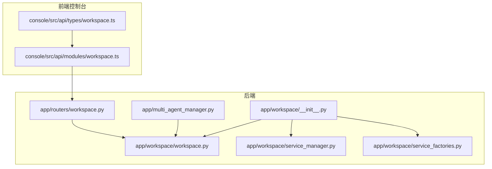
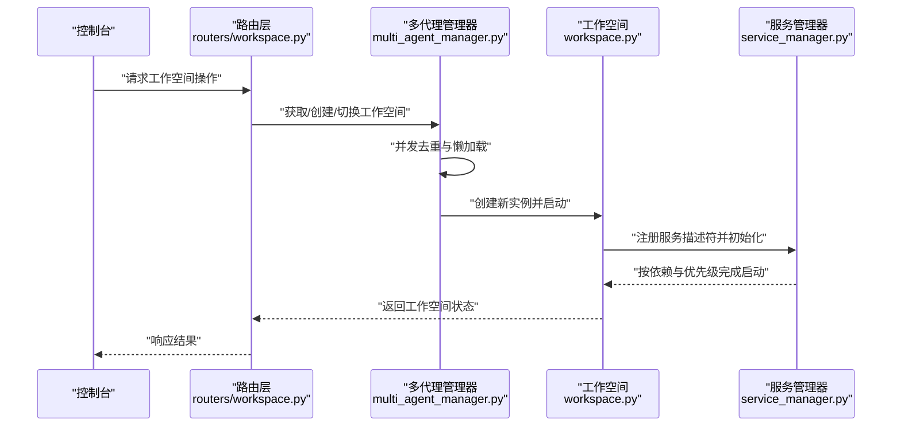
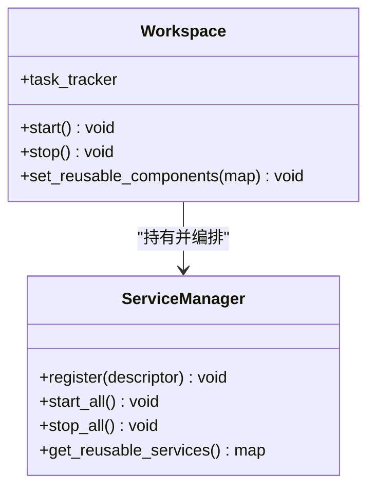
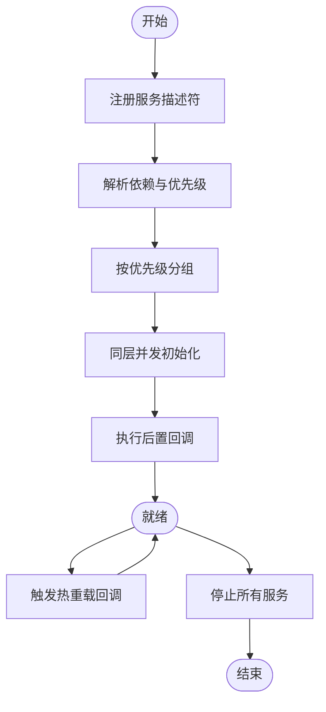
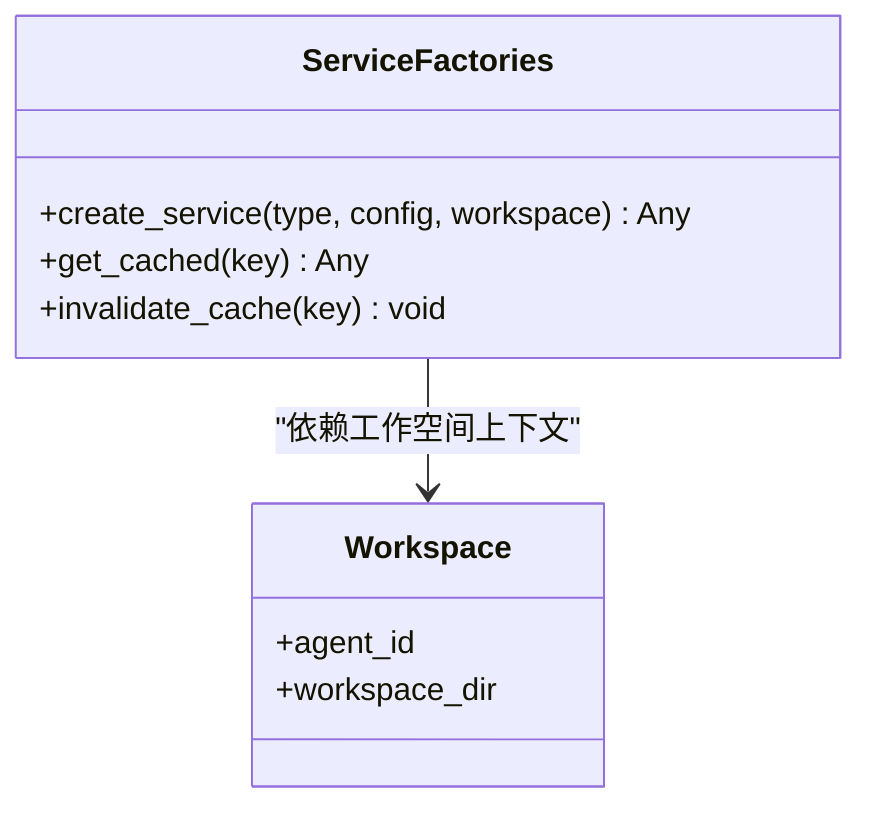
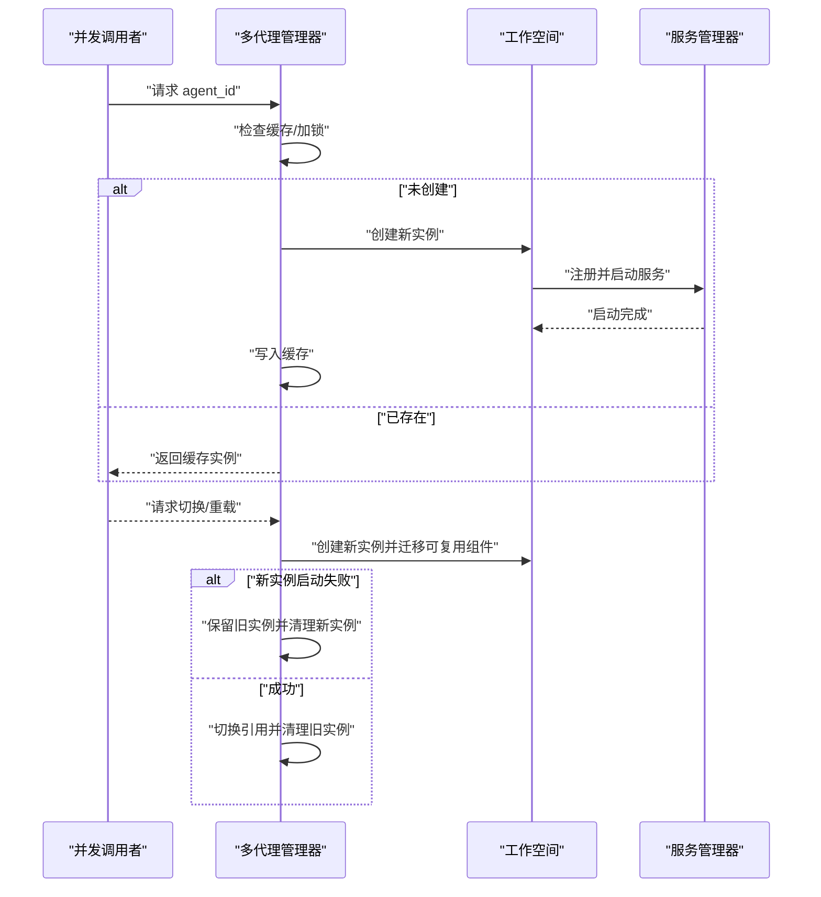
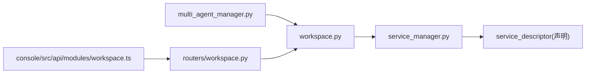

# 工作空间管理

<cite>
**本文引用的文件**
- [src/qwenpaw/app/workspace/__init__.py](file://src/qwenpaw/app/workspace/__init__.py)
- [src/qwenpaw/app/workspace/workspace.py](file://src/qwenpaw/app/workspace/workspace.py)
- [src/qwenpaw/app/workspace/service_manager.py](file://src/qwenpaw/app/workspace/service_manager.py)
- [src/qwenpaw/app/workspace/service_factories.py](file://src/qwenpaw/app/workspace/service_factories.py)
- [src/qwenpaw/app/multi_agent_manager.py](file://src/qwenpaw/app/multi_agent_manager.py)
- [src/qwenpaw/app/routers/workspace.py](file://src/qwenpaw/app/routers/workspace.py)
- [console/src/api/modules/workspace.ts](file://console/src/api/modules/workspace.ts)
- [console/src/api/types/workspace.ts](file://console/src/api/types/workspace.ts)
- [tests/unit/workspace/test_workspace.py](file://tests/unit/workspace/test_workspace.py)
- [tests/unit/app/test_agents_workspace_initialization.py](file://tests/unit/app/test_agents_workspace_initialization.py)
</cite>

## 目录
1. [简介](#简介)
2. [项目结构](#项目结构)
3. [核心组件](#核心组件)
4. [架构总览](#架构总览)
5. [详细组件分析](#详细组件分析)
6. [依赖关系分析](#依赖关系分析)
7. [性能考虑](#性能考虑)
8. [故障排查指南](#故障排查指南)
9. [结论](#结论)
10. [附录](#附录)

## 简介
本技术文档围绕 QwenPaw 的“工作空间管理”能力展开，系统性阐述其架构设计与实现细节，重点覆盖以下方面：
- 多租户支持：通过按代理（Agent）隔离的工作空间实现资源与状态的天然分隔
- 资源隔离与权限控制：基于工作空间边界的服务注册与生命周期管理，结合运行时任务跟踪与错误隔离
- 服务管理器：统一的服务注册、依赖解析、并发初始化、可复用组件迁移与热重载
- 服务工厂：面向不同服务类型的实例化、配置注入与缓存策略
- 启动流程、健康检查与故障恢复：从多代理管理器到工作空间的完整链路
- 性能优化、监控指标与扩展开发指导：面向企业级部署的最佳实践

## 项目结构
工作空间管理相关代码主要位于后端 Python 模块与前端控制台 API 层：
- 后端模块
  - app/workspace：工作空间与服务管理核心实现
  - app/multi_agent_manager：多代理（多租户）工作空间的创建、复用与切换
  - app/routers/workspace.py：工作空间相关 API 路由
- 前端控制台
  - console/src/api/modules/workspace.ts：工作空间 API 客户端
  - console/src/api/types/workspace.ts：工作空间相关类型定义

**图表来源**
- [src/qwenpaw/app/workspace/__init__.py:1-13](file://src/qwenpaw/app/workspace/__init__.py#L1-L13)
- [src/qwenpaw/app/workspace/workspace.py](file://src/qwenpaw/app/workspace/workspace.py)
- [src/qwenpaw/app/workspace/service_manager.py:76-161](file://src/qwenpaw/app/workspace/service_manager.py#L76-L161)
- [src/qwenpaw/app/workspace/service_factories.py](file://src/qwenpaw/app/workspace/service_factories.py)
- [src/qwenpaw/app/multi_agent_manager.py:42-343](file://src/qwenpaw/app/multi_agent_manager.py#L42-L343)
- [src/qwenpaw/app/routers/workspace.py](file://src/qwenpaw/app/routers/workspace.py)
- [console/src/api/modules/workspace.ts](file://console/src/api/modules/workspace.ts)
- [console/src/api/types/workspace.ts](file://console/src/api/types/workspace.ts)

**章节来源**
- [src/qwenpaw/app/workspace/__init__.py:1-13](file://src/qwenpaw/app/workspace/__init__.py#L1-L13)

## 核心组件
- 工作空间（Workspace）
  - 单个代理实例的容器，负责服务注册、启动/停止、任务跟踪与资源释放
- 服务管理器（ServiceManager）
  - 统一编排服务组件的生命周期，支持依赖解析、并发初始化、可复用组件迁移与热重载
- 服务描述符（ServiceDescriptor）
  - 声明式服务配置，包含类/工厂、初始化参数、后置回调、启动/停止方法、依赖列表、优先级与并发策略等
- 服务工厂（ServiceFactories）
  - 面向不同服务类型的实例化策略与配置注入
- 多代理管理器（MultiAgentManager）
  - 支持多租户场景下的工作空间懒加载、去重与并行初始化，以及平滑切换与回滚

**章节来源**
- [src/qwenpaw/app/workspace/__init__.py:1-13](file://src/qwenpaw/app/workspace/__init__.py#L1-L13)
- [src/qwenpaw/app/workspace/service_manager.py:53-74](file://src/qwenpaw/app/workspace/service_manager.py#L53-L74)
- [src/qwenpaw/app/multi_agent_manager.py:42-343](file://src/qwenpaw/app/multi_agent_manager.py#L42-L343)

## 架构总览
下图展示了从多代理管理器到工作空间与服务管理器的整体交互，以及前端控制台对工作空间 API 的调用。

**图表来源**
- [src/qwenpaw/app/routers/workspace.py](file://src/qwenpaw/app/routers/workspace.py)
- [src/qwenpaw/app/multi_agent_manager.py:42-343](file://src/qwenpaw/app/multi_agent_manager.py#L42-L343)
- [src/qwenpaw/app/workspace/workspace.py](file://src/qwenpaw/app/workspace/workspace.py)
- [src/qwenpaw/app/workspace/service_manager.py:76-161](file://src/qwenpaw/app/workspace/service_manager.py#L76-L161)

## 详细组件分析

### 工作空间（Workspace）
- 角色定位
  - 作为单个代理实例的容器，承载服务注册、启动/停止、任务跟踪与资源释放
- 关键职责
  - 与服务管理器协作完成服务的注册与生命周期管理
  - 提供可复用组件的设置接口，用于在热重载或实例切换时迁移资源
- 并发与一致性
  - 在多代理管理器中通过锁与事件协调，避免重复创建与竞态条件

**图表来源**
- [src/qwenpaw/app/workspace/workspace.py](file://src/qwenpaw/app/workspace/workspace.py)
- [src/qwenpaw/app/workspace/service_manager.py:76-161](file://src/qwenpaw/app/workspace/service_manager.py#L76-L161)

**章节来源**
- [src/qwenpaw/app/workspace/workspace.py](file://src/qwenpaw/app/workspace/workspace.py)
- [src/qwenpaw/app/multi_agent_manager.py:42-343](file://src/qwenpaw/app/multi_agent_manager.py#L42-L343)

### 服务管理器（ServiceManager）
- 设计要点
  - 声明式服务描述符：集中定义服务类、初始化参数、后置回调、启动/停止方法、依赖与优先级
  - 依赖解析与拓扑排序：按优先级与依赖关系进行有序启动/停止
  - 并发初始化：支持同层服务并行启动以提升启动效率
  - 可复用组件迁移：在实例切换或热重载时迁移可复用服务，降低重启成本
  - 热重载回调：支持在替换实例后执行自定义重载逻辑
- 生命周期流程

**图表来源**
- [src/qwenpaw/app/workspace/service_manager.py:76-161](file://src/qwenpaw/app/workspace/service_manager.py#L76-L161)

**章节来源**
- [src/qwenpaw/app/workspace/service_manager.py:53-74](file://src/qwenpaw/app/workspace/service_manager.py#L53-L74)
- [src/qwenpaw/app/workspace/service_manager.py:76-161](file://src/qwenpaw/app/workspace/service_manager.py#L76-L161)

### 服务工厂（ServiceFactories）
- 设计模式
  - 工厂方法：根据服务类型与配置动态创建实例
  - 配置注入：将工作空间上下文与运行时参数注入到服务构造函数
  - 缓存机制：对可复用服务进行缓存，减少重复创建开销
- 适用场景
  - 数据库连接池、消息队列客户端、外部 API 客户端等需要共享与复用的资源

**图表来源**
- [src/qwenpaw/app/workspace/service_factories.py](file://src/qwenpaw/app/workspace/service_factories.py)

**章节来源**
- [src/qwenpaw/app/workspace/service_factories.py](file://src/qwenpaw/app/workspace/service_factories.py)

### 多代理管理器（MultiAgentManager）
- 多租户支持
  - 按 agent_id 隔离工作空间，确保资源与状态互不干扰
- 懒加载与去重
  - 并发请求同一 agent_id 时，仅首次创建，其余等待完成
- 平滑切换与回滚
  - 创建新实例并迁移可复用组件，失败时保留旧实例继续服务
- 并发初始化
  - 锁仅用于字典检查与变更，不阻塞慢启动过程，提升整体吞吐

**图表来源**
- [src/qwenpaw/app/multi_agent_manager.py:42-343](file://src/qwenpaw/app/multi_agent_manager.py#L42-L343)
- [src/qwenpaw/app/workspace/service_manager.py:148-158](file://src/qwenpaw/app/workspace/service_manager.py#L148-L158)

**章节来源**
- [src/qwenpaw/app/multi_agent_manager.py:42-343](file://src/qwenpaw/app/multi_agent_manager.py#L42-L343)

### 控制台 API 与类型
- 控制台通过模块化的 API 客户端与后端路由对接，实现工作空间的查询、启动、停止与配置更新
- 类型定义保证前后端数据结构一致，便于扩展与维护

**章节来源**
- [console/src/api/modules/workspace.ts](file://console/src/api/modules/workspace.ts)
- [console/src/api/types/workspace.ts](file://console/src/api/types/workspace.ts)
- [src/qwenpaw/app/routers/workspace.py](file://src/qwenpaw/app/routers/workspace.py)

## 依赖关系分析
- 组件耦合
  - Workspace 强依赖 ServiceManager 进行服务编排
  - MultiAgentManager 强依赖 Workspace 进行实例化与切换
  - ServiceManager 依赖 ServiceDescriptor 进行声明式配置
- 外部依赖
  - 前端控制台通过 API 与后端路由交互
  - 测试用例覆盖工作空间初始化与多代理管理器行为

**图表来源**
- [src/qwenpaw/app/multi_agent_manager.py:42-343](file://src/qwenpaw/app/multi_agent_manager.py#L42-L343)
- [src/qwenpaw/app/workspace/workspace.py](file://src/qwenpaw/app/workspace/workspace.py)
- [src/qwenpaw/app/workspace/service_manager.py:76-161](file://src/qwenpaw/app/workspace/service_manager.py#L76-L161)
- [src/qwenpaw/app/routers/workspace.py](file://src/qwenpaw/app/routers/workspace.py)
- [console/src/api/modules/workspace.ts](file://console/src/api/modules/workspace.ts)

**章节来源**
- [src/qwenpaw/app/multi_agent_manager.py:42-343](file://src/qwenpaw/app/multi_agent_manager.py#L42-L343)
- [src/qwenpaw/app/workspace/service_manager.py:76-161](file://src/qwenpaw/app/workspace/service_manager.py#L76-L161)
- [src/qwenpaw/app/routers/workspace.py](file://src/qwenpaw/app/routers/workspace.py)

## 性能考虑
- 启动性能
  - 同层服务并发初始化：通过优先级分组与并发策略缩短启动时间
  - 可复用组件迁移：避免重复创建昂贵资源（如数据库连接池、外部客户端）
- 并发与锁粒度
  - 多代理管理器中的锁仅用于缓存检查与更新，不阻塞慢启动流程，提高整体吞吐
- 内存与资源
  - 服务工厂缓存与可复用组件迁移降低内存占用与重建成本
- 监控与可观测性
  - 建议在服务管理器与工作空间中增加启动耗时、依赖解析耗时、热重载成功率等指标埋点
  - 对异常与回滚路径进行日志分级与告警联动

[本节为通用性能建议，无需特定文件引用]

## 故障排查指南
- 启动失败
  - 检查服务描述符的依赖是否满足、启动方法是否存在、初始化参数是否正确
  - 查看服务管理器的日志输出，定位具体失败的服务与异常栈
- 切换失败
  - 若新实例启动失败，多代理管理器会保留旧实例；确认新实例的可复用组件迁移是否成功
- 热重载异常
  - 确认 reload_func 是否正确实现，避免在重载过程中阻塞或抛出未捕获异常
- 并发问题
  - 若出现竞态或重复创建，检查多代理管理器的锁使用与缓存更新逻辑

**章节来源**
- [src/qwenpaw/app/workspace/service_manager.py:136-147](file://src/qwenpaw/app/workspace/service_manager.py#L136-L147)
- [src/qwenpaw/app/multi_agent_manager.py:329-343](file://src/qwenpaw/app/multi_agent_manager.py#L329-L343)

## 结论
QwenPaw 的工作空间管理通过“工作空间 + 服务管理器 + 服务工厂”的组合，实现了多租户隔离、资源复用与高效启动。多代理管理器进一步增强了并发与稳定性，配合声明式服务描述符与热重载机制，满足企业级部署对弹性与可运维性的要求。

[本节为总结性内容，无需特定文件引用]

## 附录
- 单元测试参考
  - 工作空间初始化与行为验证
  - 多代理工作空间初始化与切换行为
- 扩展开发建议
  - 新增服务时遵循 ServiceDescriptor 的声明式配置
  - 对昂贵资源采用服务工厂缓存与可复用组件迁移
  - 在路由层新增 API 时保持与控制台类型定义一致

**章节来源**
- [tests/unit/workspace/test_workspace.py](file://tests/unit/workspace/test_workspace.py)
- [tests/unit/app/test_agents_workspace_initialization.py](file://tests/unit/app/test_agents_workspace_initialization.py)