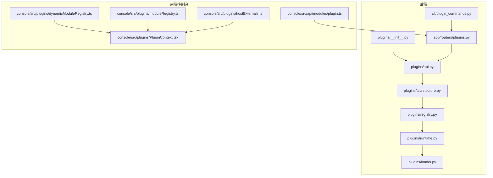
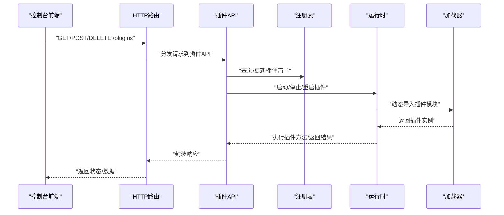
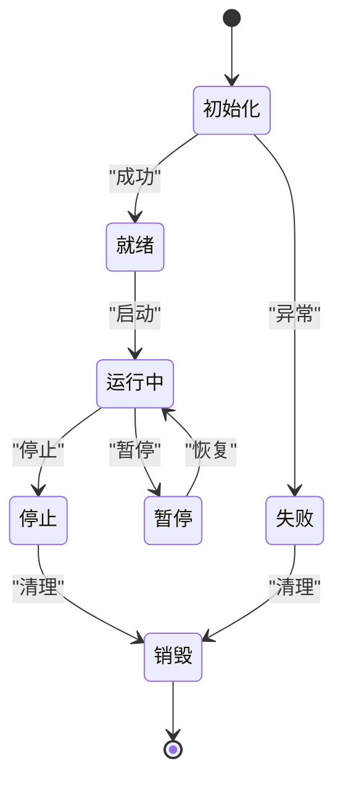
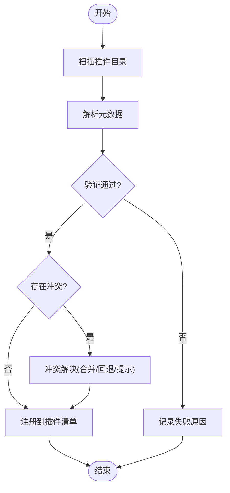
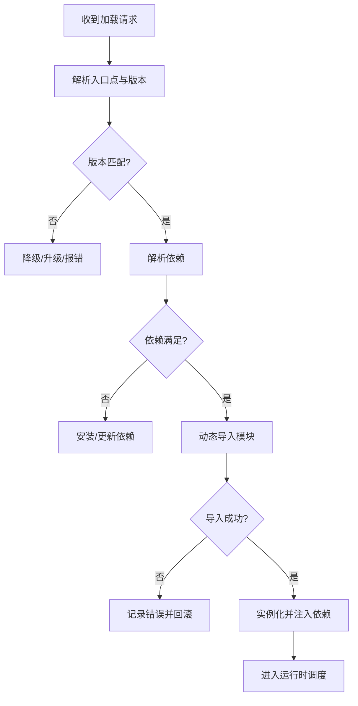
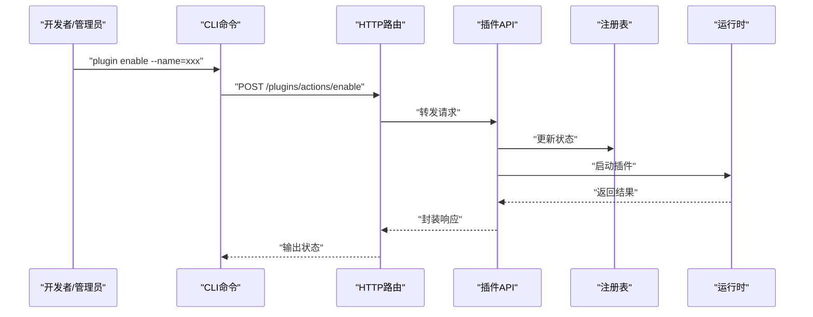
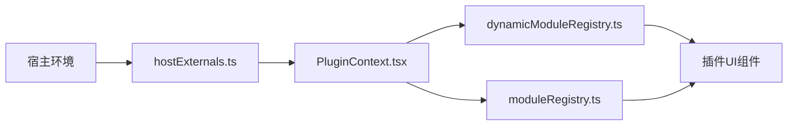
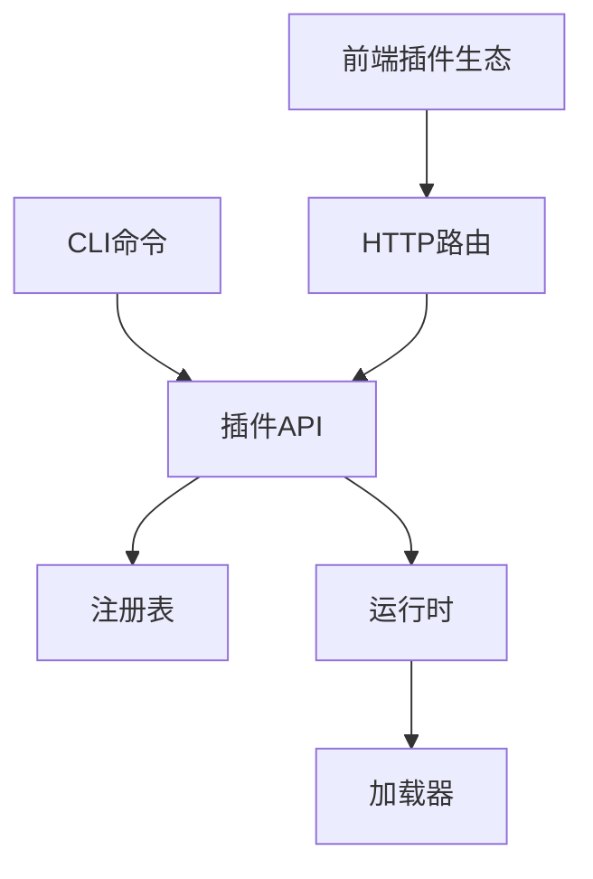

# 插件系统

<cite>
**本文引用的文件**
- [src/qwenpaw/plugins/__init__.py](file://src/qwenpaw/plugins/__init__.py)
- [src/qwenpaw/plugins/api.py](file://src/qwenpaw/plugins/api.py)
- [src/qwenpaw/plugins/architecture.py](file://src/qwenpaw/plugins/architecture.py)
- [src/qwenpaw/plugins/loader.py](file://src/qwenpaw/plugins/loader.py)
- [src/qwenpaw/plugins/registry.py](file://src/qwenpaw/plugins/registry.py)
- [src/qwenpaw/plugins/runtime.py](file://src/qwenpaw/plugins/runtime.py)
- [src/qwenpaw/cli/plugin_commands.py](file://src/qwenpaw/cli/plugin_commands.py)
- [src/qwenpaw/app/routers/plugins.py](file://src/qwenpaw/app/routers/plugins.py)
- [console/src/api/modules/plugin.ts](file://console/src/api/modules/plugin.ts)
- [console/src/plugins/dynamicModuleRegistry.ts](file://console/src/plugins/dynamicModuleRegistry.ts)
- [console/src/plugins/moduleRegistry.ts](file://console/src/plugins/moduleRegistry.ts)
- [console/src/plugins/PluginContext.tsx](file://console/src/plugins/PluginContext.tsx)
- [console/src/plugins/hostExternals.ts](file://console/src/plugins/hostExternals.ts)
</cite>

## 目录
1. [引言](#引言)
2. [项目结构](#项目结构)
3. [核心组件](#核心组件)
4. [架构总览](#架构总览)
5. [详细组件分析](#详细组件分析)
6. [依赖关系分析](#依赖关系分析)
7. [性能考虑](#性能考虑)
8. [故障排查指南](#故障排查指南)
9. [结论](#结论)
10. [附录](#附录)

## 引言
本文件面向QwenPaw的插件系统，系统性阐述其架构设计、模块化组织与动态加载机制；说明插件API接口规范、生命周期管理与依赖注入；解释插件注册表的发现、验证与冲突处理；梳理插件加载器的动态导入、版本管理与热重载流程；并提供开发指南、安全机制、性能监控与故障隔离的最佳实践，帮助开发者快速构建与集成高质量插件。

## 项目结构
QwenPaw的插件系统由后端Python实现与前端React控制台两部分组成：
- 后端：位于src/qwenpaw/plugins，提供插件API、架构定义、注册表、运行时与加载器等核心能力，并通过CLI命令与HTTP路由暴露给外部。
- 前端：位于console/src/plugins，提供动态模块注册表、宿主外部依赖桥接、插件上下文与模块注册表等，支撑控制台侧的插件管理与动态加载。

**图表来源**
- [src/qwenpaw/plugins/__init__.py](file://src/qwenpaw/plugins/__init__.py)
- [src/qwenpaw/plugins/api.py](file://src/qwenpaw/plugins/api.py)
- [src/qwenpaw/plugins/architecture.py](file://src/qwenpaw/plugins/architecture.py)
- [src/qwenpaw/plugins/registry.py](file://src/qwenpaw/plugins/registry.py)
- [src/qwenpaw/plugins/runtime.py](file://src/qwenpaw/plugins/runtime.py)
- [src/qwenpaw/plugins/loader.py](file://src/qwenpaw/plugins/loader.py)
- [src/qwenpaw/cli/plugin_commands.py](file://src/qwenpaw/cli/plugin_commands.py)
- [src/qwenpaw/app/routers/plugins.py](file://src/qwenpaw/app/routers/plugins.py)
- [console/src/api/modules/plugin.ts](file://console/src/api/modules/plugin.ts)
- [console/src/plugins/dynamicModuleRegistry.ts](file://console/src/plugins/dynamicModuleRegistry.ts)
- [console/src/plugins/moduleRegistry.ts](file://console/src/plugins/moduleRegistry.ts)
- [console/src/plugins/PluginContext.tsx](file://console/src/plugins/PluginContext.tsx)
- [console/src/plugins/hostExternals.ts](file://console/src/plugins/hostExternals.ts)

**章节来源**
- [src/qwenpaw/plugins/__init__.py](file://src/qwenpaw/plugins/__init__.py)
- [src/qwenpaw/plugins/api.py](file://src/qwenpaw/plugins/api.py)
- [src/qwenpaw/plugins/architecture.py](file://src/qwenpaw/plugins/architecture.py)
- [src/qwenpaw/plugins/registry.py](file://src/qwenpaw/plugins/registry.py)
- [src/qwenpaw/plugins/runtime.py](file://src/qwenpaw/plugins/runtime.py)
- [src/qwenpaw/plugins/loader.py](file://src/qwenpaw/plugins/loader.py)
- [src/qwenpaw/cli/plugin_commands.py](file://src/qwenpaw/cli/plugin_commands.py)
- [src/qwenpaw/app/routers/plugins.py](file://src/qwenpaw/app/routers/plugins.py)
- [console/src/api/modules/plugin.ts](file://console/src/api/modules/plugin.ts)
- [console/src/plugins/dynamicModuleRegistry.ts](file://console/src/plugins/dynamicModuleRegistry.ts)
- [console/src/plugins/moduleRegistry.ts](file://console/src/plugins/moduleRegistry.ts)
- [console/src/plugins/PluginContext.tsx](file://console/src/plugins/PluginContext.tsx)
- [console/src/plugins/hostExternals.ts](file://console/src/plugins/hostExternals.ts)

## 核心组件
- 插件API（api.py）：定义插件对外接口、能力声明与调用约定，统一插件与宿主交互协议。
- 架构定义（architecture.py）：描述插件的抽象模型、生命周期阶段与依赖注入点位。
- 注册表（registry.py）：维护已安装/启用插件清单、元数据校验与冲突检测。
- 运行时（runtime.py）：负责插件实例化、生命周期调度、错误隔离与资源回收。
- 加载器（loader.py）：实现动态导入、版本解析、依赖解析与热重载策略。
- CLI命令（cli/plugin_commands.py）：提供插件安装、卸载、启停、状态查询等运维操作。
- HTTP路由（app/routers/plugins.py）：暴露REST接口供控制台或外部系统管理插件。
- 前端插件生态（console/plugins/*）：提供动态模块注册、宿主外部依赖桥接与插件上下文。

**章节来源**
- [src/qwenpaw/plugins/api.py](file://src/qwenpaw/plugins/api.py)
- [src/qwenpaw/plugins/architecture.py](file://src/qwenpaw/plugins/architecture.py)
- [src/qwenpaw/plugins/registry.py](file://src/qwenpaw/plugins/registry.py)
- [src/qwenpaw/plugins/runtime.py](file://src/qwenpaw/plugins/runtime.py)
- [src/qwenpaw/plugins/loader.py](file://src/qwenpaw/plugins/loader.py)
- [src/qwenpaw/cli/plugin_commands.py](file://src/qwenpaw/cli/plugin_commands.py)
- [src/qwenpaw/app/routers/plugins.py](file://src/qwenpaw/app/routers/plugins.py)
- [console/src/plugins/dynamicModuleRegistry.ts](file://console/src/plugins/dynamicModuleRegistry.ts)
- [console/src/plugins/moduleRegistry.ts](file://console/src/plugins/moduleRegistry.ts)
- [console/src/plugins/PluginContext.tsx](file://console/src/plugins/PluginContext.tsx)
- [console/src/plugins/hostExternals.ts](file://console/src/plugins/hostExternals.ts)

## 架构总览
下图展示从控制台到后端插件系统的端到端交互，涵盖注册表、运行时与加载器的关键节点。

**图表来源**
- [src/qwenpaw/app/routers/plugins.py](file://src/qwenpaw/app/routers/plugins.py)
- [src/qwenpaw/plugins/api.py](file://src/qwenpaw/plugins/api.py)
- [src/qwenpaw/plugins/registry.py](file://src/qwenpaw/plugins/registry.py)
- [src/qwenpaw/plugins/runtime.py](file://src/qwenpaw/plugins/runtime.py)
- [src/qwenpaw/plugins/loader.py](file://src/qwenpaw/plugins/loader.py)

## 详细组件分析

### 插件API与接口规范
- 职责：定义插件对外能力边界、事件回调、配置契约与错误码规范。
- 关键点：统一方法签名、参数校验、返回值结构；支持异步/同步两种模式；提供钩子扩展点。
- 集成方式：通过HTTP路由与CLI命令调用；前端通过API模块发起请求。

**章节来源**
- [src/qwenpaw/plugins/api.py](file://src/qwenpaw/plugins/api.py)
- [src/qwenpaw/app/routers/plugins.py](file://src/qwenpaw/app/routers/plugins.py)
- [console/src/api/modules/plugin.ts](file://console/src/api/modules/plugin.ts)

### 架构与生命周期
- 抽象模型：定义插件类型、能力矩阵、依赖关系与版本约束。
- 生命周期：初始化→就绪→运行→暂停/恢复→停止→销毁；每个阶段可挂载钩子。
- 依赖注入：在初始化阶段注入宿主服务、日志、配置与工具集。

**图表来源**
- [src/qwenpaw/plugins/architecture.py](file://src/qwenpaw/plugins/architecture.py)
- [src/qwenpaw/plugins/runtime.py](file://src/qwenpaw/plugins/runtime.py)

**章节来源**
- [src/qwenpaw/plugins/architecture.py](file://src/qwenpaw/plugins/architecture.py)
- [src/qwenpaw/plugins/runtime.py](file://src/qwenpaw/plugins/runtime.py)

### 注册表与冲突解决
- 发现机制：扫描插件目录、解析元数据、识别入口点与依赖。
- 验证规则：版本兼容性、依赖完整性、命名冲突、权限与安全基线。
- 冲突处理：优先级排序、版本回退、自动合并或提示人工干预。
- 状态管理：启用/禁用/待启用/失败等状态机与持久化存储。

**图表来源**
- [src/qwenpaw/plugins/registry.py](file://src/qwenpaw/plugins/registry.py)

**章节来源**
- [src/qwenpaw/plugins/registry.py](file://src/qwenpaw/plugins/registry.py)

### 运行时与依赖注入
- 实例化：根据注册表信息创建插件实例，注入宿主上下文与工具集。
- 生命周期调度：按阶段触发钩子，捕获异常并进入隔离态。
- 资源管理：统一关闭钩子、释放锁与临时文件，避免泄漏。
- 安全隔离：沙箱执行、超时控制、内存限制与信号处理。

**章节来源**
- [src/qwenpaw/plugins/runtime.py](file://src/qwenpaw/plugins/runtime.py)

### 加载器与动态导入
- 动态导入：基于模块路径与入口点进行importlib式动态加载。
- 版本管理：解析PEP 440语义版本，校验最小/最大兼容范围。
- 热重载：监听文件变更、对比哈希、按需重启实例，保证无损切换。
- 依赖解析：解析requirements.txt或pyproject.toml，确保运行环境满足。

**图表来源**
- [src/qwenpaw/plugins/loader.py](file://src/qwenpaw/plugins/loader.py)
- [src/qwenpaw/plugins/runtime.py](file://src/qwenpaw/plugins/runtime.py)

**章节来源**
- [src/qwenpaw/plugins/loader.py](file://src/qwenpaw/plugins/loader.py)
- [src/qwenpaw/plugins/runtime.py](file://src/qwenpaw/plugins/runtime.py)

### CLI与HTTP管理接口
- CLI命令：提供install/uninstall/enable/disable/reload/status等子命令，支持批量与交互式操作。
- HTTP路由：提供REST接口用于远程管理，支持分页、过滤与并发控制。
- 控制台集成：前端API模块封装请求，动态模块注册表与上下文驱动UI渲染。

**图表来源**
- [src/qwenpaw/cli/plugin_commands.py](file://src/qwenpaw/cli/plugin_commands.py)
- [src/qwenpaw/app/routers/plugins.py](file://src/qwenpaw/app/routers/plugins.py)
- [src/qwenpaw/plugins/api.py](file://src/qwenpaw/plugins/api.py)
- [src/qwenpaw/plugins/registry.py](file://src/qwenpaw/plugins/registry.py)
- [src/qwenpaw/plugins/runtime.py](file://src/qwenpaw/plugins/runtime.py)

**章节来源**
- [src/qwenpaw/cli/plugin_commands.py](file://src/qwenpaw/cli/plugin_commands.py)
- [src/qwenpaw/app/routers/plugins.py](file://src/qwenpaw/app/routers/plugins.py)
- [console/src/api/modules/plugin.ts](file://console/src/api/modules/plugin.ts)

### 前端插件生态与动态加载
- 动态模块注册表：集中管理插件模块映射，支持按需懒加载与缓存。
- 宿主外部依赖桥接：将宿主提供的全局对象映射为插件可访问的依赖。
- 插件上下文：提供配置、日志、事件总线与能力查询接口。
- 模块注册表：维护插件模块的生命周期与依赖关系，保障加载顺序与一致性。

**图表来源**
- [console/src/plugins/hostExternals.ts](file://console/src/plugins/hostExternals.ts)
- [console/src/plugins/PluginContext.tsx](file://console/src/plugins/PluginContext.tsx)
- [console/src/plugins/dynamicModuleRegistry.ts](file://console/src/plugins/dynamicModuleRegistry.ts)
- [console/src/plugins/moduleRegistry.ts](file://console/src/plugins/moduleRegistry.ts)

**章节来源**
- [console/src/plugins/hostExternals.ts](file://console/src/plugins/hostExternals.ts)
- [console/src/plugins/PluginContext.tsx](file://console/src/plugins/PluginContext.tsx)
- [console/src/plugins/dynamicModuleRegistry.ts](file://console/src/plugins/dynamicModuleRegistry.ts)
- [console/src/plugins/moduleRegistry.ts](file://console/src/plugins/moduleRegistry.ts)

## 依赖关系分析
- 组件耦合：API作为门面，向后依赖注册表与运行时；运行时依赖加载器完成动态导入；CLI与HTTP路由共同驱动API。
- 外部依赖：Python标准库与第三方包（如importlib、packaging、aiohttp等），前端依赖React与Vite生态。
- 循环依赖：通过分层与接口抽象避免循环导入；注册表与运行时通过契约解耦。

**图表来源**
- [src/qwenpaw/plugins/api.py](file://src/qwenpaw/plugins/api.py)
- [src/qwenpaw/plugins/registry.py](file://src/qwenpaw/plugins/registry.py)
- [src/qwenpaw/plugins/runtime.py](file://src/qwenpaw/plugins/runtime.py)
- [src/qwenpaw/plugins/loader.py](file://src/qwenpaw/plugins/loader.py)
- [src/qwenpaw/cli/plugin_commands.py](file://src/qwenpaw/cli/plugin_commands.py)
- [src/qwenpaw/app/routers/plugins.py](file://src/qwenpaw/app/routers/plugins.py)
- [console/src/plugins/dynamicModuleRegistry.ts](file://console/src/plugins/dynamicModuleRegistry.ts)
- [console/src/plugins/moduleRegistry.ts](file://console/src/plugins/moduleRegistry.ts)
- [console/src/plugins/PluginContext.tsx](file://console/src/plugins/PluginContext.tsx)
- [console/src/plugins/hostExternals.ts](file://console/src/plugins/hostExternals.ts)

**章节来源**
- [src/qwenpaw/plugins/api.py](file://src/qwenpaw/plugins/api.py)
- [src/qwenpaw/plugins/registry.py](file://src/qwenpaw/plugins/registry.py)
- [src/qwenpaw/plugins/runtime.py](file://src/qwenpaw/plugins/runtime.py)
- [src/qwenpaw/plugins/loader.py](file://src/qwenpaw/plugins/loader.py)
- [src/qwenpaw/cli/plugin_commands.py](file://src/qwenpaw/cli/plugin_commands.py)
- [src/qwenpaw/app/routers/plugins.py](file://src/qwenpaw/app/routers/plugins.py)
- [console/src/plugins/dynamicModuleRegistry.ts](file://console/src/plugins/dynamicModuleRegistry.ts)
- [console/src/plugins/moduleRegistry.ts](file://console/src/plugins/moduleRegistry.ts)
- [console/src/plugins/PluginContext.tsx](file://console/src/plugins/PluginContext.tsx)
- [console/src/plugins/hostExternals.ts](file://console/src/plugins/hostExternals.ts)

## 性能考虑
- 动态导入优化：缓存模块元数据与字节码，减少重复解析开销；按需懒加载，延迟初始化非关键模块。
- 并发与限流：对批量操作（安装/卸载/重载）设置并发上限与队列；对高频API调用实施速率限制。
- 内存与GC：及时释放未使用的模块引用，定期触发垃圾回收；对大对象采用生成器与流式处理。
- 监控指标：采集启动耗时、CPU/内存占用、错误率与热重载成功率，建立告警阈值。
- 热重载策略：仅在文件变更时触发重载，使用哈希校验避免无效重启；对长任务进行优雅中断。

[本节为通用性能建议，无需特定文件引用]

## 故障排查指南
- 常见问题定位：
  - 导入失败：检查入口点、依赖与Python路径；查看加载器日志与回滚记录。
  - 版本冲突：核对注册表中的版本约束与依赖树；必要时手动降级或升级。
  - 生命周期异常：确认钩子实现与宿主注入是否完整；检查运行时隔离日志。
- 排障步骤：
  - 使用CLI/status查看插件状态与最近错误。
  - 通过HTTP路由获取详细日志与堆栈信息。
  - 在控制台前端打开调试面板，观察动态模块注册与上下文注入。
- 回滚与恢复：当热重载失败时，自动回滚至上一个稳定版本；必要时手动执行卸载/重装。

**章节来源**
- [src/qwenpaw/cli/plugin_commands.py](file://src/qwenpaw/cli/plugin_commands.py)
- [src/qwenpaw/app/routers/plugins.py](file://src/qwenpaw/app/routers/plugins.py)
- [src/qwenpaw/plugins/loader.py](file://src/qwenpaw/plugins/loader.py)
- [src/qwenpaw/plugins/runtime.py](file://src/qwenpaw/plugins/runtime.py)
- [console/src/api/modules/plugin.ts](file://console/src/api/modules/plugin.ts)

## 结论
QwenPaw插件系统以清晰的分层与契约为核心，结合动态加载、版本管理与热重载能力，实现了高可扩展与强隔离的插件生态。通过注册表的严格验证与冲突解决、运行时的生命周期调度与依赖注入，以及前后端协同的动态模块体系，开发者可以高效地构建与维护高质量插件。建议在生产环境中配合完善的监控与安全策略，持续优化性能与稳定性。

[本节为总结性内容，无需特定文件引用]

## 附录

### 开发者指南
- 接口实现：遵循插件API规范，提供稳定的入口点与能力声明；在初始化阶段完成依赖注入与资源准备。
- 配置管理：使用宿主提供的配置中心，支持热更新；对敏感配置进行加密存储与访问控制。
- 调试技巧：开启详细日志与断点，利用运行时钩子输出诊断信息；在控制台前端启用调试模式观察模块加载过程。
- 测试策略：编写单元测试与集成测试，覆盖正常路径、异常路径与边界条件；模拟热重载与并发场景。

**章节来源**
- [src/qwenpaw/plugins/api.py](file://src/qwenpaw/plugins/api.py)
- [src/qwenpaw/plugins/architecture.py](file://src/qwenpaw/plugins/architecture.py)
- [src/qwenpaw/plugins/runtime.py](file://src/qwenpaw/plugins/runtime.py)
- [console/src/plugins/PluginContext.tsx](file://console/src/plugins/PluginContext.tsx)

### 安全机制与最佳实践
- 权限最小化：插件仅申请必要权限，避免全局写操作；对文件系统与网络访问进行白名单控制。
- 输入验证：对所有外部输入进行严格校验与清洗；对RPC调用增加参数与返回值schema校验。
- 隔离与审计：启用沙箱与容器化运行；记录关键操作日志与审计轨迹；对异常行为进行告警。
- 更新与补丁：建立自动化安全扫描与补丁推送流程；对高危漏洞实施强制升级策略。

[本节为通用安全建议，无需特定文件引用]