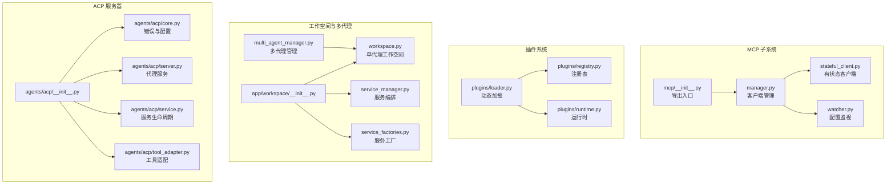
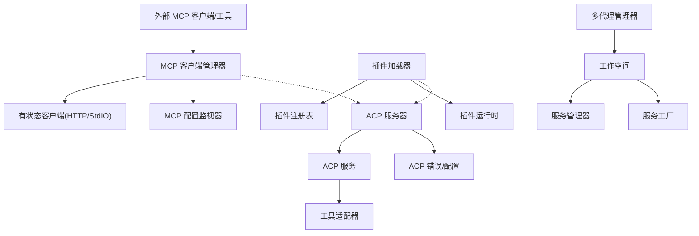
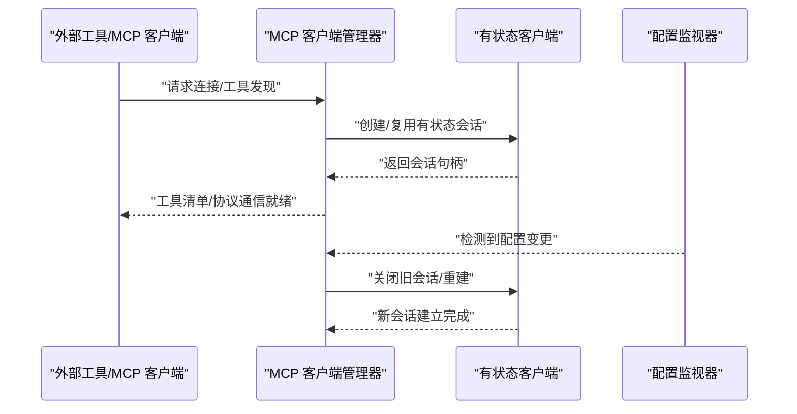
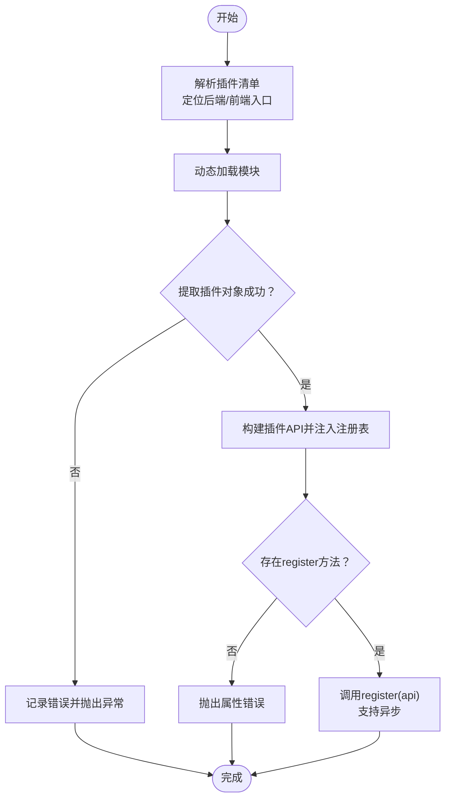
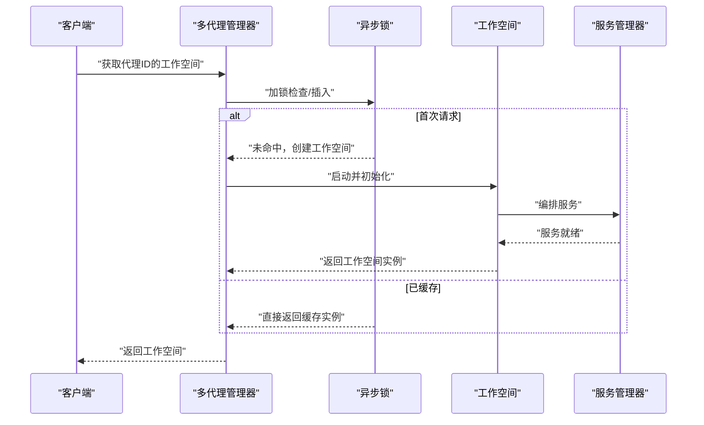
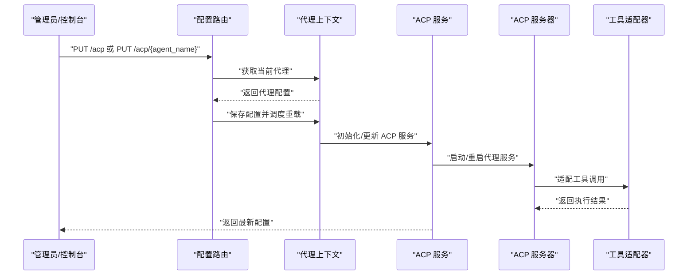
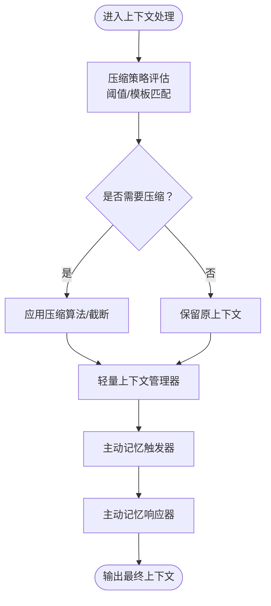
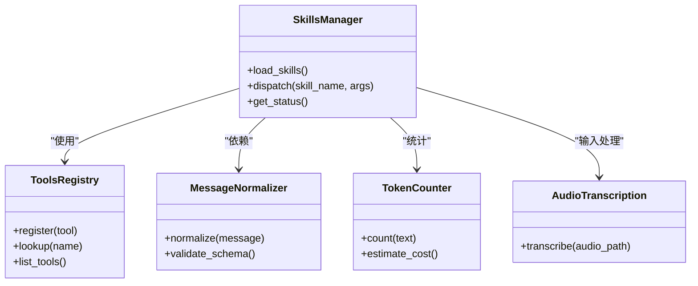
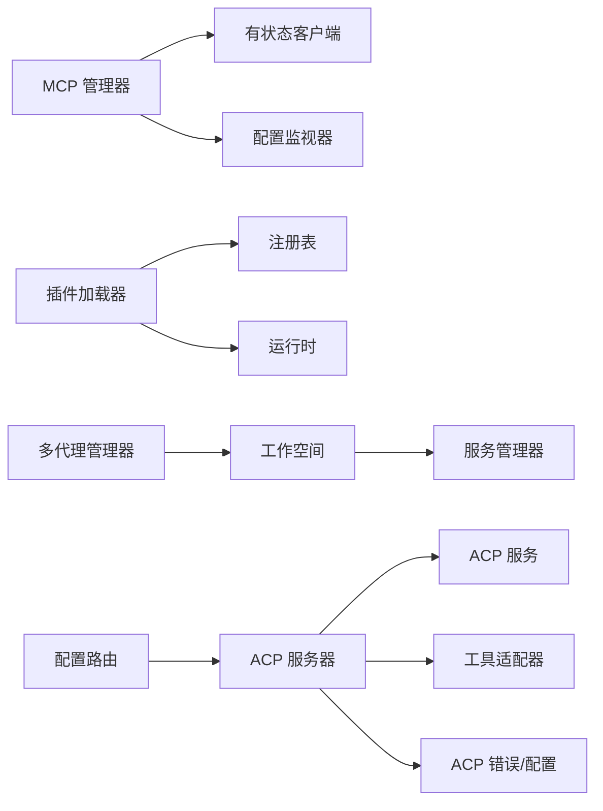

# 高级功能

<cite>
**本文引用的文件**
- [src/qwenpaw/app/mcp/__init__.py](file://src/qwenpaw/app/mcp/__init__.py)
- [src/qwenpaw/app/mcp/manager.py](file://src/qwenpaw/app/mcp/manager.py)
- [src/qwenpaw/app/mcp/stateful_client.py](file://src/qwenpaw/app/mcp/stateful_client.py)
- [src/qwenpaw/app/mcp/watcher.py](file://src/qwenpaw/app/mcp/watcher.py)
- [src/qwenpaw/plugins/loader.py](file://src/qwenpaw/plugins/loader.py)
- [src/qwenpaw/plugins/registry.py](file://src/qwenpaw/plugins/registry.py)
- [src/qwenpaw/plugins/runtime.py](file://src/qwenpaw/plugins/runtime.py)
- [src/qwenpaw/app/workspace/__init__.py](file://src/qwenpaw/app/workspace/__init__.py)
- [src/qwenpaw/app/workspace/workspace.py](file://src/qwenpaw/app/workspace/workspace.py)
- [src/qwenpaw/app/workspace/service_manager.py](file://src/qwenpaw/app/workspace/service_manager.py)
- [src/qwenpaw/app/workspace/service_factories.py](file://src/qwenpaw/app/workspace/service_factories.py)
- [src/qwenpaw/app/multi_agent_manager.py](file://src/qwenpaw/app/multi_agent_manager.py)
- [src/qwenpaw/agents/acp/__init__.py](file://src/qwenpaw/agents/acp/__init__.py)
- [src/qwenpaw/agents/acp/core.py](file://src/qwenpaw/agents/acp/core.py)
- [src/qwenpaw/agents/acp/server.py](file://src/qwenpaw/agents/acp/server.py)
- [src/qwenpaw/agents/acp/service.py](file://src/qwenpaw/agents/acp/service.py)
- [src/qwenpaw/agents/acp/tool_adapter.py](file://src/qwenpaw/agents/acp/tool_adapter.py)
- [src/qwenpaw/app/routers/config.py](file://src/qwenpaw/app/routers/config.py)
- [src/qwenpaw/agents/context/base_context_manager.py](file://src/qwenpaw/agents/context/base_context_manager.py)
- [src/qwenpaw/agents/context/light_context_manager.py](file://src/qwenpaw/agents/context/light_context_manager.py)
- [src/qwenpaw/agents/context/compactor_prompts.py](file://src/qwenpaw/agents/context/compactor_prompts.py)
- [src/qwenpaw/agents/context/as_msg_handler.py](file://src/qwenpaw/agents/context/as_msg_handler.py)
- [src/qwenpaw/agents/context/as_msg_stat.py](file://src/qwenpaw/agents/context/as_msg_stat.py)
- [src/qwenpaw/agents/tools/utils.py](file://src/qwenpaw/agents/tools/utils.py)
- [src/qwenpaw/agents/utils/registry.py](file://src/qwenpaw/agents/utils/registry.py)
- [src/qwenpaw/agents/utils/setup_utils.py](file://src/qwenpaw/agents/utils/setup_utils.py)
- [src/qwenpaw/agents/utils/message_processing.py](file://src/qwenpaw/agents/utils/message_processing.py)
- [src/qwenpaw/agents/utils/message_request_normalizer.py](file://src/qwenpaw/agents/utils/message_request_normalizer.py)
- [src/qwenpaw/agents/utils/token_counter.py](file://src/qwenpaw/agents/utils/token_counter.py)
- [src/qwenpaw/agents/utils/tool_message_utils.py](file://src/qwenpaw/agents/utils/tool_message_utils.py)
- [src/qwenpaw/agents/skills_hub.py](file://src/qwenpaw/agents/skills_hub.py)
- [src/qwenpaw/agents/skills_manager.py](file://src/qwenpaw/agents/skills_manager.py)
- [src/qwenpaw/agents/memory/base_memory_manager.py](file://src/qwenpaw/agents/memory/base_memory_manager.py)
- [src/qwenpaw/agents/memory/reme_light_memory_manager.py](file://src/qwenpaw/agents/memory/reme_light_memory_manager.py)
- [src/qwenpaw/agents/memory/proactive/proactive_prompts.py](file://src/qwenpaw/agents/memory/proactive/proactive_prompts.py)
- [src/qwenpaw/agents/memory/proactive/proactive_responder.py](file://src/qwenpaw/agents/memory/proactive/proactive_responder.py)
- [src/qwenpaw/agents/memory/proactive/proactive_trigger.py](file://src/qwenpaw/agents/memory/proactive/proactive_trigger.py)
- [src/qwenpaw/agents/memory/proactive/proactive_types.py](file://src/qwenpaw/agents/memory/proactive/proactive_types.py)
- [src/qwenpaw/agents/memory/proactive/proactive_utils.py](file://src/qwenpaw/agents/memory/proactive/proactive_utils.py)
- [src/qwenpaw/agents/mission/mission_runner.py](file://src/qwenpaw/agents/mission/mission_runner.py)
- [src/qwenpaw/agents/mission/state.py](file://src/qwenpaw/agents/mission/state.py)
- [src/qwenpaw/agents/mission/handler.py](file://src/qwenpaw/agents/mission/handler.py)
- [src/qwenpaw/agents/mission/prompts.py](file://src/qwenpaw/agents/mission/prompts.py)
- [src/qwenpaw/agents/command_handler.py](file://src/qwenpaw/agents/command_handler.py)
- [src/qwenpaw/agents/model_factory.py](file://src/qwenpaw/agents/model_factory.py)
- [src/qwenpaw/agents/schema.py](file://src/qwenpaw/agents/schema.py)
- [src/qwenpaw/agents/react_agent.py](file://src/qwenpaw/agents/react_agent.py)
- [src/qwenpaw/agents/tool_guard_mixin.py](file://src/qwenpaw/agents/tool_guard_mixin.py)
- [src/qwenpaw/agents/utils/estimate_token_counter.py](file://src/qwenpaw/agents/utils/estimate_token_counter.py)
- [src/qwenpaw/agents/utils/audio_transcription.py](file://src/qwenpaw/agents/utils/audio_transcription.py)
- [src/qwenpaw/agents/utils/file_handling.py](file://src/qwenpaw/agents/utils/file_handling.py)
- [src/qwenpaw/agents/utils/setup_utils.py](file://src/qwenpaw/agents/utils/setup_utils.py)
- [src/qwenpaw/agents/utils/registry.py](file://src/qwenpaw/agents/utils/registry.py)
- [src/qwenpaw/agents/utils/message_processing.py](file://src/qwenpaw/agents/utils/message_processing.py)
- [src/qwenpaw/agents/utils/message_request_normalizer.py](file://src/qwenpaw/agents/utils/message_request_normalizer.py)
- [src/qwenpaw/agents/utils/token_counter.py](file://src/qwenpaw/agents/utils/token_counter.py)
- [src/qwenpaw/agents/utils/tool_message_utils.py](file://src/qwenpaw/agents/utils/tool_message_utils.py)
- [src/qwenpaw/agents/utils/estimate_token_counter.py](file://src/qwenpaw/agents/utils/estimate_token_counter.py)
- [src/qwenpaw/agents/utils/audio_transcription.py](file://src/qwenpaw/agents/utils/audio_transcription.py)
- [src/qwenpaw/agents/utils/file_handling.py](file://src/qwenpaw/agents/utils/file_handling.py)
- [src/qwenpaw/agents/utils/setup_utils.py](file://src/qwenpaw/agents/utils/setup_utils.py)
- [src/qwenpaw/agents/utils/registry.py](file://src/qwenpaw/agents/utils/registry.py)
- [src/qwenpaw/agents/utils/message_processing.py](file://src/qwenpaw/agents/utils/message_processing.py)
- [src/qwenpaw/agents/utils/message_request_normalizer.py](file://src/qwenpaw/agents/utils/message_request_normalizer.py)
- [src/qwenpaw/agents/utils/token_counter.py](file://src/qwenpaw/agents/utils/token_counter.py)
- [src/qwenpaw/agents/utils/tool_message_utils.py](file://src/qwenpaw/agents/utils/tool_message_utils.py)
- [src/qwenpaw/agents/utils/estimate_token_counter.py](file://src/qwenpaw/agents/utils/estimate_token_counter.py)
- [src/qwenpaw/agents/utils/audio_transcription.py](file://src/qwenpaw/agents/utils/audio_transcription.py)
- [src/qwenpaw/agents/utils/file_handling.py](file://src/qwenpaw/agents/utils/file_handling.py)
- [src/qwenpaw/agents/utils/setup_utils.py](file://src/qwenpaw/agents/utils/setup_utils.py)
- [src/qwenpaw/agents/utils/registry.py](file://src/qwenpaw/agents/utils/registry.py)
- [src/qwenpaw/agents/utils/message_processing.py](file://src/qwenpaw/agents/utils/message_processing.py)
- [src/qwenpaw/agents/utils/message_request_normalizer.py](file://src/qwenpaw/agents/utils/message_request_normalizer.py)
- [src/qwenpaw/agents/utils/token_counter.py](file://src/qwenpaw/agents/utils/token_counter.py)
- [src/qwenpaw/agents/utils/tool_message_utils.py](file://src/qwenpaw/agents/utils/tool_message_utils.py)
- [src/qwenpaw/agents/utils/estimate_token_counter.py](file://src/qwenpaw/agents/utils/estimate_token_counter.py)
- [src/qwenpaw/agents/utils/audio_transcription.py](file://src/qwenpaw/agents/utils/audio_transcription.py)
- [src/qwenpaw/agents/utils/file_handling.py](file://src/qwenpaw/agents/utils/file_handling.py)
- [src/qwenpaw/agents/utils/setup_utils.py](file://src/qwenpaw/agents/utils/setup_utils.py)
- [src/qwenpaw/agents/utils/registry.py](file://src/qwenpaw/agents/utils/registry.py)
- [src/qwenpaw/agents/utils/message_processing.py](file://src/qwenpaw/agents/utils/message_processing.py)
- [src/qwenpaw/agents/utils/message_request_normalizer.py](file://src/qwenpaw/agents/utils/message_request_normalizer.py)
- [src/qwenpaw/agents/utils/token_counter.py](file://src/qwenpaw/agents/utils/token_counter.py)
- [src/qwenpaw/agents/utils/tool_message_utils.py](file://src/qwenpaw/agents/utils/tool_message_utils.py)
- [src/qwenpaw/agents/utils/estimate_token_counter.py](file://src/qwenpaw/agents/utils/estimate_token_counter.py)
- [src/qwenpaw/agents/utils/audio_transcription.py](file://src/qwenpaw/agents/utils/audio_transcription.py)
- [src/qwenpaw/agents/utils/file_handling.py](file://src/qwenpaw/agents/utils/file_handling.py)
- [src/qwenpaw/agents/utils/setup_utils.py](file://src/qwenpaw/agents/utils/setup_utils.py)
- [src/qwenpaw/agents/utils/registry.py](file://src/qwenpaw/agents/utils/registry.py)
- [src/qwenpaw/agents/utils/message_processing.py](file://src/qwenpaw/agents/utils/message_processing.py)
- [src/qwenpaw/agents/utils/message_request_normalizer.py](file://src/qwenpaw/agents/utils/message_request_normalizer.py)
- [src/qwenpaw/agents/utils/token_counter.py](file://src/qwenpaw/agents/utils/token_counter.py)
- [src/qwenpaw/agents/utils/tool_message_utils.py](file://src/qwenpaw/agents/utils/tool_message_utils.py)
- [src/qwenpaw/agents/utils/estimate_token_counter.py](file://src/qwenpaw/agents/utils/estimate_token_counter.py)
- [src/qwenpaw/agents/utils/audio_transcription.py](file://src/qwenpaw/agents/utils/audio_transcription.py)
- [src/qwenpaw/agents/utils/file_handling.py](file://src/qwenpaw/agents/utils/file_handling.py)
- [src/qwenpaw/agents/utils/setup_utils.py](file://src/qwenpaw/agents/utils/setup_utils.py)
- [src/qwenpaw/agents/utils/registry.py](file://src/qwenpaw/agents/utils/registry.py)
- [src/qwenpaw/agents/utils/message_processing.py](file://src/qwenpaw/agents/utils/message_processing.py)
- [src/qwenpaw/agents/utils/message_request_normalizer.py](file://src/qwenpaw/agents/utils/message_request_normalizer.py)
- [src/qwenpaw/agents/utils/token_counter.py](file://src/qwenpaw/agents/utils/token_counter.py)
- [src/qwenpaw/agents/utils/tool_message_utils.py](file://src/qwenpaw/agents/utils/tool_message_utils.py)
- [src/qwenpaw/agents/utils/estimate_token_counter.py](file://src/qwenpaw/agents/utils/estimate_token_counter.py)
- [src/qwenpaw/agents/utils/audio_transcription.py](file://src/qwenpaw/agents/utils/audio_transcription.py)
- [src/qwenpaw/agents/utils/file_handling.py](file://src/qwenpaw/agents/utils/file_handling.py)
- [src/qwenpaw/agents/utils/setup_utils.py](file://src/qwenpaw/agents/utils/setup_utils.py)
- [src/qwenpaw/agents/utils/registry.py](file://src/q......)
</cite>

## 目录
1. [简介](#简介)
2. [项目结构](#项目结构)
3. [核心组件](#核心组件)
4. [架构总览](#架构总览)
5. [详细组件分析](#详细组件分析)
6. [依赖关系分析](#依赖关系分析)
7. [性能考量](#性能考量)
8. [故障排查指南](#故障排查指南)
9. [结论](#结论)
10. [附录](#附录)

## 简介
本文件面向高级用户与企业用户，系统性阐述 QwenPaw 的高级能力：MCP（模型上下文协议）集成、插件系统、工作空间与多租户管理、ACP（Agent Control Protocol）服务器与协作机制，并提供性能优化、扩展开发与自定义集成的实践建议。内容基于代码库中的实际实现进行归纳总结，辅以图示帮助理解。

## 项目结构
QwenPaw 的高级功能主要分布在以下子系统：
- MCP 客户端与配置监视：提供热重载、HTTP/StdIO 两类有状态客户端，以及配置变更监听器
- 插件系统：动态加载、注册与运行时生命周期管理
- 工作空间与多代理管理：按需懒加载、并发启动、服务编排与热重载
- ACP 服务器与代理：代理服务初始化、会话管理、权限与错误处理
- 上下文与记忆：消息上下文压缩、轻量上下文管理器、主动记忆触发
- 技能与工具：技能池、工具注册与消息归一化、令牌计数与转写

**图表来源**
- [src/qwenpaw/app/mcp/__init__.py:1-20](file://src/qwenpaw/app/mcp/__init__.py#L1-L20)
- [src/qwenpaw/app/mcp/manager.py](file://src/qwenpaw/app/mcp/manager.py)
- [src/qwenpaw/app/mcp/stateful_client.py](file://src/qwenpaw/app/mcp/stateful_client.py)
- [src/qwenpaw/app/mcp/watcher.py](file://src/qwenpaw/app/mcp/watcher.py)
- [src/qwenpaw/plugins/loader.py:92-215](file://src/qwenpaw/plugins/loader.py#L92-L215)
- [src/qwenpaw/plugins/registry.py](file://src/qwenpaw/plugins/registry.py)
- [src/qwenpaw/plugins/runtime.py](file://src/qwenpaw/plugins/runtime.py)
- [src/qwenpaw/app/workspace/__init__.py:1-13](file://src/qwenpaw/app/workspace/__init__.py#L1-L13)
- [src/qwenpaw/app/workspace/workspace.py](file://src/qwenpaw/app/workspace/workspace.py)
- [src/qwenpaw/app/workspace/service_manager.py](file://src/qwenpaw/app/workspace/service_manager.py)
- [src/qwenpaw/app/workspace/service_factories.py](file://src/qwenpaw/app/workspace/service_factories.py)
- [src/qwenpaw/app/multi_agent_manager.py:22-74](file://src/qwenpaw/app/multi_agent_manager.py#L22-L74)
- [src/qwenpaw/agents/acp/__init__.py:1-33](file://src/qwenpaw/agents/acp/__init__.py#L1-L33)
- [src/qwenpaw/agents/acp/core.py:1-56](file://src/qwenpaw/agents/acp/core.py#L1-L56)
- [src/qwenpaw/agents/acp/server.py](file://src/qwenpaw/agents/acp/server.py)
- [src/qwenpaw/agents/acp/service.py:426-469](file://src/qwenpaw/agents/acp/service.py#L426-L469)
- [src/qwenpaw/agents/acp/tool_adapter.py](file://src/qwenpaw/agents/acp/tool_adapter.py)

**章节来源**
- [src/qwenpaw/app/mcp/__init__.py:1-20](file://src/qwenpaw/app/mcp/__init__.py#L1-L20)
- [src/qwenpaw/app/workspace/__init__.py:1-13](file://src/qwenpaw/app/workspace/__init__.py#L1-L13)
- [src/qwenpaw/agents/acp/__init__.py:1-33](file://src/qwenpaw/agents/acp/__init__.py#L1-L33)

## 核心组件
- MCP 客户端管理：提供热重载、独立于应用其他组件、可替换 AgentScope 客户端以解决 CPU 泄漏问题
- 插件系统：支持后端/前端入口点声明、异步/同步注册、失败回滚与日志记录
- 工作空间与多代理：懒加载、并发启动、细粒度锁、后台清理任务
- ACP 服务器：代理服务初始化、会话关闭、权限与错误类型定义
- 上下文与记忆：消息上下文压缩、轻量上下文管理器、主动记忆触发与响应
- 技能与工具：技能池与管理器、工具注册与消息归一化、令牌计数与音频转写

**章节来源**
- [src/qwenpaw/app/mcp/__init__.py:1-20](file://src/qwenpaw/app/mcp/__init__.py#L1-L20)
- [src/qwenpaw/plugins/loader.py:92-215](file://src/qwenpaw/plugins/loader.py#L92-L215)
- [src/qwenpaw/app/multi_agent_manager.py:22-74](file://src/qwenpaw/app/multi_agent_manager.py#L22-L74)
- [src/qwenpaw/agents/acp/core.py:1-56](file://src/qwenpaw/agents/acp/core.py#L1-L56)
- [src/qwenpaw/agents/context/compactor_prompts.py](file://src/qwenpaw/agents/context/compactor_prompts.py)
- [src/qwenpaw/agents/context/light_context_manager.py](file://src/qwenpaw/agents/context/light_context_manager.py)
- [src/qwenpaw/agents/memory/proactive/proactive_trigger.py](file://src/qwenpaw/agents/memory/proactive/proactive_trigger.py)
- [src/qwenpaw/agents/memory/proactive/proactive_responder.py](file://src/qwenpaw/agents/memory/proactive/proactive_responder.py)
- [src/qwenpaw/agents/skills_manager.py](file://src/qwenpaw/agents/skills_manager.py)
- [src/qwenpaw/agents/utils/message_request_normalizer.py](file://src/qwenpaw/agents/utils/message_request_normalizer.py)
- [src/qwenpaw/agents/utils/token_counter.py](file://src/qwenpaw/agents/utils/token_counter.py)
- [src/qwenpaw/agents/utils/audio_transcription.py](file://src/qwenpaw/agents/utils/audio_transcription.py)

## 架构总览
下图展示 MCP、插件、工作空间与 ACP 的交互关系及数据流：

**图表来源**
- [src/qwenpaw/app/mcp/manager.py](file://src/qwenpaw/app/mcp/manager.py)
- [src/qwenpaw/app/mcp/stateful_client.py](file://src/qwenpaw/app/mcp/stateful_client.py)
- [src/qwenpaw/app/mcp/watcher.py](file://src/qwenpaw/app/mcp/watcher.py)
- [src/qwenpaw/plugins/loader.py:92-215](file://src/qwenpaw/plugins/loader.py#L92-L215)
- [src/qwenpaw/plugins/registry.py](file://src/qwenpaw/plugins/registry.py)
- [src/qwenpaw/plugins/runtime.py](file://src/qwenpaw/plugins/runtime.py)
- [src/qwenpaw/app/multi_agent_manager.py:22-74](file://src/qwenpaw/app/multi_agent_manager.py#L22-L74)
- [src/qwenpaw/app/workspace/workspace.py](file://src/qwenpaw/app/workspace/workspace.py)
- [src/qwenpaw/app/workspace/service_manager.py](file://src/qwenpaw/app/workspace/service_manager.py)
- [src/qwenpaw/app/workspace/service_factories.py](file://src/qwenpaw/app/workspace/service_factories.py)
- [src/qwenpaw/agents/acp/server.py](file://src/qwenpaw/agents/acp/server.py)
- [src/qwenpaw/agents/acp/service.py:426-469](file://src/qwenpaw/agents/acp/service.py#L426-L469)
- [src/qwenpaw/agents/acp/tool_adapter.py](file://src/qwenpaw/agents/acp/tool_adapter.py)
- [src/qwenpaw/agents/acp/core.py:1-56](file://src/qwenpaw/agents/acp/core.py#L1-L56)

## 详细组件分析

### MCP（模型上下文协议）集成
- 实现要点
  - 独立的客户端管理模块，支持热重载与跨任务上下文管理器退出导致的 CPU 泄漏修复
  - 提供 HTTP 与 StdIO 两类有状态客户端，便于与不同类型的 MCP 服务对接
  - 配置监视器用于检测配置变化并触发重载
- 关键流程
  - 客户端管理器负责实例化与生命周期管理
  - 有状态客户端封装传输细节，确保会话状态稳定
  - 配置监视器在文件或配置变更时通知管理器执行重载

**图表来源**
- [src/qwenpaw/app/mcp/manager.py](file://src/qwenpaw/app/mcp/manager.py)
- [src/qwenpaw/app/mcp/stateful_client.py](file://src/qwenpaw/app/mcp/stateful_client.py)
- [src/qwenpaw/app/mcp/watcher.py](file://src/qwenpaw/app/mcp/watcher.py)

**章节来源**
- [src/qwenpaw/app/mcp/__init__.py:1-20](file://src/qwenpaw/app/mcp/__init__.py#L1-L20)
- [src/qwenpaw/app/mcp/manager.py](file://src/qwenpaw/app/mcp/manager.py)
- [src/qwenpaw/app/mcp/stateful_client.py](file://src/qwenpaw/app/mcp/stateful_client.py)
- [src/qwenpaw/app/mcp/watcher.py](file://src/qwenpaw/app/mcp/watcher.py)

### 插件系统架构
- 动态加载
  - 从插件清单中解析后端/前端入口点
  - 加载模块并提取插件对象，构造插件 API 并注入注册表
  - 支持同步/异步 register 方法，失败时记录错误并抛出异常
- 模块注册与依赖管理
  - 注册表维护已加载插件，避免重复加载
  - 运行时负责插件生命周期与资源回收
- 使用建议
  - 在插件清单中明确声明入口点与依赖版本
  - 在 register 中完成工具/技能注册与路由绑定

**图表来源**
- [src/qwenpaw/plugins/loader.py:92-215](file://src/qwenpaw/plugins/loader.py#L92-L215)
- [src/qwenpaw/plugins/registry.py](file://src/qwenpaw/plugins/registry.py)
- [src/qwenpaw/plugins/runtime.py](file://src/qwenpaw/plugins/runtime.py)

**章节来源**
- [src/qwenpaw/plugins/loader.py:92-215](file://src/qwenpaw/plugins/loader.py#L92-L215)
- [src/qwenpaw/plugins/registry.py](file://src/qwenpaw/plugins/registry.py)
- [src/qwenpaw/plugins/runtime.py](file://src/qwenpaw/plugins/runtime.py)

### 工作空间管理机制（含多租户）
- 懒加载与并发启动
  - 多代理管理器按需创建工作空间，避免一次性初始化所有代理
  - 使用细粒度锁协调并发访问，锁仅在字典检查/修改时持有，启动期间释放以允许并行
- 资源隔离与热重载
  - 工作空间包含服务管理器与服务工厂，按需编排组件生命周期
  - 后台清理任务负责回收不再使用的资源
- 多租户支持
  - 通过代理 ID 与工作空间目录隔离配置、缓存与状态
  - 可结合路由层对不同租户进行访问控制与配额管理

**图表来源**
- [src/qwenpaw/app/multi_agent_manager.py:22-74](file://src/qwenpaw/app/multi_agent_manager.py#L22-L74)
- [src/qwenpaw/app/workspace/workspace.py](file://src/qwenpaw/app/workspace/workspace.py)
- [src/qwenpaw/app/workspace/service_manager.py](file://src/qwenpaw/app/workspace/service_manager.py)
- [src/qwenpaw/app/workspace/service_factories.py](file://src/qwenpaw/app/workspace/service_factories.py)

**章节来源**
- [src/qwenpaw/app/multi_agent_manager.py:22-74](file://src/qwenpaw/app/multi_agent_manager.py#L22-L74)
- [src/qwenpaw/app/workspace/__init__.py:1-13](file://src/qwenpaw/app/workspace/__init__.py#L1-L13)
- [src/qwenpaw/app/workspace/workspace.py](file://src/qwenpaw/app/workspace/workspace.py)
- [src/qwenpaw/app/workspace/service_manager.py](file://src/qwenpaw/app/workspace/service_manager.py)
- [src/qwenpaw/app/workspace/service_factories.py](file://src/qwenpaw/app/workspace/service_factories.py)

### ACP（Agent Control Protocol）服务器与协作
- 代理服务与会话管理
  - 初始化 ACP 服务，提供代理运行时环境
  - 统一关闭所有会话，确保优雅退出
- 权限与错误处理
  - 定义配置、传输、协议与会话相关错误类型
  - 支持暂停权限与用户确认流程
- 协作机制
  - 通过工具适配器桥接工具调用与 ACP 协议
  - 结合路由层暴露 ACP 配置接口，支持按代理维度更新

**图表来源**
- [src/qwenpaw/app/routers/config.py:403-522](file://src/qwenpaw/app/routers/config.py#L403-L522)
- [src/qwenpaw/agents/acp/__init__.py:1-33](file://src/qwenpaw/agents/acp/__init__.py#L1-L33)
- [src/qwenpaw/agents/acp/core.py:1-56](file://src/qwenpaw/agents/acp/core.py#L1-L56)
- [src/qwenpaw/agents/acp/server.py](file://src/qwenpaw/agents/acp/server.py)
- [src/qwenpaw/agents/acp/service.py:426-469](file://src/qwenpaw/agents/acp/service.py#L426-L469)
- [src/qwenpaw/agents/acp/tool_adapter.py](file://src/qwenpaw/agents/acp/tool_adapter.py)

**章节来源**
- [src/qwenpaw/agents/acp/__init__.py:1-33](file://src/qwenpaw/agents/acp/__init__.py#L1-L33)
- [src/qwenpaw/agents/acp/core.py:1-56](file://src/qwenpaw/agents/acp/core.py#L1-L56)
- [src/qwenpaw/agents/acp/server.py](file://src/qwenpaw/agents/acp/server.py)
- [src/qwenpaw/agents/acp/service.py:426-469](file://src/qwenpaw/agents/acp/service.py#L426-L469)
- [src/qwenpaw/agents/acp/tool_adapter.py](file://src/qwenpaw/agents/acp/tool_adapter.py)
- [src/qwenpaw/app/routers/config.py:403-522](file://src/qwenpaw/app/routers/config.py#L403-L522)

### 上下文与记忆（消息压缩与主动记忆）
- 消息上下文压缩
  - 基于提示词模板与上下文长度阈值，自动压缩历史消息
- 轻量上下文管理器
  - 适用于长对话与高吞吐场景，降低内存与计算开销
- 主动记忆
  - 触发器根据预设规则判断是否需要主动检索与响应
  - 响应器生成符合上下文的回复，提升交互质量

**图表来源**
- [src/qwenpaw/agents/context/compactor_prompts.py](file://src/qwenpaw/agents/context/compactor_prompts.py)
- [src/qwenpaw/agents/context/light_context_manager.py](file://src/qwenpaw/agents/context/light_context_manager.py)
- [src/qwenpaw/agents/memory/proactive/proactive_trigger.py](file://src/qwenpaw/agents/memory/proactive/proactive_trigger.py)
- [src/qwenpaw/agents/memory/proactive/proactive_responder.py](file://src/qwenpaw/agents/memory/proactive/proactive_responder.py)

**章节来源**
- [src/qwenpaw/agents/context/compactor_prompts.py](file://src/qwenpaw/agents/context/compactor_prompts.py)
- [src/qwenpaw/agents/context/light_context_manager.py](file://src/qwenpaw/agents/context/light_context_manager.py)
- [src/qwenpaw/agents/memory/proactive/proactive_trigger.py](file://src/qwenpaw/agents/memory/proactive/proactive_trigger.py)
- [src/qwenpaw/agents/memory/proactive/proactive_responder.py](file://src/qwenpaw/agents/memory/proactive/proactive_responder.py)

### 技能与工具（注册、归一化与计数）
- 技能池与管理器
  - 技能以模块形式组织，管理器负责加载、调度与状态维护
- 工具注册与消息归一化
  - 工具注册表统一管理工具元数据与调用签名
  - 消息归一化确保不同来源的消息格式一致
- 令牌计数与音频转写
  - 令牌计数器用于成本估算与预算控制
  - 音频转写模块支持语音输入处理

**图表来源**
- [src/qwenpaw/agents/skills_manager.py](file://src/qwenpaw/agents/skills_manager.py)
- [src/qwenpaw/agents/utils/registry.py](file://src/qwenpaw/agents/utils/registry.py)
- [src/qwenpaw/agents/utils/message_request_normalizer.py](file://src/qwenpaw/agents/utils/message_request_normalizer.py)
- [src/qwenpaw/agents/utils/token_counter.py](file://src/qwenpaw/agents/utils/token_counter.py)
- [src/qwenpaw/agents/utils/audio_transcription.py](file://src/qwenpaw/agents/utils/audio_transcription.py)

**章节来源**
- [src/qwenpaw/agents/skills_manager.py](file://src/qwenpaw/agents/skills_manager.py)
- [src/qwenpaw/agents/utils/registry.py](file://src/qwenpaw/agents/utils/registry.py)
- [src/qwenpaw/agents/utils/message_request_normalizer.py](file://src/qwenpaw/agents/utils/message_request_normalizer.py)
- [src/qwenpaw/agents/utils/token_counter.py](file://src/qwenpaw/agents/utils/token_counter.py)
- [src/qwenpaw/agents/utils/audio_transcription.py](file://src/qwenpaw/agents/utils/audio_transcription.py)

## 依赖关系分析
- 组件耦合与内聚
  - MCP 客户端管理器与有状态客户端低耦合，便于替换传输层
  - 插件加载器与注册表/运行时解耦，支持热插拔
  - 多代理管理器与工作空间通过接口契约解耦，利于扩展
- 外部依赖与集成点
  - ACP 服务器与工具适配器形成协议适配层，向上提供统一接口
  - 路由层暴露 ACP 配置接口，向下驱动服务层

**图表来源**
- [src/qwenpaw/app/mcp/manager.py](file://src/qwenpaw/app/mcp/manager.py)
- [src/qwenpaw/app/mcp/stateful_client.py](file://src/qwenpaw/app/mcp/stateful_client.py)
- [src/qwenpaw/app/mcp/watcher.py](file://src/qwenpaw/app/mcp/watcher.py)
- [src/qwenpaw/plugins/loader.py:92-215](file://src/qwenpaw/plugins/loader.py#L92-L215)
- [src/qwenpaw/plugins/registry.py](file://src/qwenpaw/plugins/registry.py)
- [src/qwenpaw/plugins/runtime.py](file://src/qwenpaw/plugins/runtime.py)
- [src/qwenpaw/app/multi_agent_manager.py:22-74](file://src/qwenpaw/app/multi_agent_manager.py#L22-L74)
- [src/qwenpaw/app/workspace/workspace.py](file://src/qwenpaw/app/workspace/workspace.py)
- [src/qwenpaw/app/workspace/service_manager.py](file://src/qwenpaw/app/workspace/service_manager.py)
- [src/qwenpaw/agents/acp/server.py](file://src/qwenpaw/agents/acp/server.py)
- [src/qwenpaw/agents/acp/service.py:426-469](file://src/qwenpaw/agents/acp/service.py#L426-L469)
- [src/qwenpaw/agents/acp/tool_adapter.py](file://src/qwenpaw/agents/acp/tool_adapter.py)
- [src/qwenpaw/agents/acp/core.py:1-56](file://src/qwenpaw/agents/acp/core.py#L1-L56)
- [src/qwenpaw/app/routers/config.py:403-522](file://src/qwenpaw/app/routers/config.py#L403-L522)

**章节来源**
- [src/qwenpaw/app/mcp/manager.py](file://src/qwenpaw/app/mcp/manager.py)
- [src/qwenpaw/plugins/loader.py:92-215](file://src/qwenpaw/plugins/loader.py#L92-L215)
- [src/qwenpaw/app/multi_agent_manager.py:22-74](file://src/qwenpaw/app/multi_agent_manager.py#L22-L74)
- [src/qwenpaw/agents/acp/server.py](file://src/qwenpaw/agents/acp/server.py)
- [src/qwenpaw/app/routers/config.py:403-522](file://src/qwenpaw/app/routers/config.py#L403-L522)

## 性能考量
- 并发与懒加载
  - 多代理管理器采用细粒度锁与并发启动，减少冷启动时间
  - 工作空间按需创建，避免不必要的资源占用
- 传输与会话
  - 有状态客户端减少重复握手开销，适合高频工具调用
  - 配置监视器触发增量重载，避免全量重启
- 计数与归一化
  - 令牌计数器与消息归一化降低下游处理复杂度
  - 轻量上下文管理器与主动记忆减少无效计算

[本节为通用性能建议，不直接分析具体文件]

## 故障排查指南
- MCP 客户端
  - 若出现 CPU 泄漏或会话异常，优先检查有状态客户端的会话关闭逻辑与配置监视器的重载时机
- 插件加载
  - 若注册失败，查看加载器的日志与异常栈，确认插件清单与入口点声明正确
- 工作空间
  - 若代理启动缓慢，检查服务编排与工厂初始化顺序；关注后台清理任务是否及时回收资源
- ACP 服务
  - 若会话无法关闭，检查服务生命周期管理与 atexit 注册的关闭钩子

**章节来源**
- [src/qwenpaw/app/mcp/stateful_client.py](file://src/qwenpaw/app/mcp/stateful_client.py)
- [src/qwenpaw/app/mcp/watcher.py](file://src/qwenpaw/app/mcp/watcher.py)
- [src/qwenpaw/plugins/loader.py:92-215](file://src/qwenpaw/plugins/loader.py#L92-L215)
- [src/qwenpaw/app/workspace/service_manager.py](file://src/qwenpaw/app/workspace/service_manager.py)
- [src/qwenpaw/agents/acp/service.py:426-469](file://src/qwenpaw/agents/acp/service.py#L426-L469)

## 结论
QwenPaw 的高级功能围绕“可热重载的 MCP 客户端”、“可插拔的插件系统”、“按需工作空间与多代理管理”以及“ACP 服务器与协作机制”展开。通过模块化设计与清晰的接口契约，系统在保证稳定性的同时提供了强大的扩展能力。建议在生产环境中结合并发启动、配置监视与服务编排策略，持续优化启动时延与运行时资源占用。

[本节为总结性内容，不直接分析具体文件]

## 附录
- 高级用户与企业用户的定制化建议
  - 自定义 MCP 工具：遵循工具清单规范，提供稳定的工具签名与错误处理
  - 插件生态：制定插件开发规范与测试流程，确保兼容性与安全性
  - 多租户隔离：结合代理 ID 与工作空间目录，实施严格的权限与配额控制
  - ACP 协作：通过路由层与工具适配器实现跨代理的工具共享与权限审批

[本节为概念性内容，不直接分析具体文件]